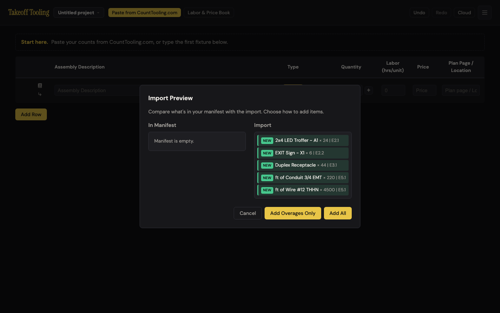
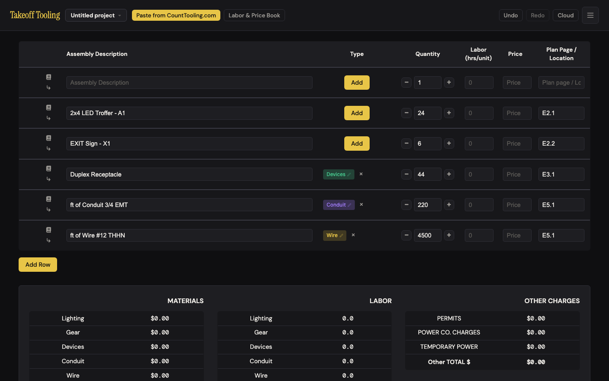
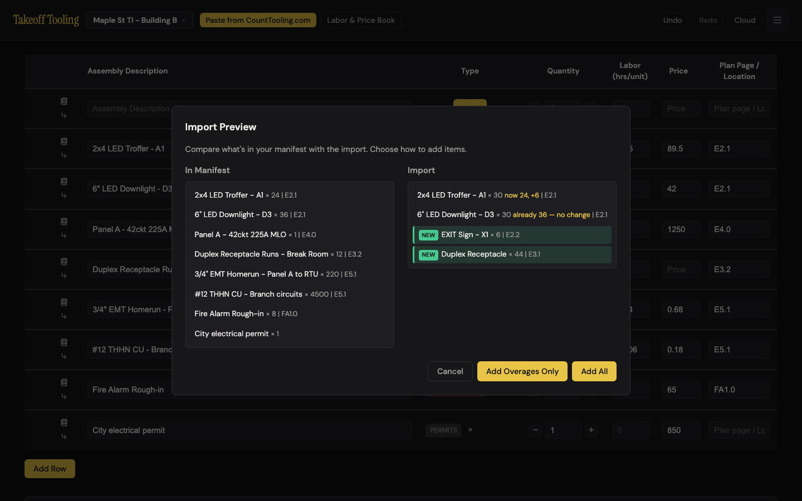
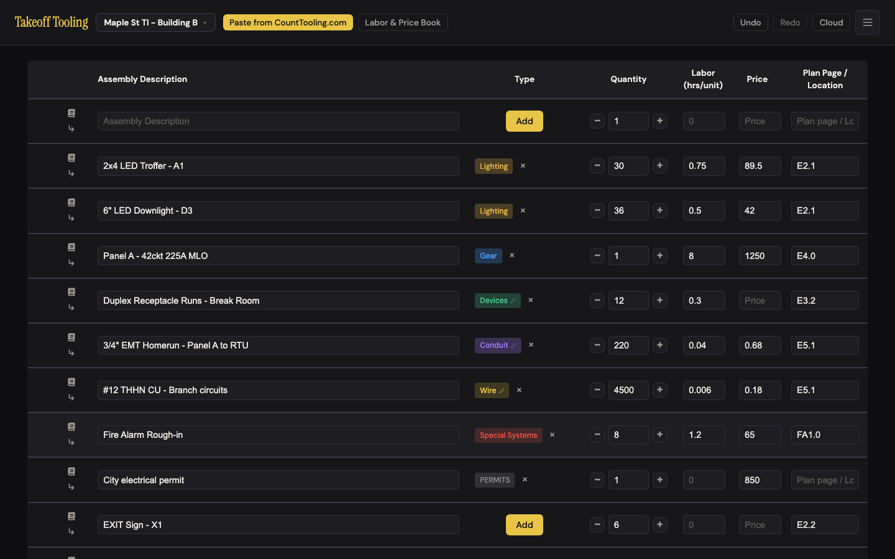
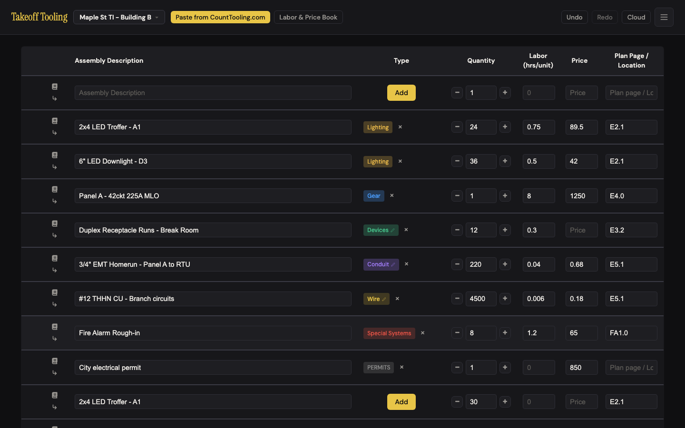
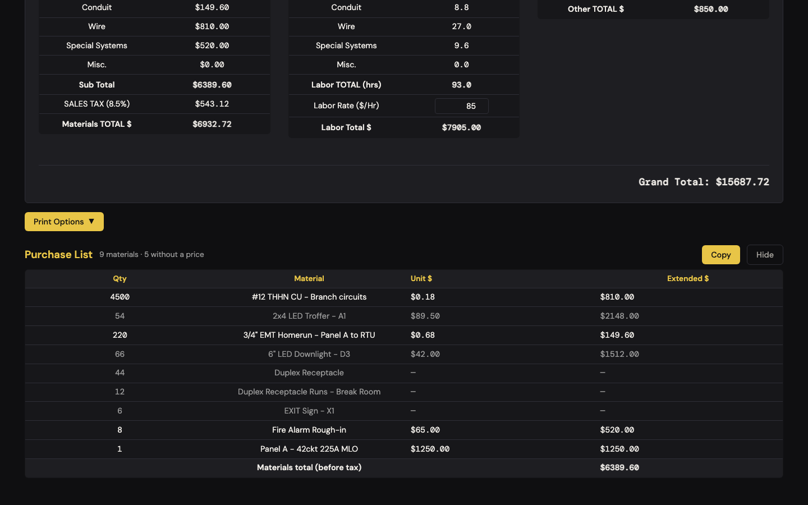
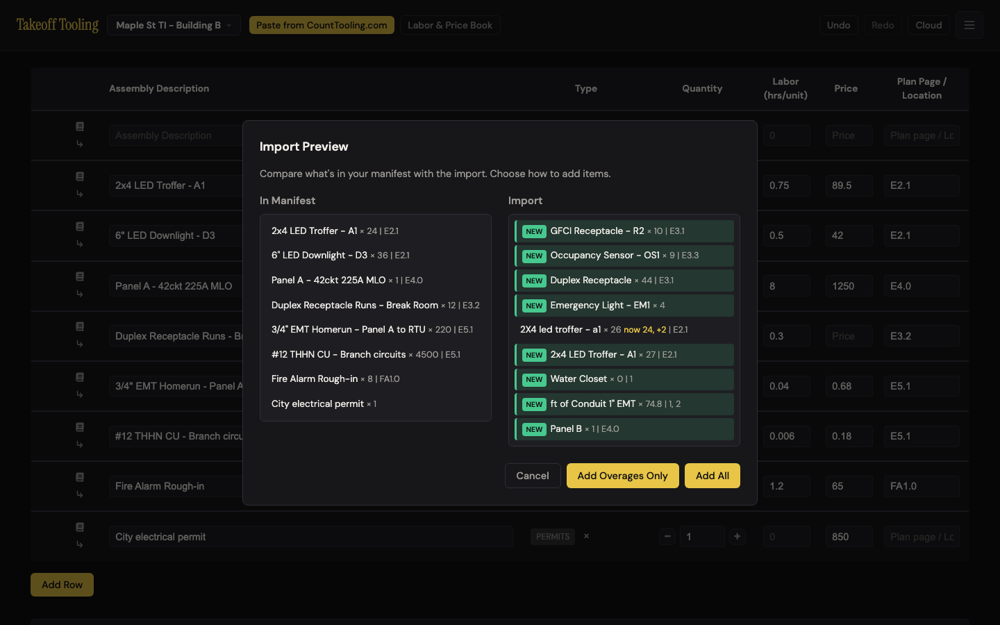

# J2 — Bring the counts over from Count Tooling

Personas: E C · Status: ● walked 2026-09-06 (headless Chromium, :4188, signed out)

> Trigger — the count is done in Count Tooling. The estimator brings it into the bid by
> pasting the clipboard or by opening an `#import=` link. A week later the count changes
> (a revised sheet, a missed room) and they bring it over again, expecting the bid to
> follow the new numbers without doubling anything up.

## Entry points

- **Header** — `#import-count-tooling-btn` "Paste from CountTooling.com" (gold, the most prominent button in the header) → `navigator.clipboard.readText()` → parse `fixture ⇥ count ⇥ pages` lines → `#import-preview-modal` (click)
- **First-run hint** — `#manifest-first-run-hint` "Start here. Paste your counts from CountTooling.com, or type the first fixture below." names the header button; it is text, not a link (read)
- **Hash route at boot** — `/#import=<base64 {v:1, source, items:[{description, count|quantity, page|planPage, type?}]}>` → `TakeoffApp.handleHashRoute({atBoot:true})` → `TakeoffImport.importFromPayload` → preview; hash stripped via `replaceState` before the modal shows (app.js:426-469)
- **Hash route while open** — same link pasted into a tab that already has the app up → `hashchange` → same preview, no reload (app.js:480; baseline N-4)
- **Programmatic** — `TakeoffImport.importFromPayload(payload)` / `showImportPreviewModal(items)` (the smoke spec's path; no UI)
- **Upstream** — Count Tooling's sidebar "Copy to /Tooling" → scope menu → tab-delimited rows land on the clipboard; when the Count Tooling user is signed in the text ends with a `View link:⇥<url>` footer line (see [Count Tooling J11](/Users/diane/Documents/GitHub/counttooling.github.io/journeys/hand-off-to-pricing.md))

## Current route (walked 2026-09-06)

Happy path (first hand-off, paste): **2 clicks, 1 decision** inside Takeoff Tooling to
land the counts — then **2 more clicks per untyped row** to give it a type (2 of 5 rows in
the walk, so 6 clicks / 3 decisions to a fully typed manifest). Re-count via link: **1
click, 1 decision** (which button).

**First hand-off, cold (clipboard):**

1. Cold boot, empty project "Untitled project". The first-run hint reads *Start here. Paste your counts from CountTooling.com, or type the first fixture below.* — the header button it names is the gold one. 
2. Clipboard held five Count Tooling lines (`2x4 LED Troffer - A1⇥24⇥E2.1`, `EXIT Sign - X1⇥6⇥E2.2`, `Duplex Receptacle⇥44⇥E3.1`, `ft of Conduit 3/4 EMT⇥220⇥E5.1`, `ft of Wire #12 THHN⇥4500⇥E5.1`). Clicked **Paste from CountTooling.com** → the Import Preview opened at once (headless clipboard read worked with the permission granted). Left column: *Manifest is empty.* Right column: all five lines with green **NEW** badges, `× count | page`. No type is shown for any line. 
3. **Decision:** Cancel / Add Overages Only / Add All — two identical gold buttons. Clicked **Add All**. Modal closed; no confirmation anywhere.
4. Manifest: 6 rows — the blank starter row still on top, then the five imports. Types: Troffer **untyped ("Add" button)**, EXIT Sign **untyped**, Duplex Receptacle → Devices, ft of Conduit → Conduit, ft of Wire → Wire. Quantities 24 / 6 / 44 / 220 / 4500 and plan pages all correct. Labor 0, price blank on every row — the summary is all `$0.00` / `0.0`, as it must be before pricing. 
5. Undo once → back to the single blank row; Redo → the six rows return. **One undo frame per import — holds.**

**The re-count (standard seed, `#import=` link at boot):**

6. Seeded "Maple St TI - Building B" (8 fixtures, labor rate $85; Lighting $3,660.00, Labor 93.0 hrs, Grand Total $15,687.72). Opened `/#import=<base64>` carrying Troffer 30, Downlight 30, EXIT Sign 6, Duplex Receptacle 44 (type `devices`).
7. Preview: left column lists the 8 seeded fixtures with `× qty | page`. Right column: `2x4 LED Troffer - A1 × 30 **now 24, +6** | E2.1` · `6" LED Downlight - D3 × 30 **already 36 — no change** | E2.1` · **NEW** `EXIT Sign - X1 × 6 | E2.2` · **NEW** `Duplex Receptacle × 44 | E3.1`. The hash was already gone from the URL. 
8. Clicked **Add Overages Only**. Manifest: 11 rows. Troffer **24 → 30** (labor 0.75 and price $89.50 kept), Downlight **stays 36**, Panel/Runs/EMT/THHN/FA/permit untouched, then `EXIT Sign - X1 × 6` (**untyped**) and `Duplex Receptacle × 44` (Devices) appended at the bottom. Summary: Lighting **$3,660.00 → $4,197.00** (+6 × $89.50 = $537.00 ✓), Lighting labor **36.0 → 40.5 hrs** (+6 × 0.75 ✓), Labor total $7,905.00 → $8,287.50 ✓. 
9. Undo once → 9 rows, Troffer 24. Redo → 11 rows, Troffer 30. **One frame — holds.**
10. Set `location.hash` to the same link with the app open: preview reopened **without a reload** (one navigation entry), hash stripped again; every line now read *already N — no change*. Esc closed it.

**The wrong turn (fresh seed, same link, Add All):**

11. Clicked **Add All** instead. Manifest: **13 rows** — the seeded Troffer `24 @ $89.50 / 0.75 h` *and* a second Troffer `30 @ — / 0 h`, untyped; the same pair for the Downlight (36 priced + 30 unpriced). The manifest now says **54 troffers and 66 downlights** where the count says 30 and 30. Summary **unchanged** — Lighting still $3,660.00 (the new rows have no price), so the bid's dollars did not move for a count that rose. 
12. Opened the purchase list: `54 | 2x4 LED Troffer - A1 | $89.50 | $2148.00` and `66 | 6" LED Downlight - D3 | $42.00 | $1512.00` — the row is dimmed (its "unpriced" flag), but 54 × $89.50 is $4,833.00, not $2,148.00 (that is 24 × 89.50). Header: *9 materials · 5 without a price* (it does count the two half-priced lines). 

**Contract probes (`#import=`, seeded):** 

- `type:'receptacles'` → falls back to regex inference: "GFCI Receptacle - R2" → Devices (the word *receptacle*), "Occupancy Sensor - OS1" → **untyped**. `type:'Gear'` (case) → ignored, "Panel B" inferred gear by luck.
- `count:"44"` (string) → 44. Missing `page` → blank, preview omits the `| page` part. `count:74.8` → 74.8. Blank description → dropped silently.
- `"2X4 led troffer - a1 "` → **matched** (`now 24, +2`), raised 24 → 26. `"2x4  LED Troffer - A1"` (double space) → **NEW**, landed as a second untyped troffer row.
- `count:"1,200"` → preview `× 0`, row lands at 0. (Clipboard path: `parseFloat("1,200")` → **1**.)
- Empty `items` → alert *This import link contained no valid items.* `v:2` → the **same** alert. Garbage base64 → *This import link could not be loaded — it may be truncated or corrupted.* Nothing added in any case.
- Matched row with a different page/type (`Fire Alarm Rough-in`, 12, FA1.1, `lighting`) → quantity 8 → 12; page stays FA1.0, type stays Special Systems.
- Count Tooling's real footer through the real button: `View link:⇥https://counttooling.com/view/abc123` → preview **NEW `View link: × 0`** → a manifest row "View link:" × 0, untyped; the URL is gone. `[Lighting] 2x4 LED Troffer - A1` (group prefix) → inferred Lighting via the prefix word; `px of Conduit 3/4 EMT⇥367.20` → Conduit × 367.2 (pixels accepted as feet).

Divergences from the documented route:

- README:59 — *"Add Overages Only — Add only items that increase quantities (merge overages into existing)"*. Actual: raises a matched row to the import's count when higher **and adds every unmatched line** regardless of quantity; never lowers. README:58 *"Add All — Add all import items"* is literally true but says nothing about duplicates when a description already exists.
- ARCHITECTURE.md:178-179 is accurate (totals-not-sums, single undo frame, invalid `type` → regex). Neither doc says how often regex inference fails on ordinary fixture names, nor that untyped rows land with an "Add" button.
- `_surfaces.md` says the hash routes strip the hash — confirmed on both boot and `hashchange`.

## Naive attempt

I opened the app cold with the Count Tooling paste on my clipboard. The hint line said
*Paste your counts from CountTooling.com* and the one gold button in the header said the
same thing, so I clicked it on faith — no hunting. A preview came up with all five lines
badged NEW and "Manifest is empty." on the left; fine. Then two identical gold buttons:
"Add Overages Only" and "Add All". Overages? In this trade an overage is the 10% of
conduit I order for waste. I had nothing in the manifest, so I guessed they'd do the same
thing here and hit Add All (rightmost — where "OK" lives). The modal vanished with no
word; the rows were just there. Two of them had a yellow "Add" where the type should be —
the troffer and the exit sign, the two most obviously *lighting* things on the list — and
the receptacle, conduit and wire had picked their types by themselves. I didn't know from
the preview that two would need me. Nothing told me what had just happened; I only knew
because I could see the table.

A week later I had a revised count and the link. Opening it showed me exactly what I
wanted: "× 30, now 24, +6" on the troffer, two NEW rows, and "already 36 — no change" on
the downlight. The downlight count had actually dropped to 30 — I read "no change" as the
app telling me my bid was fine, and it wasn't: I was still carrying six downlights. The two
buttons were the same two again. If I'd clicked Add All — and on a re-count "All" is the
word you reach for — I'd have had 54 troffers.

## Evidence

- **Telemetry visibility:** none exists in Takeoff Tooling. A rework here should ship `import_opened {source: clipboard|link, lines, matched, new, untyped}` and `import_added {mode: all|update, raised, added, lowerKept}` — the third field is the one that tells us how often a lower re-count is being silently kept.
- **Doc coverage:** README.md:53-59 (Import from CountTooling.com — button descriptions, one of them inaccurate, see divergences); CLAUDE.md "Persistence" bullet (share links vs import); ARCHITECTURE.md:176-179 (formats — accurate); `_surfaces.md` header + hash routes. Nothing documents the untyped-row follow-up, the `View link:` footer, or the exact `ITEM_TYPES` strings a payload must use.
- **Specs:** `smoke.spec.js:42-55` — `#import=` at boot → modal visible → **Add All** → item present. Not covered: the clipboard button, `parseCountToolingClipboard` / `inferType` (import.js is an IIFE, not Node-loadable, so no `*.test.js` can reach it), **Add Overages Only raising a count (baseline A-3's fix has no spec)**, the delta text (C-8), the `hashchange` path (N-4), empty/invalid payload alerts, single-undo-frame.
- **Modals:** `#import-preview-modal`; then `#type-modal` once per untyped row (the unavoidable second act of this journey).
- **Hotkeys:** `Esc` closes the preview (import.js:170-177). None pick a button; the modal opens with focus on `<body>`, so `Enter` does nothing. After import, `G L D C W S` in the type modal for each untyped row.
- **Storage / state touched:** one undo frame per import (`beginBatch`/`endBatch`, import.js:109-131); `takeoff-project-<id>` rewritten after the 400 ms debounce; `takeoff-projects-index` touched for `savedAt`. Cloud push would follow when signed in (not exercised — production).

## Friction findings

| # | Severity | What happens | Why it hurts | Verdict stamp (Phase 2b) |
|---|---|---|---|---|
| 1 | **blocker** | On a re-count, **Add All** appends a second row for every fixture that already exists: seed Troffer `24 @ $89.50` + new `30 @ — / 0 h` untyped → the manifest says **54** troffers (count says 30) and **66** downlights (count says 30). Summary Lighting stays **$3,660.00** (should be $4,197.00 at 30 × $89.50). Purchase list prints `54 | 2x4 LED Troffer - A1 | $89.50 | $2148.00` — 54 × 89.50 = $4,833; the row is only dimmed. Both buttons are `.btn-success`, Add All sits rightmost, README lists it first. (import.js:101-133; index.html:232-233; selectors.js:76-82) | The one-click wrong path gives a bid that over-counts by 24 fixtures and under-prices by $537 at the same time, and a purchase list whose qty × unit ≠ extended. The import's counts are totals, and the button that treats them as additions is the more prominent one. | **CONFIRMED** — re-driven on an independent seed (Flat Panel 18 @ $74.25 + import 25 → Add All → 13 rows, purchase list `43 | $74.25 | $1336.50`; 43 × 74.25 = $3,192.75, the extended is 18 × 74.25 — `getPurchaseList` sums qty for every occurrence but `extended` only for priced ones, selectors.js:76-82). Summary Lighting unchanged at $2,516.50; the list's *total* still agrees with the summary to the cent ($4,032.50 both) — the disagreement is inside the row (qty × unit ≠ extended), which is greyed (`rgb(153,153,153)`) with no title/marker. No confirm, no warning in code for a matched description on Add All (import.js:101-133). |
| 2 | **stumble** | A lower re-count is silently kept: Downlight import 30 vs manifest 36 → preview says *already 36 — no change*; after **Add Overages Only** the bid still carries 36. That is 6 × $42.00 = **$252.00** materials + 3.0 hrs = $255.00 labor ≈ **$507 + tax** for fixtures the count says are not there. No way to accept the lower number except editing the row by hand. (import.js:88-90, 116) | "Already 36" reads as reassurance, not as "your count dropped and I ignored it". Counts go down as often as up (value engineering, a deleted room); the merge is one-directional and says so only in the code comment. | **CONFIRMED** — Wall Pack 10 in manifest, import 7 → preview *already 10 — no change*; after Add Overages Only still 10 @ $118 / 1.0 h (3 × $118 = $354 + 3.0 h × $95 = $285 carried). import.js:88-90 has only two branches (`want > have` / else); ARCHITECTURE.md:178 documents "raised when higher" as design, which makes the *behavior* intentional but not the "no change" wording — the count did change. Stays a stumble: the estimator does not stop, they over-bid without knowing. |
| 3 | **stumble** | The button is named **Add Overages Only**, but in this app "Overage" already means the waste % on a conduit or wire run (5/10/15/20 % in the flow editors). Here it means "raise matched counts to the new total and add the new ones" — the safe default for every re-count. "Only" says it does less. | The word collides with the app's own trade vocabulary at the journey's single decision point, and it points the estimator at the wrong button (see #1). Both walkers of the day paused here. | **CONFIRMED** (as a judgment finding — no telemetry can back "paused here") — the collision is real in code: wire.js:37 titles its flow *"Wire - Overage and MAC Adapters"*, conduit.js has an Overage step, and README:59 itself glosses the button as "merge overages into existing", a third meaning. Both buttons render `.btn-success` `rgb(232,197,71)`; Cancel is the only visually different one. |
| 4 | **stumble** | Untyped arrivals are invisible in the preview. Cold paste: **2 of 5** lines ("2x4 LED Troffer - A1", "EXIT Sign - X1") got no type — `inferType` needs *fixture / lighting / light fixture*; troffer, downlight, exit, emergency, sconce, high-bay are not in the regex (import.js:13-21). The preview has no type column; after import those rows carry a gold **Add** button and sit in no summary bucket. `#import=` items without `type` behave the same (EXIT Sign in the re-count). | Every untyped row costs two more clicks and a decision after the modal has closed, and the estimator can't see how many are coming. The most common lighting names in the trade are exactly the ones the regex misses. | **CONFIRMED and sharpened** — on my paste 2 of 6 real lines landed untyped (`Emergency Light - EM2`, and the `View link:` footer); probes: `Exit Sign - X1` → null, `6" LED Downlight` → null. Worse than untyped, found in passing (see NEW-1 below): `2x2 LED Flat Panel - F1` → **gear** (the word *panel*), `Switchgear MSB` / `Transfer Switch ATS-1` / `Disconnect Switch 60A` → **devices** (*switch*), `Lighting Contactor LC-1` → **lighting** — mis-typed rows show a type badge and sum into the wrong bucket with no "Add" to flag them. Preview has no type column (import.js:92). |
| 5 | **stumble** | Count Tooling's signed-in footer `View link:⇥<url>` becomes a preview line **NEW `View link: × 0`** and then a manifest row "View link:" × 0, untyped. The URL — the pointer back to the source takeoff — is discarded (`parseFloat(url)` → 0, import.js:30). | A junk row on every hand-off from a signed-in Count Tooling user, and the one piece of provenance the paste carried is thrown away instead of kept with the project. | **CONFIRMED** — drove the real header button with Count Tooling's own fixture footer (`View link:⇥https://counttooling.com/app/?t=8f3c…`, the exact string in Count Tooling's `report.test.js:138`): preview line **NEW `View link: × 0`**, manifest row "View link:" × 0 untyped with its own Add button; URL gone (`parseFloat(url)` → NaN → 0, import.js:30). Count Tooling's J11 dossier confirms the footer ships whenever the project is cloud-saved. |
| 6 | papercut | Thousands separators: clipboard `1,200` → `parseFloat` → **1**; `#import=` `"1,200"` → `Number` → **0** (preview shows `× 0`). Count Tooling itself emits plain decimals (`74.80`), so this needs a spreadsheet detour to trigger. | A plausible-looking `× 1` on a 1,200-ft run is the app's worst failure shape; low likelihood keeps it a papercut. | **CONFIRMED** — clipboard `ft of Wire #10 THHN⇥1,800` → Wire × **1** (landed as a 1-ft run); payload `count:"2,400"` → preview `× 0`, row at 0. Count Tooling's own copy emits `150.00`-style plain decimals (its output specs pin `234.60`), so the trigger really is a spreadsheet detour — papercut holds. |
| 7 | papercut | Match key is `trim().toLowerCase()` only: `"2X4 led troffer - a1 "` matches, `"2x4  LED Troffer - A1"` (double space) is **NEW** and lands as a duplicate. The purchase list's own key collapses internal whitespace (selectors.js:70), so the two rows *would* merge there — two normalizations for one concept. | Rare in practice, but when it fires it produces exactly the #1 duplicate with no way to see why. | **CONFIRMED** — `led wall pack - wp1 ` (case, trailing space) matched and raised 10 → 12; `LED  Wall Pack - WP1` (double space) badged NEW and landed as a second untyped row even under Add Overages Only. import.js:53/80/112 use `trim().toLowerCase()`; selectors.js:70 adds `replace(/\s+/g,' ')` — two keys, verified. |
| 8 | papercut | Nothing confirms the import after the modal closes: no toast (the app has no toast mechanism at all), no highlight, rows appended at the bottom of the table. Only the greyed Redo / live Undo hints that something happened. | "What did that just add?" is answerable only by the preview you just dismissed. On a 40-row bid the new rows are below the fold. | **CONFIRMED** — `grep -rn "toast\|aria-live" js index.html` is empty; new rows appended after the last seed row (`County permit`, row 9) at 10–11. Only signal: Undo enabled / Redo disabled after the import. |
| 9 | papercut | After a cold import (both paths) the blank starter row stays as row 1, above the fixtures, with its own "Add" type button (app.js:471-473, 483-485). Baseline B-6 removed it from the preview; the manifest side still shows it. | One junk row and one stray "Add" at the top of every first bid that started from a paste. | **CONFIRMED** — both cold paths: clipboard Add All → 8 rows, row 1 `{d:"", q:1}` with an Add button; `#import=` at boot → state holds 1 row while the preview is up (app.js:483-485 runs after the route), Add All → 5 rows, blank first, 3 Add buttons. Not a baseline duplicate: B-6 fixed the *preview* leak only; N-9 made the blank seed row deliberate for empty projects, which is why this stays a papercut rather than a bug. |
| 10 | papercut | Payload `type` must equal an `ITEM_TYPES` string exactly: `receptacles` and `Gear` are silently dropped to regex inference (import.js:212-214). A `v:2` payload gets *This import link contained no valid items.* (app.js:462-463) — a wrong diagnosis. | Count Tooling's implementer gets no signal that a type was rejected; a future version bump would be reported as an empty link. | **CONFIRMED** — `type:'receptacles'` on "Occupancy Sensor - OS2" → null (Add button); `type:'Gear'` on "Panel LP-2" → gear only via the regex. `{v:2,…}` → alert *This import link contained no valid items.* verbatim (importFromPayload returns 0 at import.js:205; app.js:462-463 cannot tell "wrong version" from "empty"). |
| 11 | papercut | The preview opens with focus on `<body>`: no default button, `Enter` does nothing, `Tab` starts from the top of the page. Both action buttons share one class — no visual primary. | Keyboard users get no path; sighted users get no nudge toward the safe button. | **CONFIRMED and sharpened** — `#import=` path: `document.activeElement` = BODY. Clipboard path: focus stays on the header button `#import-count-tooling-btn` (the click left it there), and `Tab` moves to `#labor-book-open-btn` — the modal does not trap focus at all; Enter picked nothing on either path. Both action buttons `rgb(232,197,71)`. |
| 12 | papercut | A matched row takes only the quantity — page stays FA1.0 when the import says FA1.1, type stays. A `px of …` row (Count Tooling page left unscaled) arrives as **Conduit × 367.2** as if feet. | Stale page refs are minor; the px row is a Count Tooling-side problem (its J11 #1) that this side cannot detect but could at least name. | **CONFIRMED** — `Nurse Call Rough-in` 5 @ LV1.0 specialSystems + import `{count:9, page:'LV1.1', type:'lighting'}` → qty 9, page **LV1.0**, type **specialSystems** (import.js:117 updates `quantity` only — arguably the right call for type). `px of Conduit 3/4 EMT⇥412.30` → Conduit × 412.3, no flag. |

## Proposals

1. **rework** — Collapse the decision. One primary button whose label depends on the state: empty manifest → **"Add 5 fixtures"**; anything matched → **"Update counts"** (raise matched rows to the new totals, add the new ones — today's Add-Overages-Only behavior). Demote today's Add All to a secondary text action **"Add as separate rows"**, shown only when at least one line matched (when nothing matches the two are identical). Spirit: (1) removes the one decision on the cold path and the duplicate trap on the re-count path; (2) "fixtures", "counts", "update" — no "overage", no "only"; (3) removes the term *Add Overages Only*, removes the duplicate outcome as a default, makes Finding #1 unreachable by a single click; (4) it is the only gold button in the modal. `spiritPass: true` — fixes #1 and #3 together. **Verifier: `spiritPass: true`** — all four hold; the label can carry the receipt for free (*"Update 1 count · add 2 fixtures"*), which is where proposal 7's value belongs. Caveat: the secondary "Add as separate rows" is still a decision when lines match — acceptable because it is demoted, but consider hiding it entirely and leaving duplicates to a manual add.
2. **rework** — Show lower counts as what they are and let the estimator take them: `× 30 · was 36, **−6**` with a per-line **"use 30"** toggle (or one modal-level "also lower counts that dropped" checkbox, default off so nothing is ever silently removed). Spirit: (1) adds one optional click only on lines whose count fell; today those lines cost a hand edit each; (2) "was / now / dropped"; (3) removes the hand-editing pass after every downward re-count and the misleading "no change"; (4) it appears on the very line the estimator is already reading. `spiritPass: true` — the delta renderer already computes `have`/`want`; this is a third branch, not a new surface. **Verifier: `spiritPass: true` with a caveat** — the *label* change (`was 10, −3`) is pure removal of a wrong message and passes outright; the per-line toggle is new surface that earns its place only because it replaces a hand edit per dropped line (fewer steps, test 1). Prefer the simplest variant: since counts are totals and the preview already shows the delta, "Update counts" could simply set matched rows to the import's number in both directions — no toggle at all, nothing silent because the −3 is on screen.
3. **polish** — Show the type in the preview: a small chip per line (Lighting / Devices / Conduit …) and a dashed **"needs a type"** where inference failed, plus a footer count *"2 of 5 need a type"*. Spirit: (1) no new steps — the same decision, made with the information it needs; (2) the app's own type labels; (3) removes the post-import surprise and lets the estimator judge Add before the rows exist; (4) it is in the modal they are already looking at. `spiritPass: true`. **Verifier: `spiritPass: false` as written** — fails test 3: chips + a footer count are added surface that remove no step or decision; the untyped rows still cost the same two clicks each after the modal closes. Salvage that passes: make the dashed *"needs a type"* chip a picker (G/L/D/C/W/S) inside the preview — then it *replaces* the post-import type-modal trip (2 clicks → 1, before the rows exist) and proposal 3 becomes the visible half of proposal 4. Also needed to surface NEW-1 (mis-typed rows), which an info-only chip would at least make visible.
4. **polish** — Teach `inferType` the trade's fixture names: `troffer|downlight|exit|emergency|sconce|high.?bay|strip|wrap|pendant|lamp|luminaire` → lighting; `sensor|dimmer|gfci|dataport|jack` → devices; `disconnect|breaker|meter|switchboard|mcc|xfmr` → gear; `fire alarm|smoke|strobe|speaker|camera|card reader` → specialSystems. Spirit: (1) in the walk 2 of 5 lines needed typing after import; with these, 0 of 5 — 4 clicks and 2 decisions gone; (2) trade names, not categories; (3) removes most trips to the type modal after a paste; (4) automatic. `spiritPass: true` — one regex block, import.js:13-21. **Verifier: `spiritPass: true` with a caveat** — the proposed list has false positives waiting: `lamp` matches *Beam clamp* / *Conduit clamp*, `strip` matches *Strip heater*, `jack` matches *Jack chain*, `meter` matches *Voltmeter*; use word boundaries. And fix the order/regex before adding: today `panel` sends *LED Flat Panel* to gear and `switch` sends *Switchgear* / *Transfer Switch* / *Disconnect Switch* to devices (NEW-1) — lighting terms must be tested before gear, and `switch` must not beat `switchgear|switchboard|transfer switch|disconnect`. With those fixes my paste goes from 2 of 6 untyped + 1 mis-typed to 0 of 6.
5. **polish** — Parser hygiene for what Count Tooling actually sends: drop the `View link:` footer as a row and keep the URL with the project (a "Counted in Count Tooling ↗" line under the project name, or at minimum a note field); treat a count that parses to `NaN` as **"× ?"** in the preview instead of `0` or `1`, and strip thousands separators before parsing. Spirit: (1) no steps; (2) "counted in"; (3) removes a junk row from every signed-in hand-off and removes two silent wrong numbers; (4) automatic. `spiritPass: true` — fixes #5 and #6. **Verifier: `spiritPass: true`** — dropping the footer row and normalizing `1,800` remove two wrong rows/numbers with zero new UI; the "Counted in Count Tooling ↗" line is a small addition justified by keeping provenance the paste already carried (the footer's exact shape `View link:⇥<url>` is pinned in Count Tooling's own tests, so the parser can match it safely). Prefer `× ?` over a silent 0/1 as stated.
6. **polish** — Normalize the match key the way the purchase list already does (`replace(/\s+/g,' ')`, selectors.js:70) and share the helper. Spirit: (1) no steps; (2) none needed; (3) removes one duplicate source and one of two normalizations; (4) automatic. `spiritPass: true` — one-liner in two places (import.js:53, 105). **Verifier: `spiritPass: true`** — three sites, not two (import.js:53, 80, 112 — the preview's delta lookup at :80 must agree with `performImport` or the badge and the outcome diverge); one shared `TakeoffUtils` key helper used by selectors.js:70 too.
7. **polish** — After the import, reuse the first-run hint's slot for a one-line receipt: *"Updated 1 count, added 2 fixtures (1 needs a type) — Undo"*, cleared on the next edit. No toast system needed — the slot exists (manifest.js:207). Spirit: (1) zero steps; puts Undo where the eye is; (2) "count", "fixture"; (3) removes the "what just happened" scan and the trip to the header for Undo; (4) it appears where the last hint appeared. `spiritPass: true`. **Verifier: `spiritPass: false`** — fails test 3: a receipt line is pure added surface; it removes no step (Undo still lives in the header, the rows still land below the fold) and "the what-just-happened scan" is not a step the app imposes. Fold the value into proposal 1 instead: a state-aware button label (*"Update 1 count · add 2 fixtures (1 needs a type)"*) tells the estimator what will happen *before* the click, with nothing new on the page.
8. **polish** — Cold import lands in the blank starter row's place: when the only row is blank and undescribed, remove it inside the same batch (app.js:471-473 / 483-485 create it; import.js `performImport` can drop it). Spirit: (1) one fewer junk row and stray "Add"; (2) none needed; (3) removes the row and the question "what is that blank line for"; (4) automatic. `spiritPass: true`. **Verifier: `spiritPass: true`** — pure removal. Guard: only when the sole row is description-less *and* the import adds ≥1 row, inside the same batch so Undo restores it (N-9's "a project always has a row" invariant survives).
9. **keep** — The preview's shape as walked: side by side, `× 30 · now 24, +6` deltas, NEW badges, counts treated as totals (never summed), one undo frame, `#import=` on boot and on `hashchange` with the hash stripped, Esc/click-out. Pre-registered strength — confirmed, every number checked (Lighting +$537.00, +4.5 hrs). `spiritPass: true`. **Verifier: `spiritPass: true` (keep)** — re-confirmed on a second seed: Lighting $2,516.50 → $3,036.25 (+7 × $74.25 = $519.75 exact), 22.6 → 27.5 h, one undo frame each way, hashchange preview with `window` state intact and hash stripped.
10. **teach** — Publish the `#import=` contract for Count Tooling's implementers: `v:1`, `items[].description`, `count|quantity` (number), `page|planPage`, `type` ∈ exactly `lighting gear devices conduit wire specialSystems permits powerCoCharges temporaryPower` (anything else falls to inference), and that a `px of` row means a page was left unscaled upstream. Fails spirit (1) — docs only, no step removed. `spiritPass: false` — teach. **Verifier: `spiritPass: false` (teach, agreed)** — add to the contract text: `type` is compared case-sensitively against `ITEM_TYPES` (import.js:212), and a wrong `v` is reported as an *empty* link (#10), so implementers should pin `v:1` literally.

## Guide actions

- README:58-59: rewrite the two button lines to what they do — *"Update counts (raise matched fixtures to the new total, add new ones; never lowers)"* and *"Add as separate rows (every line becomes a new row, even if a fixture of that name already exists)"* — using whatever labels proposal 1 lands on.
- Add: "Rows the import couldn't type show a gold **Add** — click it and press G / L / D / C / W / S." (until proposal 3/4 makes it rare).
- Add: what arrives from Count Tooling — `fixture ⇥ count ⇥ pages`, `ft of …` rows become Conduit/Wire, the `View link:` footer (until proposal 5).
- Add the `#import=` contract paragraph (proposal 10) — ARCHITECTURE.md:179 has it; README has nothing.
- A first guide article "From count to bid" should walk exactly steps 1-8 above with screenshots 02, 04 and 05.

## Demo moment

Open the re-count link on a bid you already priced: the preview says *2x4 LED Troffer - A1
× 30 — now 24, +6* and badges the two new fixtures NEW; one click and the troffer row reads
30 with its $89.50 and 0.75 h intact, Lighting jumps from $3,660.00 to $4,197.00, and Undo
takes the whole thing back in one press. Screenshot 04 → 05.

## Walk notes

- **Environment:** headless Chromium (`@playwright/test`), 1440×900, against the read-only review server at `http://localhost:4188` (not started or stopped by this walk). Fresh browser context per probe (P1 cold clipboard · P2 seed + `#import=` boot + Add Overages Only + hashchange · P3 seed + Add All · P5 contract payloads · P6 cold `#import=`), clipboard read/write granted, `context.route(/supabase/i, abort)` on every context. **Signed out throughout; nothing cloud-side touched.** Seed: the standard 8-row "Maple St TI - Building B" bid at $85/hr, injected via `page.evaluate` after boot, 700 ms wait so the debounced project write landed before navigating to the link.
- **Console:** one `Failed to load resource: net::ERR_FAILED` per context — the deliberately aborted `cdn.jsdelivr.net/npm/@supabase/supabase-js@2.49.4/dist/umd/supabase.min.js`. No app-side errors, no page errors, across six contexts.
- **Dialogs seen (all `alert`):** *No valid rows found. Expected format: fixture\tcount\tpage (tab-separated, one per line)* (junk clipboard) · *This import link contained no valid items.* (empty items, `v:2`, all-blank descriptions) · *This import link could not be loaded — it may be truncated or corrupted.* (bad base64).
- **Walls:** none. Headless clipboard read worked with `permissions:['clipboard-read','clipboard-write']`, so the paste button was driven for real. The dirty-flow-editor branch of `handleHashRoute` (app.js:431-436) was not exercised — no programmatic way to open a flow without the UI, and it belongs to J4/J5.
- **Baseline check:** A-3 (overages raise counts) holds — 24 → 30 verified with dollars; B-6 (blank row out of the preview) holds; C-8 (delta text) holds verbatim; N-4 (hash while open) holds — modal without reload, hash stripped. No regressions.
- **Verifier — re-drive first:** #1 (seed → `#import=` re-count → **Add All** → 13 rows, Troffer 24 + 30, purchase list `54 | $89.50 | $2148.00`); #2 (Downlight 36 vs 30 → "already 36 — no change" → 36 kept); #5 (clipboard with a `View link:⇥https://…` last line → "View link: × 0" row). Scripts: `scratchpad/walks/bring-counts-from-count-tooling/walk.js` and `followup.js` (throwaway; `NODE_PATH=<repo>/node_modules node <script>`).
- **Screenshot index:** 01 cold start with first-run hint · 02 cold preview, five NEW, "Manifest is empty." · 03 manifest after cold Add All — two "Add" type buttons, blank row on top · 04 re-count preview with deltas and NEW badges (demo) · 05 manifest after Add Overages Only — 30 / 36 / two appended rows · 06 purchase list after the duplicate Add All (`54 @ $89.50 = $2148.00`) · 07 manifest after Add All on a re-count — duplicate untyped troffer row · 08 contract-probe preview (`× 0`, missing page, case-insensitive match, double-space NEW).

## Verification

**2026-09-06 · adversarial verifier · headless Chromium (`@playwright/test`) 1440×900 against the read-only review server `http://localhost:4188` (not started or stopped) · signed out · `context.route(/supabase/i, abort)` on every context · clipboard read/write granted · dialogs accepted and logged · console errors logged.** Script: `scratchpad/walks/bring-counts-from-count-tooling/verify/verify.js` (+ `verify.log`), five fresh contexts V1–V5. **Independent seed** — *"Oak Ave Dental - Suite 200"*, $95/hr, 8 rows: `2x2 LED Flat Panel - F1` 18 @ $74.25 / 0.7 h · `LED Wall Pack - WP1` 10 @ $118.00 / 1.0 h · Panel LP-1 · Quad Receptacle (unpriced) · 1/2" EMT 150 ft · #10 THHN 1,800 ft · Nurse Call Rough-in 5 · County permit. Re-count link: Flat Panel 25 (+7), Wall Pack **7** (lower), `Emergency Light - EM2` 4 (no type), `GFCI Receptacle - Lab` 12 (`devices`). Expected before driving: Lighting $2,516.50 / 22.6 h → $3,036.25 / 27.5 h after Add Overages Only; Add All → 13 rows and a purchase-list Flat Panel line of 43 × $74.25 ≠ $1,336.50.

**Re-driven, in the walker's priority order:**

1. *Add All duplicates (#1)* — V3: 13 rows; Flat Panel `18 lighting $74.25` + `25 gear — 0 h`; Wall Pack `10` + `7 untyped`. Summary Lighting unchanged $2,516.50. Purchase list header *9 materials · 5 without a price*; row `43 | 2x2 LED Flat Panel - F1 | $74.25 | $1336.50`, greyed, no title, no `≠`. Math: 43 × 74.25 = **$3,192.75** vs extended **$1,336.50** (= 18 × 74.25). The walker's `54 × $89.50 = $4,833 vs $2,148 (= 24 × 89.50)` is arithmetically right. **The list total and the summary subtotal agree ($4,032.50 = $4,032.50)** — the disagreement is inside the row, not between the two surfaces; the dossier's wording ("qty × unit ≠ extended") is the accurate one. Root cause selectors.js:76-82: `quantity` sums all occurrences, `extended` only priced ones; the greyed style is the only cue.
2. *Silent lower re-count (#2)* — V2: preview *LED Wall Pack - WP1 × 7 already 10 — no change*; after Add Overages Only still 10 @ $118 / 1.0 h. import.js:88-90 has no "lower" branch.
3. *`View link:` footer (#5)* — V1, the real header button, Count Tooling's exact fixture string: preview `NEW View link: × 0`, manifest row "View link:" × 0 with an Add button, URL discarded.
4. Rest: #4 (Emergency Light / Exit Sign / Downlight → null), #6 (`1,800` → 1; `"2,400"` → 0), #7 (trailing-space match vs double-space NEW duplicate), #8 (no toast/aria-live in the codebase; rows appended after row 9), #9 (blank row first on both cold paths), #10 (`receptacles` / `Gear` / `v:2` behaviors, alert text verbatim), #11 (BODY focus on the link path; header-button focus + focus not trapped on the clipboard path), #12 (page LV1.0 and type kept; `px of` → Conduit × 412.3).

**Counter-evidence hunts:** (a) Is never-lowering a documented design choice? Yes — ARCHITECTURE.md:178 "raised … when higher"; that makes #2's *behavior* intentional but not its "no change" wording, so it stays a stumble rather than a bug. (b) Is the blank starter row (#9) baseline N-9/B-6? No — N-9 seeds the row on purpose for empty projects, B-6 fixed the preview only; the manifest-side leftover after an import is new and correctly a papercut. (c) Does the app warn anywhere before Add All duplicates a matched line? No — no confirm, no delta-aware button state, no README caveat (README:58 lists Add All first). (d) Does Count Tooling ever emit thousands separators (#6)? No — its output specs pin `234.60`-style; papercut holds. (e) Is the "Overage" collision (#3) more than opinion? wire.js:37 and the conduit flow both use the word for waste %, and README:59 gives the button a third gloss ("merge overages") — confirmed as a judgment finding with textual evidence, no telemetry either way. (f) Spec coverage claim: `grep overages-btn|import-count-tooling-btn|parseCountToolingClipboard *.spec.js *.test.js` → nothing; import.js has no `module.exports`. Both claims hold. No finding duplicated a baseline item; none KILLED; none downgraded.

**NEW bugs found in passing:**

- **NEW-1 (stumble)** — `inferType` *mis-types* common trade names, which is worse than leaving them untyped because the row shows a real type badge and sums into the wrong summary bucket with no "Add" to flag it: `2x2 LED Flat Panel - F1` → **gear** (`panel`, import.js:19; lighting is tested after gear only for `fixture|lighting`); `Switchgear MSB`, `Transfer Switch ATS-1`, `Disconnect Switch 60A` → **devices** (`switch`, import.js:17); `Lighting Contactor LC-1` → **lighting**; `Fixture Whip` → lighting. On my seed this put the duplicate Flat Panel row under Gear. Fix belongs with proposal 4 (order + word boundaries + negative terms), not as a separate surface.
- **NEW-2 (papercut)** — the preview modal does not trap focus: on the clipboard path `Tab` leaves the modal for `#labor-book-open-btn` in the header behind it, and `Enter` re-fires the still-focused paste button (re-reads the clipboard and re-renders the same preview). Sharpens #11.

**Baseline re-verified:** A-3 ✓ (Add Overages Only raised 18 → 25 with $74.25 / 0.7 h intact, +$519.75 / +4.9 h) · B-6 ✓ (preview left column read *Manifest is empty.* while the blank starter row sat in state on both cold paths) · C-8 ✓ (`× 25 now 18, +7` and `already 10 — no change` verbatim) · N-4 ✓ (`location.hash` set on the open tab → preview without reload — a `window.__marker` survived — and the hash stripped).

**Tally:** 12 walker findings → **12 CONFIRMED** (2 sharpened: #4, #11) / 0 downgraded / 0 KILLED. Proposals: `spiritPass: true` × 7 (1, 2, 4, 5, 6, 8, 9 — 2 and 4 with caveats) / `spiritPass: false` × 3 (3 and 7 fail test 3 as written — added surface, no step removed, salvage paths given; 10 is teach, as the walker said). New: NEW-1 stumble, NEW-2 papercut. Console: one aborted-Supabase `net::ERR_FAILED` per context, no app or page errors across five contexts. Nothing committed; no app code touched.
