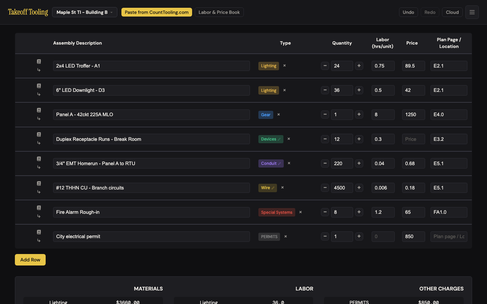
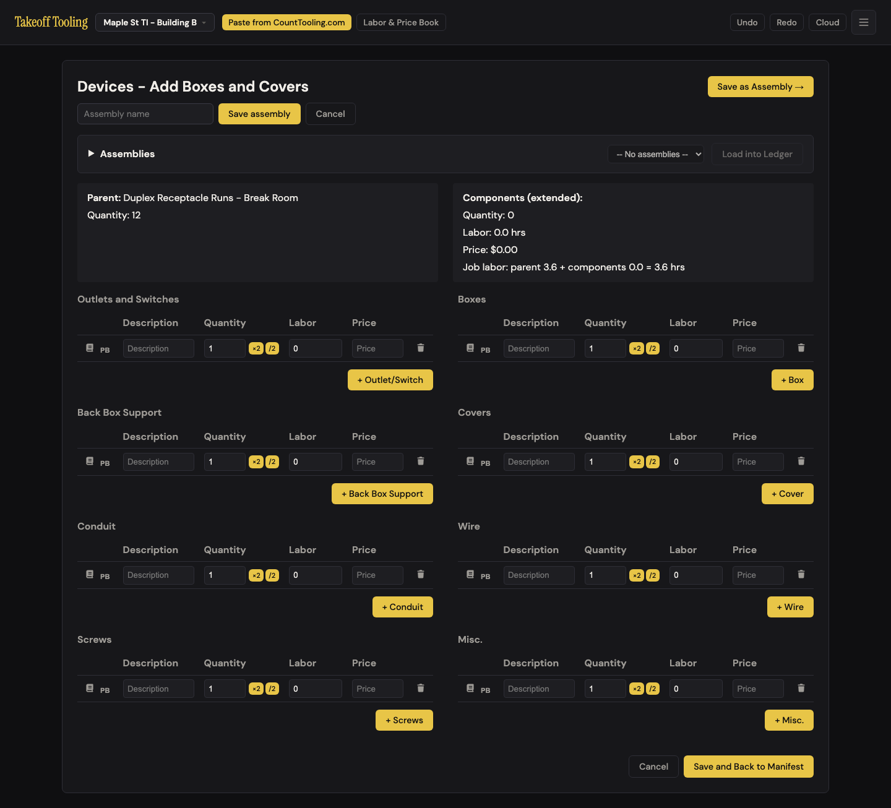
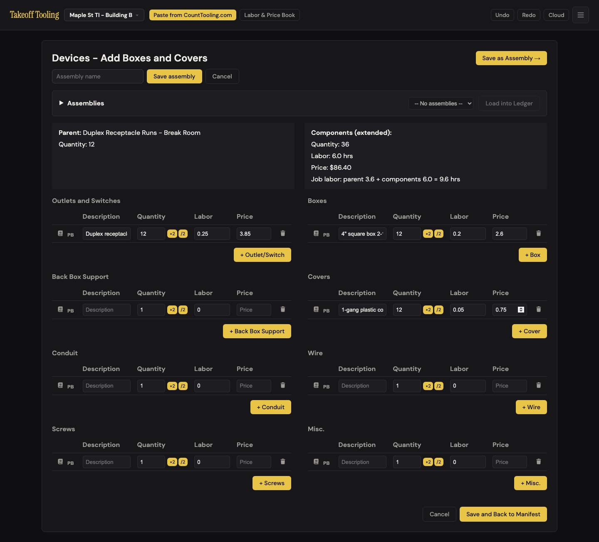
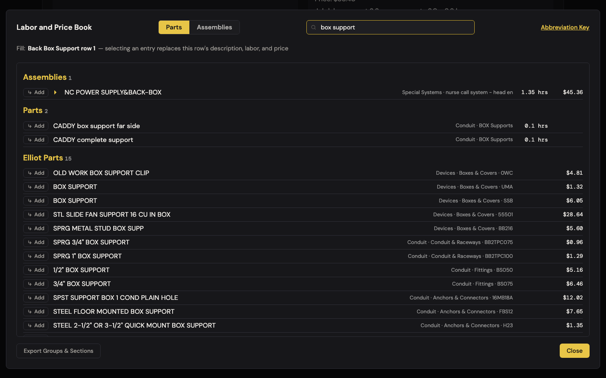
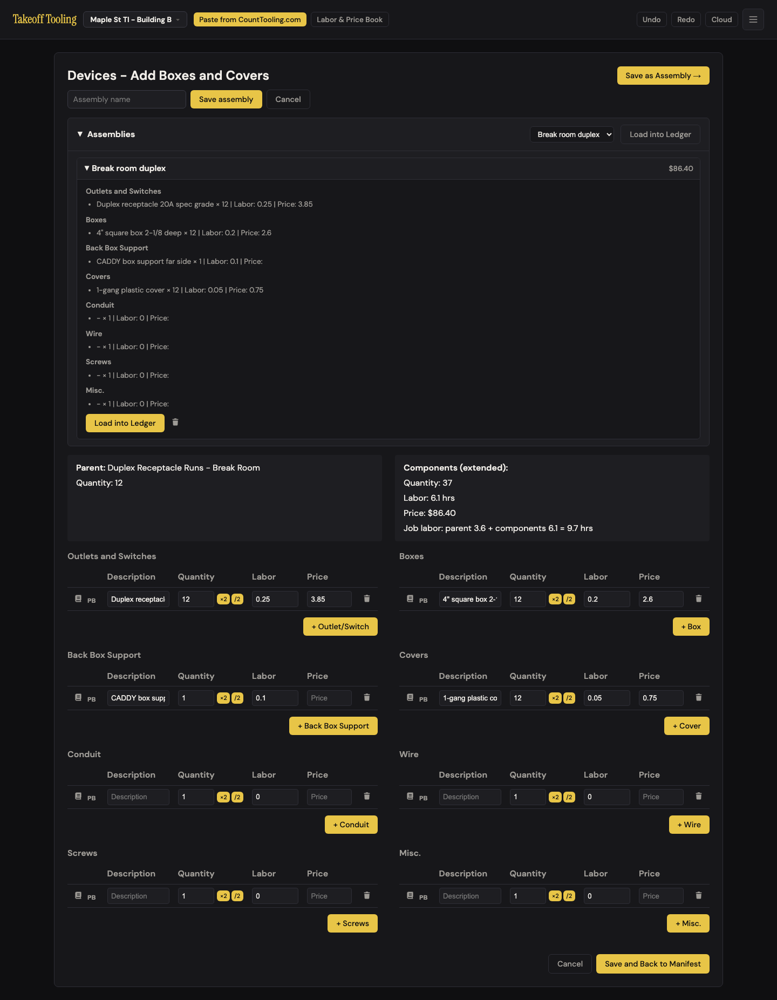
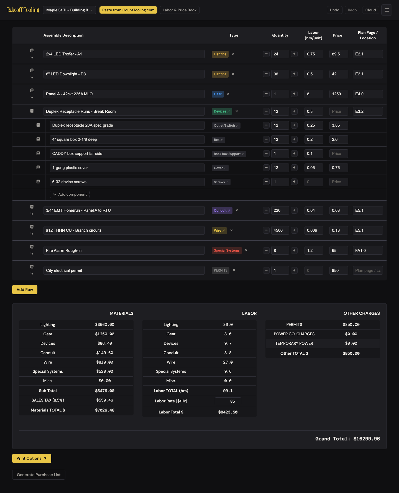
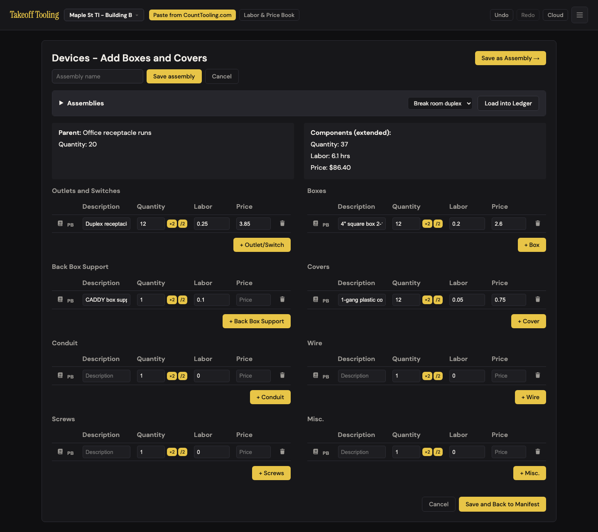
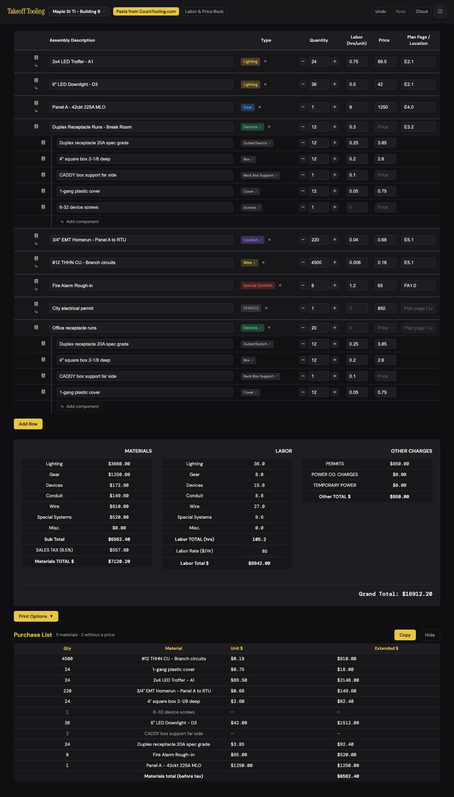

# J4 — Build a device run (the parts behind "12 duplex runs")

Personas: E · Status: ● walked 2026-09-06 (headless Chromium, :4188, signed out) · **adversarially verified 2026-09-07** (independent 20-run seed — see [Verification](#verification))

> Trigger — a devices line on the bid ("Duplex Receptacle Runs - Break Room", 12 runs,
> 0.3 hrs each, no price) needs its parts: receptacles, boxes, covers, screws. The
> estimator wants those parts priced and counted on the bid, and wants to keep the
> recipe so the next 20-run office line takes ten seconds instead of five minutes.

## Entry points

- **Manifest row chip** — `.type-badge-flow` "Devices ✎" (title "Edit in flow") on the parent row → `TakeoffApp.navigateToDevice` (manifest.js:450-454). The pencil is the only visual cue.
- **Any child chip** — "Outlet/Switch ✎", "Box ✎", … on a child row targets the *parent's* flow (manifest.js:52-61).
- **Type modal → Devices** — clicking "Devices" or pressing `D` in `#type-modal` sets the type and jumps **straight into the flow** (modal.js:14); the estimator never sees the chip first. Undocumented; a good shortcut.
- *Look-alikes that are not entry points:* the row's `↳` "Add child row" adds a blank untyped child with qty 0 directly on the manifest (manifest.js:442-447); the row's book icon opens the Labor & Price Book preselecting the fixture — parts added there land as children with the parent's quantity (12) and bypass the flow entirely (laborBookTargets.js:102-114). Both are plausible first clicks (see Naive attempt).
- No hash route or import path opens the flow.

## Current route (walked 2026-09-06)

Happy path as driven: **20 actions, 6 decisions** — of which **9 actions are re-clicks
forced by finding #1** (a field loses focus after every edit; the un-bugged path is 11).
Decisions: per-run vs total quantity (×3, one per section), which book door on the
Back Box Support row, which search result, whether to fix the PB-filled row's qty 1.

1. Seeded bid, manifest view. The devices row shows book icon · `↳` · "Devices ✎" chip · × · qty spinner. 
2. Clicked "Devices ✎". Flow page: "Devices - Add Boxes and Covers", "Save as Assembly →", the assembly-name row (already visible — finding #4), a collapsed "Assemblies" bar ("-- No assemblies --", Load disabled), Parent panel ("Quantity: 12"), Components (extended) panel ("Quantity: 0 · Labor: 0.0 hrs · Price: $0.00 · Job labor: parent 3.6 + components 0.0 = 3.6 hrs"), then **8 sections in two columns, each with one blank row prefilled `Quantity 1`**, then Cancel / Save and Back to Manifest. Page is 1306 px tall at 1440 wide before anything is typed. 
3. Outlets and Switches row: typed "Duplex receptacle 20A spec grade", Tab, **clicked** Quantity (Tab had dropped focus), 12, Tab, clicked Labor, 0.25, Tab, clicked Price, 3.85. Panel while typing: qty 12 → labor 3.0 → price $46.20; rollup "parent 3.6 + components 3.0 = 6.6 hrs". Live on each keystroke (B-4 holds).
4. Boxes row: `4" square box 2-1/8 deep`, 12, 0.2, 2.60 → panel 24 / 5.4 hrs / $77.40.
5. Covers row: `1-gang plastic cover`, 12, 0.05, 0.75 → **panel 36 / 6.0 hrs / $86.40; "Job labor: parent 3.6 + components 6.0 = 9.6 hrs"**. Calculator: 12×3.85 + 12×2.60 + 12×0.75 = 46.20 + 31.20 + 9.00 = 86.40 ✓; 12×(0.25+0.2+0.05) = 6.0 ✓; 12×0.3 = 3.6 ✓. 
6. ×2 on Boxes → qty 24, panel 48 / $117.60; ÷2 → 12, panel 36 / $86.40 ✓. ÷2 on an odd 13 → 6.5 (kept, no rounding warning).
7. "+ Box" → second Boxes row, qty 1, **focus not moved into it** (activeElement = body). Typed a description; panel qty 37. Trash → back to one row; trash on the only Misc row re-seeds a blank row (no confirm).
8. "PB" on Back Box Support row 1 → book opens in fill mode, search focused, banner "Fill: **Back Box Support row 1** — selecting an entry replaces this row's description, labor, and price" (N-2 holds). Typed "box support": **the first ↳ Add on screen is the Assemblies hit "NC POWER SUPPLY&BACK-BOX · Special Systems · nurse call system" (1.35 hrs, $45.36)**; the two real hits ("CADDY box support far side", "CADDY complete support", Conduit · BOX Supports, 0.1 hrs, no price) sit below under Parts; 15 Elliot parts below that. 
9. Clicked that first Add (a naive pick): the book closed and the row read "NC POWER SUPPLY&BACK-BOX · 1 · 1.35 · 45.36"; **panel jumped to 37 / 7.3 hrs / $131.76**. Re-opened PB, clicked the Parts hit: row "CADDY box support far side · 1 · 0.1 · (no price)"; panel 37 / 6.1 hrs / $86.40. The row's qty stayed **1** while its neighbours say 12.
10. Book icon (not PB) on the same row → banner "Add to: **Back Box Support row 1** (CADDY box support far side)", search not focused. Add on "CADDY complete support" → **the same row became "CADDY box support far side, CADDY complete support", qty 2, labor 0.2** — merged into one row, not a new row — and the book stayed open (laborBookTargets.js:70-86). (In a first pass the same button on an *assembly* hit exploded three component rows into the section, one of them "20A WIRE TERMINATION × 6 · Price: 0", another with labor 0.0075.) Reset the row to the single CADDY line.
11. "Save as Assembly →" → nothing visibly changed (the name row was already showing — #4); the field did take focus. Typed "Break room duplex", Enter. Name row `hidden` flipped true but stayed visible; the Assemblies bar stayed collapsed; no "saved" feedback; `flowDirty` still true.
12. Expanded Assemblies → card "Break room duplex **$86.40**" (title "Extended material price (qty × unit)" — N-6 holds). Body: the four real rows plus **four "- × 1 | Labor: 0 | Price:" lines** for the empty sections. Actions: Load into Ledger · trash. 
13. Typed "6-32 device screws" in Screws. Clicked the "Takeoff Tooling" title → `confirm` "Discard unsaved changes in this editor?" → Cancel → still in the flow, screws row intact. Clicked the flow's Cancel → same dialog → Cancel → stayed (B-3 holds).
14. "Save and Back to Manifest" → no dialog. Manifest: five child rows under the parent with chips **Outlet/Switch ✎ · Box ✎ · Back Box Support ✎ · Cover ✎ · Screws ✎**, each with qty/labor/price and a book icon, then a ghost "↳ Add component". Summary **Devices $86.40 materials, 9.7 hrs** (6.1 components + 3.6 parent); Sub Total $6,476.00 (= 6,389.60 + 86.40 ✓); tax $550.46 (= 6,476 × 0.085 ✓). One undo frame: Undo removed all 5 children, Redo restored them. 
15. Re-opened via the chip: all rows hydrated exactly (prices, the CADDY row's blank price as ""), blank seed rows for the three empty sections, `flowDirty` false. Saved again with no edits → still 5 children, Devices still $86.40, **but all five child IDs changed and a no-op undo frame was pushed** (Undo lit; pressing it changed nothing visible).
16. Re-opened, changed the receptacle qty to 99, clicked the title → dialog → OK → manifest; child qty still 12. Edits gone, saved children intact ✓.
17. Second run: Add Row → "Office receptacle runs", qty 20 → Add → type modal → Devices → **landed directly in the flow** ("Parent: Office receptacle runs · Quantity: 20"; the select now offers "Break room duplex"). Typed a Misc row first, then header "Load into Ledger": **every section was replaced** — the Misc row vanished; rows came back as 12 / 12 / 1 / 12 — **the break room's counts, on a 20-run line**. Panel 37 / 6.1 hrs / $86.40 (no Job-labor line because this parent has 0 labor). 
18. Saved. Summary Devices **$172.80** (86.40 × 2) and 15.8 hrs for 32 runs.
19. Re-opened, expanded the card, trash → `confirm` "Delete this assembly?" → Cancel keeps it; OK removes it; empty-state copy: "No assemblies saved. Fill the form below and click "Save as Assembly →" to create one." Deleting did not mark the flow dirty; Cancel left without a guard ✓.
20. Generate Purchase List: "11 materials · 2 without a price"; **neither parent appears** (price-less groupings — A-1 holds); components merge across the two runs: "24 · Duplex receptacle 20A spec grade · $3.85 · $92.40", "24 · 4" square box…", "24 · 1-gang plastic cover", "2 · CADDY box support far side · —" (unpriced), "1 · 6-32 device screws · —". Footer "Materials total (before tax) $6562.40" = summary Sub Total $6,562.40 ✓ to the cent. 

Divergences from the documented route:

- README "Assemblies → **Load into Ledger** — Add assembly items to the manifest": it loads rows into the *flow* (replacing what is there); nothing reaches the manifest until "Save and Back to Manifest". ARCHITECTURE.md:105 has it right.
- README lists the flow as "Save as Assembly stores the configuration"; it does not mention that the type modal drops you straight into the flow, that PB/book icon behave differently, or that the page has two Cancel buttons.
- JOURNEY-MAP protected strength "Focus survives typing … (all flows)" holds *within* a field (input events patch the panel) but **not across fields** in the device flow — see #1.

## Naive attempt

I knew the break-room line needed receptacles, boxes and covers under it. On its row I saw
three candidates left of the description: a little book, a `↳` arrow, and a green
"Devices" chip with a pencil. The arrow said "Add child row" on hover, which is exactly
what I wanted, so I clicked it — a blank indented row appeared with quantity 0 and no
type, and my cursor in its description. That would work for one part, but there was no
place for "boxes vs covers", so I hit Undo and tried the chip. Two clicks to the right
door; the pencil is what made me try it. Inside, the page was a wall of eight identical
empty tables headed "Add Boxes and Covers" — and I wanted receptacles first, which turned
out to be the top-left table. Every row already said Quantity **1** while the panel above
said the run was Quantity **12**; I paused: is that 1 per run? I typed 12 to be safe. The
first time I tabbed from the description to the quantity my "12" went nowhere — the box
still said 1 — so I clicked into it and typed again, and kept clicking for every field
after that. When I clicked "PB" on Back Box Support and searched "box support", the first
Add button was a nurse-call power supply; I took it before reading, saw $131.76 in the
panel, and had to redo it. "Save as Assembly" did nothing I could see until I noticed the
name box under the title had focus.

## Evidence

- **Telemetry visibility:** none exists. A rework here should ship `flow_saved {kind:'devices', rows, componentQty, componentPrice, parentQty}`, `assembly_saved {rows}`, `assembly_loaded {sourceParentQty, targetParentQty, replacedRows}`, and `book_fill {kind:'device-row', resultKind:'assembly'|'part'|'elliot'}` — the last two would have caught #3 and #5 in a week.
- **Doc coverage:** README.md "Devices Flow" (lines 24-37) and "Assemblies" (39-43) — the Load-into-Ledger line is wrong (above); CLAUDE.md "Flow editors" paragraph and ARCHITECTURE.md:103-105, 150-158 are accurate. No doc states whether a component quantity is per run or total.
- **Specs:** `selectors.test.js` covers the math this journey relies on — children roll into the parent's Devices bucket (lines 78-87), a price-less devices parent stays a purchase-list grouping while its children list (55-58). **No `*.spec.js` drives the device flow**: typing, ×2/÷2, PB fill, book-icon merge, Save as Assembly, Load into Ledger, the discard guard and the no-change re-save are all uncovered. `labor-book.spec.js` opens the book only.
- **Modals:** `#type-modal` (second run), `#labor-book-modal` (fill mode via PB; add-to mode via the row book icon). Two native `confirm()`s: discard guard, delete assembly.
- **Hotkeys:** `D` in the type modal (→ straight into the flow); `Enter`/`Esc` in the assembly-name field; `Esc` in the book clears the search first, then closes.
- **Storage / state touched:** `takeoff-project-<id>` (debounced 400 ms; children written on Save), `takeoff-assemblies` (immediate; device-wide, not per project; cloud-merged when signed in), `takeoff-projects-index`. Undo: exactly one frame per Save — including a no-change Save (#10); none for assembly save/delete (by design). Cloud pushes: none (signed out).

## Friction findings

| # | Severity | What happens | Why it hurts | Verdict stamp (Phase 2b) |
|---|---|---|---|---|
| 1 | **blocker** | Leaving an *edited* field fires `change` → `TakeoffApp.render()` (device.js:283-286) with no focus restore. Tab from the description → `activeElement` = `<body>`; "12" typed next went nowhere (qty stayed **1**). Click from qty into Labor → "0.25" lost (labor **0**). A field left *unchanged* tabs fine, so it looks random. In a pass that typed each row straight through, three "complete" rows produced a panel of **3 qty / 0.5 hrs / $0.00** instead of 36 / 6.0 / $86.40 — a bid saved then would carry $0.00 material for the break room. The manifest never re-renders on `change` (`updateSummaryOnly`) and does not have this. conduit.js:387,458 and wire.js:119 use the same pattern (untested here — J5 should re-drive). | 3 extra clicks per row (9 on this walk), and silent wrong quantities for anyone who trusts Tab. | **CONFIRMED — and worse.** Re-drove with real `keyboard.press('Tab')` on a 20-run seed: Tab out of an edited description leaves `activeElement` = `body`, the next "20" is lost, and a straight-through pass saved a bid with **Devices material $0.00**; the *first click on any control* after typing is swallowed too (Save, + Box, PB, trash, ×2 — see NEW-1). Sub-claim **KILLED**: conduit.js:387/458 and wire.js:119 commit only, they never call `render()`. |
| 2 | **blocker** (trust) | Component quantity semantics are undeclared and inconsistent. Every row is seeded `Quantity 1` (app.js:133-134, device.js:185-186) beside a panel that says the run is `Quantity: 12`. The saved child is added to the bid as qty × price with **no multiplication by the run count** (selectors.js:36-50, 132-165): 12 receptacles × $3.85 = $46.20. Read the same box as *per run* and type 1 → the break room prices at **$7.20** instead of **$86.40** (12× under), labor 0.5 hrs instead of 6.0. The book's other door does the opposite: a part added from the manifest row's book icon inherits qty **12** (laborBookTargets.js:104-105) and an exploded assembly scales by 12 (:176, :195). The only hint anywhere is the word "(extended)". | The failure mode this app is graded on: a dollar figure that looks right. Nothing tells the estimator which rule applies to the row in front of them. | **CONFIRMED.** On a 20-run line the same three rows read as totals give $175.00 / 9.2 hrs and read as per-run give $8.75 / 0.46 hrs — **20× under**. Counter-evidence weighed and it sharpens the finding: the manifest book door's banner *does* say "×20 on the bid" (laborBook.js:360) while the flow's own banners and column header say nothing, so two doors on one row disagree in silence. |
| 3 | **blocker** (trust) | Assemblies store **absolute totals**. "Break room duplex" saved from a 12-run line carries 12/12/1/12; loaded onto "Office receptacle runs" (20 runs) it stays 12/12/1/12 → the office line prices at **$86.40** (and the purchase list reads 24 receptacles for 32 runs). Per-run scaling would give 20 × $7.20 = **$144.00** for the office line and $230.40 for both. The card says "$86.40" with no "per what". | The reuse feature's whole point is "same recipe, different count"; today every load needs four quantities retyped, and forgetting is invisible. | **CONFIRMED** on independent numbers: a preset saved from a 20-run line loaded onto an **8-run** line as 20/20/20 → panel $175.00, saved bid **Devices $350.00 for 28 runs**, purchase list "40 · Decora receptacle" (per-run-correct: $70.00 on the 8-run line). No warning anywhere. |
| 4 | stumble | "Save as Assembly →" appears to do nothing. `.inline-name-row { display:flex }` (styles.css:3668) beats the `hidden` attribute device.js:124 renders, so the name row is **always visible** (computed `display: flex`, height 36 px with `hidden=true`); toggling it changes nothing on screen, and after Enter the row stays, the Assemblies bar stays collapsed and no "saved" text appears. Same class of bug as baseline A-5, on the field N-5 introduced. | The estimator can't tell whether the preset saved without expanding the browser; two "Cancel" buttons now sit on one page meaning different things. | **CONFIRMED — a HOLE in A-5's fix, not a re-report.** `getComputedStyle('#device-assembly-name-row').display` = `flex` with `hidden === true`, 36 px tall, input focusable; A-5 shipped only `.header-menu-item[hidden]` and `.btn[hidden]`, no base rule, so N-5's new class inherited the bug. After Enter the assembly saved (0 → 1) with no "Saved" text and the bar still collapsed. |
| 5 | stumble | Search "box support" in fill mode ranks the Assemblies bucket first, and its one hit is **"NC POWER SUPPLY&BACK-BOX" (nurse call, $45.36, 1.35 hrs)** — matched because the synonym `support → supp` (utils.js:78) is tested as a *substring* for any alternative ≥ 4 chars (`makeTokenMatcher`), so `supp` hits SUPPLY. Taking the first Add filled the row and the panel read **$131.76 / 7.3 hrs** (true: $86.40 / 6.1). The right hits (CADDY box supports, 0.1 hrs) were second. | A plausible-looking wrong number planted on the bid by the search's own ordering. | **CONFIRMED.** Fill-mode "box support" renders Assemblies (1) → Parts (2) → Elliot Parts (15); the first Add is NC POWER SUPPLY&BACK-BOX and filling with it wrote 1.35 hrs / $45.36 into the row. In-page: `makeTokenMatcher('box support')('NC POWER SUPPLY&BACK-BOX') === true`. |
| 6 | stumble | Three doors, three behaviours on one row: **PB** replaces the row and closes the book (qty left at 1); the row's **book icon** *merges* the pick into the row — "CADDY box support far side, CADDY complete support", qty 2, labor 0.2 (laborBookTargets.js:76-82) — and keeps the book open; an assembly through that door explodes extra rows with "Price: 0" and labor `0.0075`. An estimator expects "Add to row" to add a row. | Frankenstein descriptions and summed prices that no one would order; the merged line then lands in the purchase list as one unbuyable item. | **CONFIRMED, explode included.** PB filled and closed the book leaving qty 1; the row's book icon merged into `"NC POWER SUPPLY&BACK-BOX, CADDY box support far side"`, qty 2, labor 1.45, book stayed open; an Assemblies hit through that door exploded `20A WIRE TERMINATION × 6 · Price 0` plus a `labor 0.0075` row (2 rows on my seed, 3 on the walker's) via mcBook.js:261 → laborBookTargets.js:137. |
| 7 | stumble | "Load into Ledger" **replaces all eight sections silently** (device.js:367-380): a Misc row typed before loading was gone; no confirm, no undo (temp buffer). README says it "adds assembly items to the manifest" — it does neither. | Work lost with no warning; the doc sets the wrong expectation. | **CONFIRMED.** A typed Misc row ("Corridor pull string") was gone after Load into Ledger with **zero dialogs** and no undo path (temp buffer); README:42 still reads "Load into Ledger — Add assembly items to the manifest". |
| 8 | papercut | Eight sections always render, each with a blank qty-1 row: 1306 px tall empty at 1440 wide (two columns), roughly double below 1200 px. Five of eight stayed empty on this journey. "Conduit" and "Wire" sections duplicate top-level bid types. Title "Devices - Add Boxes and Covers" while the first table is Outlets and Switches. | Scroll and scan cost every time; the title points at the wrong table. | **CONFIRMED** with my own measurements: empty flow **1183 px** tall in two columns (section lefts 125 / 740) at 1440, **1925 px** in one column at 1199 — 1.6×, not quite "double". Title vs first table confirmed verbatim. |
| 9 | papercut | Panel "Quantity: 36" sums receptacles + boxes + covers — a count of nothing an estimator orders. "+ Box" adds a row but leaves focus on `<body>` (device.js:187-196) — one more click per added row. | Noise where the trusted numbers live; a click tax. | **CONFIRMED.** "+ Box" leaves `activeElement` = `body`; the panel's Quantity read **60** — receptacles + boxes + covers added together, a count of nothing orderable. |
| 10 | papercut | A Save with no edits deletes and re-creates every child (new IDs) and pushes an undo frame that undoes nothing visible (device.js:388-415). Undo lights up. | Undo is a protected strength; a phantom frame erodes trust in it (and children IDs churn for any future cloud diffing). | **CONFIRMED.** Re-opened (flowDirty false), saved with no edits: all three child UUIDs changed, and the frame it pushed is a true no-op — Undo left the children at 3 and every summary bucket byte-identical. |
| 11 | papercut | `saveAssemblyAs` keeps blank seed rows (device.js:293-299, no `isMeaningfulRow` filter) so the card lists four "- × 1 \| Labor: 0 \| Price:" lines; the name row's "Cancel" sits beside "Save assembly" while the flow's "Cancel" means discard everything. | Card looks broken; two Cancels invite the wrong one. | **CONFIRMED.** My card lists three real rows and **five** `- × 1 \| Labor: 0 \| Price:` lines (one per empty section); device.js:299 even manufactures a blank row for a section that had none. Both Cancels present as described. |
| 12 | papercut | "Save as Assembly" saves the *preset* but not the bid: `flowDirty` stays true, so leaving right after still raises "Discard unsaved changes?". Nothing says there are two different saves. | The word "Save" twice on one page with different scopes. | **CONFIRMED, but design-correct behaviour** — `flowDirty` was `true` before Save as Assembly and still `true` after (saveAssemblyAs never touches it), so the guard fires on the way out. The cost is the label, not the logic; stays a papercut and is mostly absorbed by P4/P10. |

Confirmed holding (not re-reported): B-1 two columns ≥ 1200 px (575 px + 575 px at 1440), centered · B-2 pencil on chips · B-3 guard on title and Cancel, none on Save · B-4 extended math, live per keystroke, blank rows excluded · B-11 "Job labor: parent 3.6 + components 6.0 = 9.6 hrs" · N-2 banner "Back Box Support row 1" · N-5 inline name field (present; see #4) · N-6 card price extended ($86.40) · A-1 price-less parents stay groupings; purchase list = summary to the cent.

## Proposals

**P1 — polish — stop re-rendering the device flow on `change`.** Delete device.js:283-286's `render()` (the panel is already patched on `input`; nothing else on the page depends on a committed value). Same audit for conduit.js:387/458 and wire.js:119.
(1) removes 3 re-clicks per row (9 on this walk) and the "did that take?" glance; (2) no words involved; (3) removes a full DOM rebuild per field and the need for any focus-restore code; (4) invisible — Tab just works. `spiritPass: true` — verifier should confirm nothing reads a re-rendered value (e.g. price normalisation) before deleting.
> **Verifier — `spiritPass: true`.** (1) removes 3 re-clicks per row *and* the swallowed first click on Save / + Box / PB / trash (NEW-1); (2) no words; (3) deletes 4 lines and a DOM rebuild per field; (4) invisible. Checked the caveat: `input` already commits parsed values to the buffer, and every other mutation (×2, ÷2, trash, + section, book fills) calls `render()` itself — the only thing lost is cosmetic re-normalisation of what was typed ("007" would stay "007" on screen while the buffer holds 7). **Amend the proposal**: the conduit/wire half is a no-op — conduit.js:387/458 and wire.js:119 have no `render()` to delete (they also have no `input` listener, which is a J5 question, not this one).

**P2 — rework — seed every component row with the run count and say so.** Replace `hasParentDesc ? 1 : quantity` (app.js:133, device.js:186/255/375) with the parent's quantity; column header "Quantity (all 12 runs)"; panel line "Price: $86.40 · $7.20 per run". Keeps the storage model (children are totals, matching the book's Add-to-fixture door) but makes the default right and the rule visible.
(1) removes typing "12" three times and the per-run/total decision on every row; (2) "runs", "per run"; (3) removes the four-way special case and the mismatch with the book door; (4) the number is already right before they touch it, and the header says why. `spiritPass: true` — caveat: a run whose count changes later still needs the children retyped (as today); the header makes that visible rather than fixing it.
> **Verifier — `spiritPass: true`.** (1) removes typing "20" three times plus the per-run/total decision on every row; (2) "runs", "per run"; (3) deletes the `hasParentDesc ? 1 : quantity` special case in four places and closes the flow-vs-book-door split (laborBookTargets.js:104 already inherits the parent qty and its banner already says "×20 on the bid" — P2 makes the flow agree); (4) the seeded number is right before anyone touches it. Regression checked: `isMeaningfulRow` ignores quantity, so seeding blank rows at 20 still keeps them out of the totals and out of the save.

**P3 — rework — assemblies are per-run recipes.** On save, divide each row's qty by the source run count (12 → 1, the CADDY row → 0.08 shown as "1 per 12 runs"… better: warn when a row's qty isn't a multiple of the run count); on load, multiply by the target's runs (20 → 20). Card: "Break room duplex · $7.20 per run · 0.50 hrs per run · 4 parts". Flag stored assemblies `perRun: true`; legacy ones load as today with a "totals from a 12-run line" note.
(1) removes retyping four quantities after every load and the silent wrong total; (2) "per run", "recipe"; (3) removes the card's ambiguous "$86.40" and the Load-then-fix step; (4) the card says "per run" next to every number. `spiritPass: true` — caveat: migration touches `takeoff-assemblies` which cloud-merges (README: "assemblies merge"), so the flag must survive the merge.
> **Verifier — `spiritPass: true`, the thinnest pass of the set.** (1) removes retyping four quantities after every load and the silent 2.5× error I measured ($175.00 landed on an 8-run line); (2) "per run", "recipe"; (3) removes the Load-then-fix step and the card's naked "$175.00" — but it *adds* a `perRun` flag, a legacy-totals mode that never sunsets, and a non-multiple warning, which is the most surface any proposal here adds; (4) the card says "per run" beside every number. **Required amendment**: divide-then-multiply manufactures fractional part counts — the qty-1 CADDY support on a 20-run line stores 0.05 and loads onto 8 runs as 0.4, and neither `getPurchaseList` nor `getSummaryBreakdown` rounds (selectors.js:66-80, 132-165), so the purchase list would read "0.4 · CADDY box support". Store the ratio and round **up** at load, or P3 trades one wrong number for another.

**P4 — polish — make the name row actually hide, and say "saved".** Add `.inline-name-row[hidden] { display: none }` (or move the flex to a wrapper); after Enter flash "Saved · Break room duplex" on the header button for 2 s and expand the Assemblies bar; drop the row's Cancel (Esc and the toggle already close it).
(1) removes the expand-to-check scroll; (2) "Saved"; (3) removes one of the two Cancel buttons; (4) feedback is where they clicked. `spiritPass: true`.
> **Verifier — `spiritPass: true`, with a bigger version.** All four hold as written. **Amend**: don't add a third per-class rule — A-5 shipped `.header-menu-item[hidden]` and `.btn[hidden]` and this finding is the hole that pattern leaves. One base rule (`[hidden] { display: none !important }`) closes device.js:124, laborBook.js:112 and anything N-series adds next; projects.js:142 uses the same class with no `hidden` attribute, so it is unaffected. Fewer lines than the targeted fix, and the class of bug stops recurring.

**P5 — polish — fill mode ranks parts first and matches short synonyms on word boundaries.** In fill mode render Parts, then Elliot Parts, then Assemblies (or omit Assemblies — filling one component row with a rolled-up assembly is the rare case); in `makeTokenMatcher` use the whole-word regex for *synonym alternatives* regardless of length (the length rule was meant for the user's own token).
(1) removes a wrong pick + re-fill; (2) n/a; (3) removes the Assemblies bucket from the fill path; (4) the first Add is the right one. `spiritPass: true` — verifier: check "supp" wasn't added for a real abbreviation that needs substring matching (supplier CSVs use "SUPP").
> **Verifier — `spiritPass: true`, caveat cleared.** Ran the caveat in-page: `makeTokenMatcher('support')('BOX SUPP BRKT')` is `true` today, and the proposed word-boundary regex `(^|[^a-z0-9])supp([^a-z0-9]|$)` still matches "BOX SUPP BRKT" while *not* matching "SUPPLY" — the abbreviation keeps working and the false hit dies. The proposal's own wording is what saves it: only *synonym alternatives* switch to word-boundary, so the user's own token ("comp" → COMPRESSION CONN) keeps substring matching. (1) removes a wrong pick + re-fill; (2) n/a; (3) removes the Assemblies bucket from the fill path; (4) the first Add is the right one.

**P6 — hide — one book door per flow row.** Keep PB (fill); remove the flow row's book icon and the `targetDeviceRow` "Add to" path (laborBookTargets.js:70-86, 141-168; laborBook.js:346-353). "Another part in this section" is `+ Box` then PB — which is what the merge path was standing in for.
(1) removes one decision per row and the merged-description outcome; (2) n/a; (3) removes ~60 lines and a banner variant; (4) one button, one behaviour. `spiritPass: true` — caveat: the assembly-explode-into-rows ability goes with it; P5's Assemblies-in-fill decision should be made together.
> **Verifier — `spiritPass: true`.** (1) one door instead of two per row; (2) n/a; (3) removes the merge branch, the explode-into-device-rows branch (laborBookTargets.js:137-165) and one banner variant; (4) one button, one behaviour. The ability being removed is the one that produced `20A WIRE TERMINATION × 6 · Price 0` and a `labor 0.0075` row on my re-drive — losing it is a gain. Guard rail for whoever ships it: this must remove only the **flow row's** icon; the manifest row's book icon is a different, working door (banner "Adding parts under: … ×20 on the bid") and P2 depends on it.

**P7 — polish — Load into Ledger asks before replacing, and README says what it does.** When any current row is meaningful: `confirm("Replace the 5 parts here with 'Break room duplex'?")`. README line → "Load into Ledger — fills this run's sections from the preset (replacing what's there); Save and Back to Manifest puts the parts on the bid."
(1) removes silent loss (a decision is added only when there is something to lose); (2) "parts", "run"; (3) removes the re-type after an accidental load; (4) the dialog names what is about to vanish. `spiritPass: true`.
> **Verifier — `spiritPass: true`, with the weakest rule-1 answer in the set.** A confirm *adds* a decision; it only survives rule 1 because it is gated on there being something to lose (verified: my "Corridor pull string" row vanished with zero dialogs). The README half is pure win and should ship regardless. Stronger alternative worth costing: load into the buffer with an "Undo load" affordance instead of a prompt — no decision on the happy path at all.

**P8 — polish — empty sections collapse to their "+" chips; retitle.** Render a section's table only when it has a meaningful row; otherwise show just "+ Outlet/Switch", "+ Box", … in one row of chips. Title "Duplex Receptacle Runs - Break Room · parts" (the parent's name). Drop "Quantity: 36" from the panel (keep labor, price, per-run).
(1) removes ~700 px of scroll on a fresh flow; (2) the run's own name; (3) removes five empty tables and one meaningless number; (4) the chips are the same words the sections had. `spiritPass: true`.
> **Verifier — `spiritPass: true`.** Measured the win: 1183 px → a header plus one chip row at 1440, and 1925 px → the same at 1199, where the single-column stack is worst. All four hold; the chips keep the eight section names discoverable, so nothing is hidden, only deferred.

**P9 — polish batch — Save no-ops, blank rows, Undo frame.** Skip the delete/re-add when the row set is unchanged (compare description/qty/labor/price), or at least reuse child IDs; filter `isMeaningfulRow` in `saveAssemblyAs`; `+ Box` focuses the new description.
(1) removes a phantom Undo step and a click per added row; (3) removes four junk lines from every card; (4) invisible. `spiritPass: true`.
> **Verifier — `spiritPass: true`.** (1) removes a phantom Undo step and a click per added row; (2) n/a; (3) removes five junk lines from my card and the ID churn (all three UUIDs changed on a no-op save); (4) invisible. **Ordering note**: "`+ Box` focuses the new description" is unreachable until P1 lands — today the click on `+ Box` right after typing is swallowed entirely (NEW-1), so the row is never added at all.

**P10 — teach — two saves on one page.** Until P4 lands, the first guide must say: "Save as Assembly keeps the recipe for other runs; Save and Back to Manifest puts these parts on this bid. Do both." `spiritPass: n/a` (teach).
> **Verifier — `spiritPass: n/a` (teach), and it must carry one more line.** Until P1 lands the guide has to say that a field is not committed until you leave it *and* that the first click after typing may not register — otherwise the article teaches a route that silently drops numbers (NEW-1).

**Keep (document as-is):** the type modal dropping straight into the flow; the live "Components (extended)" panel and the "Job labor: parent + components" line; the fill banner naming the target row; one undo frame per Save; exact hydration on re-open; blank rows never saved; the purchase list agreeing with the summary to the cent while leaving price-less parents out.

## Guide actions

- Article "Parts under a device run" must carry: the chip with the pencil is the door (or pick Devices in the type modal and you're already there); **quantities are totals for the whole line, not per run** (until P2/P3 change that — then "per run"); PB fills the row from the book; the panel's Price is what lands in the Devices bucket; two saves (P10); Load into Ledger replaces what's in the flow.
- README rows to fix/add: "Load into Ledger" wording (#7); "type modal → flow directly"; the quantity rule; PB vs book icon (or delete the latter with P6).

## Demo moment

Type three lines — receptacle, box, cover — and watch "Price: $86.40 · Job labor: parent 3.6 + components 6.0 = 9.6 hrs" change under your fingers, hit Save, and the Devices row in the summary reads $86.40. Screenshots 03 → 06.

## Walk notes

- Server: the read-only review server at `http://localhost:4188` (not started or stopped by this walk). Headless Chromium via `@playwright/test`, fresh context 1440×900, signed out, `context.route(/supabase/i, abort)` — the single console error `Failed to load resource: net::ERR_FAILED` is that abort.
- Seed via `page.evaluate`: project "Maple St TI - Building B", the standard 8 rows, labor rate 85 (Sub Total $6,389.60 / 93.0 hrs before the walk).
- Dialogs auto-handled with a switchable mode: `dismiss()` for the stay-put tests (title, Cancel, delete), `accept()` otherwise. Five dialogs total, all `confirm`.
- Scripts (scratchpad, not committed): `walks/build-a-device-run/walk.js` (the full route, writes `log.json`), `probe-focus.js` (#1 — Tab and mouse-click reproductions, manifest comparison), `probe-hidden.js` (#4 — computed style of the name row; 1200 px breakpoint; Tab order on an untouched field).
- **Verifier: re-drive #1 first** (`probe-focus.js` — it is the finding most likely to be called an automation artifact; it is not: `keyboard.press('Tab')` then `keyboard.type('12')` leaves qty at 1 with `activeElement === body`), then #3 (load "Break room duplex" onto a qty-20 line and read the Devices bucket), then #4 (`getComputedStyle(#device-assembly-name-row).display` with `hidden=true`).
- Not walked: the manifest child row's own book icon (would it create a grandchild via `addItem({parentId: childId})`? — J3/J6), the conduit/wire `change` handlers (J5), tablet widths (J14).

## Verification

**Adversarial verify pass — 2026-09-07**, headless Chromium via `@playwright/test`, fresh
context 1440×900, signed out, `context.route(/supabase/i, abort)` (the two console errors
are that abort; no other console or page errors across five scripts).

**Independent seed, deliberately unlike the walker's**: project boots empty, then
`TakeoffState` builds "Office Receptacle Runs - Suite 200" (devices, **qty 20**, 0.4 hrs),
"Corridor Switch Runs" (devices, qty 8, 0.4), a 30 × $118.50 lighting line and a $2,400
panel; labor rate 92. Recipe: Decora receptacle 0.22 hrs / $4.40 · 4-11/16 box 0.18 / $3.10
· 2-gang cover 0.06 / $1.25. **Numbers re-derived before driving**: extended $175.00
(20 × 8.75), components 9.2 hrs, panel Quantity 60, rollup parent 8.0 + 9.2 = 17.2;
Devices $175.00 → Sub Total $6,130.00 → tax $521.05 → materials $6,651.05, labor 41.4 hrs.
The app produced every one of those to the cent. Preset-on-a-different-line control:
$70.00 is the per-run-correct answer for 8 runs; the app produced $175.00.

Scripts (scratchpad `walks/build-a-device-run/verify/`, not committed): `seed.js`,
`v1-focus.js` (#1 Tab / mouse / straight-through / manifest control), `v2-hidden.js` (#4
computed style, save feedback), `v3-book.js` (#5 ordering + matcher, #6 PB vs book icon),
`v4-quantities.js` (#2 #3 #7 #8 #9 #10 #11 #12 + B-1 B-3 B-4 B-11 N-5 N-6 A-1),
`v5-doors.js` (mouse variants, entry points, the manifest book door), `v6-swallow.js`
(NEW-1, type modal → `D`), `v7-explode.js` (#6 explode, breakpoint heights).

### Re-drives

| # | Result | Independent evidence |
|---|---|---|
| 1 | CONFIRMED, strengthened | Tab out of an edited description → `activeElement` `body`, "20" lost, qty stays 1. Straight-through Tab pass over three rows → buffer `qty 1 / labor 0.22, 0, 0 / price ""` ×3, panel **3 / 0.2 hrs / $0.00**, saved bid **Devices material $0.00** (labor 11.42). Control: an *unchanged* field tabs correctly to Quantity and accepts "20". Control: the manifest does not have it (Tab lands on a button, all values intact). |
| 2 | CONFIRMED | Totals reading $175.00 / 9.2 hrs vs per-run reading $8.75 / 0.46 hrs on the same three rows = **20× under**. Seeded row qty is 1 on a 20-run parent (device.js:186 `hasParentDesc ? 1 : quantity`); selectors.js multiplies nothing by the run count. |
| 3 | CONFIRMED | 20/20/20 preset loaded onto the 8-run line unchanged; panel $175.00 / 9.2 hrs; saved → Devices $350.00, 29.6 hrs, purchase list "40 · Decora receptacle · $176.00" across 28 runs. |
| 4 | CONFIRMED (hole in A-5) | `display: flex`, `visibility: visible`, height 36 px, input focusable — all with `hidden === true`. Author `[hidden]` rules in the sheet: only `.header-menu-item[hidden]` and `.btn[hidden]`. Assemblies 0 → 1 with no "Saved" anywhere in `document.body.innerText` and the bar still `assemblies-section-collapsed`. |
| 5 | CONFIRMED | Group order Assemblies (1) → Parts (2) → Elliot Parts (15); first Add = NC POWER SUPPLY&BACK-BOX (1.35 hrs, $45.36) and it filled the row. `makeTokenMatcher('box support')('NC POWER SUPPLY&BACK-BOX') === true`. |
| 6 | CONFIRMED | PB: row replaced, book closed (`aria-hidden="true"`), qty left 1. Book icon: `"NC POWER SUPPLY&BACK-BOX, CADDY box support far side"`, qty 2, labor 1.45, book stayed open. Assemblies hit through the book icon: `20A WIRE TERMINATION × 6 · price 0` + `NC POWER SUPPLY W/BACK · labor 0.0075 · price 0`. |
| 7 | CONFIRMED | "Corridor pull string" → `[""]` after Load into Ledger; dialog count unchanged (the only two dialogs in that run were B-3's). |
| 8 | CONFIRMED | 1183 px / 2 columns at 1440 (lefts 125, 740); **1925 px / 1 column** at 1199 and 1024. Title "Devices - Add Boxes and Covers", first table "Outlets and Switches". |
| 9 | CONFIRMED | `+ Box` → `activeElement` `body` (row added). Panel Quantity 60 = 20 receptacles + 20 boxes + 20 covers. |
| 10 | CONFIRMED | Re-open (flowDirty false) → Save: three new UUIDs, and Undo on the pushed frame left children at 3 with identical materials buckets. |
| 11 | CONFIRMED | Card: 3 real lines + 5 × `- × 1 \| Labor: 0 \| Price:`. |
| 12 | CONFIRMED (design-correct) | `flowDirty` true → true across Save as Assembly. |

### Counter-evidence hunted

- **Baseline duplication** — checked every row against B-1/B-2/B-3/B-4/B-11/N-2/N-5/N-6/A-1.
  Nothing re-reports a fixed item: the totals panel, Cancel guard, pencil, extended card
  price and fill banner all *hold* here and are cited as holding. #4 is the one that could
  have been an A-5 duplicate and is not — A-5's fix was two per-class rules, and N-5's new
  `.inline-name-row` fell straight through the gap. It is a **hole**, and the same class
  sits unfixed at laborBook.js:112 (reachable only on a parts tab with no sections, which
  is why the walker did not hit it here — J14 did).
- **Documented design** — "component qty is a total, not per run" is nowhere in README,
  CLAUDE.md or ARCHITECTURE.md; #2 is not a doc-known behaviour being re-litigated. It is
  also not *uniformly* undeclared: the manifest book door's banner reads "Adding parts
  under: … · ×20 on the bid" (laborBook.js:360). That is counter-evidence to "nothing tells
  the estimator", and it makes the finding worse rather than better — one door states the
  rule, the other seeds the opposite value with no label.
- **A path missed** — drove the two entry points the walker called shortcuts. Type modal →
  `D` lands directly in the flow with "Parent: Breakroom quad runs · Quantity: 6" and a
  seeded row of qty **1**, so #2 greets a first-timer on the fastest path in. The manifest
  row's book icon creates a child at qty 20 with the ×20 banner, confirming #2's split.
- **Automation artifact** — the one place the walker's account did not reproduce on the
  first try: my initial mouse test appeared to keep focus, but that was Playwright's
  `fill()` firing `change` early. With real typing (`keyboard.type`) the mouse path fails
  exactly as reported: qty typed 20 → click Labor → `activeElement` `body`, labor stays 0.
  Cross-section (outlets description → covers price) and `Shift+Tab` fail the same way.

### New bugs found in passing

- **NEW-1 (blocker-grade, folded into #1)** — the `change` → `render()` does not merely move
  focus, it **swallows the first click on any control** that follows typing, because the
  control is destroyed between mousedown and click. Measured, one click each, immediately
  after typing: **"Save and Back to Manifest" did nothing** (still in the flow, 0 children;
  a second click saved), `+ Box` added no row, `PB` did not open the book
  (`aria-hidden` stayed `"true"`), the trash did not delete the row, `×2` left qty at 20
  instead of 40. The buffer is safe (the `change` commits) but every control on the page
  needs two clicks after a keystroke, and a user who types the last price, clicks Save and
  walks away leaves the flow unsaved. This is the strongest argument for P1 and should be
  quoted in the Tier-1 write-up.
- **NEW-2 (J5 pointer, not a J4 finding)** — conduit.js:387/458 and wire.js:119 have no
  `input` listener at all and never re-render: their rows commit on blur only. No focus
  theft there, but the B-4 "live on keystroke" property is device-flow-only. J5 owns it.

### Baseline re-verification (one line each)

- **B-3 ✓** — "Discard unsaved changes in this editor?" on the title click and on the flow's
  Cancel; dismissing both left the view `device` with the rows intact; Save raised nothing.
- **B-4 ✓** — panel 60 / 9.2 hrs / $175.00 with blank rows excluded, patched on every
  keystroke without a re-render.
- **B-11 ✓** — "Job labor: parent 8.0 + components 9.2 = 17.2 hrs", and the line correctly
  disappears on a parent with no labor.
- **N-2 ✓** — "Fill: **Back Box Support row 1** — selecting an entry replaces this row's
  description, labor, and price", search focused; the add-to variant reads "Add to: Back Box
  Support row 1 (…)" and does not focus search.
- **N-5 ✓** — inline `#device-assembly-name` field, no `prompt()` in the path (its visibility
  is #4's problem, not N-5's).
- **N-6 ✓** — card price `$175.00`, title "Extended material price (qty × unit)" — extended,
  not a sum of unit prices.
- Also holding: **B-1** two columns ≥ 1200 px, centered (lefts 125 / 740 at 1440);
  **B-2** pencil `svg` inside the chip, `title="Edit in flow"`; **A-1** purchase list
  `totalCost` $6,305.00 = summary Sub Total $6,305.00 to the cent, both price-less devices
  parents absent as groupings while their children list.

### Tally

12 walker findings: **12 CONFIRMED, 0 downgraded, 0 killed** — one embedded sub-claim killed
(#1's "conduit.js:387,458 and wire.js:119 use the same pattern": those handlers never call
`render()`, so J5 has no focus bug to inherit from here) and one sharpened (#2's "nothing
tells the estimator": the manifest door does, the flow does not).
10 proposals: **spiritPass true ×9, n/a ×1** (P10, teach) — none failed, but three carry
verifier amendments that change what ships: P1 drops its conduit/wire half, P3 must round
per-run quantities up or it manufactures fractional part counts on the purchase list, and
P4 should ship one base `[hidden]` rule rather than a third per-class rule.
1 new bug in passing (**NEW-1**), 1 pointer handed to J5 (**NEW-2**).
