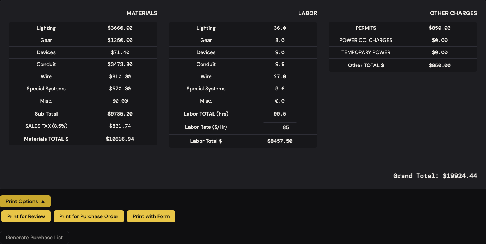
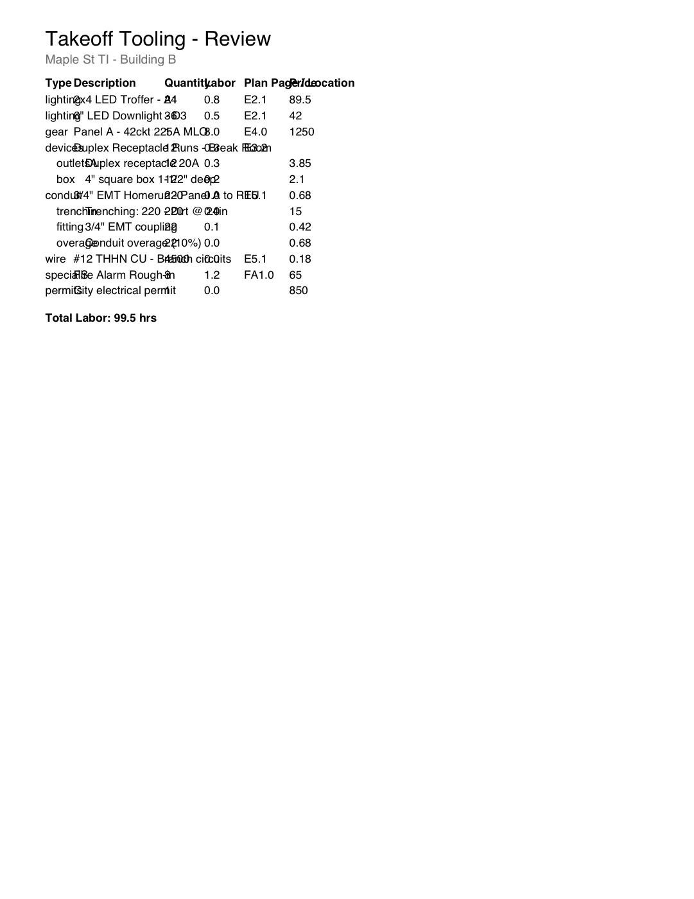
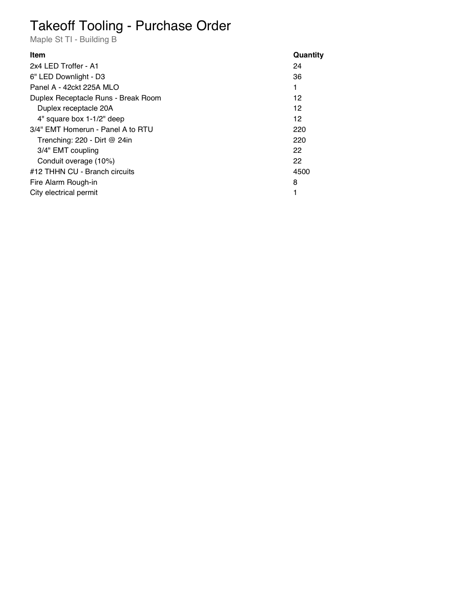
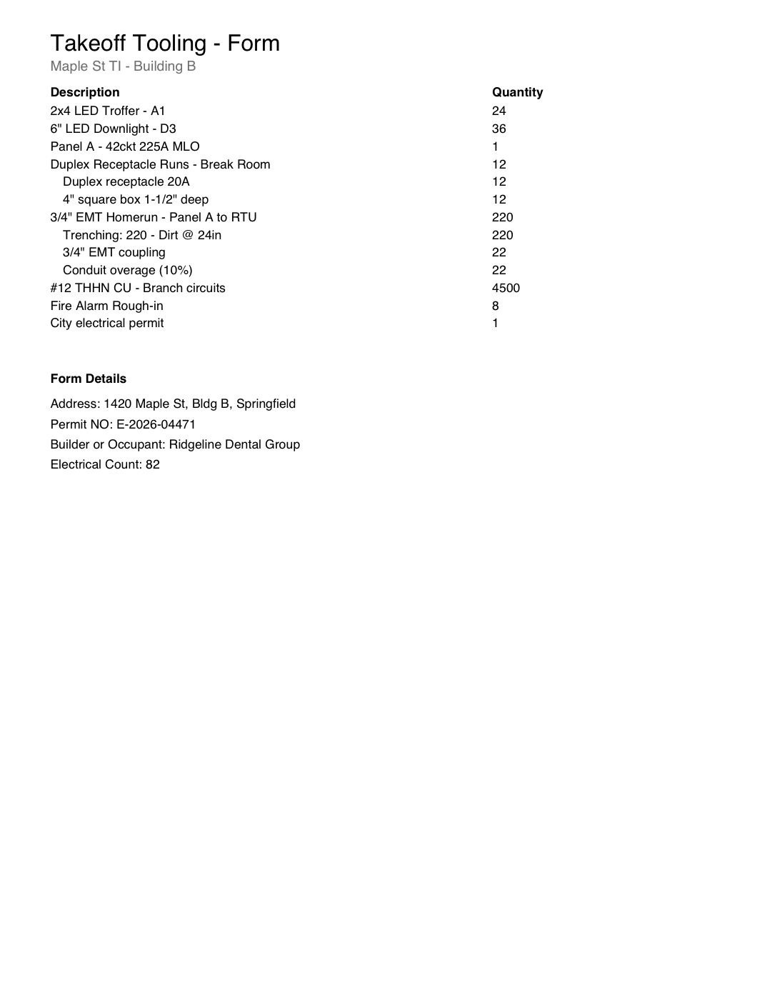
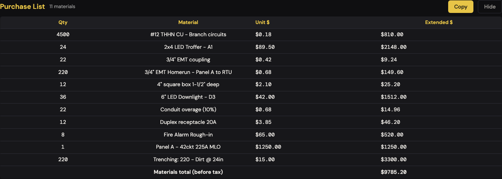
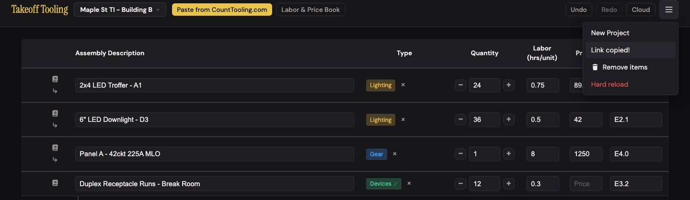
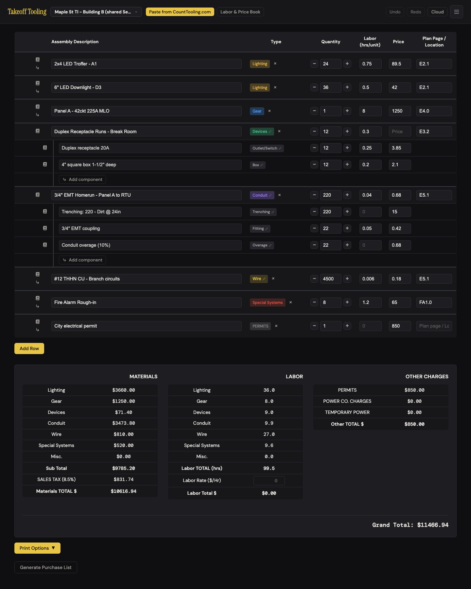
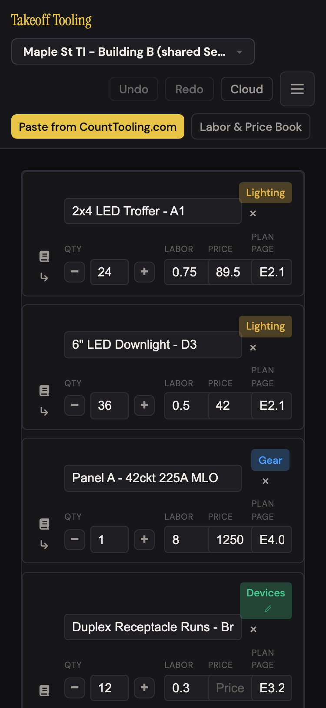

# J9 — Deliver the bid: print it, hand off the order, send the boss a link

Personas: E (estimator), S (share-link recipient) · Status: ● walked 2026-09-06 (headless Chromium, :4188, signed out; PDFs captured) · verified 2026-09-06 (adversarial re-drive, own seed — see Verification)

> Trigger — the number is done. The estimator prints the bid for a second pair of eyes,
> prints the material order for the supply house, prints the permit-form variant, copies
> the purchase list into a spreadsheet, and texts a colleague a link. The colleague has
> no account and opens it on whatever they have in hand.

## Entry points

- **Below the summary** — `#print-options-toggle` "Print Options ▼" (collapsed by default; hidden entirely until a row has a description) → reveals three buttons (click)
  - `#print-review-btn` "Print for Review" → downloads `takeoff-review.pdf` immediately (no preview, no dialog)
  - `#print-po-btn` "Print for Purchase Order" → downloads `takeoff-purchase-order.pdf` immediately
  - `#print-form-btn` "Print with Form" → `#form-modal` "Fill Form Details" (Address · Permit NO · Builder or Occupant · Electrical Count) → "Print with Form" downloads `takeoff-form.pdf`
- **Below Print Options** — `#purchase-list-toggle-btn` "Generate Purchase List" → inline report → `#purchase-list-copy-btn` "Copy" (TSV to clipboard, button flashes "Copied!" 1.5 s)
- **Header ☰** — `#export-link-btn` "Export via link" → clipboard gets `<origin>/#d=<base64>`; button reads "Link copied!" for 2 s and the menu stays open (app.js:306-333)
- **Hash route** `#d=…` — at boot or on `hashchange` in an open tab (app.js:426-480): creates a NEW project "<name> (shared <Mon D>)", loads the manifest, strips the hash
- Not present: a Share/Send button anywhere in the manifest area; a print preview; browser `window.print()`; an email or share-sheet path.

## Current route (walked 2026-09-06)

Happy path (E, all four deliverables + the link): **11 steps, 3 decisions** (which of three PDFs; fill or skip the four form fields; where to paste the link). Recipient (S): **1 step, 0 decisions** — but see finding 1.

1. Seeded the standard 8-row bid with 5 children (device run: receptacle + box; conduit run: trenching + coupling + 10 % overage), labor rate $85. Summary showed Materials $10,616.94 (subtotal $9,785.20 + 8.5 % tax $831.74) · Labor 99.5 hrs → $8,457.50 · Other $850.00 · **Grand Total $19,924.44**.
2. Scrolled past the summary. "Print Options ▼" sits at y≈1658 on an 1800-px viewport — the last thing before "Generate Purchase List". Clicked; three gold buttons appeared. 
3. **Print for Review** → `takeoff-review.pdf` (7,519 B, 1 page) landed in Downloads with no on-screen acknowledgement. Rendered: 
4. **Print for Purchase Order** → `takeoff-purchase-order.pdf` (4,886 B, 1 page). 
5. **Print with Form** → modal "Fill Form Details"; typed an address, permit number, occupant, count; clicked "Print with Form" → `takeoff-form.pdf` (5,259 B, 1 page). Re-opening the modal later still showed the four values (they live in the DOM, not the project). 
6. **Generate Purchase List** → 11 materials, "Materials total (before tax) $9,785.20" — agrees with the summary subtotal to the cent (A-1 holds). Clicked **Copy** → "Copied!"; clipboard held 13 TSV lines: header `Qty\tMaterial\tUnit $\tExtended $`, 11 rows, `\tTOTAL\t\t9785.20`. 
7. Added 60 lighting rows (73 rows, Grand Total $65,133.43, 308.5 hrs) and printed all three again: review 2 pages (44 rows/page), PO 2 pages, form **3 pages** — the four form fields print alone on page 3 under the last three fixtures.
8. **☰ → Export via link** → "Link copied!" in place, menu stayed open.  Clipboard: `http://localhost:4188/#d=eyJ2IjoyLCJhcHA…` — **4,341 characters** for the 13-row bid, **22,889** for the 73-row bid. Envelope `{v:2, app, exportedAt, name, manifest}` — no `laborRate`.
9. **Recipient (S)** opened the 13-row link in a fresh profile: landed in project "Maple St TI - Building B (shared Sep 6)", hash stripped, 8 rows + 5 children intact, every quantity/labor/price identical… and **Grand Total $11,466.94**. Labor Rate shows `0`, Labor Total $0.00. No banner, no "this is a copy" notice — the only clue is "(shared Se…" truncated in the project switcher. 
10. Reload → still there (`takeoff-project-<id>` + index written; the fresh profile also got an "Untitled project" from boot). Opened the same link a second time → a **second** "Maple St TI - Building B (shared Sep 6)" project; switcher now lists two identical names.
11. Back in the sender's open tab, set `location.hash` to their own link → imported without reload (N-4 holds) into a new "(shared Sep 6)" project and **switched to it**, no prompt. Then `#d=garbage` → alert "This shared link could not be loaded — it may be truncated or corrupted."; a link cut at 300 chars → same alert; `#d=` + base64 of `{"v":2,"name":"x"}` (valid JSON, no manifest) → hash stripped, **nothing happens, no message**.
12. Mobile recipient (375×812): card layout, no horizontal overflow, same $11,466.94. 

Divergences from the documented route:

- README "Export via link — Generates a shareable base64 URL with full manifest data" — true, and the omission matters: *full manifest* is not *full bid*. The labor rate is not in it.
- README "Print for Purchase Order — PDF for PO": the PDF is the manifest tree with quantities. It is not the purchase list the app already computes (merged, priced, groupings and permits excluded).
- ARCHITECTURE.md:180 describes the `#d=` import accurately; neither doc mentions that the sender's own tab will consume a pasted link and switch projects.
- _baseline.md "PDF downloads … could not be exercised in the review sandbox" — exercised now; three of the findings below are PDF-content findings that pass could not have seen.

## Naive attempt

I had a finished bid and wanted to print it. Nothing in the header said print, share, or send. I scrolled. Past the table, past three summary panels and the grand total, a gold "Print Options ▼" button was the second-to-last thing on the page; I would not have found it on a laptop without scrolling on faith. It opened three choices. "Print for Review" — review by whom? I clicked it and nothing visible happened; the file was in my Downloads, named `takeoff-review.pdf`, not after the job. I opened it and the columns were printed on top of each other; I could read the description of the troffer only by guessing where "Quantity" started. "Print for Purchase Order" gave me quantities and no prices, and it listed "Duplex Receptacle Runs - Break Room · 12" as if I were buying twelve of a run, plus the city permit. "Print with Form" asked me four questions I did not expect — Permit NO? Electrical Count? — with no hint of which form this is, and printed my answers at the bottom of the last page.

Sending it to my boss: I looked for "Share". There is a "Cloud" button — that turned out to be sign-in. The ☰ menu had "Export via link". "Export" sounded like a file; it copied a link and told me so. I pasted it into a message. My boss opened it, saw the bid, and said the total was eleven grand. Mine says twenty. Neither of us could tell why from the screen: her labor rate field was blank.

## Evidence

- **Telemetry visibility:** none exists. A rework here should ship `pdf_exported` (`variant: review|po|form`, `rows`, `pages`), `purchase_list_copied` (`lines`), `share_link_created` (`bytes`, `rows`), and `share_link_opened` (`ok|truncated|empty`, `atBoot`).
- **Doc coverage:** README "Export" (4 bullets, accurate but shallow); CLAUDE.md "Share links (`v:2` envelope, now with `name`) import into a NEW project"; ARCHITECTURE.md:171 (form modal ownership), :180 (envelope + import), :191 (no migration logic). None describe what each PDF contains.
- **Specs:** none. `smoke.spec.js` and `labor-book.spec.js` do not touch `#print-*`, `#export-link-btn`, `#purchase-list-*`, or `#d=`. `selectors.test.js` covers `getPurchaseList` (merge, priced parent, other-charges skip), `getFlattenedItems`, `getSummaryBreakdown` — the data under the PDFs is tested; the PDFs and the envelope are not.
- **Modals:** `#form-modal` only. The header menu is a popover, not a modal.
- **Hotkeys:** `Esc` closes the form modal and the header menu. None open anything on this route.
- **Storage / state touched:** sender — none (PDFs and the link are pure reads; the DOM form values are not persisted). Recipient — `createProject` writes `takeoff-projects-index` + `takeoff-project-<id>` immediately; `loadManifestFromExport` schedules a second write and **clears the undo stack** (state.js:81-83). No cloud push signed out.

## Friction findings

| # | Severity | What happens | Why it hurts | Verdict stamp (Phase 2b) |
|---|---|---|---|---|
| 1 | **blocker** | The share link carries `manifest` and `name` but not `laborRate` (app.js:314-320). The recipient's new project inherits *their* rate — 0 in a fresh profile — so a $19,924.44 bid opens as **$11,466.94** (labor $8,457.50 → $0.00). Same rows, same hours, different grand total; nothing on screen says why. | Two people reading "the same" bid disagree by 42 %. The recipient trusts the number in front of them; a labor-rate field reading `0` under a $10k materials block is easy to miss. This is the app's named failure mode — a wrong dollar figure that looks right. | **CONFIRMED blocker.** Re-driven at rate 92: sender $4,402.98 → fresh-profile recipient $2,056.97 (rate 0); a recipient whose open project already carried $60/hr got **$3,586.97** with no `0` clue at all. Counter-evidence found and rejected: `createProject` *deliberately* carries the recipient's rate (state.js:282-283) — "by design" makes the wrong number harder to spot, it does not lower the severity. |
| 2 | **blocker** | Print for Review lays columns at 25/80/35/35/40/35 pt (pdf.js:36) for 10-pt text: "lighting" (≈37 pt) overruns Type; every description (up to 45 chars ≈ 200 pt) runs through Quantity and Labor; the header "Plan Page / Location" is printed over "Price". See img/deliver-the-bid-02.png. | The one PDF meant for a reviewer is unreadable past the first two words of each line. It has been this way for every bid ever printed. | **CONFIRMED blocker (measured).** In-page jsPDF 2.5.1 `getTextWidth` at 10 pt on a 44-row bid: 44/44 descriptions cross Quantity (x=145), 39 cross Labor (x=180), 3 cross Plan (x=215), 1 crosses Price (a 45-char line ends at x=260.9); the bold header "Plan Page / Location" is 97.4 pt wide and overruns "Price" by 57.4 pt, "Quantity" overruns "Labor" by 5.4 pt; every type label but `wire`/`gear`/`box` is wider than its 25-pt column (`powerCoC` 46.9 pt). |
| 3 | **stumble** (numbers) | Review PDF prints `Labor` with `toFixed(1)` per unit: 0.75 → "0.8", 0.05 → "0.1", **0.04 → "0.0"**, **0.006 → "0.0"** (pdf.js:57). Price is `String(item.price)`: "89.5", "1250", "0.18" — no `$`, no cents, no extended column, no materials/tax/grand total; the only total is "Total Labor: 99.5 hrs". | The 4,500-ft wire run — 27 of the bid's 99.5 labor hours — shows 0.0 labor. A reviewer checking hours by eye is told the wire is free to pull. And the document called "Review" cannot be used to review the number the summary shows. | **CONFIRMED stumble.** Seven distinct roundings observed in the 44-row file (0.75→0.8, 0.25→0.3, 0.05→0.1, 0.04→0.0, 0.006→0.0 …); the wire (18 hrs) and conduit (7.2 hrs) — 25.2 of 139 hrs — print as `0.0` while "Total Labor: 139.0 hrs" is right; no `$`, "Materials", "Tax" or "Grand" text run exists anywhere in either PDF. Stays a stumble, not a blocker: the one total printed is correct. |
| 4 | **stumble** | Print for Purchase Order is the manifest tree with quantities: it includes the devices grouping row ("Duplex Receptacle Runs - Break Room · 12", price-less), the permit, the overage as a separate line, and does not merge duplicates. No unit price, no extended, no total, no vendor/ship-to/PO number. Meanwhile the purchase list (which does all of that, A-1) is copy-only. | The supply house gets a list with a non-item on it and a permit; the estimator hand-edits it or copies the TSV into a spreadsheet and prints that. Two "purchase" artifacts with different contents. | **CONFIRMED stumble.** PO-40 text runs contain the devices grouping row, the permit, "Utility service connection fee" and the overage line; zero `$`, zero total; the file has exactly two x-positions (40+indent, 390) — pdf.js:98-111 prints nothing else. |
| 5 | **stumble** | Print with Form: modal "Fill Form Details" never says which form; the PDF is titled "Takeoff Tooling - Form" and prints the four answers as a "Form Details" block **after** the last item — on a 73-row bid that is page 3, alone. Values are kept only in the DOM (lost on reload) and not stored with the project. | The fields (Address, Permit NO, Builder or Occupant, Electrical Count) are a permit-application header; printed as a footer they are not the form. Re-typing them on every print of every revision is busywork. | **CONFIRMED stumble.** Heading "Fill Form Details", four labels, no form name anywhere; values survived `TakeoffApp.render()` and a re-open only because `#form-modal` is static DOM outside `#main-content` (index.html:266-280) — nothing in app.js:407-419 writes them anywhere, so a reload loses them. On the 44-row bid "Form Details" landed at PDF y=568 on page 2 under 11 rows. |
| 6 | **stumble** | Pasting a `#d=` link into a tab that already has the app open (N-4) creates the "(shared Sep 6)" project **and switches to it** with no prompt, including the sender's own link. Opening the same link twice makes two identically named projects. | An estimator who pastes a link to check it, or a recipient who clicks the same message twice, ends up with duplicates and — because the switch is silent — may think their bid was replaced. Undo history of the previous project is not lost, but nothing says "you're now in a copy". | **CONFIRMED stumble.** `location.hash = <own link>` in the sender's tab: zero dialogs, project switched to "… (shared Sep 6)", hash stripped; fresh-profile recipient opening one link twice → two identical names (`dupCount 2`). app.js:448 always calls `createProject` — no lookup by name or `exportedAt`. |
| 7 | **stumble** | The recipient gets no notice that this is a shared copy they may edit freely: no banner, no origin/date beyond the "(shared Sep 6)" suffix, which the project switcher truncates to "(shared Se…" at 1440 px and 375 px. `exportedAt` is in the envelope and unused; the date shown is the *open* date. | S does not know whether edits go back to the sender (they do not), whether the sender still has their copy (they do), or when this was sent. | **CONFIRMED stumble.** No text matching /copy/ anywhere on the recipient's page; `#project-switch-name` measured scrollWidth 297 > clientWidth 237 at 1440 px (`text-overflow: ellipsis`, button `max-width: 280px`, styles.css:3720/3728) so the suffix is cut; `exportedAt` is decoded and ignored — app.js:447 stamps `new Date()`. |
| 8 | **papercut** | All three downloads are named `takeoff-review.pdf` / `takeoff-purchase-order.pdf` / `takeoff-form.pdf` — no project name, no date. Nothing in-app confirms a download happened. | Downloads folder fills with `takeoff-review (7).pdf`; the estimator attaches the wrong bid. | **CONFIRMED papercut.** `suggestedFilename` identical for the 3-row and 44-row bids (`takeoff-review.pdf` / `takeoff-purchase-order.pdf` / `takeoff-form.pdf`) — literals at pdf.js:74/115/169; no DOM change after the click. |
| 9 | **papercut** | A `#d=` payload that is valid base64 + valid JSON but has no `manifest` array (e.g. `{"v":2,"name":"x"}`) strips the hash and does nothing — no alert (app.js:442-451 only alerts in the `catch`). Garbage and truncated links do alert. | A future envelope change, or a link mangled into valid-looking JSON, fails silently. | **CONFIRMED papercut (widened).** `{"v":2,"name":"x"}` → hash stripped, project count unchanged, no dialog; `{"v":2,"manifest":{"a":1}}` (non-array) is equally silent. `{"v":2,"name":"Empty","manifest":[]}` *does* create "Empty (shared Sep 6)" with one blank row — acceptable. Garbage and a 300-char cut both alerted, as the walker said. |
| 10 | **papercut** | "Export via link" is software language and lives in ☰ next to "Hard reload"; there is no Share/Send affordance near Print Options where the estimator is already standing at delivery time. The blank app shows no print or share word anywhere (summary hidden until content). | Naive attempt above: looked for "Share", found "Cloud", found "Export". Recoverable, costs a minute. | **CONFIRMED papercut.** Blank app: no "print", "share" or "export" text on screen; ☰ holds exactly New Project · Export via link · Remove items · Hard reload (index.html:35-43). Wording is a judgement call; the mechanism — the whole print block hidden until a described row (manifest.js:246) — is real. |
| 11 | **papercut** (observation) | The link is the bid: 4.3 kB for 13 rows, 22.9 kB for 73. Nothing is stored server-side (the fragment never reaches the server) — good for privacy — but the whole bid, prices included, sits in both browsers' history and in whatever chat carried it. Chrome/Safari/Firefox accept it; SMS and some mail clients wrap or cut long URLs (the truncation alert covers the cut case). | A 300-row bid is ~90 kB in a URL. Fine technically, awkward socially. | **CONFIRMED observation.** 1,077 chars for 3 rows, 13,973 for 44 (≈318 chars/row → 300 rows ≈ 95 kB); the server is static and never sees the fragment. Correctly filed at papercut/teach — no UI change warranted. |

Baseline regressions: none. A-1 (purchase list vs summary: $9,785.20 both), N-3 (suffix present), N-4 (hashchange import works) hold.
*Verifier re-check (own seed):* A-1 ✓ purchase list "Materials total (before tax) $1435.00" = summary subtotal $1,435.00, TSV `TOTAL 1435.00` · N-3 ✓ "(shared Sep 6)" suffix on every import · N-4 ✓ `hashchange` in an open tab imported without reload.

## Proposals

**P1 — Put the labor rate in the envelope and honour it on import.** verdict: **polish** (one field; fixes finding 1).
(1) Removes the recipient's hidden decision "what rate?" — they never see a 0. (2) "Labor rate" is already the trade word on the summary. (3) Makes the recipient's re-typing of the rate unnecessary and removes the "why is your total different" phone call. (4) Nothing to find — the total is simply right. Also carry `laborRate` into `loadManifestFromExport`'s caller and keep the recipient's own rate only when the envelope has none (legacy links). `spiritPass: true`.
*Verifier:* `spiritPass: true`. Caveat: `createProject` (state.js:284-294) intentionally carries the *current* project's rate into the new one, so the import must call `setLaborRate` **after** `createProject` and only when `typeof data.laborRate === 'number'`; acceptance = recipient-B (own rate 60) sees 92 on the shared copy and still 60 on their own project.

**P2 — Make "Print for Review" the summary page plus a readable table.** verdict: **rework** (findings 2, 3).
Page 1: project name, date, the three summary blocks and Grand Total exactly as the screen shows them (with `$` and cents). Then the table with measured column widths (jsPDF `getTextWidth` or fixed 6-column layout across the 532-pt text width: Type 60 · Description 220 · Qty 50 · Labor 55 · Plan 70 · Price 70), labor at two decimals, extended labor and extended price columns, indent children. (1) Removes the step "open the PDF, give up, screenshot the summary instead". (2) Same words as the summary: Materials, Labor TOTAL (hrs), Grand Total. (3) Makes finding 3's rounding and finding 8's confusion unnecessary; one document answers "what's the number". (4) Same button, same place. `spiritPass: true`.
*Verifier:* `spiritPass: true`. Caveats: the proposed widths sum to 525 of 532 pt — no gutters, so measure rather than fix them (my longest 45-char description was 195.9 pt at 10 pt, so 220 holds; the 8-char type truncation must go — see NEW-1). "Makes finding 8 unnecessary" is overclaimed; filenames are P6's job.

**P3 — "Print for Purchase Order" prints the purchase list.** verdict: **rework** (finding 4) with a **hide** on the current tree dump.
Reuse `getPurchaseList()`: Qty · Material · Unit $ · Extended $ · Materials total (before tax), project name and date at the top, "n without a price" flagged. Rename the button and the report the same thing — **"Material list"** or **"Order list"** — so the on-screen list, the Copy, and the PDF are one artifact. (1) Removes the copy-to-spreadsheet-then-print detour. (2) "Material list", "supply house". (3) Removes one of two purchase artifacts. (4) The button already exists; the report's Copy and a new Print button sit side by side. `spiritPass: true`.
*Verifier:* `spiritPass: true`. Caveats: nothing the tree dump prints is lost — it carries only Item · Quantity (no plan page, no run structure), so the swap has no downside; keep "PO" in the label somewhere ("Print material list (PO)") because estimators do say "PO" — "Order list" is not trade language.

**P4 — Name the form, put the fields on top, remember them.** verdict: **polish** (finding 5).
Title the modal and the PDF for what it is (owner to confirm — it reads as a permit application header: "Permit form"), print the four fields under the project name on page 1, store them on the project (`project.form = {...}`) so the modal pre-fills. (1) Removes re-typing four fields per print. (2) "Permit", "Address", "Builder or Occupant" are already the form's words. (3) Makes the free-floating "Form Details" footer unnecessary. (4) Same button. `spiritPass: true` — caveat: needs the owner to name which form this is.
*Verifier:* `spiritPass: true`, same caveat, plus: `project.form` widens the project document `{manifest, laborRate}` that mirrors to `takeoff_projects.data` — harmless, but it needs a row in ARCHITECTURE's key table and a `sanitize` on import.

**P5 — Shared-copy banner + dedupe.** verdict: **polish** (findings 6, 7, 9).
On `#d=` import show a dismissible line above the table: "Copy of *Maple St TI - Building B*, shared Sep 6 by link — edits stay on this device." When the current project is not the recipient's blank starter, ask before switching ("Open the shared bid *Maple St TI - Building B*? Your open bid stays in the project list."); if a project with the same `name` + `exportedAt` already exists, switch to it instead of creating another. Alert on a shaped-but-empty payload. (1) Removes the recipient's "is this mine? can I touch it?" decision and the duplicate cleanup. (2) "Copy", "shared", "your open bid". (3) Makes the "(shared Sep 6)" suffix's truncation harmless — the banner carries the fact. (4) It is on the screen the link opens. `spiritPass: true`.
*Verifier:* `spiritPass: false` **as written** — passes once the confirm prompt is dropped. (1) The prompt adds a decision to a path the walker measured at "1 step, 0 decisions"; (3) the prompt removes nothing — the switch already replaces nothing (recipient-A's "Untitled project" and the sender's own bid were both intact after import). The banner, the `name`+`exportedAt` dedupe and the shaped-but-empty alert pass all four tests on their own and cover findings 6, 7 and 9 completely.

**P6 — Filenames and a download nod.** verdict: **polish** (finding 8).
`Maple St TI - Building B — Review 2026-09-06.pdf` (slugged); button text flashes "Saved" for 1.5 s like Copy does. (1) Removes a rename in Finder. (2) Job name. (3) Removes the "did it work?" re-click. (4) Same button. `spiritPass: true`.
*Verifier:* `spiritPass: true`. Caveat: the "Saved" flash duplicates the browser's own download chip — the filename alone pays for the change; the slug must strip `/` and `:` (project names are free text).

**P7 — A "Share" verb where the estimator stands.** verdict: **polish** (finding 10); keep the ☰ item.
Add "Copy share link" beside the three print buttons under Print Options (rename the group "Print & share"). (1) Removes the header hunt. (2) "Share", not "Export". (3) Nothing removed — flagged: the simplicity budget is paid by folding the link into the group the user already opened, not a new region. (4) Sits next to Print. `spiritPass: true` with the verifier's caveat that this adds one button.
*Verifier:* `spiritPass: false` **as written** — "keep the ☰ item" plus a new button is a duplicate surface, which JOURNEY-MAP lists as a watch item and test (3) rejects by construction. Passes as a **move**: "Copy share link" under Print Options and the ☰ item removed — the blank app (where ☰ would be the only path) has nothing to share, and the menu shrinks to three items.

**P8 — Long-URL and privacy note.** verdict: **teach** (finding 11). No UI change; the guide says the link *is* the bid, that it works offline and stores nothing on a server, and that a chat client which cuts long links will produce the "truncated" message — send it as a file or from a desktop mail client. `spiritPass: n/a`.
*Verifier:* `spiritPass: n/a` (teach). The guide claim is accurate as far as it goes: a cut link alerts; a link mangled into valid JSON without a manifest does not (finding 9) — the article should say "if nothing opens, ask for the link again".

**Keep** (pre-registered strength, verified): the purchase list — merged by description, `≠` when prices vary, "n without a price", agrees with the summary to the cent; Copy produces clean TSV that pastes into a spreadsheet with a header and a TOTAL row. Keep also the recipient path's mechanics: no account, lands in its own project, nothing replaced, persists on reload, works at 375 px.

## Guide actions

- "Deliver the bid" article: what each print contains (after P2/P3 land, describe the new contents; until then, warn that Review has no dollar totals and PO has no prices), where Print Options is (below the summary), the form's purpose and fields, Copy purchase list → paste into Sheets/Excel.
- "Send someone the bid": the link carries the whole bid; recipient needs no account; they get a copy — edits do not flow back; **until P1 lands, tell the recipient the labor rate** (their copy opens with the rate from their own device).
- README rows to fix: "Export via link — … full manifest data" → say what is and is not included (labor rate, assemblies, book); "Print for Purchase Order — PDF for PO" → describe contents; add the purchase list row (currently undocumented, per JOURNEY-MAP coverage table).

## Demo moment

Click ☰ → Export via link, paste it into a message, and watch the colleague's phone open the whole bid — every run and its components — with no login (img/deliver-the-bid-08.png). Do not scroll to the total until P1 lands.

## Walk notes

- Server: read-only static server at `http://localhost:4188` (not started or stopped by this walk). Playwright 1.61.1 headless Chromium; sender context 1440×1800 with `acceptDownloads` and clipboard read/write; recipient context fresh profile 1440×1800; mobile context 375×812, `isMobile`, DPR 2. Every context aborted `/supabase/i` — the only console errors in all three contexts were the resulting `Failed to load resource: net::ERR_FAILED` (one per boot, expected). No page errors.
- Seed: via `page.evaluate` — `setProjectName('Maple St TI - Building B')`, 8 rows + 5 children in one batch, `setLaborRate(85)`. Long variant: +60 lighting rows in one batch, undone afterwards with `TakeoffState.undo()` (one frame — batch works).
- PDFs captured with `waitForEvent('download')` + `saveAs`; inspected by byte scan (`%PDF-1.3`, `/Type /Page` count, `(…) Tj` runs with their `Td` x-positions) and rendered page 1 with macOS `qlmanage` for the three images. jsPDF 2.5.1 output is uncompressed, so text runs were readable directly.

| PDF | Bytes (13-row / 73-row) | Pages | What it contains | What it omits |
|---|---|---|---|---|
| `takeoff-review.pdf` | 7,519 / 28,127 | 1 / 2 (44 rows per page) | Title, project name; columns Type · Description · Quantity · Labor · Plan Page / Location · Price for every row incl. children (indented 10 pt); "Total Labor: 99.5 hrs" | Any `$`, extended cost, materials/tax/other/grand totals, labor rate, date; columns overlap (finding 2); labor rounded to 0.0 for wire/conduit (finding 3) |
| `takeoff-purchase-order.pdf` | 4,886 / 13,016 | 1 / 2 | Title, project name; Item · Quantity for every row incl. children, groupings (devices parent qty 12), overage, permit | Prices, extended, total, vendor/ship-to/PO number, merging of duplicates, date |
| `takeoff-form.pdf` | 5,259 / 13,611 | 1 / 3 (33 rows per page) | Title, project name; Description · Quantity for every row; then "Form Details": Address, Permit NO, Builder or Occupant, Electrical Count — after the last item (page 3 on the long bid) | Prices, totals, which form this is, fields at the top, date |

- Purchase list TSV (13-row bid): 13 lines — header, 11 materials sorted by description, `\tTOTAL\t\t9785.20`; unit prices two decimals; no `$` in cells (spreadsheet-friendly).
- Share link: 4,341 chars (13 rows) / 22,889 (73 rows). Envelope keys `v, app, exportedAt, name, manifest`.
- Recipient landing values: rows 13 (8 + 5), Materials $10,616.94, Labor 99.5 hrs, rate 0, Other $850, **Grand $11,466.94** (sender $19,924.44). Persisted across reload; second open created a duplicate project.
- Verifier: re-drive finding 1 first (open any link in a fresh profile and compare Grand Total), then open `img/deliver-the-bid-02.png` or regenerate the review PDF for finding 2 — both are deterministic.
- Scratch (scripts, captured PDFs, TSV, URLs, full log): `scratchpad/walks/deliver-the-bid/` in the session scratchpad. Nothing was committed; app code and tests were not touched.

## Verification

**Date:** 2026-09-06 · **Verifier:** adversarial pass, independent of the walker's scripts and seed. A previous verifier was cut off before starting; nothing of theirs existed.

**Method.** Playwright 1.61.1 headless Chromium against the read-only server at `http://localhost:4188` (not started or stopped); every context aborted `/supabase/i` (the only console error per boot is the resulting `ERR_FAILED`, expected); zero page errors, zero unexpected dialogs. Contexts: sender 1440×1800 with `acceptDownloads` + clipboard permissions; recipient A fresh profile; recipient B fresh profile pre-set to $60/hr; mobile 375×812 (`isMobile`, DPR 2). **Own seed:** project "Cedar Ridge Clinic - Suite 200", labor rate **92**; a 3-row variant (troffer 10 × 0.75 hr × $89.50; #12 THHN 3,000 ft × 0.006 hr × $0.18; county permit $500) and a 40-top-level variant (44 flattened rows: + gear, a devices run with 2 children, a conduit run with trenching/coupling/10 % overage, an 87-char `specialSystems` line, a `powerCoCharges` line, 31 lighting rows). Expected values were derived by hand before the run and matched exactly: 3-row Materials $1,435.00 + 8.5 % tax $121.98 → $1,556.97 · Labor 25.5 hrs × 92 = $2,346.00 · Other $500 · **Grand $4,402.98**; recipient at rate 0 → **$2,056.97**. 44-row: Materials $18,569.34 · 139 hrs → $12,788 · Other $1,700 · Grand $33,057.34. PDFs captured via `waitForEvent('download')` → `saveAs`, then byte-inspected (page count = `/Type /Page` objects; text runs = `x y Td (text) Tj` pairs, jsPDF 2.5.1 emits uncompressed streams). Column overlap measured *inside the page* with `new jspdf.jsPDF()` → `setFontSize(10)` → `getTextWidth()` against the exact x-offsets pdf.js computes from `[25, 80, 35, 35, 40, 35]` at margin 40 (`x = 40, 65, 145, 180, 215, 255`). Scripts, PDFs, TSV, URLs and the full log: `scratchpad/walks/deliver-the-bid/verify/` (`verify.js`, `measure-po.js`, `verify.log`).

**Re-driven (all 11 findings, both variants).** Review PDF: 3-row 4,545 B / 1 page; 44-row 17,996 B / **1 page** (44 rows is exactly the per-page capacity: rows start at y=91 and `y > 700` trips on the 45th — consistent with the walker's 44/page). PO: 3,680 B / 8,888 B, 1 page each. Form: 4,054 B / 9,484 B, 1 / 2 pages (33 rows/page from `y > 550`; "Form Details" at PDF y=568 on page 2 under 11 rows). Purchase list: 2 materials, $1,435.00, Copy → "Copied!" and a 4-line TSV with header and `\tTOTAL\t\t1435.00`. Export via link: "Link copied!", menu stayed open, envelope keys exactly `v, app, exportedAt, name, manifest`; 1,077 chars (3 rows) / 13,973 (44 rows). Sender-tab `hashchange` with its own link: silent switch to "Cedar Ridge Clinic - Suite 200 (shared Sep 6)", hash stripped. Malformed payloads: garbage → alert; 300-char cut → alert; `{"v":2,"name":"x"}` → silent; `{"v":2,"manifest":{"a":1}}` → silent; `{"v":2,"name":"Empty","manifest":[]}` → creates "Empty (shared Sep 6)" with one blank row. Recipient A: lands in the shared project, rate field empty, **$2,056.97**, no notice text, switcher text truncated (scrollWidth 297 > clientWidth 237), persists across reload, second open → duplicate project. Recipient B (own rate 60): **$3,586.97** — same rows, third different grand total for the same bid. Mobile: same $2,056.97, no horizontal overflow.

**Counter-evidence hunts.**
- *Is the labor rate deliberately per-project and excluded from the envelope?* Per-project, yes: `{v:1, …, laborRate}` on disk and `data = {manifest, laborRate}` in `takeoff_projects` (ARCHITECTURE.md:123, :134); `createProject`'s comment (state.js:282-283) says the rate "carries over as the default" and that share-link imports replace the manifest "right after" — so the recipient's rate is applied on purpose. Excluded from the envelope deliberately? No document says so; README says "full manifest data" and ARCHITECTURE.md:180 lists the fields without comment. Judgement: design intent does not change the outcome — three grand totals for one bid ($4,402.98 / $2,056.97 / $3,586.97) with nothing on screen explaining it; the $60 case is *worse* than the walker's because there is no `0` to notice. Finding 1 stays a blocker.
- *Is finding 2 really a blocker rather than a stumble?* The numbers settle it: every description on a 44-row bid crosses the Quantity column and 39 of 44 cross Labor — the reviewer cannot read any line past the description. Stays blocker.
- *Does the PO / Form PDF have the same overlap?* Only two x-positions there (40 + indent, 390). An 80-char mixed-case description measures 341.8 pt → ends at x=381.8, 8 pt short of Quantity; an 80-char ALL-CAPS line measures 467.2 pt → ends at x=507, 117 pt past it. Checked every shipped description source: `mc-labor-book.json` is all-caps but capped at 50 chars (55,775 rows, max 50 → ≈292 pt, safe); `laborBookDefaults.js` names max 57 chars mixed-case; the Elliot overlay carries part numbers only. So the overlap is reachable only with a hand-typed ≥60-char all-caps description — a latent risk noted for P2/P3, not a finding.
- *Could finding 3 be a blocker?* No dollar figure is wrong because none is printed; the only total (labor hours) is right. Stumble holds.
- *Is finding 9 real at boot as well as on `hashchange`?* Same branch (app.js:442-451) both ways; the `list` null check falls through to `stripHash()` with no alert. Confirmed and widened to non-array `manifest`.
- *Walker's dollar formatting:* the dossier writes `$19,924.44` but the screen renders `$19924.44` — `formatMoney` (manifest.js:112) is a bare `toFixed(2)` with no thousands separator. Editorial, not a J9 finding (J8 owns the summary); recorded so a reader does not go looking for a comma.

**NEW in passing.**
- **NEW-1 (papercut, Review PDF)** — the Type column prints the raw internal type key cut to 8 characters (pdf.js:54, :61): the 44-row file contains `outletsA`, `trenchin`, `specialS`, `powerCoC`. The manifest view already owns display labels for every one of these (`TYPE_LABELS` / `CHILD_TYPE_LABELS`, manifest.js:10-35: "Outlet/Switch", "Trenching", "Special Systems", "POWER CO. CHARGES"). Same class as baseline N-2 (a section key leaking into UI text). Folds into P2.
- **Widening of finding 9** — a non-array `manifest` is as silent as a missing one (recorded in the row).

**Tally.** Walker findings 11 → **CONFIRMED 11 / downgraded 0 / KILLED 0** (finding 9 widened). Proposals: `spiritPass` true 5 (P1, P2, P3, P4, P6) / false 2 as written (P5 — the confirm prompt adds a decision and removes nothing; P7 — duplicates a surface) / n/a 1 (P8). Baseline: A-1 ✓ · N-3 ✓ · N-4 ✓. One new papercut (NEW-1). Only this file was edited.
