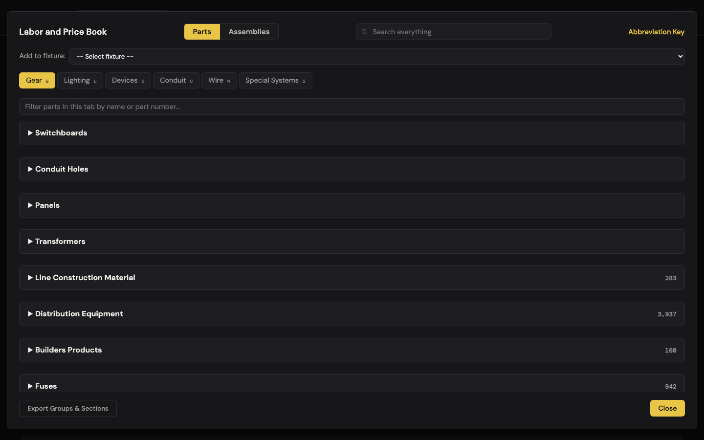
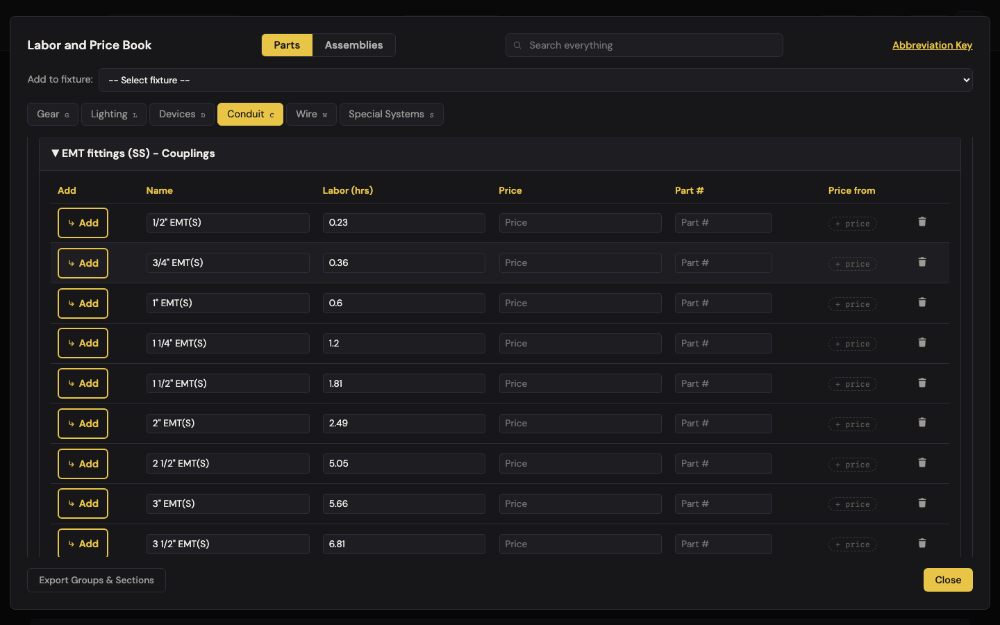
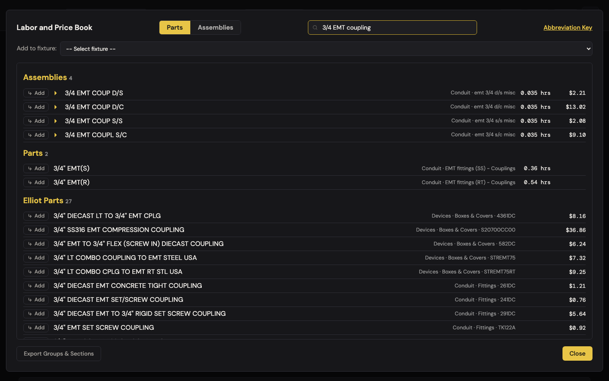
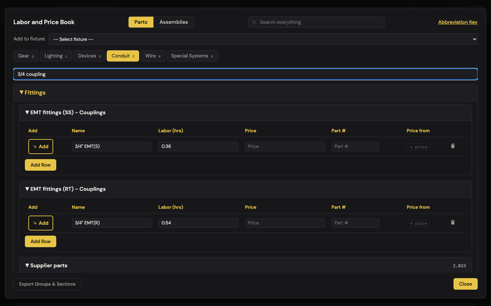
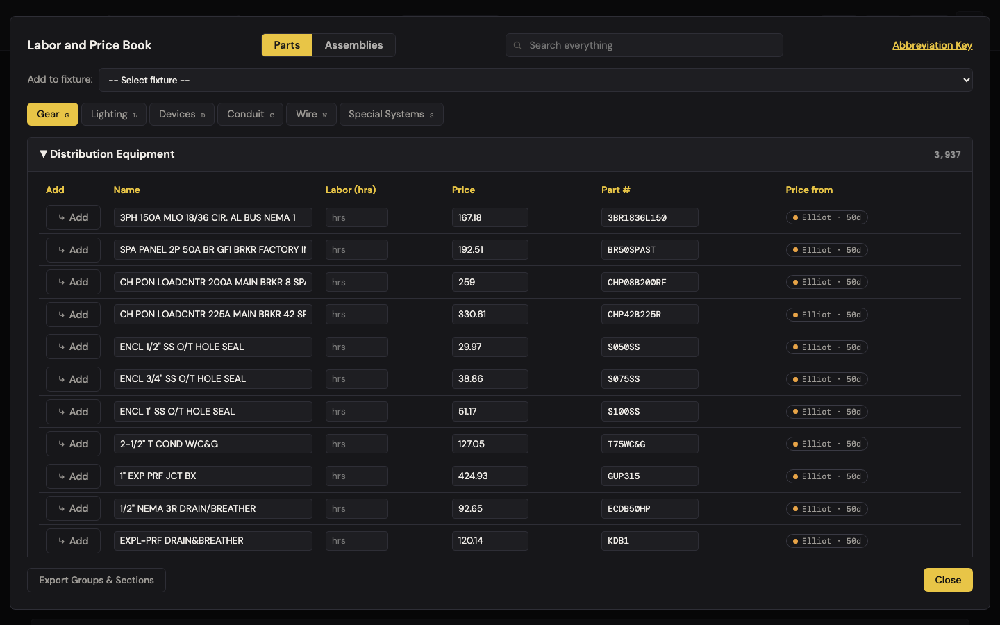
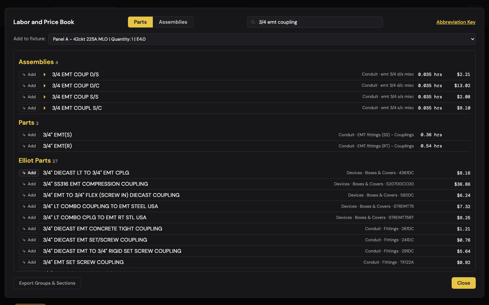
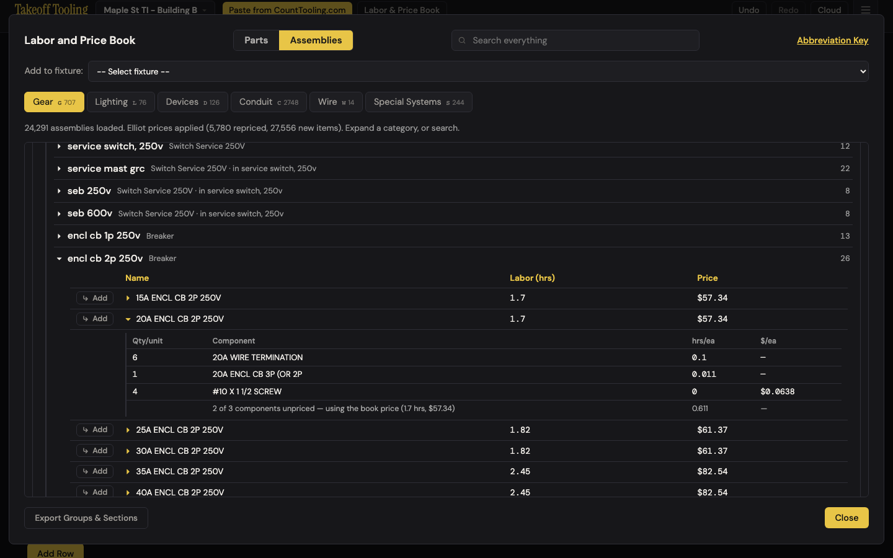
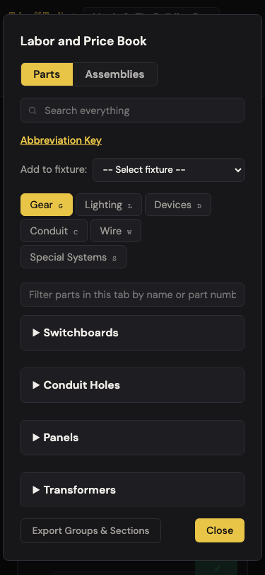

# J6 — Find a part: from "I need a 3/4 coupling" to a priced line on the bid

Personas: E · Status: ● walked 2026-09-06 (headless Chromium 1440×900 + one 375×812 pass, :4188, signed out, cloud aborted, seeded 8-row bid) · **adversarially verified 2026-09-07** (18/18 findings confirmed, 4 new — see [Verification](#verification))

> Trigger — the estimator needs one specific part: a 3/4" EMT coupling for the homerun, a
> 20A duplex for the break room, a 2P 20A breaker for Panel A. It has to come from somewhere
> in the curated book, a 34,000-part supply-house catalog, or 24,291 MC assemblies — and
> land on the right fixture with a price and hours that are actually right.

## Entry points

- **Header "Labor & Price Book"** — `#labor-book-open-btn` → `#labor-book-modal` on the last-used tab (Gear on first open), Parts side, "Add to fixture: -- Select fixture --" `<select>` (app.js:52–66). Focus stays on the header button; nothing in the book is focused.
- **Manifest row book icon** — `.labor-book-icon-btn[data-id]` → same modal on the row's tab with the banner "↳ Adding parts under: **Panel A – 42ckt 225A MLO** · ×1 on the bid" (laborBook.js:355–362). No select.
- **Conduit fittings header book icon** — `#conduit-fittings-labor-book-btn` (conduit.js:410) → Conduit tab, **Fittings group pre-expanded**, banner "Adding parts under: 3/4" EMT Homerun … · ×220 on the bid"; adds land as fittings rows in the wizard, not on the manifest (laborBookTargets.js:92–100).
- **PB fill buttons** — device rows, conduit fitting rows, wire MAC rows (`.part-book-icon-btn`) → fill mode: banner "Fill: **fitting row 1** — selecting an entry replaces this row's description, labor, and price", **search box focused** (app.js:228–239). The only door that focuses the search.
- **Device flow row book icon** → "Add to: Boxes row 1" (accumulates into that row; J4).
- **Empty-tab "Browse Assemblies"** button (laborBook.js:110) → flips to the Assemblies side.
- Hotkeys while open: `g l d c w s` switch tabs on either side; `Esc` (see finding 4). No hash route.

## Current route (walked 2026-09-06)

Happy path (a 3/4" EMT coupling under the 220-ft homerun): **4 steps, 3 decisions** — open the book, pick the fixture, type the query, click ↳ Add on one of **33 candidates across three buckets** (which bucket, which row, and fixture-first-or-search-first).

1. Clicked **Labor & Price Book**. Gear tab, everything collapsed: four curated headers (Switchboards, Conduit Holes, Panels, Transformers) then five supplier sections with counts — Line Construction Material 283, **Distribution Equipment 3,937**, Builders Products 160, Fuses 942, Controls 1,803. Placeholder "Search everything"; per-tab filter "Filter parts in this tab by name or part number…". 
2. **Conduit** tab: five curated groups (Fittings, Connectors, Couplings, Tubing, Special) and two supplier sections at group level (Conduit & Raceways 1,375; Anchors & Connectors 3,678). Opened Fittings → 14 curated sections + "Supplier parts 2,023". Opened **EMT fittings (SS) - Couplings**: ten rows `1/2" EMT(S)` … `4" EMT(S)`, labor 0.23–9.1 hrs, **every Price empty, every badge "+ price"**. The Elbows section three headers up has the **same ten row names** (verified: 10 of 10 identical). 
3. Typed `3/4 EMT coupling` in **Search everything**. Tabs vanished; three buckets: **Assemblies 4** (3/4 EMT COUP D/S 0.035 hrs $2.21 · D/C $13.02 · S/S $2.08 · COUPL S/C $9.10), **Parts 2** (3/4" EMT(S) 0.36 hrs, 3/4" EMT(R) 0.54 hrs — no price), **Elliot Parts 27** (3/4" DIECAST LT TO 3/4" EMT CPLG $8.16 first; the plain "3/4" DIECAST EMT SET/SCREW COUPLING $0.76" seventh — no labor on any). Results within the 250 ms debounce. 
4. Cleared with `Esc` (search box focused: term cleared, book stayed open). Conduit **tab filter** `3/4 coupling`: curated rows narrowed to 4 sections × 1 row (SS Couplings, RT Couplings, Meyers Hubs, RIGID Set 2), supplier blocks opened themselves with counts "37 matches" (Fittings), "6 matches" (Conduit & Raceways: PVC/ENT couplings), "2 matches" (Anchors & Connectors: hex rod coupling nuts); Connectors/Tubing/Special groups hidden. `emt` → 10 curated sections, "First 100 of 555 matches" / "55 matches" / "1 match" (C-4 holds). 
5. Gear → **Distribution Equipment**: 100 rows in 335 ms + "Show all 3,937 parts" (B-5 holds). Rows are live inputs: Name, empty Labor, Price 167.18, Part #, badge "Elliot · 50d". Clicked Show all: 504 ms, **70,881 DOM nodes**; scroll round-trip 104 ms; typing `225a` still filtered ("First 100 of 142 matches" + Fuses 7). 
6. **Add path (a)** — header button, selected **Panel A** in the `<select>`, searched `3/4 emt coupling`, clicked ↳ Add on the first Elliot row → button flashed **✓ Added** for 1.2 s, book stayed open, nothing else moved. Then ↳ Add on Parts "3/4" EMT(S)" and on Assemblies "3/4 EMT COUP S/S". Panel A now has three children: `3/4" DIECAST LT TO 3/4" EMT CPLG ×1 $8.1587 0 hrs` · `3/4" EMT(S) ×1 (no price) 0.36 hrs` · `3/4 EMT COUP S/S ×1 $1.06 0.035 hrs`. **The assembly row said $2.08.** 
7. **Add path (b)** — Panel A's row icon: Gear tab, banner "Adding parts under: Panel A – 42ckt 225A MLO · ×1 on the bid"; searched `2p 20a breaker` → Assemblies 0, Parts 0, Elliot 30 ("TYPE QC BRKR 2P 20A 120/240VAC MAX 10KAIC $179.00" first) → ↳ Add → child ×1 $179, 0 hrs.
8. **Add path (c)** — header button, no fixture, searched `wire nut`, ↳ Add → native `alert()` "Please select a fixture from "Add to fixture" first." (laborBookTargets.js:88–90); same alert from a curated row's ↳ Add. Pressed `Esc` with focus still on the Add button → **the whole book closed**; reopened → search box still says `wire nut`, results showing, **tabs hidden**.
9. **Add path (e)** — selected the **3/4" EMT Homerun (×220)** in the select, ↳ Add on the S/S assembly and the Elliot coupling → children `3/4 EMT COUP S/S ×220 $1.06` and `3/4" DIECAST LT TO 3/4" EMT CPLG ×220 $8.1587` — **$233.20 + $1,794.91 of couplings** for one 220-ft run.
10. **Fill mode** — in the conduit wizard's Fittings step, PB on row 1: banner "Fill: fitting row 1 …", search focused; ↳ Add on the S/S assembly → row became `3/4 EMT COUP S/S · qty 0 · 0.035 hrs · $2.08` and the book closed. Same assembly, **$2.08 here, $1.06 in step 6**. Fittings-header book icon → Fittings group open; supplier "3/4" NM RIGID PIPE HANGER" ↳ Add → new fittings row qty 1 $0.9796, book stays open. Back → **Cancel: no "Discard unsaved changes?"** — the book-added row was discarded silently.
11. **Assemblies side** — status "24,291 assemblies loaded. Elliot prices applied (5,780 repriced, 27,556 new items). Expand a category, or search." Tab counts Gear 707 · Lighting 76 · Devices 126 · **Conduit 2,748** · Wire 14 · Special Systems 244 sections. No filter box on this side. Drilled **Equipment 177 → Switchs/Breakers 52 → encl cb 2p 250v (26)**: 15A…600A ENCL CB 2P 250V; **20A = 1.7 hrs, $57.34**. ▸ BOM: `6 × 20A WIRE TERMINATION 0.1 —` · `1 × 20A ENCL CB 3P (OR 2P 0.011 —` · `4 × #10 X 1 1/2 SCREW 0 $0.0638`, footer **"2 of 3 components unpriced — using the book price (1.7 hrs, $57.34) · 0.611 · —"** (B-12 holds). 
12. Selected Panel A, ↳ Add on 20A ENCL CB 2P 250V → status "Added 3 components of "20A ENCL CB 2P 250V" to the selected target." Children: `20A WIRE TERMINATION ×6 $0 0.1 hrs` · `20A ENCL CB 3P (OR 2P ×1 $0 0.011 hrs` · `#10 X 1 1/2 SCREW ×4 $0.06 0 hrs` — **$0.24 and 0.611 hrs on the bid for a breaker the book prices at $57.34 and 1.7 hrs.** One undo frame (3 → 0 children).
13. Hotkeys `g l d c w s` switched tabs on both sides (`w` on Assemblies → Wire, stayed on Assemblies). Abbreviation Key: 8 entries (SS, st, cn, insl., RGS, RT, N3R, N4R); `Esc` closed the key, book stayed. **Export Groups & Sections** → button read "Copied!" for 1.5 s; clipboard holds a plain-text outline of the curated Gear/Conduit/Wire sections only. Update Supplier Prices hidden signed out (B-10 holds).
14. **Mobile 375×812**: modal 368 px wide, header stacks to 162 px, tabs wrap to three rows, no page-level horizontal scroll (C-11 holds). Search rows: **part name 0 px wide** — only "Conduit · emt 3/4 d/s misc 0.03…" shows. Curated table 437 px inside a 282 px body with the modal `overflow: hidden` → Price / Part # / Price from unreachable. 

Divergences from the documented route:

- README.md:73 — "add entries rolled-up or exploded into their component items" reads as a choice. There is none: `addAssemblyEntry` (mcBook.js:249–270) **always explodes when a composition exists**, and only fill mode gets the rolled-up entry. ARCHITECTURE.md:186 repeats the phrasing.
- README.md:77 — Abbreviation Key is "Reference for labor codes"; it is eight fitting abbreviations. None of the book's own codes (D/S, S/S, D/C, S/C, W/C, GROUI, BUSHI, WEATH, LOCKN) or MC's (nf/f, gd, hd, seb, n3r) are in it.
- README.md:74 — "Searches parts, assemblies, and supplier parts together": true, but the surfaces name the third bucket **"Elliot Parts"** (laborBookSearch.js:75) — a vendor, not a kind of thing.
- _surfaces.md says `Esc` "clears search → closes book". Only when the search box has focus (laborBookSearch.js:138–149); from anywhere else in the book `Esc` closes it outright (laborBook.js:643–657).

## Naive attempt

I had a 220-foot 3/4" EMT homerun on the bid and needed the couplings priced. I opened the book from the header because that's what it's called. Gear. I clicked Conduit, then Fittings, then a section that said Couplings, and found `3/4" EMT(S)` with 0.36 hours and an empty price with a little dashed "+ price". Hours but no dollars — so I don't have a coupling yet. I noticed a "Supplier parts 2,023" bar under it and opened that; a hundred rows of anchors, straps and hangers scrolled past before a coupling. I gave up and typed `3/4 EMT coupling` in the big search. Three lists came back. The top one — "Assemblies" — had a "3/4 EMT COUP S/S" for $2.08 with hours; the middle one was the same hours-only row I'd just left; the bottom one, "Elliot Parts", had 27 couplings with prices and no hours. Which is the coupling? I clicked ↳ Add on the S/S one on faith. A popup told me to pick a fixture first. I picked the homerun from the list at the top and clicked Add again — "✓ Added", and the book just sat there. I closed it: the run now had **220 couplings at $1.06** under it. Not $2.08 — $1.06 — and 220 of them, one per foot. I wanted about 22. I fixed the quantity by hand. Then I went back for a 2P 20A breaker for Panel A: the assemblies list had nothing (the book calls it "encl cb"), so I took an Elliot breaker at $179 with no hours, and separately found the MC one by digging Equipment → Switchs/Breakers → encl cb 2p 250v. Its BOM said "using the book price (1.7 hrs, $57.34)". I added it. Panel A got three lines totalling **24 cents and 0.6 hours**.

## Evidence

- **Telemetry visibility:** none exists. A rework here should ship `book_search {termLength, buckets:{asm,parts,elliot}, zeroResult}`, `book_add_to_target {door: header|rowIcon|fittingsIcon|fill, bucket, exploded, targetType, targetQty, inheritedQty}`, `assembly_bom_opened`, and `book_esc_closed_with_term` — the last one measures finding 4 directly.
- **Doc coverage:** README.md:20, :68–78; CLAUDE.md "Where things live" (mcBook / laborBookSearch rows); ARCHITECTURE.md:185–186 (structure accurate; "rolled-up or exploded" misleading, see Divergences); _baseline.md A-4, N-1 (matcher), B-5, C-4, B-12, C-9.
- **Specs:** `labor-book.spec.js:5–25` opens the book, flips to Assemblies, and checks that searching `EMT` produces text containing "EMT" — nothing on adding, exploding, quantity inheritance, the filter counts, Show all, or `Esc`. `utils.test.js:15–46` covers `makeTokenMatcher` (7 tests including synonyms and short-word rule). Steps 6–12 above have **zero** automated coverage; findings 1–3 are each a one-assertion test on `addAssemblyEntry` / `addEntryToTarget` / `describeBookRow`.
- **Modals:** `#labor-book-modal`; `#abbreviation-key-modal` (stacked); `#part-card-modal` when a stray click lands on a "+ price" badge (J7); one native `alert()`.
- **Hotkeys:** `g l d c w s` (both sides; ignored while an input/select has focus); `Esc` clears-then-closes **only** from the search box.
- **Storage / state touched:** `takeoff-project-<id>` on every ↳ Add (400 ms debounce); one undo frame per add, one per explosion (`beginBatch`/`endBatch`, laborBookTargets.js:190–202 — verified 3 children → 0 on undo). Fill / fittings-step adds write the conduit temp buffer only and **do not set the flow dirty flag**. No `takeoff-book` writes on this route unless a catalog row is edited (J7). `mc-elliot-*` read only.
- **Console:** no app errors. The single `net::ERR_FAILED` in every run is the walk's own `route(/supabase/i).abort()`.

### Search-quality table (global search, cap 80 per bucket → "80+")

| Query | Assemblies | Parts | Elliot Parts | Note |
|---|---|---|---|---|
| `3/4 EMT coupling` | **4** — 3/4 EMT COUP D/S · D/C · S/S | **2** — 3/4" EMT(S) · 3/4" EMT(R) | **27** — 3/4" DIECAST LT TO 3/4" EMT CPLG · SS316 EMT COMPRESSION COUPLING · EMT TO 3/4" FLEX DIECAST COUPLING | good; the plain set-screw coupling ($0.76) is 7th |
| `duplex receptacle 20a` | **40** — 20A 125V IV TAMPER DPLX RCP · WH TAMPER DPLX RCP · DPLX 20/3 HOSP REC | **0** | **80+** — TR DUPLEX RECP 20A 125V SELF GRND W · SQ STL BLK … GFCI RCPT · WR DUPLEX RECP TR 20A | synonyms carry it (N-1 holds) |
| `2p 20a breaker` | **0** | **0** | **30** — TYPE QC BRKR 2P 20A · GHC BRKR 2P 20A · EHD BRKR 2P 20A | MC names it "ENCL CB 2P" — `cb` is not a synonym of breaker |
| `1/2 emt` | **80+** — 1/2 EMT D/S STRAP · 1 1/2 EMT D/S STRAP · 2 1/2 EMT D/S STRAP | **39** — 1/2 EMT · 1 1/2 EMT · 2 1/2 EMT | **80+** — 1/2" 90D EMT ELB ×2 · 1-1/2" 90D EMT ELB | `1/2` substring-matches 1 1/2 and 2 1/2 |
| `4 square box` | **17** — 4 11/16 J-BOX (SURF) … | **0** | **0** | false positive: section "box 4 11/16 square"; catalog says 4S / 4SQ |
| `exit sign` | **0** | **0** | **0** | book has LED EXIT LIGHT ×5 (`exit light` → 5) |
| `2x4 troffer` | **36** — 2X4 TROFFER 2/3/4 LAMP LED | **0** | **3** — 2X4 LED LENSED TROFFER … | good |
| `12 thhn` | **2** — 12 THHN CU SOLID · STRANDED | **1** — 12 (THHN CU) | **80+** — THHN 12 SOL BLUE 500' … | good; Elliot per-foot $0.20 vs curated $215/roll — unlabeled units |
| `gfci` | **47** — AFCI & GFCI IV15A RECEPT … | **0** | **80+** — SPA PANEL 2P 50A BR GFI BRKR · HANDLE PADLOCK … GFI · 1P 20A GFCI BREAKER | `gfi` synonym pulls breakers ahead of receptacles |
| `panel 42 circuit` | **0** | **0** | **1** — 1-42 MASTIC PANELBOARD CIRCUIT NUMBER LABELS | curated "42" under Panels.1PH is not found (haystack lacks "circuit") |
| `pvc 90` | **80+** — 1/2 GRC/PVC 90 ELBOW … | **10** — 1/2" PVC 90 … | **5** — 4IN PVC COATED RIGID 90 ($0.00) … | good; a $0.00 catalog row surfaces |
| `wire nut` | **0** | **0** | **18** — WIRE-NUT 73B ORANGE 500/BAG $0.09 · WING-NUT 451 · WIRE-NUT 72B BLUE | catalog only |
| `strut` | **80+** — 3 WOOD STRUT RACK … | **0** | **80+** — 3/4" 316SS RIGID STRUT STRAPS … | fine |
| `ground rod` | **14** — 1/2X8' GA GRND ROD W/C … | **15** — 1/2" X 8' · 1/2" X 10' · 5/8" X 8' (Grounding rod) | **51** — 3/4'' GROUND ROD DRIVER $481.86 · 5/8"X6' GALV GROUND ROD $17.15 · CLAMP | good (section name carries the curated rows) |

Extra electrician phrasings: `1900 box`, `single pole switch`, `pull string` → **0/0/0**; `emt 90` → 80+ assemblies, **0 Elliot** (catalog writes "90D EMT ELB"); `4s box` → 0/0/1; `toggle switch` → 0 assemblies (MC: "SP STD"); `romex` → 0/0/56; `occ sensor` 4/0/35, `photocell` 0/0/7, `disconnect 60a` 0/0/14 — the curated book is silent on every device query. Short forms: `sw` → 80+/6/80+ (the six curated hits are Switchboards rows "600a", "800a" via the section name); `lt` → 80+ (BATH FAN/**LT**, **LIQ** COOLED GENERATOR $27,255) ; `al` → 80+/**47**/80+ (curated hits are "FLEX Tubing (available in steel or **al**uminum)"); `ss` → 80+/40/80+ where the catalog's SS means **stainless** (316 SS tubing) and the curated book's means set screw. `cplg` and `3/4" emt coupling` (with inch mark) return exactly the `3/4 EMT coupling` set — A-4 holds.

## Friction findings

| # | Severity | What happens | Why it hurts | Verdict stamp (Phase 2b) |
|---|---|---|---|---|
| 1 | **blocker** | Exploded add ignores what the BOM footer promises. "20A ENCL CB 2P 250V" shows **1.7 hrs · $57.34**; its BOM says "2 of 3 components unpriced — using the book price (1.7 hrs, $57.34)"; ↳ Add puts **$0.24 and 0.611 hrs** on Panel A (6 × $0, 1 × $0, 4 × $0.06). Same mechanism on the coupling: row says **$2.08**, exploded child is **$1.06** (component overlay price), while fill mode gives $2.08. `addAssemblyEntry` explodes whenever `getComposition` returns anything (mcBook.js:259–262); `renderBom` only relabels (mcBook.js:150–153). | The number the estimator read is not the number on the bid, by −99.6% on a breaker and −49% on a coupling, with no message. B-12 fixed the label, not the add. | **CONFIRMED** — re-driven on *100A ENCL CB 2P 250V* (row 4.03 hrs · $193.65, footer "2 of 3 components unpriced — using the book price"): ↳ Add onto Panel B ×3 landed **$2.76 and 5.70 hrs** where the row promises $580.95 and 12.09 hrs (−99.5%). Not scoped to unpriced BOMs — all 24,291 entries carry a composition, and the fully-priced `#12 MTR TERM` still explodes to $23.88 against a $42.52 row. |
| 2 | **blocker** (shared J5 J8) | Children inherit the parent's quantity as a **count** even when the parent is footage: coupling added to the 220-ft homerun via the select → **×220**, $233.20 (assembly) + $1,794.91 (Elliot); `inheritedQty` (laborBookTargets.js:102–105) and `scale` (:176, :195) apply to every type. Inside the wizard the same add lands as **qty 1** (:99) — so the banner "×220 on the bid" is true in one door and false in the other. | A coupling per foot is a plausible-looking $2,000 mistake; the estimator has to know to fix the qty by hand. Two doors, two quantities. | **CONFIRMED** — a 145-ft feeder took an Elliot coupling at **×145 · $73.0758 = $10,595.99**, while the same part added from inside the wizard landed qty 1. Widened: inside that same wizard door an *assembly* explodes ×145 (laborBookTargets.js:186) while a single entry stays 1 (:99), so the split runs through one door as well as between two. |
| 3 | **blocker** (shared J8) | Curated fitting rows are bare sizes — `3/4" EMT(S)` exists identically in *EMT fittings (SS) Elbows* and *EMT fittings (SS) - Couplings* (10 of 10 names shared; same for (R)). `describeBookRow` appends the section only for names under 10 chars (laborBookTargets.js:19); `3/4" EMT(S)` is 11 → the bid child reads `3/4" EMT(S)`. `getPurchaseList` merges identical descriptions (selectors.js:60–63). | An elbow and a coupling become one purchase-list line. The estimator can't tell them apart on the bid either. | **CONFIRMED** — 10 of 10 names shared between *(SS) Elbows* and *(SS) - Couplings*; adding `1/2" EMT(S)` from each put two children on Panel B and `getPurchaseList` merged them into one unorderable line, **`1/2" EMT(S) × 6`**. The rule is arbitrary, not conservative: `1" EMT(R)` (9 chars) *does* get its section appended, `1/2" EMT(S)` (11) does not. |
| 4 | stumble | `Esc` after clicking any ↳ Add (focus on the button) **closes the book** (laborBook.js:643–657); `hideLaborBookModal` (app.js) never clears the search term, so the next open shows the stale `wire nut` results **with the tabs hidden**. Only the search box's own handler clears-then-closes. | The documented "Esc clears, Esc again closes" is true one time in three; the reopen state looks broken ("where did the tabs go?"). | **CONFIRMED** — Esc with focus on an Add button set `aria-hidden="true"` while the term `pull elbow` survived in both the input and `TakeoffLaborBookSearch.getTerm()`; reopening showed `.labor-book-tabs` at `display:none` over 12 stale rows. Esc from the search box still clears-then-closes, exactly as documented. |
| 5 | stumble | Search misses electrician phrasings and adds noise with short forms: `2p 20a breaker` → 0 assemblies (26 "ENCL CB 2P" entries exist), `exit sign` 0/0/0, `4 square box` → wrong (4-11/16) and 0 Elliot, `1900 box` / `single pole switch` / `pull string` 0/0/0, `emt 90` 0 Elliot. `ss` means stainless in the catalog and set screw in the book; `lt`/`al` light up FAN/LT and "steel or aluminum" section titles. Results are in tab/section order, not by match quality (laborBookSearch.js:42–54, mcBook.js:282–291). | Four of fourteen everyday queries need a second try; the three-letter synonyms trade one miss for a screen of noise. | **CONFIRMED** — an independent 26-query sweep reproduced every cited cell: `2p 20a breaker` 0/0/30 while `encl cb 2p` finds **52** assemblies; `4 square box` 17 assemblies, all 4-11/16; `exit sign` 0/0/0 vs `exit light` 5; `ss`/`lt`/`al`/`sw` noise identical. Adds one: `20a circuit breaker` also returns 0 assemblies. |
| 6 | stumble | Three buckets, three incomplete shapes of one part: **Parts** rows have hours and no price ("+ price" on all 65 Gear rows and every curated fitting), **Elliot Parts** have price and **no labor** (blank hrs on all 3,937), **Assemblies** have both but may explode (finding 1). Nothing says which to take; "Elliot Parts" is a vendor name. | The estimator picks by faith; the coupling arrived three ways in step 6 — $8.16/0 hrs, no price/0.36 hrs, $1.06/0.035 hrs. | **CONFIRMED** — measured across the whole book: **27,556 catalog entries, 0 with labor**, 27,544 priced; **481 curated rows, 466 with labor, 98 priced**. The incompleteness is structural, not incidental. |
| 7 | stumble | The Assemblies side has **no filter**: `#mc-book-search` is wired (mcBook.js:183, 413–416) but absent from index.html, so narrowing 2,748 conduit sections means leaving the tree for the global search. Drilling to a breaker is Equipment 177 → Switchs/Breakers 52 → **encl cb 2p 250v** through lower-case MC codes ("seb 250v", "switch gd 3ph n3r nf"). | Four clicks and a decoder ring for the most common gear item; the tree's structure (level1 → level2 → section) is never explained. | **CONFIRMED** — `#mc-book-search` appears in neither index.html nor the live DOM, and `#labor-book-assemblies` holds no `input`/`select` at all; its toolbar (index.html:121–124) is exactly the slot the filter would take. |
| 8 | stumble (shared J14) | 375 px: search-result **part names collapse to 0 px** (`.lb-search-name{flex:1;min-width:0}` beside a fixed 18 rem context and two 4.5 rem numbers, styles.css:3009–3030); curated tables are 437 px in a 282 px body with `overflow-x: visible` inside the modal's `overflow: hidden` (styles.css:1172–1179) → Price / Part # / Price from unreachable. | On a phone the search shows everything except *what the part is*. | **CONFIRMED, mechanism corrected** — at 375 px `.lb-search-name` measured **0 px** beside a 198 px context, and a curated table is 437 px inside a 282 px box. The clipping element is `.labor-book-section { overflow: hidden }` (styles.css:1307–1312) — user scroll is impossible even though `scrollLeft` moves programmatically — not the `overflow-x: visible` cited at :1172. |
| 9 | stumble (B-3 partial regression) | Adds from the book into the conduit Fittings step (`temp.fittings.push`, laborBookTargets.js:97–100, :183–188) never call `setFlowDirty`; **Cancel discarded the book-added hanger with no prompt** (`cancelDialogs: []`), while the wizard's own Add Fitting Row button sets the flag (conduit.js:426–431). | B-3's "Discard unsaved changes?" guard has a hole exactly where the book meets the wizard. | **CONFIRMED, hole is wider** — with dialogs *dismissed*: the book add left `flowDirty:false` and exiting via the guarded app-title route discarded it with **no confirm** (no `setFlowDirty` call exists in any book module). New: `goToStep` clears the flag on *backward* moves too (conduit.js:117–126) and step 2 has no Cancel of its own, so a hand-typed fitting → Back → Cancel is discarded silently as well. |
| 10 | stumble | Feedback is a 1.2 s "✓ Added" on the button; the book stays open, no count, no undo hint, no line saying *where* it went. With no fixture selected, a native `alert()` ("Please select a fixture from "Add to fixture" first.") blocks the page. | The estimator can't see the bid while the book is up, so "did it take, and where?" is answered only by closing. | **CONFIRMED** — the native alert reproduced verbatim ("Please select a fixture from 'Add to fixture' first."), and the only success signal is the 1.2 s ✓ swapped into the button (laborBookSearch.js:178–182). |
| 11 | papercut | Catalog prices land as strings at catalog precision: search row shows **$8.16**, the bid child stores `"8.1587"` (laborBookSearch.js:198, laborBookElliot.js:217); the manifest's `<input type=number step=1>` renders 8.1587. Exploded adds round to 2 places; fill mode stores a number. | Three precisions for one price; the bid shows a figure the estimator never saw. | **CONFIRMED** — one search row showed **$73.08** and stored the string **"73.0758"**; the exploded add stored `0.23` (round2, number) and fill mode `1.66` (number). manifest.js:89 prints the raw value into a `step="1"` number input. |
| 12 | papercut | Fill mode leaves the fitting row at **qty 0** (laborBookTargets.js:47–54); the fittings-header banner promises "×220 on the bid" but adds land as qty 1 rows. | A filled row that counts nothing until the estimator notices. | **CONFIRMED** — fill on fitting row 1 produced `1/2 EMT COUP D/S · qty 0 · 0.03 hrs · $1.66` and closed the book behind it; the fittings-header door on the same 145-ft run banners "×145 on the bid" and adds qty 1. |
| 13 | papercut | "Show all 3,937 parts" is one click back to 70,881 DOM nodes (504 ms build, ~1 s filter keystroke) with no way back to the capped view except leaving the tab. | B-5's cap is opt-out with no opt-in. | **CONFIRMED** — `RENDER_CAP = 100` plus "Show all 3,937 parts" reproduced; the handler replaces the body with every row (laborBookElliot.js:54–62, :236–239) and nothing re-renders the capped body while `data-loaded="1"` stands, so collapsing and reopening the block does not restore it. |
| 14 | papercut | Abbreviation Key has 8 entries; the book's own row codes (D/S, S/S, D/C, S/C = die-cast/steel × set-screw/compression?, W/C, GROUI, BUSHI, WEATH, LOCKN) and MC's (nf/f, gd, hd, seb, n3r, "(SS)CP.INSL") are absent. README calls it "labor codes". | The key doesn't decode the screen it sits on. | **CONFIRMED** — the modal holds exactly 8 entries (SS, st, cn, insl., RGS, RT, N3R, N4R); none of D/S, S/C, W/C, nf, gd or seb appear anywhere in it. |
| 15 | papercut | **Export Groups & Sections** copies a plain-text outline of curated sections (Gear/Conduit/Wire only) and says "Copied!" for 1.5 s; no supplier or assembly structure; failure path is an `alert`. Every estimator sees it in the footer. | A maintainer's tool on the daily screen; nobody in J6 needs it. | **CONFIRMED** — signed out the footer reads Export Groups & Sections · Close, with `mc-elliot-update-btn` carrying `hidden`: the maintainer's button that ships to everyone is the one still showing. |
| 16 | papercut | MC names arrive verbatim: `20A ENCL CB 3P (OR 2P` (truncated), `SP              STD` (padded) become bid descriptions. | Looks like a bug on the printed bid. | **CONFIRMED** — `100A ENCL CB 3P (OR 2P` landed verbatim as a bid child description in the re-drive, alongside `100A CIRCUIT TERM` and `HEX LAG BLT 1/4X3`. |
| 17 | papercut | Opening from the header or a row icon leaves focus on the button that opened it (`focused: labor-book-open-btn` / `BUTTON`); only fill mode focuses the search. Typing does nothing until a click. | One extra click on every lookup; the fastest door isn't primed. | **CONFIRMED** — `document.activeElement` after the header door = `labor-book-open-btn`, after a row icon = that row's `BUTTON`, after a PB fill = `labor-book-global-search`. |
| 18 | papercut | Relabeled MC categories read well ("Adjustment units ($1 material · 1 hr labor)", "Tenant Improvement budget rates", "Grounding") but the count sits between label and note in one `<h2>` line: "Adjustment units ($1 material · 1 hr labor) **2** MC placeholders — add N of them…". Grounding's note ("ground rods and mast guy kits") was never needed. | Minor; C-9 holds. | **CONFIRMED (cosmetic)** — label, count and note render inside one `<h2>` (mcBook.js:230–238); the relabels themselves are intact, so C-9 stands. The weakest finding in the table — a wording/layout nit, not an outcome. |

Baseline check: A-4, N-1 (matcher and synonyms), B-5 (cap), B-6 (blank rows out of the picker), B-12 (BOM label), C-4 (counts), C-9 (relabels), C-11 (375 px header), B-10 (supplier update hidden) all hold. **B-3 partially regressed** (finding 9 — book-side adds bypass the dirty flag).

## Proposals

**P1 — rework — one part, one price, whichever door.** In `addAssemblyEntry`: explode only when every component is priced (`unpriced === 0`, the same test `renderBom` already makes); otherwise add the rolled-up entry at the book's labor and price — which is what the footer already claims. Show the choice in the status/flash: "Added 20A ENCL CB 2P 250V · 1.7 hrs · $57.34 (book price)". (1) Removes the silent decision "which price will I get?" and the fix-by-hand step; (2) "book price", "components"; (3) makes the footer's explanation and any guide entry on "why did my breaker cost 24 cents" unnecessary; (4) it's automatic and the flash says what happened. `spiritPass: true` — verifier: confirm fill mode is unchanged and that a fully-priced assembly still explodes.
> **Verifier — `spiritPass: true`, but the rule as written does not deliver the promise.** Fill mode is unchanged (verified: fill still takes the rolled-up $1.66) and the single undo frame survives. But `unpriced === 0` is not a sufficient test: the fully-priced `#12 MTR TERM` explodes to **$23.88** against a **$42.52** row, and across 24,267 priced entries the component-sum ÷ book-price ratio has median **1.099** and p90 **18.7** — exploding rarely reproduces the book number in either direction. Ship the rule as "explode only when the components reconstruct the book price (within a tolerance), else add rolled-up", or P1 ships the same wrong number in a smaller font. Also note the rolled-up fallback in `addAssemblyEntry` is currently dead code: **all 24,291 entries have a composition**.

**P2 — polish — inherit a count, never a footage.** `inheritedQty`/`scale` apply only when the parent's type is gear / lighting / devices / specialSystems; conduit and wire parents get qty 1, and the ✓ flash reads "Added ×1 under 3/4" EMT Homerun — set the count". Same rule in the wizard (already 1) so the banner's "×220 on the bid" can drop for footage parents. (1) Removes the retype-the-quantity step and one wrong number; (2) "run", "count", "footage"; (3) removes the two-door inconsistency and the misleading banner suffix; (4) the flash tells them. `spiritPass: true`.
> **Verifier — `spiritPass: true`**, with one scope correction: the rule must cover `addComponentsToTarget`'s fittings branch (laborBookTargets.js:186) as well as the manifest branch (:176), because an assembly added *inside* the wizard already scales ×145 today. Fixing only the manifest path leaves the wizard with the bug the proposal names.

**P3 — polish — the bid line says what the part is.** `describeBookRow`: when the row name carries no word from the section's kind (Couplings / Elbows / Connectors / …), append it — `3/4" EMT(S) coupling`; apply the same rule in the search-result context and the purchase list follows for free. (1) Zero steps; one fewer wrong purchase-list merge; (2) trade words are the section names already; (3) makes "which 3/4" EMT(S) is this?" unanswerable-by-design go away; (4) automatic. `spiritPass: true`.
> **Verifier — `spiritPass: true`.** Verified end to end: the merged line `1/2" EMT(S) × 6` is what the estimator would order from today. Caveat: delete the `name.length < 10` rule rather than re-tune it — length is a proxy for nothing (`1" EMT(R)` at 9 chars gets its section, `1/2" EMT(S)` at 11 does not), and the same describe path feeds fill mode and the flow rows.

**P4 — polish — Esc means "back one level" everywhere in the book.** The document handler (laborBook.js:643–657) clears the term when one exists, regardless of focus; `hideLaborBookModal` clears the term and input. (1) Removes the reopen-and-hunt-for-tabs step; (2) n/a; (3) deletes a special case (the search-box-only path) and a broken state; (4) matches what the docs already say. `spiritPass: true`.
> **Verifier — `spiritPass: true`.** Both halves reproduced (close-with-term, then tabs at `display:none` over 12 stale rows on reopen); the fix is two handlers that already exist (laborBook.js:653–656 and app.js:91–102), so it removes a special case rather than adding one.

**P5 — polish — teach the matcher the words the trade uses.** Add synonym groups: `['breaker','brkr','bkr','cb','circuit breaker']`, `['exit sign','exit light','exit fixture','exit']`, `['4s','4sq','4 square','1900']`, `['single pole','1p','sp']`, `['90','90d','ell','elbow','elb']`, `['pull string','pull line','pull tape']`; and order results literal-match-first within each bucket (rows containing the typed token before synonym-only hits) so `ss`/`lt`/`al` noise sinks. (1) Removes the second search on 4 of 14 queries; (2) the trade's own words; (3) removes the need for the Abbreviation Key to explain search; (4) they just type. `spiritPass: true` — verifier: extend `utils.test.js`.
> **Verifier — `spiritPass: true`.** The misses are real (`2p 20a breaker` 0 assemblies against 52 `encl cb 2p` entries; `20a circuit breaker` also 0). The load-bearing half is the *ordering*, not the synonyms: adding `cb → breaker` without literal-match-first will pull those 52 ENCL CB rows into every `cb`-shaped query, repeating the `ss`/`lt` noise this proposal is meant to sink.

**P6 — gap — a filter on the Assemblies side.** Add the `#mc-book-search` input the code already listens to (mcBook.js:183, 413) above the tree, styled like the Parts filter; `renderTree` already renders "N matching sections". (1) Removes the mode switch to global search and back; (2) "filter"; (3) removes the need to know the MC level1/level2 names to find a section; (4) it sits where the Parts filter sits. `spiritPass: true`.
> **Verifier — `spiritPass: true`.** Confirmed the input is absent from index.html *and* the DOM while both listeners and the "N matching sections" count already exist (mcBook.js:180–199, :413–416) — this is wiring an orphan, not new surface.

**P7 — polish — the book on a phone.** `.lb-search-row{flex-wrap:wrap}` with the name on its own full-width line at ≤640 px; wrap curated and supplier tables in the existing `.flow-table-scroll` strip (A-7's fix). (1) Zero steps; (2) n/a; (3) makes three columns and the part name reachable again, no new surface; (4) automatic. `spiritPass: true`.
> **Verifier — `spiritPass: true`**, with the mechanism corrected: the scroll strip belongs on `.labor-book-section` (`overflow: hidden`, 437 px of table in a 282 px box, styles.css:1307–1312), not only on the search row. The 0 px name measurement stands.

**P8 — teach — name the three buckets for what they are.** "Your book (hours)", "Supply house · Elliot (prices)", "MC assemblies (hours + material)"; one grey line under the search on first use: "Assemblies bring both hours and price; your book has your hours; the supply house has today's prices." Guide article carries the same sentence. (1) Removes the which-bucket decision's guesswork; (2) "supply house", "your book"; (3) makes the vendor-named bucket unnecessary; (4) it's in the headers they're reading. `spiritPass: true` (teach + labels).
> **Verifier — `spiritPass: true`.** The measured shapes back the labels exactly: 0 of 27,556 catalog rows carry labor, 98 of 481 curated rows carry a price. "MC assemblies (hours + material)" must not be written until P1 lands, or the label promises a number the add doesn't deliver.

**P9 — hide — Export Groups & Sections.** Move to the header ☰ menu (or admin gate). (1) One fewer button in the footer on every lookup; (2) n/a; (3) removes a maintainer control from the estimator's daily screen; (4) maintainers know the menu. `spiritPass: true`.
> **Verifier — `spiritPass: true`.** Verified signed out: the footer is Export Groups & Sections · Close, with Update Supplier Prices already `hidden` — the role gate exists, this button just isn't behind it.

**P10 — polish — Abbreviation Key decodes the screen.** Generate the list from a small table that includes the book's row codes and MC's section codes; add `title` tooltips on assembly section names ("nf = non-fused"). Fix README:77. (1) Zero steps; (2) the codes *are* the trade shorthand; (3) makes the guessing ("S/C?") unnecessary; (4) it's the link that's already there. `spiritPass: true`.
> **Verifier — `spiritPass: true`.** Counted 8 entries in the modal; none of the codes on the screen behind it (D/S, S/S, D/C, S/C, W/C) or in the assemblies tree (nf, gd, hd, seb, n3r) are among them.

**P11 — keep — the search core.** Token-any-order matching with inch-mark normalization, the tab filter narrowing curated and supplier rows together with "First 100 of N", the 100-row cap, open-state survival, ▸ BOM inside search results, hotkeys on both sides, one undo frame per explosion. All behaved exactly as documented; protect with a spec (Guide actions).
> **Verifier — `spiritPass: true` (keep upheld).** Re-verified independently: one undo frame per explosion (3 children → 0 → 3 on redo) and one per single add (4 → 3); inch-mark normalization (`3/4 emt coupling` ≡ `3/4" emt coupling`, both 4/2/27); tab-filter counts "First 100 of 759 matches" · "1 match" · "2 matches"; the 100-row cap; ▸ BOM inside search results. Caveat: what is protected is the undo frame and the matcher — **not** the explode-by-default behaviour finding 1 kills.

**P12 — polish — prime the door, close the hole.** Focus `#labor-book-global-search` on every open (as fill mode does); book-side adds into the conduit fittings step call `setFlowDirty(true)`. (1) One click removed per lookup; a silent discard removed; (2) n/a; (3) removes the B-3 exception; (4) automatic. `spiritPass: true`.
> **Verifier — `spiritPass: true`, but the second half is incomplete.** `setFlowDirty(true)` on book adds does not close the hole on its own: `goToStep` clears the flag on *backward* moves (conduit.js:117–126) and step 2 has no Cancel of its own, so the only exit from the fittings step disarms the guard for hand-typed rows too. The fix has to stop backward transitions from clearing the flag. Priming focus must also keep P4's Esc contract intact.

Verdict count: keep 1 (P11) · polish 7 (P2 P3 P4 P5 P7 P10 P12) · rework 1 (P1) · teach 1 (P8) · hide 1 (P9) · gap 1 (P6).

## Guide actions

- First article "Finding a part": pick the fixture **first** (or open the book from the row's icon), then type the trade name — `3/4 emt coupling`, `2p 20a breaker` — and read the three lists as *hours / prices / both*. Say plainly that a supply-house row brings no hours and a book row may bring no price.
- "What ↳ Add does": one child under the fixture, quantity = the fixture's count (until P2: "for a run, set the count yourself"); an assembly adds its components as separate lines (until P1: "and may price them differently — check the BOM footer").
- "The MC assemblies tree": Equipment → Switchs/Breakers → *encl cb* = enclosed circuit breaker; nf/f = non-fused/fused; n1/n3r/n4x = enclosure ratings. Until P10 this is the only decoder.
- README rows: fix :73 ("exploded automatically when components exist; rolled-up in fill mode"), :77 (what the key covers), :74 (name the third bucket honestly).
- Spec to add (`labor-book.spec.js`): select fixture → search → ↳ Add in each bucket → assert child price equals the price shown; add a coupling to a footage parent → assert qty; `describeBookRow` unit test for the shared `3/4" EMT(S)` names; `Esc` from an Add button keeps the book open; `#mc-book-search` (once it exists) narrows the tree.

## Demo moment

Type `duplex receptacle 20a` and watch 40 MC assemblies, your book, and 80+ supply-house rows line up under one box in under a quarter second — then press ▸ on one and see the boxes, straps and screws it's made of. Screenshot 03 (the three buckets) and 07 (the BOM).

## Walk notes

- Server: read-only static server on :4188 (not started or stopped by this walk). Fresh Chromium context per script, 1440×900; one 375×812 context for step 14. Signed out; `context.route(/supabase/i).abort()` — the only network failure in every run was that stub.
- Seed via `page.evaluate`: project "Maple St TI - Building B", 8 rows (Panel A gear ×1 / 8 hrs / $1,250 / E4.0; 3/4" EMT Homerun conduit ×220 / 0.04 / $0.68 / E5.1; etc.), labor rate 85; `McBook.ensureLoaded()` awaited before opening the book.
- **Reused artifacts** from the previous walker (cut off before writing): `scratchpad/walks/find-a-part/lib.js` (boot/seed/search/readBuckets helpers), `walk1.js` + `walk1.json` (naive attempt, the 68-query search sweep, tab filter, Gear/Distribution Equipment timings) and screenshots 01, 03, 04, 05. `walk2.js` had never run; it was patched (screenshot slots, `closeBook` helper, partial-result saving) and produced `walk2.json` (add paths a/b/c/e, fill mode) and `walk2-mobile.json`; the remainder was split into `walk3.js` → `walk3.json` (fittings-header door, assemblies drill, hotkeys, key, export, mobile). `walk4.js` regenerated screenshot 02 (the previous 02 was a duplicate of 03) and confirmed the 10 shared Elbows/Couplings row names; `walk5.js` regenerated 03–05 after the previous walker's partial walk2 had overwritten 05 with a copy of 06. Screenshot 01 is the only image reused byte-for-byte. Scratch shots `mobile-search.png`, `mobile-section.png`, `fittings-header.png` sit beside the scripts.
- Verifier: re-drive findings 1–3 first — they are one click each: (1) Assemblies → Gear → Equipment → Switchs/Breakers → encl cb 2p 250v → ▸ on 20A, then ↳ Add with Panel A selected and read the three children; (2) select the 220-ft homerun in "Add to fixture", search `3/4 emt coupling`, ↳ Add any Elliot row, read the child's quantity; (3) Conduit → Fittings → compare the row names in *EMT fittings (SS) Elbows* and *EMT fittings (SS) - Couplings*, ↳ Add one of each to a fixture, open the purchase list.
- Not exercised: signed-in state (cloud is production); the admin Update Supplier Prices modal (J13); the part card beyond a stray open (J7); PDF output of the added lines (J9).

## Verification

Adversarial pass, **2026-09-07**. Every finding was re-derived expected-first, then re-driven with
scripts written from scratch (`scratchpad/walks/find-a-part/verify/vlib.js`, `v1`–`v9`) on a
**different seed and different parts** from the walk: project *"Cedar Ridge Warehouse - Phase 2"* —
Panel B ×**3** (not a qty-1 panel), a **145-ft** 1" EMT feeder (not 220 ft), 18 high bays, 9 switch
runs, 2,200 ft of #10, labor rate 92 — and different lookups (`100A ENCL CB 2P 250V`,
`1/2 EMT COUP D/S`, `2-1/2" EMT STL COMP CPLG`, `1/2" EMT(S)`, `#12 MTR TERM`). Headless Chromium
1440×900 plus a 375×812 pass against the read-only server on :4188, signed out,
`context.route(/supabase/i).abort()`; the only console error in every run was that stub. Dialogs
were **dismissed** (not accepted) in the B-3 re-drive so a `confirm()` would actually have blocked
the exit. Two dialogs fired all pass: the "Please select a fixture" alert and one expected
"Discard unsaved changes in this editor?" in the control arm.

**Re-drives, with numbers**

- **F1 (exploded add).** Book row *100A ENCL CB 2P 250V* — 4.03 hrs, **$193.65**; BOM footer "2 of 3
  components unpriced — using the book price (4.03 hrs, $193.65)". ↳ Add onto Panel B (×3) landed
  three children — `100A CIRCUIT TERM ×18 @ $0` · `HEX LAG BLT 1/4X3 ×12 @ $0.23` ·
  `100A ENCL CB 3P (OR 2P ×3 @ $0` — i.e. **$2.76 and 5.70 hrs** where the row promises **$580.95 and
  12.09 hrs**. Same shape on a coupling: row $1.66 → child $0.76 (−54%). Whole-book scan: **24,291 of
  24,291 entries have a composition** (so the rolled-up branch never runs outside fill mode); 10,140
  have at least one unpriced component; **5,179 priced entries explode to under half their book
  price**; component-sum ÷ book-price median **1.099**, p90 **18.7**.
- **F2 (quantity).** 145-ft feeder, header door: Elliot coupling **×145 @ $73.0758 = $10,595.99**,
  assembly **×145 @ $0.76 = $110.20**, curated part ×145 unpriced. Same Elliot part added *inside* the
  wizard: **qty 1**. New wrinkle: an *assembly* added inside the wizard lands **×145**
  (laborBookTargets.js:186) — the two-quantity split exists inside a single door.
- **F3 (bare names).** 10/10 row names shared between *(SS) Elbows* and *(SS) - Couplings*;
  `describeBookRow('1/2" EMT(S)', …)` returns the bare name for both sections, while
  `1" EMT(R)` (9 chars) gets "… EMT fittings (RT) - Couplings" appended. Adding one of each produced
  two identical children and a purchase-list line **`1/2" EMT(S) × 6`**.
- **F4 (Esc).** Add-button focus + Esc → `aria-hidden="true"`, term `pull elbow` still in the input
  *and* the module; reopen: tabs `display:none`, 12 stale rows. Esc from the search box: clears, then
  closes. Exactly as reported.
- **F9 (B-3 hole).** Book add into the fittings buffer → `flowDirty:false`; **Back → Cancel: no
  dialog**, buffer gone; and **app-title exit (the guarded route): no dialog either**. Control arm
  (wizard's own Add Fitting Row, no Back) → the guard fires. `grep setFlowDirty` finds no call in any
  book module.
- **Search sweep** (26 queries, module-level so no debounce): reproduced the walker's table cell for
  cell where re-driven — `2p 20a breaker` 0/0/30, `encl cb 2p` **52**/0/3, `4 square box` 17/0/0 (all
  4-11/16), `exit sign` 0/0/0 vs `exit light` 5, `emt 90` 80/0/**0**, `wire nut` 0/0/18,
  `ground rod` 14/15/51, `ss` 80/40/80, `sw` 80/6/80 (the six curated hits are the Switchboards rows).

**Counter-evidence hunts**

- *Is exploding documented as intended?* README:73 and ARCHITECTURE:186 say "rolled-up **or**
  exploded", but there is no chooser and — since every entry has a composition — the rolled-up branch
  is unreachable outside fill mode. The docs describe a choice that does not exist; they do not
  sanction a $193.65 row landing $2.76, and the BOM footer explicitly promises the book price.
  **Does not rescue F1.**
- *Does P1's `unpriced === 0` test rescue it?* No. `#12 MTR TERM` is fully priced (footer "Computed
  per unit (book: 0.66 hrs, $42.52)") and explodes to **$23.88** — the ratio distribution above says
  this is typical, not exceptional. Recorded on P1.
- *Is inheriting the fixture's quantity intended and sensible?* For a count parent it reads right (18
  terminations for 3 panels). For footage it produces **$10,595.99 of couplings on a 145-ft run**.
  Judged on the wrong-number outcome, F2 stays a blocker and P2's type-based rule is the right shape.
- *Baseline duplication?* None. A-4, N-1, B-5, B-6, B-10, B-12, C-4, C-9, C-11 all re-verified as
  holding (below); F9 is a **hole in B-3's fix**, and NEW-1 is a hole in the protected purchase list —
  both are new by the baseline's own rule.

**NEW bugs found in passing**

- **NEW-1 — exploded $0 components defeat the purchase list's "n without a price" flag.**
  `addComponentsToTarget` stores `price: 0` (a number) for unpriced components, and `getPurchaseList`
  treats 0 as a real price (selectors.js:71–74). After adding the 100A breaker the list carried
  `100A CIRCUIT TERM × 18 · $0.00` and `100A ENCL CB 3P (OR 2P × 3 · $0.00` as **priced** lines, with
  `unpricedCount` counting only the two null-priced rows. The gap F1 creates is the one gap the
  purchase list stops flagging.
- **NEW-2 — the conduit wizard disarms its own discard guard on Back.** `goToStep` calls
  `setFlowDirty(false)` on backward moves too (conduit.js:117–126) and step 2 has no Cancel of its
  own (only step 1, :206), so the only exit route clears the flag: a **hand-typed** fitting row →
  Back → Cancel is discarded with no prompt. F9 is therefore wider than "where the book meets the
  wizard" (shared J5).
- **NEW-3 — two quantities inside the fittings door.** A single book entry lands qty 1
  (laborBookTargets.js:99) while an assembly's components land ×(run footage) (:186).
- **NEW-4 (minor, doc) — dead branch.** All 24,291 assemblies have a composition, so
  `addAssemblyEntry`'s rolled-up fallback (mcBook.js:264–269) is unreachable outside fill mode;
  README:73's "rolled-up or exploded" names a branch that never runs.

**Baseline re-verification** — A-4 ✓ (`3/4 emt coupling` ≡ `3/4" emt coupling`, 4/2/27 both; `cplg`
80/20/80) · N-1 ✓ (`duplex receptacle 20a` 40/0/80; `gfi` pulls into `gfci`) · B-5 ✓ (Distribution
Equipment 3,937 → 100 rows + "Show all 3,937 parts") · B-6 ✓ (picker offered 5 described rows while
the manifest still held a blank starter row) · B-10 ✓ (Update Supplier Prices `hidden` signed out) ·
B-12 ✓ (both footers correct: "2 of 3 components unpriced — using the book price (4.03 hrs, $193.65)"
and "Computed per unit (book: 0.66 hrs, $42.52)") · C-4 ✓ ("First 100 of 759 matches", "1 match",
"2 matches") · C-9 ✓ (relabels intact) · C-11 ✓ (`scrollWidth` 375 = `innerWidth` at 375 px) ·
**B-3 ✗ for book-side adds** (F9, widened by NEW-2).

**Tally** — 18 walker findings: **18 CONFIRMED, 0 downgraded, 0 killed**, with two mechanism
corrections (F8's clipping element; F9's scope). 12 proposals: **12 `spiritPass: true`**, three
carrying corrections that change the shipping shape (P1's explode test is insufficient; P2 must also
cover the wizard branch; P12 must stop `goToStep` clearing the dirty flag). 4 new bugs (NEW-1…4).
Two blocker-grade numbers now have independent second measurements: **$193.65 → $2.76** and
**×145 = $10,595.99**.
