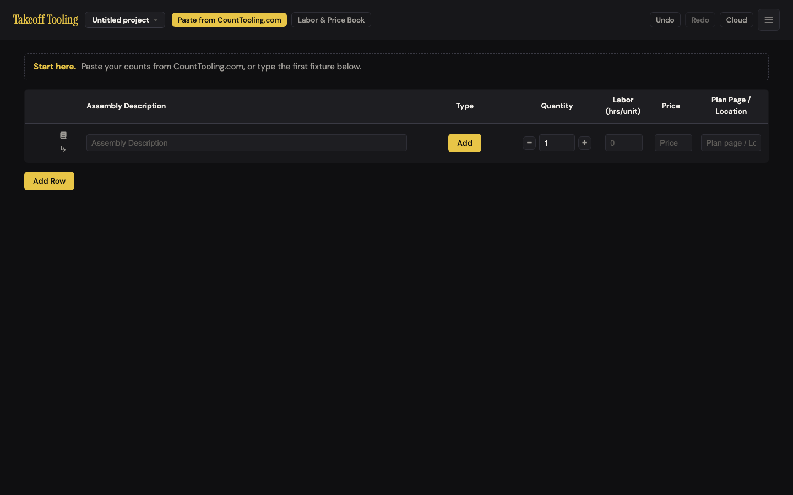
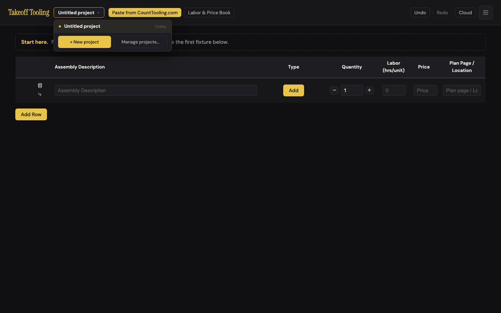
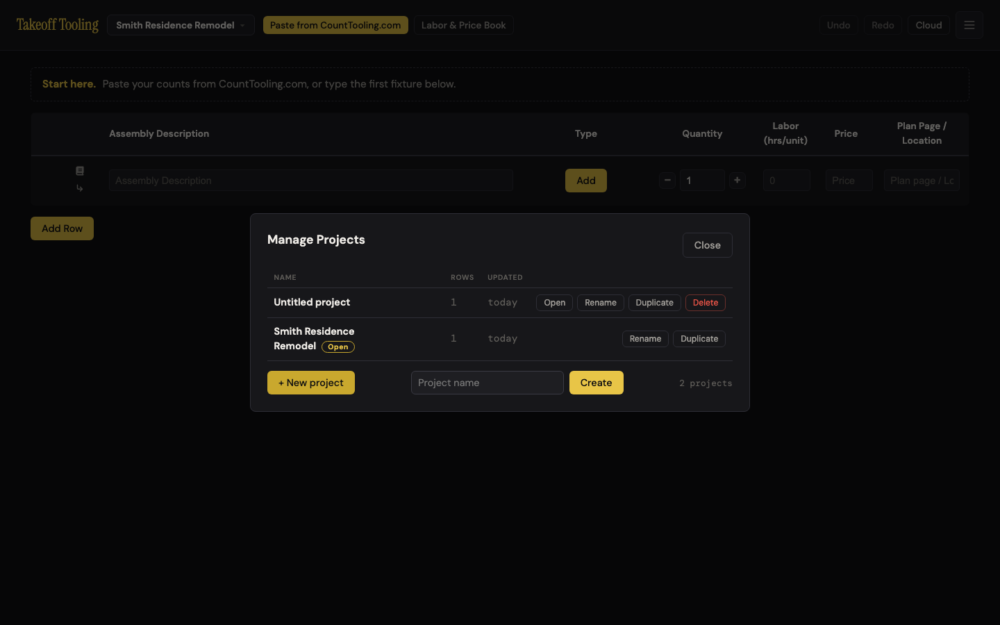
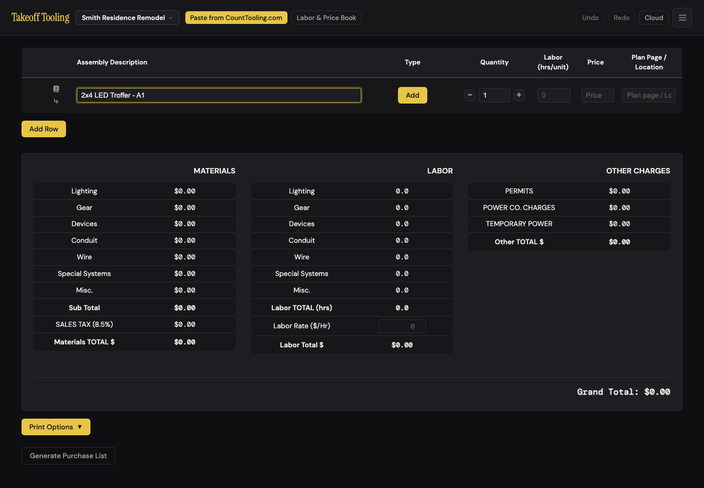
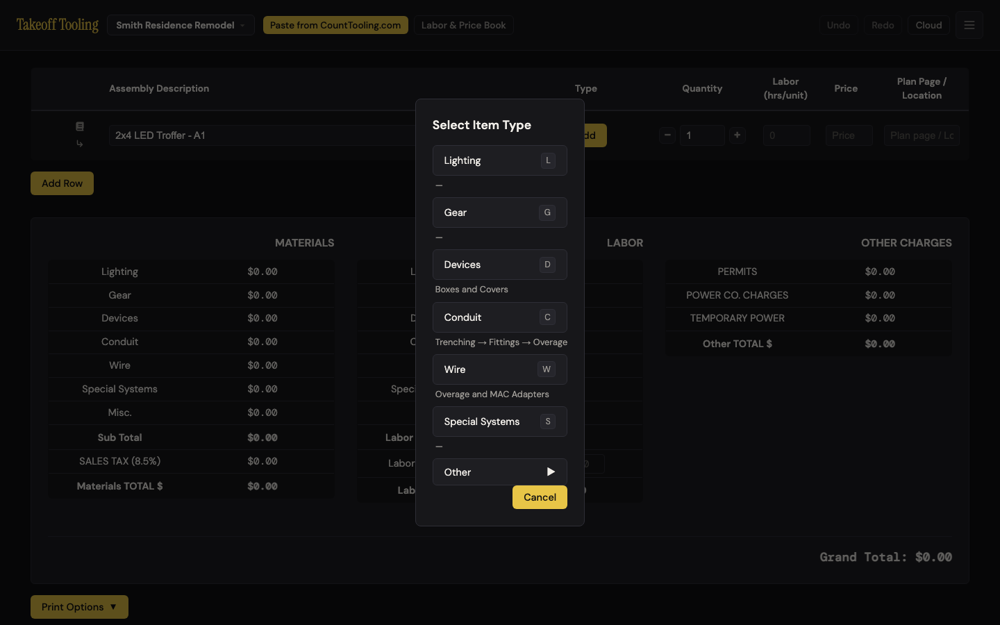
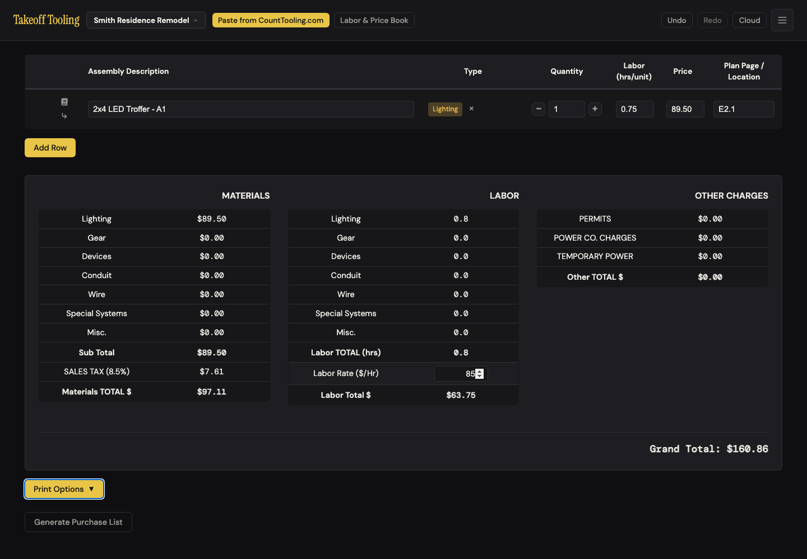
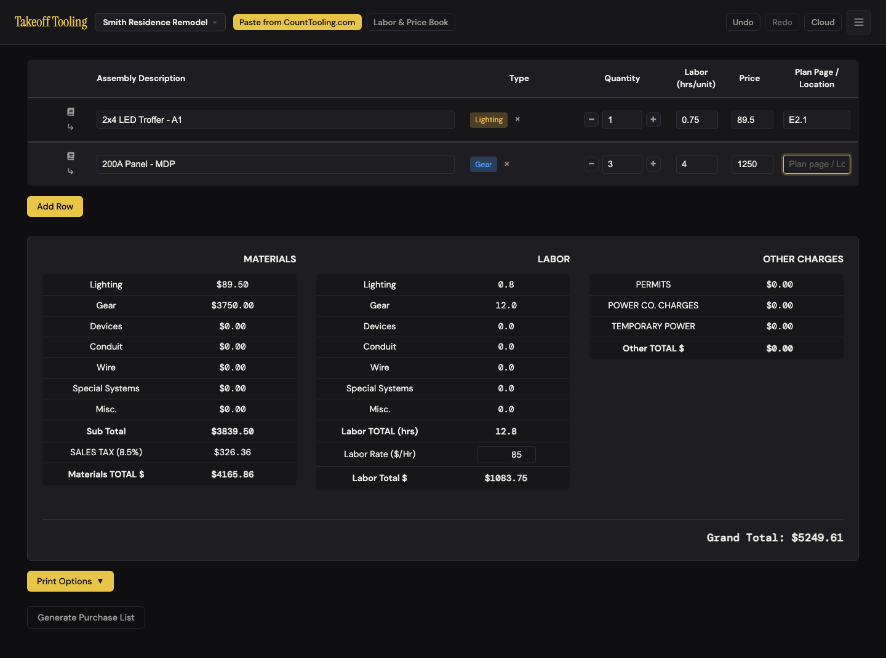
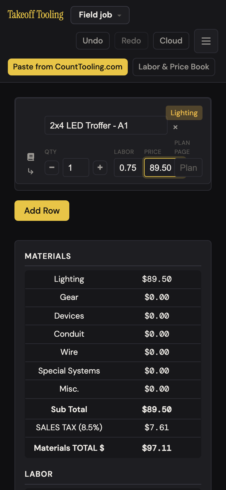

# J1 — First bid from scratch

Personas: N · Status: ● walked 2026-09-06 (headless Chromium, local static server :4188, signed out, fresh context)

> Trigger — an electrician who has never seen the app opens it cold, with no counts and no
> Count Tooling, and needs one fixture typed in, given a type, and totaled — the first ten
> minutes that decide whether there is a second session.

## Entry points

- **URL, cold** — `http://…/` with empty localStorage → boot creates "Untitled project" (state.js:213-217), adds one blank row (app.js:483-485), renders the manifest with `#manifest-first-run-hint` and the summary hidden (manifest.js:204-209, 246). Automatic.
- **Project switcher** — `#project-switch-btn` "Untitled project ▾" → `#project-menu` ("Untitled project · today", "+ New project", "Manage projects…"). Click.
- **Header ☰** — `#new-takeoff-btn` "New Project" → same Manage Projects modal with the inline name field focused (app.js:360-362 → projects.js:113-119). Click.
- **Blank row description** — `input[data-field="description"]` placeholder "Assembly Description"; first keystroke sets qty 1, retires the hint, reveals the summary (manifest.js:380-393). Typing.
- **Type column "Add"** — `.select-type-btn` → `#type-modal` (manifest.js:70, app.js:36-41). Click; then `L G D C W S` hotkeys or click; `Esc` / Cancel / click-out leave.
- **`#add-row-btn` "Add Row"** — appends a blank row with qty 1 (manifest.js:333-343). Click.
- **`#labor-rate-input`** — inside the LABOR summary block; `change`-only (manifest.js:362, 168). Type + blur.
- *Not on this route but on the same screen:* "Paste from CountTooling.com" (J2), row book icon (J6/J7), ↳ add child (J3).

## Current route (walked 2026-09-06)

Happy path to one typed, typed, totaled fixture in a named project: **12 steps, 4 decisions**
(name now or later · new project vs rename · which of 9 types · hotkey vs click). The second
row adds 7 steps. Desktop 1440×900 unless noted.

1. Boot cold (374–607 ms to a usable table). Title "Untitled project — Takeoff Tooling". One blank row; the dashed **"Start here.** Paste your counts from CountTooling.com, or type the first fixture below." hint; summary block hidden (`manifest-empty-hide`); below the table only a gold **Add Row**. In the Type column a gold **Add**. Undo is *enabled* (see F9). 
2. Click the project name → menu: "Untitled project · today", **+ New project**, **Manage projects…**. No Rename here. 
3. Click **+ New project** → Manage Projects modal opens with the name field focused. Type "Smith Residence Remodel", Enter. Header and tab title update at once ("Smith Residence Remodel — Takeoff Tooling"); the manifest is a fresh blank row with the hint back. The modal **stays open**, the name field is still showing with the typed name in it, and the list now has **two** projects: "Untitled project · 1 row · today" (with Delete) and the new one. 
4. Press Esc to leave → nothing (twice). Click **Close** → closed. (F2)
5. Click the description field, type "2x4 LED Troffer - A1" (25 ms/keystroke). Focus stayed in the field the whole time; value intact; Quantity flipped from empty to **1** on the first letter; hint gone; summary block appeared showing all zeros. Undo button still greyed although `canUndo()` is true (F9). 
6. Tab from the description: **Add → − → qty → + → Labor → Price** — four Tabs to reach Labor (F7).
7. Click **Add** → "Select Item Type" modal: Lighting L, Gear G, Devices D "Boxes and Covers", Conduit C "Trenching → Fittings → Overage", Wire W "Overage and MAC Adapters", Special Systems S, Other ▸ (PERMITS, POWER CO. CHARGES, TEMPORARY POWER), Cancel. Cancel, Esc and click-outside each close it with the type still unset. Click **Lighting** → chip "Lighting" + ×; focus drops to `<body>`. × clears; re-open, press lowercase `l` → Lighting again. 
8. Click Labor, type 0.75; click Price, type 89.50; click Plan Page, type E2.1; Tab. Summary: Lighting **$89.50** · Sub Total $89.50 · SALES TAX (8.5%) **$7.61** (7.6075) · Materials TOTAL **$97.11** · Lighting hours **0.8** (0.75 stored) · Labor TOTAL (hrs) 0.8 · Labor Total $ $0.00 · Grand Total **$97.11**. All correct.
9. Click Labor Rate, type 85, Tab → Labor Total $ **$63.75**, Grand Total **$160.86** (97.1075 + 63.75). Correct — but only because the previous blur was from Plan Page. From a Labor/Price/Qty field the first click is swallowed (F1). 
10. **Add Row** → second blank row, qty 1, focus on `<body>` (F8). Click its description, type "200A Panel - MDP"; click **Add**, press `G` → Gear. Click **+** twice → qty 3 (input and state agree). Labor 4, Price 1250, Tab.
    Summary: Lighting $89.50 + Gear **$3750.00** = Sub Total **$3839.50** · tax **$326.36** (326.3575) · Materials TOTAL **$4165.86** · hours Lighting 0.8 + Gear 12.0 = **12.8** (12.75 stored) · Labor Total $ **$1083.75** · Grand **$5249.61** (4165.8575 + 1083.75). Correct to the cent; no thousands separators (F10). 
11. Click **−** three times → qty **0**, input shows 0; summary still shows Gear **$1250.00** and **4.0 hrs**, Grand **$1857.11** (F3). A fourth − stays at 0. Typing 2.5 as a quantity is accepted (Gear 10.0 hrs).
12. Wait 600 ms, reload: project name, both rows, rate 85 and Grand $5249.61 all back; undo history empty (expected). localStorage: `takeoff-projects-index`, two `takeoff-project-<uuid>`, `takeoff-book`.
13. Debounce probes: type "E1.0" into Plan Page and `reload()` 60 ms later → **kept**. Type "X" and navigate to about:blank 40 ms later → **kept** (`beforeunload` → `persistAllNow`, app.js:378-380). Type "95" into Labor Rate and reload without blurring → **lost** (rate still 85; F6). Type "Z" and kill the page with no `beforeunload` → lost (crash-class; accepted).
14. Mobile 375×812 (touch): no horizontal overflow (scrollWidth 375); header 137 px tall in three rows; hint, description (204 px wide), Add (60×34), qty − 1 + and Add Row all in view; card labels QTY / LABOR / PRICE / PLAN PAGE; project modal 353×286 fits; type modal 244×617 fits; typing keeps focus, qty 1, summary appears; Lighting L → $97.11. Plan Page field ~50 px, placeholder truncated to "Plan" (F12). 

Divergences from the documented route (README / CLAUDE.md / ARCHITECTURE.md):

- README "Quantity … default 0": a described row auto-sets qty 1 and Add Row starts at 1; only the ↳ child row starts at 0.
- README lists no first-run hint, no project naming, no labor rate; CLAUDE.md says the summary is "hidden until a row has a description" — confirmed.
- `_surfaces.md` says the Manage Projects "inline name field" hides — it never does (F2).
- `_surfaces.md`: "Enter confirms, Esc dismisses" for the inline name field — Enter confirms, Esc only re-hides an already-visible row and eats the keystroke the user meant for the modal.

## Naive attempt

I opened the page and the dashed "Start here" line told me two things: paste counts, or type a fixture below. I had no counts, so I clicked the only text box and typed my troffer — the quantity turned to 1 by itself, which felt right, and a big totals panel unfolded underneath. Before typing I had pressed Enter in the empty box hoping for a new line; nothing happened. Two gold buttons said **Add** — one in the row under "Type", one under the table saying **Add Row** — and I clicked the row one first because it was closer, expecting another row; a "Select Item Type" list appeared instead, which made sense once I saw "Lighting". I pressed Esc, then went back and pressed L.

The project was called "Untitled project" in the top bar, so I clicked it to change the name. The menu offered "+ New project" and "Manage projects…" but no rename; I took **+ New project**, typed the job name, hit Enter, and the name appeared in the top bar. But the dialog stayed, my name was still sitting in the field, and the list now showed an "Untitled project" I never made. I hit Esc twice and nothing closed; I found Close. Later I learned Rename lives inside Manage projects.

Labor and price were obvious columns. I typed 0.75 and 89.50, then clicked the Labor Rate box in the totals and typed 85 — and nothing appeared in the box. I clicked it again, typed 85 again, tabbed, and Labor Total $ became $63.75. Checking with my phone: the panel said 0.8 hours, 0.8 × 85 is 68, not 63.75; I had to remember I typed 0.75. When I knocked the panel's quantity down to 0 with the − button to see what happened, the Gear line still said $1250.00. Undo had been lit since the page opened; I did not press it, which turned out to be lucky (F9).

## Evidence

- **Telemetry visibility:** none exists in Takeoff Tooling. A rework on this route should ship `project_created` (source: switcher / menu / boot), `first_row_described` (ms since boot), `type_set` (via: click / hotkey), `labor_rate_set`, and a `rate_click_retry` counter if F1 is not fixed.
- **Doc coverage:** README "Manifest Table" (columns, type shortcuts, quantity spinner) and "Other → Undo/Redo"; CLAUDE.md "First-run state", "Persistence" (400 ms debounce, `beforeunload` flush), "Manifest structure"; `_baseline.md` N-7 (hint + hidden summary) and N-9 (new project seeds a row). README says quantity defaults to 0 (wrong for described rows) and documents neither projects nor the labor rate.
- **Specs:** `smoke.spec.js` "app boots without console errors and manifest edits persist" covers boot + a typed description + reload; `selectors.test.js` covers `getSummaryBreakdown` tax/rollup and the qty-0-counts-once rule (line 15 — the rule behind F3 is a *tested* design choice). No spec drives the type modal, hotkeys, spinner, labor rate, project naming, the Manage Projects `hidden` row, or Undo button state.
- **Modals:** `#projects-modal` (Manage Projects), `#type-modal`. Two of eleven.
- **Hotkeys:** `L G D C W S` (case-insensitive; `l` verified) while the type modal is open; `Esc` closes it; `Enter` confirms the project name; `Esc` in the header menu / project menu.
- **Storage / state touched:** `takeoff-projects-index` (written at boot and on every save), `takeoff-project-<id>` × 2 (the boot "Untitled project" and the named one), `takeoff-book` (written by the defaults-version bootstrap on first boot, state.js:175-191). Undo frames: 1 at boot (blank row), then one per coalesced field edit (1.2 s window) and one per Add Row / type set. No cloud pushes (signed out; the SDK script was aborted by the walk's route).

## Friction findings

| # | Severity | What happens | Why it hurts | Verdict stamp (Phase 2b) |
|---|---|---|---|---|
| F1 | **stumble** | After typing in any row Labor / Price / Qty field, the **first click on Labor Rate is swallowed**: mousedown blurs the row field → its `change` handler (manifest.js:399) runs `handleFieldUpdate` → `updateSummaryOnly()` → `summaryEl.outerHTML = …` (manifest.js:167) rebuilds the summary and destroys the rate input mid-click. Focus ends on `<body>`; the typed "85" goes nowhere; field empty; Labor Total $ stays **$0.00**, Grand **$97.11** instead of **$160.86**. Reproduced 4/4 from Labor/Price edits; second click works. Print Options / Purchase List buttons survive the same rebuild. | The rate is set once per bid, almost always right after entering rows — so nearly every first bid hits it. A user who does not notice the empty box ships a bid with **$0 labor**. | **CONFIRMED** (stumble). Re-drove 4/4 from typed Qty / Labor / Price (+ 1/1 on 375 px touch): focus → `<body>`, rate field empty, Labor Total $0.00; a 2 s pause does not help, and the summary node is provably replaced on the row field's `change`. Does not fire from the spinner, description, Plan Page, or once the row field was already left via Tab — so it is exactly the "type a price, reach for the rate" path. |
| F2 | **stumble** | The Manage Projects inline name row **never hides**: `.projects-new-row { display:flex }` (css/styles.css:3667) beats the UA `[hidden]` rule, so `row.hidden = true` (projects.js:89-92) has no effect (measured 306×34 px with `hidden=true`). Consequences: after Create the field still shows the typed name (focus on the Create button); a second Create click or Enter makes a **duplicate project** ("Job via menu" ×3 in the walk); an empty-name Create adds another "Untitled project"; **Esc does not close the modal** while the field is focused (its keydown handler stops propagation, projects.js:239-245) — two Esc presses did nothing; the footer "+ New project" toggle does nothing visible. Same class as A-5 (not a regression of A-5's two items, which still hide). | The very first thing a new user does — naming the job — ends in a dialog that will not close and a list that grows every time they press Enter. | **CONFIRMED** (stumble). `row.hidden=true` yet `display:flex` 306×34; Enter again → duplicate ("Harbor View Clinic TI" ×2), empty Create → another "Untitled project", Esc ×2 dead while the field is focused (focus stays in the *field*, not on Create — Esc with focus elsewhere does close). Not a C-6 regression (no `prompt()`); J10 F2 owns the fix. |
| F3 | **stumble** | A row spun to **qty 0** still bills once: "200A Panel - MDP" × 0 @ $1250 / 4 hrs → Gear **$1250.00** and **4.0 hrs**, Grand **$1857.11**; a hand check expects **$0 / 0.0 / $1339.50 → $1453.36 + $63.75 = $1517.11**. `getSummaryBreakdown` treats qty 0 with a price or labor as 1 (selectors.js:145-149; tested at selectors.test.js:15). The spinner floors at 0 (manifest.js:421), inviting exactly this. | Numeric trust: a zeroed line that looks removed still adds $1,250 + 4 hrs to the bid. Since described rows now auto-set qty 1 (manifest.js:383-387), the rule mostly protects rows the UI no longer produces. | **CONFIRMED** (stumble). Switchboard 2 × $4800 / 6 h spun to 0 → Gear still $4800.00 / 6.0 h, Grand $5861.88 (hand: $5861.88 *with* it counted once — arithmetic exact, rule surprising). Deliberate and tested (selectors.test.js:15) — a design choice, not a bug, but numeric trust is the journey's stated bar. J8 finding 2 rates it blocker and owns the fix. |
| F4 | **stumble** | Hours print to one decimal, dollars exact: 0.75 hrs → **"0.8"**, and 0.8 × $85 = $68.00 vs **$63.75** shown; 12.75 → **"12.8"** × 85 = $1,088.00 vs **$1,083.75** (manifest.js:122, 143 `toFixed(1)`). | Carry-a-calculator check fails on the very first bid by $4.25; the estimator cannot tell whether the app or their arithmetic is wrong. | **CONFIRMED** (stumble). 0.75 h → "0.8", $67.50 shown vs 0.8 × $90 = $72.00; 12.75 → "12.8", $1147.50 vs $1152.00. Dollars are exact; only the hours display lies. No comment or test marks `toFixed(1)` as deliberate. |
| F5 | **stumble** | Naming the job on a fresh install **leaves a stray project**: boot persists "Untitled project" (state.js:213-217); "+ New project" creates a second (state.js:284-294) and the menu/modal now list both. Rename exists only inside Manage projects (switcher → Manage → Rename → Enter → Close = 5 steps); clicking the name in the header does not rename. The Rows column counts the blank starter row ("Untitled project · 1") and lags the 400 ms save (showed 0 for a project with 2 rows). | The naive path (click the name to rename it) fails; the shortcut path creates junk the user must later understand and delete. | **CONFIRMED** (stumble). Fresh profile → "+ New project" → two projects listed ("Untitled project · 1", "Harbor View Clinic TI · 1"); header click opens the switcher (no Rename item); Rename works only inside Manage. Rows lag reproduced: 2 live rows shown as "1" until the 400 ms save. |
| F6 | **stumble** | Labor Rate is `change`-only (manifest.js:362, 168): the summary does not move while typing, and typing 95 then reloading without blur **loses the rate** (85 kept). Row fields listen to `input` and flush on `beforeunload`; fast reload (60 ms) and navigate-away (40 ms) both kept the keystrokes. | The one field whose value multiplies every hour on the bid is the one field autosave does not catch mid-edit. | **downgraded to papercut.** Reproduced: rate typed 95 without blur, reload → 90 kept; Plan Page typed + reload at 60 ms and description + navigate-away at 40 ms both kept. But the loss needs the page to go away *while the rate field is still focused* — any click, Tab or Enter commits first (Print buttons included) — so it is a narrow window, not the daily path. P1 fixes it for free alongside F1. |
| F7 | papercut | Two gold buttons read "Add": the Type column's **Add** (manifest.js:70) and **Add Row** directly below. Tab order description → Add → − → qty → + → Labor: four Tabs to Labor, the spinner buttons are focus stops. | First click on faith goes to the wrong Add; keyboard entry of qty/labor/price is slower than a spreadsheet. | **CONFIRMED** (papercut). Both buttons are identical `.btn` gold (`rgb(232,197,71)` on `rgb(15,15,17)`), same verb, no `title`, 69 px apart. Tab trace: Add → − → qty → + → Labor = **five** Tabs from the description (walker said four). "What a first-timer clicks" is unmeasurable without telemetry — the label collision is the evidence. |
| F8 | papercut | Focus lands on `<body>` after picking a type (`hideTypeModal` blurs, then `render()` replaces the DOM, app.js:43-50) and after **Add Row** (manifest.js:333-343) — unlike "Add component", which focuses the new child (manifest.js:446). Enter in a description does nothing. | Every row costs two extra clicks (into Labor after typing, into the new row after Add Row); Enter-for-new-row is the spreadsheet reflex. | **CONFIRMED** (papercut). `activeElement` = BODY after `l` hotkey pick and after Add Row; Enter in a description leaves row count and focus unchanged. |
| F9 | **stumble** | Undo button state does not track edits. Fresh boot: **Undo enabled before the user does anything** (the boot blank row is an undo frame, app.js:483-485); clicking it leaves **0 rows** — an empty table with only Add Row and the hint (the state N-9 fixed for new projects), until a reload re-seeds a row. After a new project + typing: `canUndo()` true, button **disabled** (only `render()` refreshes it, app.js:25-34; typing renders in place). | A curious first click on Undo produces the "broken empty table"; later the greyed button hides that a typo can be undone. | **CONFIRMED** (stumble). Cold boot: Undo enabled, `canUndo()` true; click → 0 manifest rows under a hint that says "type the first fixture below"; reload re-seeds. Not quite a dead end — Redo lights up and Add Row still works — but the confidence hit is real. New project + typing: `canUndo()` true, button disabled (Playwright itself refused the click) until the next full render (Add Row re-enables it). |
| F10 | papercut | Money has no thousands separators: **$3839.50**, **$4165.86**, **$5249.61** (`toFixed(2)`, manifest.js:112). | Estimators read $5,249.61; misreading by a digit is the classic bid error. | **CONFIRMED** (papercut). "$9642.75 · $10462.38 · $11609.88" on my fixtures. Same as J8 finding 11 — dedupe in synthesis. |
| F11 | papercut | Software words at the first touch: column and placeholder "**Assembly Description**" (a first-timer is typing a fixture), placeholder "Price" with no per-unit hint, "Select Item Type". Good: "Labor (hrs/unit)", "Plan Page / Location", the hint's "fixture". | Trade language rule; "assembly" means something specific (MC assemblies) elsewhere in this app. | **CONFIRMED** (papercut). Header + placeholder "Assembly Description", placeholder "Price", modal "Select Item Type" verified in the DOM. |
| F12 | papercut | 375 px: Plan Page field ~50 px wide with placeholder truncated to "Plan"; header 137 px (three rows) before content. Nothing clipped, no horizontal scroll — A-6/A-7/C-11 hold. | Field is usable but unlabeled by its placeholder. | **CONFIRMED** (papercut). Plan Page input 47 px (31 px inside padding) for a 131 px placeholder → "Plan"; header 137 px; `scrollWidth` 375. The card's `::before` label reads "Plan page" (styles.css:674), so the field *is* labeled — only the placeholder is lost. |

Numbers matter: every total on this route was correct to the cent when the inputs landed
(F1 and F6 are cases where the input did *not* land; F3 and F4 are correct arithmetic that
disagrees with what the estimator sees).

## Proposals

**P1 — polish · Labor Rate behaves like a row field.** Listen to `input` on `#labor-rate-input` and patch the Labor Total $ / Grand Total cells in place (N-8 did this for the custom overage %); skip the summary rebuild on a row field's `change` when its `input` handler already applied the value (or replace only cell text, never the block). Fixes F1 and F6. (1) Removes the second click and the lost-rate window on every first bid. (2) "Labor rate" is already the trade word. (3) Removes a redundant re-render and a data-loss window; no new surface. (4) The field already sits where the estimator looks for the labor dollars. `spiritPass: true`.
> **Verifier:** (1) yes — removes the retry click and the F6 window. (2) no new words. (3) removes the duplicate listener pair (manifest.js:168-171 vs 362-365). (4) same field, same place — nothing to find. **`spiritPass: true`** — caveat: identical to J8 P12; ship once. Also keep the row field's `change` from rebuilding a block the `input` handler already patched — that is the actual F1 mechanism.

**P2 — polish · Make `hidden` mean hidden in Manage Projects, and finish the create.** Add `.projects-new-row[hidden] { display: none }` (the A-5 pattern, css/styles.css:154, 869); after Create, clear the field and **close the modal** — the estimator came to name a job, not manage a list; Esc closes the modal even from the name field. Fixes F2. (1) Removes the Close step (12 → 11) and the duplicate-project failure. (2) "New project" / "Project name" stay. (3) Removes a broken toggle and a stopPropagation special case. (4) The dialog simply goes away when the name is confirmed. `spiritPass: true`.
> **Verifier:** (1) yes — Close step and duplicate-project failure gone. (2) unchanged. (3) removes the dead toggle and the `stopPropagation` branch. (4) yes. **`spiritPass: true`** — caveat: J10 P2 is the same fix and owns it; close-on-Create should apply when the modal was opened with `{create:true}` (both "New project" entrances), not when the user came in via "Manage projects…" to do several things.

**P3 — rework (small) · Naming on a fresh install renames, not duplicates.** Make the project name in the header click-to-edit (the same inline field pattern used for rename), and let "+ New project" *reuse* the open project when it is the untouched "Untitled project" (blank single row, never renamed). Fixes F5. (1) Naming drops from 4–5 steps to 2 (click name, type, Enter) and the stray-project decision disappears. (2) "Job name" / "Rename". (3) Removes the Manage detour for the commonest case and the junk project. (4) Clicking the name to change it is the reflex the naive attempt showed. `spiritPass: true` — caveat: J10 owns Manage Projects; coordinate so the header edit and the modal's Rename share one code path.
> **Verifier:** (1) fewer steps, yes — but the header name is *already* the switcher button (projects.js:204-208): click-to-edit either replaces switching or splits one control into two targets, which adds a decision. (2) fine. (3) the "reuse the untouched Untitled project" rule is a hidden conditional, not a removal. (4) an electrician who clicks the name today gets a menu; tomorrow an editor — and then cannot find the switcher. **`spiritPass: false` as written.** Passes when narrowed: add **Rename** to the switcher menu (one click from the reflex the naive attempt showed), keep the header as the switcher, and apply the reuse rule only when the open project is never-renamed, has no described row, and rate 0 — otherwise it swallows a real bid.

**P4 — polish · Hours agree with dollars.** Show hours to two decimals ("0.75"), or print the labor line as "0.75 hrs × $85.00 = $63.75". Fixes F4. (1) Removes the mental reconciliation step. (2) "hrs". (3) Removes a rounding discrepancy; no new control. (4) It is the line they already read. `spiritPass: true`.
> **Verifier:** (1) yes. (2) "hrs". (3) removes a rounding that disagrees with the exact dollars beside it. (4) yes. **`spiritPass: true`** — caveat: use one hours formatter everywhere (device flow's "Job labor" line, PDFs) so the same job never prints two totals.

**P5 — polish · Zero means zero.** Honor qty 0 in `getSummaryBreakdown` for top-level rows (children keep the flows' semantics) now that describing a row auto-sets qty 1; update selectors.test.js:15. Fixes F3. (1) Removes a hidden rule the estimator must know. (2) "Quantity 0 = not on the bid". (3) Removes special-case code. (4) The − button already goes to 0; the total will simply follow. `spiritPass: true` — caveat: verify with J4/J5/J8 that no flow relies on price-only parents counting once (A-1's price-carrying parents have qty).
> **Verifier:** (1) removes a rule the estimator must know. (2) "0 = not on the bid". (3) removes two `effectiveQty` branches. (4) the row already reads 0. **`spiritPass: true`** — caveats: this is J8 P2 (blocker there — it also desynchronizes the purchase list); J8 owns it. Premise correction: the boot and Add Row rows are *seeded* at qty 1 (app.js:484, manifest.js:337); the auto-1 on describing (manifest.js:383-387) fires only for qty-0 rows (↳ children, or a row the user zeroed). The conclusion holds either way. The rule is tested as deliberate (selectors.test.js:15) — owner decision, not a bug fix.

**P6 — polish · One "Add".** Relabel the Type column button "Set type" (or render an empty dashed chip "type…") so "Add Row" is the only Add on screen. Fixes F7 (label half). (1) Removes one wrong first click. (2) "type" is what the modal asks for. (3) Removes a duplicated word; no new surface. (4) Self-labeling. `spiritPass: true`.
> **Verifier:** (1) one fewer wrong click. (2) "Type" is already the column header — acceptable. (3) no surface added. (4) yes. **`spiritPass: true`** — caveat: prefer the dashed empty chip ("type…") over a second button label: it matches what the cell becomes after the pick and stops being a gold `.btn` twin of Add Row.

**P7 — polish · Focus follows the work.** After a type is picked, focus that row's Labor field; after Add Row, focus the new description (as Add component already does); Enter in a description moves to the next row's description, adding one if it was the last; take the spinner buttons out of the Tab order (`tabindex="-1"`, they remain clickable). Fixes F8 and the Tab half of F7. (1) Removes two clicks per row and two Tabs per field trip. (2) None needed. (3) Removes clicks; no new control. (4) It is what the cursor does in a spreadsheet. `spiritPass: true`.
> **Verifier:** (1) removes two clicks per row and two Tab stops per field trip (measured five Tabs description → Labor). (2) none needed. (3) `tabindex="-1"` removes stops; no control added. (4) spreadsheet reflex. **`spiritPass: true`** — caveat: for flow types (D/C/W) the pick already navigates into the editor, so "focus Labor" applies to the six non-flow types only; Enter-adds-row must not fire while the type modal is open.

**P8 — polish · Thousands separators.** `toLocaleString('en-US', {minimumFractionDigits: 2})` in `formatMoney` and the purchase list. Fixes F10. (1) Removes a misread. (2) n/a. (3) Nothing added. (4) n/a. `spiritPass: true`.
> **Verifier:** (1) yes. (2) n/a. (3) nothing removed either — the budget is paid by touching one function. (4) n/a. **`spiritPass: true`** — same as J8 P11; the TSV copy stays bare.

**P9 — polish · Undo button tracks the manifest; boot row is not an undo frame.** Seed the boot/new-project blank row without pushing an undo frame (`createProject` already writes the row directly, state.js:288-290; do the same at app.js:484), and refresh the Undo/Redo buttons from `updateItem`/`addItem` (or on every `schedulePersist`). Fixes F9. (1) Removes the "undo into an empty table" dead end. (2) n/a. (3) Removes a bogus history frame. (4) Undo lights up when there is something to undo. `spiritPass: true`.
> **Verifier:** (1) removes the undo-into-nothing click. (2) n/a. (3) removes a bogus frame. (4) yes. **`spiritPass: true`** — caveat: `createProject` already seeds without a frame (state.js:288-290); mirror that at app.js:484 and :472, and call `updateUndoRedoButtons` from the in-place paths (`handleFieldUpdate`, spinner, `updateSummaryOnly`) — today only a full `render()` refreshes it.

**P10 — polish · Trade words at the first touch.** Placeholder "Fixture or run — e.g. 2x4 LED Troffer - A1"; column "Description"; price placeholder "$ each"; modal title "What is it?". Fixes F11. (1) Removes a "what do they mean by assembly" hesitation. (2) fixture, run, each. (3) Nothing added. (4) The empty box explains itself. `spiritPass: true`.
> **Verifier:** (1) removes a hesitation. (2) fixture / run / each — yes. (3) nothing added. (4) yes. **`spiritPass: true`** — caveat: the description field is 204 px at 375 px, so the long example placeholder truncates; use "Fixture or run" on the phone column. "What is it?" is vaguer than the list it titles — "Lighting, gear, wire…?" or keep "Type".

**P11 — keep · Protected strengths verified.** Boot under a second, fully offline, zero app console errors; the "Start here" hint and hidden zero-summary (N-7); qty auto-1 on the first keystroke; typing never loses focus despite in-place patching; three exits from the type modal (C-5) plus case-insensitive hotkeys; `beforeunload` flush makes the 400 ms debounce invisible on reload/navigate; every total correct to the cent; the 375 px card layout with no overflow (A-6/A-7/C-11). Document as-is.
> **Verifier:** all re-verified on independent fixtures (see Verification). One correction: "qty auto-1 on the first keystroke" is not what the boot row does — it is seeded at 1 (the walker's own screenshot 01 shows "1" before any typing); the auto-1 path exists but fires only for qty-0 rows. Keep the strength as "a fresh row is never at 0".

**P12 — teach.** The guide carries: "Add" in the Type column sets the type (or press L/G/D/C/W/S); Labor is hours **per unit**; the labor rate lives in the totals panel; autosave is automatic, no Save button; a project is a bid, and where to rename/delete one. Until P5 lands: a row at quantity 0 still counts once.
> **Verifier:** `spiritPass: true` (teach). Add until P1 lands: Tab from Plan Page reaches the labor rate in two presses (Plan Page → Add Row → rate) and sidesteps the swallowed click.

## Guide actions

- First article "Your first bid in five minutes": screenshot 01 → type a fixture → Add → L → labor/price → labor rate → read the Grand Total; call out that hours are per unit and the rate is $/hr.
- Explain **Add** (type) vs **Add Row**, the six hotkeys, and that Devices/Conduit/Wire open an editor (J4/J5).
- Explain projects: the header name is the open bid; "+ New project" vs Rename; delete the boot "Untitled project" if you named a new one (until P3).
- README fixes: "Quantity … default 0" → "a described row starts at 1; child rows at 0"; add rows for Projects (switcher, Manage), Labor rate, and the first-run hint; correct `_surfaces.md` on the inline name row (F2).

## Demo moment

Type "2x4 LED Troffer - A1", press Add then L, type 0.75 and 89.50 — the totals panel reads $89.50 · $7.61 tax · $97.11 in about eight seconds, on a phone as well as a desktop (screenshots 04 → 06, and 08).

## Walk notes

- Server: the read-only static server at http://localhost:4188 (not started or stopped by the walk). Build: review branch at `9975c89` plus the N-series.
- Profile: fresh Playwright contexts (empty localStorage) for A (main), B (menu entrance / rename / rate), C (375×812, `isMobile`, `hasTouch`), plus four probe contexts. Signed out throughout; `context.route(/supabase/i, abort)` in every context. Side effect of the stub: the Supabase SDK `<script>` (index.html:283) is aborted, so the header button reads **"Cloud"** (status `disabled`, cloud.js:58, 537) instead of "Sign In", and each boot logs one `Failed to load resource: net::ERR_FAILED`. No other console or page errors in any context.
- Seed: none — the whole point is the cold start. Inputs used: "2x4 LED Troffer - A1" / Lighting / 0.75 / 89.50 / E2.1; "200A Panel - MDP" / Gear / qty 3 / 4 / 1250; rate 85.
- Scripts: `scratchpad/walks/first-bid-from-scratch/{walk.js, walk2.js, probe.js, probe2.js, probe3.js}` (throwaway, not committed).
- Walls: none on this route (cloud never touched). PDF export not exercised (J9).
- One un-instrumented rename attempt in the first run of context B appeared to land typed text in the wrong field; three instrumented re-drives (walk2 B1, probe P2) showed rename working correctly — the rename input selects its text, so the typed text replaced the name, which is what happened. Not a finding.
- Verifier: re-drive **F1 first** (type a price, click Labor Rate once, type 85 — expect an empty field and Labor Total $0.00), then **F2** (create a project, press Esc), **F3** (spin a priced row to 0), **F9** (click Undo on a fresh profile). F4/F10 are visible in screenshots 06 and 07.

## Verification

**Date:** 2026-09-06 (Phase 2b adversarial pass). **Method:** independent Playwright scripts against the read-only server at http://localhost:4188 (working tree == served files, verified by diff on projects.js / manifest.js / app.js / styles.css); fresh contexts 1440×900 and 375×812 (`isMobile`, `hasTouch`); signed out; `context.route(/supabase/i, abort)` everywhere; real keystrokes (`page.type` / `keyboard.press`); dialogs and console errors logged (only the expected `net::ERR_FAILED` from the aborted Supabase SDK). Fixtures deliberately differ from the walk: "6in LED Downlight - C3" / Lighting / 0.75 h / $42.75 / E1.2; "400A Switchboard - MSB" / Gear / qty 2 / 6 h / $4800; rate $90. Scripts and screenshots: `scratchpad/walks/first-bid-from-scratch/verify/{verify.js, verify2.js, *.log, results*.json, *.png}` (throwaway).

**Expected values derived first, then measured — every total agreed:**
one row → Lighting $42.75 · tax $3.63 (3.63375) · Materials $46.38 · hours "0.8" (0.75) · Labor $67.50 · Grand **$113.88** (113.88375);
two rows → Gear $9600.00 · Sub Total $9642.75 · tax $819.63 (819.63375) · Materials $10462.38 · hours "12.8" (12.75) · Labor $1147.50 · Grand **$11609.88**;
switchboard spun to 0 → Grand **$5861.88** = the job *with* one switchboard (F3).

**Re-drives (one line each):**
- F1 — matrix with real value changes: from typed Qty, Labor, Price → 4/4 swallowed (focus `<body>`, rate empty, Labor $0.00); from Labor after a 2 s pause → swallowed (timing irrelevant); from the spinner button, description, Plan Page, or after Tab already left the row field → **not** swallowed. Touch at 375 px → swallowed. `.manifest-summary` node identity changes on a Labor `change` (mechanism proven). Second click always works. Keyboard: Price → Tab ×3 reaches the rate (Plan Page → Add Row → rate) — a path that avoids it.
- F2 — after Enter: modal open, `row.hidden === true` but `display: flex` 306×34, input still "Harbor View Clinic TI", focus still in the input, "2 projects"; Esc ×2 → nothing; Enter again → a duplicate; empty Create → "Untitled project"; footer toggle flips `hidden` with no visual change; Esc with focus outside the field closes; Close button closes.
- F3 — qty 0 via − ×2: input 0, state 0, Gear 6.0 h, Grand $5861.88; a third − stays 0; 2.5 accepted (15.0 h).
- F4 / F10 — "0.8" for 0.75, "12.8" for 12.75; "$9642.75 / $10462.38 / $11609.88".
- F5 — fresh profile + "+ New project" → ["Untitled project", "Harbor View Clinic TI"]; header click opens the switcher (items: project · "+ New project" · "Manage projects…"); Rename inside Manage works and updates header/title; Rows column shows 1 for 2 live rows until the 400 ms save, then 2.
- F6 — rate typed 95, no blur, reload → 90 (lost). Plan Page typed + reload at 60 ms → kept; description typed + `about:blank` at 40 ms → kept (`beforeunload` → `persistAllNow`). Reload after settle restores name, both rows, rate, Grand $11609.88; undo history empty.
- F7 — both Adds `rgb(232,197,71)` / `rgb(15,15,17)`, no `title`; Tab trace description → Add → − → qty → + → Labor (five presses).
- F8 — `activeElement` BODY after `l` pick and after Add Row; Enter in description: no new row.
- F9 — cold: Undo enabled / `canUndo()` true → click → 0 manifest rows, hint still shown, Redo enabled, Add Row present; reload re-seeds one row. New project + typing: `canUndo()` true, button disabled (Playwright refused the click as "not enabled"); Add Row's full render re-enables it.
- F11 / F12 — DOM labels as reported; 375 px: `scrollWidth` 375, header 137 px, Plan Page 47 px (31 px inner) vs 131 px placeholder, card labels Qty / Labor / Price / Plan page, type modal 244×617 and projects modal 353×286 both fit, typing keeps focus, Grand $113.88.

**Counter-evidence hunts:**
- Baseline duplicates: N-7 (hint + hidden summary) and N-9 (seeded row) are *strengths* here, not re-reported findings; F2 is a defect in C-6's replacement, not a C-6 regression (no `prompt()` fired). Nothing killed as a duplicate.
- Design choices: F3 is deliberate and tested (selectors.test.js:15) — stamped CONFIRMED because the journey's stated bar is numeric trust and J8 independently rates it blocker; the proposal is an owner decision, not a bug fix. F4's `toFixed(1)` carries no comment or test.
- Missed paths: the keyboard path to the rate (F1) exists but is undiscoverable; Redo recovers the cold Undo (F9); the card `::before` label keeps Plan Page labeled at 375 px (F12). None changed a verdict except F6 (downgraded — the loss window requires leaving the page with the rate field still focused).
- Walker factual slips (not findings): the boot row is seeded at qty 1 — it does not "flip from empty to 1 on the first letter" (walker's own screenshot 01 shows "1"; the auto-1 path fires only for qty-0 rows); Tab count to Labor is five, not four; after Create the focus stays in the name field, not on the Create button (which is exactly why Esc is eaten).

**NEW in passing:**
- NEW (papercut) — typing a description and then deleting it leaves the hint gone and the zeroed summary showing (both are removed in place and only a full render restores N-7's state); qty stays at the seeded 1. Cosmetic; no wrong number.
- Cross-refs, not new: Enter on the rate commits but drops focus to `<body>` (J8-12, reproduced: rate 88 → $369.60, focus BODY); a new project inherits the open project's rate (J10 F3; fresh profile → 0).

**Baseline re-verified:** N-7 ✓ (hint + `manifest-empty-hide` at cold boot and on every new project) · N-9 ✓ (new project → 1 row, qty 1) · C-5 ✓ (Cancel, Esc, click-out each close the type modal with the type unset) · C-6 ✓ (no dialog on either New Project entrance; inline field focused).

**Tally:** 12 walker findings → **CONFIRMED 11 / downgraded 1 (F6 → papercut) / KILLED 0.** Proposals: `spiritPass: true` ×11 (P1, P2, P4–P12), `false` ×1 (P3 as written — the header name is already the switcher button; passes when narrowed to a Rename item in the switcher menu plus a guarded reuse rule). Severity mix after verification: 6 stumbles (F1 F2 F3 F4 F5 F9), 6 papercuts (F6 F7 F8 F10 F11 F12), 0 blockers.
