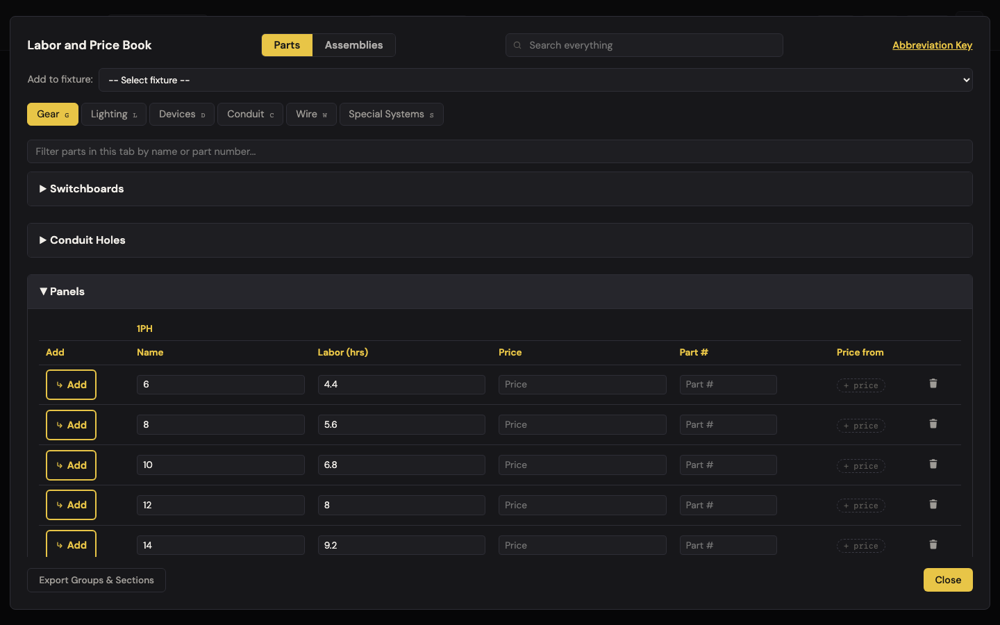
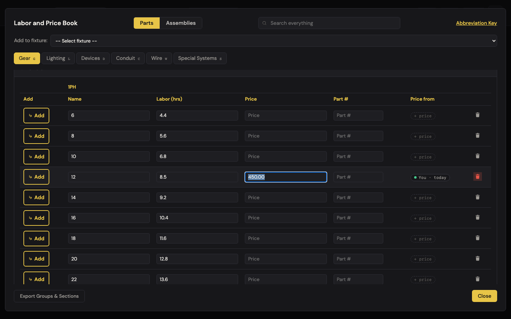
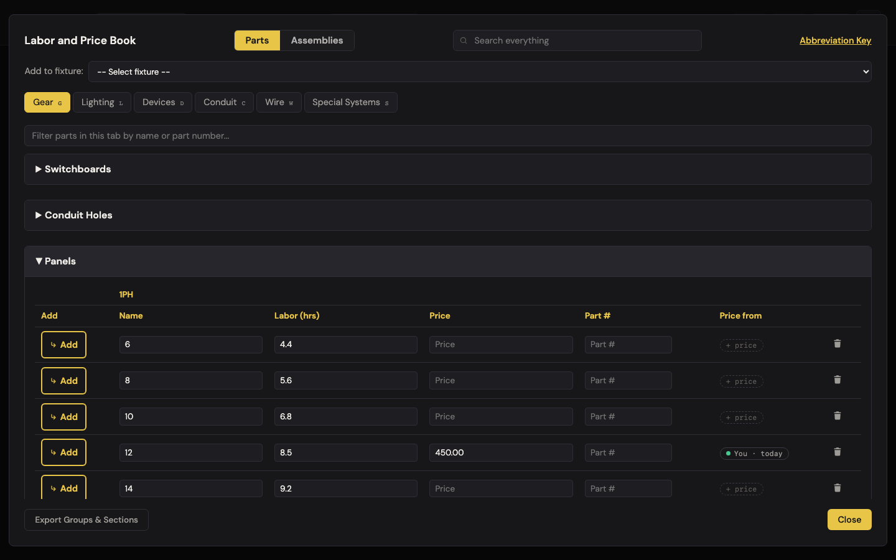
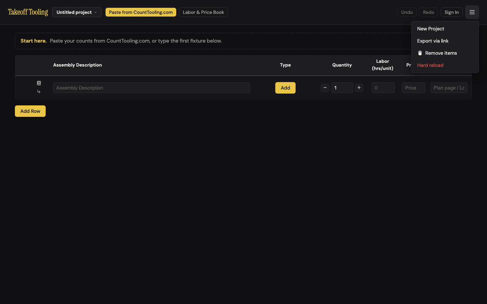

# J12 — Improve the shared book

Personas: E A · Status: ● walked 2026-09-06 (headless Chromium 1440×900, :4188, signed out, fresh profile; sharing/review interior = wall, documented from code)

> Trigger — an estimator has just fixed three wrong labor hours in the book (a 12-circuit
> 1PH panel is 8.5 hrs on this crew, not 8). If they opt in, the fix travels to an admin;
> accepted fixes ship to everyone as new defaults and merge into each book without
> clobbering anyone's own edits. The loop that turns one shop's know-how into everybody's.

## Entry points

- **Labor & Price Book** — `#labor-book-open-btn` (header) / any row book icon → Gear tab → **Panels** section header → 1PH sub-table → inline `Labor (hrs)` / `Price` inputs (`change` event → `TakeoffState.updateLaborBookRow`, stamps `edited`). Trash icon `.labor-book-remove-row` → `removeLaborBookRow` (records the name in the `removed` map). `Add Row` → `addLaborBookRow` (stamps `userAdded`). Renaming a default row's name field counts as remove + new.
- **Cloud Sync modal** — `#cloud-btn` "Sign In" / "✓ Cloud" → `#cloud-modal`. The **Improve the shared book** section (`renderSharingSection`, cloud.js:561) with the On/Off checkbox `#cloud-share-toggle`, the "N corrections shared" line and "see what's shared" (`#cloud-share-view-btn`) renders **only inside the signed-in branch** (cloud.js:607-621). Signed out there is no trace of it.
- **☰ header menu → Review suggestions** — `#review-suggestions-btn`, unhidden only when `session && isAdmin()` (cloud.js:552) → `#suggestions-modal` "Suggested corrections" (suggestionsReview.js). Admin only.
- **Automatic (no UI)** — every book save that reaches the cloud calls `pushSuggestions()` (cloud.js:301, and once after `syncDown`, :134). Every boot / cloud adopt runs `upgradeLaborBook` (state.js:175) which merges newer defaults silently.
- **No hash route, no hotkey, no hint in the book itself** — the book modal text contains no "share", "suggest", "improve", or "everyone" before or after editing (walk log `book.mentionsShare`).

## Current route (walked 2026-09-06)

Happy path as the code lays it out (signed-in estimator + admin): **9 steps, 3 decisions** — and steps 5–9 are a wall from a signed-out walk. Walked for real: 1–2 and the merge (9). Steps 3–8 documented from code.

1. **Open the book and fix the row.** Header *Labor & Price Book* → Gear (default tab) → click **Panels** (collapsed by default) → 1PH sub-table. `12` reads 8.0 hrs, no price. Typed `8.5`, Tab → row now `{labor: 8.5, edited: true}`. Typed `450.00` in Price, Tab → `priceSource: "You", pricedAt: 2026-09-06`, badge **You · today**.  
   `TakeoffState.getBookCorrections()` after each action:

   | Action | Diff entry (`kind`, old → new) |
   |---|---|
   | Labor 8 → 8.5 | `edit` 12 · gear/Panels.1PH · `{8, ""}` → `{8.5, ""}` |
   | Price "" → 450.00 | same entry, now `{8, ""}` → `{8.5, "450.00"}` |
   | Add Row "44", 30 hrs | `new` 44 · `null` → `{30, ""}` (row `userAdded: true`) |
   | Trash default "42" (29 hrs) | `remove` 42 · `{29, ""}` → `null` |
   | Rename 3PH "6" → "6 (3PH)" | **two** entries: `new` "6 (3PH)" `{4.6,""}` **and** `remove` "6" (row stays `edited`, not `userAdded`) |
   | Rename it back to "6" | `remove` "6" **persists** — a phantom (row exists, values equal the default) |
   | Add Row "42" again with the default 29 hrs | `remove` 42 **persists** — same phantom |
   | Labor 8.5 → 8 (revert) | entry drops the labor delta (price still differs); `edited: true` stays on the row |

   Reload → `takeoff-book.laborBookMeta` = `{defaultsVersion: 2, removed: {gear: {"Panels.1PH": ["42"], "Panels.3PH": ["6"]}}}`; row 12 restored as `8.5 / 450.00 / edited`. The flush is a 400 ms debounce plus `beforeunload` (app.js:378).
2. **Notice nothing.** No badge, no toast, no "share this?" — the row looks exactly like any private edit. Decision 1 (implicit): is this fix worth telling anyone? The app never asks.
3. *(wall)* **Sign in** — `#cloud-btn` → email + password or 6-digit code (J11). Signed out the modal is a plain sign-in form  — `#cloud-share-toggle` count = 0; copy: "Sign in to sync this takeoff across devices."
4. *(wall)* **Toggle "Improve the shared book" On** in the same modal. Decision 2. `setSharing(true)` writes `takeoff-share-corrections = '1'` to **this device's** localStorage (cloud.js:397-401) and calls `pushSuggestions()` immediately.
5. *(wall)* **Push** — `pushSuggestions` upserts one row per correction into `takeoff_suggestions`: `(user_id, email, tab, section, part_name, kind, old_value, new_value, updated_at)` with `onConflict: 'user_id,tab,section,part_name'` (cloud.js:421-432), then deletes the user's rows whose key is no longer in the local list (reverted edits, :438-441). Failures `console.warn` and return (:433-435, :442-444) — nothing reaches the screen. The modal line "N corrections shared · see what's shared" counts the **local** list (:563-564), not what the server accepted. The list (:588-595) shows `12 — gear · Panels.1PH — 8 hrs · $— → 8.5 hrs · $450.00`, `44 — … — 30 hrs · $—`, `42 — … — removed`.
6. *(wall, admin)* **☰ → Review suggestions** — pending rows grouped by `(kind, tab, section, part_name)` (suggestionsReview.js:27-60): distinct-user count, median labor and median price computed independently (:38-39), badge `N users agree` / `1 user` / `outlier` (price ≥ 20× or ≤ 1/20 of the default, :43-44 — price only). **Accept** / **Dismiss** set `status` on all rows in the group (:133-144). Decision 3.
7. *(wall, admin)* **Download accepted (N) as defaults patch** → `labor-book-defaults-patch.json` `{v:1, kind:'labor-book-defaults-patch', changes:[{tab, section, name, kind, labor, price}]}` (:146-174). Re-aggregates **every** accepted row ever — there is no "shipped" status.
8. *(wall, maintainer)* Apply the patch by hand to `js/data/laborBookDefaults.js`, bump `LABOR_BOOK_DEFAULTS_VERSION` (currently `2`, laborBookDefaults.js:11), commit, PR, GitHub Pages deploy.
9. **Everyone's book merges on next boot — silently.** Simulated by rewriting `takeoff-book` before boot (init script; a live edit gets clobbered by the unload flush): `defaultsVersion: 1`, untouched `10` set stale to 5.0, untouched `14` to 9.0, a leftover untouched `43` (30.5) that the "new defaults" no longer carry. After reload:

   | Row | Before boot | After `mergeDefaults` | Expected | ✓ |
   |---|---|---|---|---|
   | 10 (untouched) | 5.0 | **6.8** | new default | ✓ |
   | 14 (untouched) | 9.0 | **9.2** | new default | ✓ |
   | 12 (`edited`) | 8.5 / $450 | **8.5 / $450** | user wins | ✓ |
   | 42 (in `removed`) | absent | **absent** | stays deleted | ✓ |
   | 44 (`userAdded`) | 30 | **30** | kept | ✓ |
   | 43 (untouched, not in defaults) | 30.5 | **gone** | dropped with upstream | ✓ |
   | `laborBookMeta.defaultsVersion` | 1 | **2** | | ✓ |

   Body text after the merge contains no "updated" — nothing tells the user their book changed. 
   Pre-versioning book (meta `null`, flags stripped, `8` deleted, `6` set to 4.0): `bootstrap` inferred `removed: {"Panels.1PH": ["8", "42"]}`, `6` → `edited: true` at 4.0, `44` → `userAdded`. ✓ as designed.

Divergences from the documented route:

- README.md:84 says "you can see exactly what's shared". The list shows part, `tab · section` (raw keys: `gear · Panels.1PH`) and values — it does **not** show that your **email** rides along with every row (cloud.js:423), nor the row's status (pending / accepted / dismissed), which the table carries and RLS lets the user read.
- README.md:84 "updated defaults merge into your book without touching rows you've customized" — true, **and** over-true: a row you customized and then put back is still "customized" forever (finding 3).
- ARCHITECTURE.md:125 still describes `is_takeoff_admin()` as "email match" while :123 says it is role-driven since the 002 migration. Also: no SQL for `takeoff_suggestions` (or its unique index that `onConflict` relies on) is in `supabase/` — only 001 (projects) and 002 (profiles).
- The book's rendered trail is "Gear · Panels · 1PH" (B-9), but the sharing list and the admin panel print the storage keys `gear · Panels.1PH` / `specialSystems`.

## Naive attempt

I had just fixed three panel hours in the book. Nothing lit up. I looked at the row — a
green "You · today" badge on the price, which told me *I* did it, not that anyone else
could benefit. I opened ☰: New Project, Export via link, Remove items, Hard reload
(). Nothing about the book. I opened the book
footer: Export Groups & Sections, Close. I clicked "Sign In" out of curiosity and got an
email/password form that talks about syncing "across devices" — I have one laptop, so I
closed it. I never learned the feature exists. Had I been signed in, the section would
have been sitting under the Sign Out button in that same dialog, labelled "Improve the
shared book" — a good name, but in the one place a single-device estimator never opens.

## Evidence

- **Telemetry visibility:** none exists. A rework here should ship `book_share_toggled {on}`, `suggestions_pushed {n, failed}`, `suggestion_resolved {kind, status, users}`, `defaults_merged {from, to, changed}` — the last one is the only way to ever know the loop closed on real machines.
- **Doc coverage:** README.md:84 (the "Improve the shared book" paragraph — accurate, and the only user-facing mention anywhere); CLAUDE.md "Persistence" bullet (provenance flags + version bump rule); ARCHITECTURE.md:111 (provenance + versioning), :125 (shared-book corrections; stale "email match" note); laborBookMerge.js:1-14 header comment (the model, correct).
- **Specs:** `laborBookMerge.test.js` — 5 node:test units on bootstrap / mergeDefaults / computeCorrections (all name-keyed happy paths; no duplicate-name, rename-back, or reverted-edit case). `cloud-sync.spec.js:43` — the real round trip (sign in, toggle, push, revert prunes, opt-out withdraws) against production with the `.env.local` test account; skipped without it. **Uncovered:** the admin review panel (aggregate/median/outlier/Accept/Dismiss/patch) has no test at all; `upgradeLaborBook` in state.js has no browser test.
- **Modals:** `#labor-book-modal`, `#cloud-modal`, `#suggestions-modal` (admin). `#part-card-modal` if the estimator records the price as a quote instead.
- **Hotkeys:** book tab letters `g l d c w s`; `Esc` closes each modal.
- **Storage / state touched:** `takeoff-book` (`laborBook` + `laborBookMeta {defaultsVersion, removed}`), `takeoff-share-corrections` (`'1'`, device-local), cloud `takeoff_store` key `book` then `takeoff_suggestions` upsert/delete. **No undo frames** — book edits and deletions are outside undo (baseline "still true").

## Friction findings

| # | Severity | What happens | Why it hurts | Verdict stamp (Phase 2b) |
|---|---|---|---|---|
| 1 | **blocker** (data) | `laborBookDefaults.js:575-576` ships two rows named `PVC GLUE` in section `PVC GLUE` (15 hrs and 5 hrs). The whole provenance model is keyed by name (`find`/`findIndex` on `r.name === def.name`, laborBookMerge.js:47, 58, 88, 102, 126). Proven with the real module: `mergeDefaults(pristine book, same defaults)` returns `changed = 1` and rewrites the 15-hr row to **5 hrs** — every version bump silently changes an untouched default. `bootstrap(pristine pre-versioning book)` flags the 5-hr row `edited` and `computeCorrections` emits a phantom **"PVC GLUE edit 15 → 5"** for every pre-versioning user who opts in; in the browser run the list carried it **twice** (both rows flagged after a merge + bootstrap), and two rows with the same `(user_id,tab,section,part_name)` in one `upsert … onConflict` is rejected by Postgres — the whole batch fails with only a `console.warn` (cloud.js:433-435). | Wrong labor hours that look right (15 → 5 on glue is a real bid delta); a fake "N users agree" consensus in the admin queue that an admin could Accept and ship; and for affected users sharing fails silently while the dialog says "N corrections shared". | **CONFIRMED**, sharpened: exactly one duplicate in all 481 default rows, and `mergeDefaults(pristine, identical defaults)` returns **1** then **2, 2, 2** — it never settles at 0, because the 15-hr row is rewritten 5→15→5 inside every call. Sub-claim narrowed: ordinary bootstrap emits the phantom **once**; the duplicate-key upsert needs a book that merged and then lost its meta (reproduced — two identical conflict keys). |
| 2 | **stumble** | Rename a default row and rename it back (or delete a default and Add Row it back with the same values): the name stays in `laborBookMeta.removed` and `computeCorrections` (laborBookMerge.js:138-147) emits `remove` without checking the row is present. Walked: after "6" → "6 (3PH)" → "6", the diff still says `6 — gear · Panels.3PH — removed`; same for the re-added "42". | "See what's shared" tells the estimator they proposed deleting a row that is sitting in their book; the admin sees a bogus remove suggestion; `noteRemovedDefault` (state.js:510-516) only ever appends. | **CONFIRMED** live on different rows (wire · THHN CU): trash "12" → Add Row it back at the exact default `0.004 / $215.00` still yields `remove 12` and no `new`; rename "14" → "14 SOL" → "14" still yields `remove 14` while the row sits there unchanged. The guard at laborBookMerge.js:144 only drops names that left the defaults, not names whose row is present. |
| 3 | **stumble** | `updateLaborBookRow` sets `edited = true` (state.js:569) and nothing ever clears it. Walked: 8 → 8.5 → 8 leaves `edited: true`. Simulated a later defaults change (stored 7.9 `edited`, version 1, shipped default 8.0): the row **stays 7.9** and the correction list proposes `12 · 8 hrs → 7.9 hrs` — the estimator is offering the *old* default as a correction. | A row you touched once is frozen out of every future shared-book improvement, silently, and pollutes the queue with non-corrections. README's "without touching rows you've customized" hides this. | **CONFIRMED** with numbers on gear · Transformers.1PH · 10KVA: 10.8 → 11.3 → 10.8 and $1450 → blank leaves `edited: true` and an empty diff; when upstream then moves that row to 11.2 the row stays **10.8** and the diff flips to proposing `11.2 → 10.8`. ARCHITECTURE.md:111 (provenance-only updates deliberately don't set `edited` "so the row still upgrades") supports the finding rather than killing it. |
| 4 | **stumble** | The feature is invisible signed out: not in the book, not in ☰, not in the signed-out cloud modal ("Sign in to sync this takeoff across devices"). It appears only under Sign Out in the signed-in cloud dialog. | The estimator who just fixed three rows — the exact moment the feature is for — gets no cue. A single-device user never opens the cloud dialog. README is the only teacher. | **CONFIRMED**: the open book modal contains none of *share / shared / suggest / improve / everyone / correction*, and "shared book" occurs exactly once in the whole app — cloud.js:567, inside the signed-in branch. README's "opt-in, in the Cloud Sync dialog" documents the location, which is spirit test 4's definition of a `teach` answer, so it does not lower the severity. |
| 5 | **stumble** (trust) | "N corrections shared" is the length of the local diff (cloud.js:563-564), computed before/independent of the upsert; push errors are `console.warn` only. The opt-in flag lives in **device** localStorage (cloud.js:34, 389-401): on a second signed-in device the toggle reads **Off** while the user's rows sit in `takeoff_suggestions`; flipping it Off there deletes them (:404-407). | "Shared" is a claim, not a confirmation; two devices disagree about whether you are sharing; the withdraw promise ("turn it off, which withdraws it") is only true from the device that shows On. | **CODE-VERIFIED (wall)**, with one correction: a second device whose toggle already reads Off cannot "flip it Off" at all — the delete at :404-407 only runs on a `change` event, so withdrawing there means flipping On (which pushes) and then Off. Worse, `signOut` (cloud.js:507-514) never clears the flag — see Verification NEW-1. |
| 6 | **stumble** (loop) | No feedback to the contributor: status (`pending/accepted/dismissed`) exists per row and RLS lets a user read their own, but the list never shows it; after the merge nothing says "your book was updated"; provenance badges only ever say **You** / a supplier name / "no date" — never "from the shared book". | The loop is closed only in the repo. An estimator cannot tell whether their 8.5 hrs became everybody's, or whether their book's 6.8 came from a colleague — which is the whole pitch of J12. | **CONFIRMED**: after a real v1→v2 boot merge the page carries no "updated" / "shared book" / "merged" anywhere, and `mergeDefaults`'s return value is discarded at state.js:186. Sharper: the badge is *price* provenance only (shared.js:76-95), so the journey's own trigger — a labor-hours fix on a price-less row — renders "+ price" and no badge at all. |
| 7 | papercut | Sharing list and admin panel print storage keys: `gear · Panels.1PH`, `specialSystems`; priceless values render as `8 hrs · $—` (cloud.js:589). | Software language in the one place the estimator is asked to trust what leaves their machine (spirit test 2). | **CONFIRMED** by running a live diff through cloud.js's own formatter (:589-593): `ZZ 750 MCM \| wire · THHN CU \| 0.09 hrs · $—`, and `14 \| wire · THHN CU \| removed` for a row that is still in the book. |
| 8 | papercut (admin) | Aggregation takes the median of labor and median of price independently (suggestionsReview.js:38-39) — a group of two users can ship user A's hours with user B's price; the outlier guard is price-only (:43-44), so `8 → 800 hrs` sails through as `1 user`; "Download accepted" re-emits every accepted row ever (:146-158) with no shipped marker. | The admin's patch can be a chimera nobody proposed; a fat-fingered labor value has no guard; the second patch re-applies the first. | **CODE-VERIFIED (wall)**: independent medians at :38-39; the outlier expression is `first.kind === 'edit' && oldPrice > 0 && medPrice > 0 && …` (:43-44), so labor is unguarded and a `new`-kind row is never flagged at all; `downloadAcceptedPatch` re-fetches every `accepted` row with no shipped marker (:147-158). |
| 9 | papercut (trust) | Each pushed row carries `email` (cloud.js:423). README/dialog copy: "Only book edits are shared — never your takeoffs or job data." True about job data; silent about identity. | Believable copy, incomplete disclosure; the "see what's shared" list should be the place that makes it complete. | **CODE-VERIFIED (wall)**: `email: getEmail()` on every pushed row (cloud.js:423). The job-data half of the copy is true — I dumped the keys of a live correction: `tab, section, name, kind, old, new` only, with `offers`, `history`, `priceSource` and `partNumber` all absent even when the row carries them. |

Baseline check: A-5 holds — "Review suggestions" and "Manage users" are `hidden` signed out (walk `menu.reviewHidden = true`, ). Console errors: none; no request to `*.supabase.co` was even attempted signed out.

## Proposals

**P1 · Key provenance by identity, not name — and de-duplicate the defaults.** *(rework, Tier 1)* Fix the data (`PVC GLUE` 15 vs 5 must become two names or one row) and add a build-time/unit assertion that no section carries duplicate names; make `mergeDefaults`/`bootstrap`/`computeCorrections` match by index-within-duplicates or refuse to merge a duplicate-named section. (1) Removes zero user steps but removes a wrong number and a phantom consensus; (2) trade words: none needed — invisible fix; (3) removes the silent 15→5 rewrite, the phantom correction, and the batch-failing duplicate row; (4) findable: nothing to find — it stops happening. `spiritPass: true` — a correctness fix; verifier should re-run `dupes.js` after the data change and add the unit case. — **Verifier: `spiritPass: true`.** (1) no step removed, but a wrong number is — the program's precedent for correctness fixes; (2) no words; (3) removes the 5→15→5 oscillation, the phantom, and the duplicate conflict key; (4) nothing to find. The unit case to add is the one the suite *already asserts against a synthetic fixture* (`laborBookMerge.test.js:90`, duplicate-free): `mergeDefaults(clone(LABOR_BOOK_DEFAULTS), LABOR_BOOK_DEFAULTS, {}) === 0` — today it returns 1 on the first call and 2 on every call after.

**P2 · Provenance flags that heal.** *(polish, Tier 1)* In `updateLaborBookRow`, when the row's `{name, labor, price}` equals the shipped default again, `delete row.edited`; in `addLaborBookRow`/rename, splice the new name out of `laborBookRemoved`. (1) Removes the invisible decision "did I leave a flag behind?"; (2) no new words — nothing on screen; (3) removes findings 2 and 3 and their bogus queue entries; (4) nothing to find. `spiritPass: true`. — **Verifier: `spiritPass: true`.** Two caveats from the re-drive: the `removed` splice must fire on **both** paths (rename-back *and* Add Row with the old name — I reproduced the phantom through each), and "equals the shipped default" is undefined while a section carries two rows of one name, so P1 lands first.

**P3 · Say it where the fix happens.** *(polish)* When the signed-in-and-sharing user changes a default row, the existing provenance cell already re-renders in place (laborBook.js:524-535); add "· shared" to that badge's title/text for rows that are in the current corrections list, and replace the signed-out modal's first line with "Sign in to sync across devices and help improve the shared book." (1) Zero added steps; the cue rides an existing element; (2) "shared", "book" — trade words; (3) makes the README paragraph unnecessary as the sole teacher; (4) the electrician sees "You · today · shared" on the row they just fixed. `spiritPass: true` with caveat: only the badge text changes, no new control. — **Verifier: `spiritPass: true`, but the mechanism is wrong.** That cell is *price* provenance (`renderPriceProvenance`, shared.js:76-95): a row with no price renders "+ price" and a labor-only fix — this journey's own trigger — has no badge to append to. The cue has to live on the row (or the hours cell), not on the price badge.

**P4 · One list, honest and complete.** *(polish)* In "see what's shared": use the book's rendered trail ("Gear · Panels · 1PH"), drop `$—`, show the row's status from `takeoff_suggestions` (pending / accepted · shipped in v3 / not adopted), and one line "Sent with: your sign-in email". Make the toggle account-level (store the flag in `takeoff_store` next to `book`) so two devices agree. (1) Removes the second-device confusion (finding 5); (2) "accepted", "not adopted", "supply house" not `specialSystems`; (3) removes the raw-key rendering path and the device-local flag; (4) it is the list they already click. `spiritPass: true`. — **Verifier: `spiritPass: true`, and this is Tier 1, not polish.** Moving the flag into `takeoff_store` next to `book` is also the fix for NEW-1 (consent survives sign-out on a shared machine and the next account shares silently); a device-local flag cannot be fixed by copy. Status must be read per row, not per group — `takeoff_suggestions.status` is set on all rows in a group (suggestionsReview.js:133-144), so "accepted" is readable, "shipped in v3" is not until P6 adds it.

**P5 · Tell people the book moved.** *(polish)* `upgradeLaborBook` already knows `changed` (return value of `mergeDefaults`, currently discarded, state.js:186). Show a one-time line in the book header on next open: "Shared book updated — 3 labor values changed (untouched rows only)." with a "show" filter that reuses the tab filter. (1) Zero steps on the happy path — dismissable line; (2) "shared book", "labor values"; (3) makes the "did my numbers change?" hunt unnecessary; (4) it is in the book, where they look at numbers. `spiritPass: true` with caveat: must not become a toast on every boot — only when `changed > 0`. — **Verifier: `spiritPass: true`, hard-blocked on P1.** The premise checks out (the return value is discarded at state.js:186), but `changed` is inflated by **2** forever by the duplicate row and by every section the merge clones wholesale, so today the line would say "5 labor values changed" and name a row nobody touched. `changed > 0` is not the right gate either — the merge is not idempotent; ship P1 first, then gate on a list of actually-changed row names.

**P6 · Admin guards.** *(polish, admin-only surface)* Labor outlier flag (same 20× rule), reject groups whose labor and price medians come from different users unless ≥ 3 users, and a `shipped` status set by the patch download so the next patch is a delta. (1) Fewer admin decisions per review; (2) admin surface — trade words are fine ("hours", "price"); (3) removes the re-apply and the chimera; (4) admin reads the panel, not a guide. `spiritPass: true` (gated surface; not on the estimator's path). — **Verifier: `spiritPass: true`.** Add two things the re-drive turned up: the outlier test also skips `kind: 'new'` rows entirely (:43 requires `kind === 'edit'`), so a brand-new part at 800 hrs is never flagged; and `partNumber` never leaves the user's machine (Verification NEW-3), so an accepted "new part" reaches the maintainer with nothing to key on.

**Pace.** *(teach)* The shipping step is a commit + version bump + Pages deploy. For a *defaults* book that is acceptable — it is the supplier-price trust model, and the merge is proven safe for edited/added/removed rows — **provided** P5 exists so the arrival is visible and P4 shows the contributor the outcome. Without those two, the pace is invisible rather than slow.

**Keep.** The merge semantics themselves (user-touched wins, removed stays removed, upstream-dropped untouched rows leave) verified with numbers above; the opt-in default Off; opt-out = delete; corrections carry no job data (`computeCorrections` reads only `laborBook` rows and the `removed` map — laborBookMerge.js:118-150; nothing from the manifest is in scope).

## Guide actions

- First guide article "Fix a number once, fix it for everyone": where the toggle is (signed in → Cloud → Improve the shared book), what a correction is (edit / new part / removed part), what leaves the machine (book rows + your email; never a takeoff), how to withdraw, and that accepted fixes arrive in an app update and never override a row you changed yourself.
- README row to fix: add "your account email accompanies each correction so the reviewer can follow up"; note that the toggle is per device until P4.
- ARCHITECTURE.md:125 — drop "email match"; add `takeoff_suggestions` schema + unique index to `supabase/` or say where it lives.
- Maintainer note next to `LABOR_BOOK_DEFAULTS_VERSION`: "names must be unique within a section — the merge is name-keyed" (until P1).

## Demo moment

Type `8.5` over a panel's 8 hrs, watch the badge flip to "You · today", then open Cloud → "1 correction shared · see what's shared" and read the exact line that left the machine — `12 · Gear · Panels · 1PH · 8 → 8.5 hrs`. Screenshot 03 shows the first half; the second half is a wall from a signed-out walk.

## Walk notes

- Server `http://localhost:4188` (read-only review server), headless Chromium 1440×900, fresh context per run, **signed out**. `context.route(/supabase\.co/i, abort)` — the API host only. Note for verifiers: `/supabase/i` also matches the jsdelivr URL of the supabase-js library (`index.html:283`); aborting that makes the cloud modal render the "sync library failed to load" variant (walked once by accident; text: "Cloud sync is not available (the sync library failed to load). The app keeps saving to this browser." and the header reads "Cloud" instead of "Sign In"). With only the API host aborted, zero requests failed and zero console errors were logged.
- Storage simulations must run **before boot** (`context.addInitScript`, one-shot via a sessionStorage flag). A `page.evaluate` write to `takeoff-book` followed by `reload` is clobbered by `persistAllNow` on `beforeunload` (app.js:378) — the first run's merge "success" was a false positive for that reason.
- Scripts: scratchpad `walks/improve-the-shared-book/walk.js` (the walk; writes `walk-log.json`) and `dupes.js` (duplicate-name probe against the real `laborBookMerge.js` + defaults via `vm`).
- Walls: sign-in (steps 3–5), the sharing toggle/list, `pushSuggestions` round trip, the admin panel, the patch download, the commit. `cloud-sync.spec.js` covers 3–5 with the `.env.local` test account; the admin panel is untested anywhere.
- Verifier: re-drive finding 1 first (`node dupes.js`: expect `changed = 1` and both `PVC GLUE` rows at 5 after a merge of a pristine book), then finding 3 (edit → revert → `edited` remains), then finding 2 (rename → rename back → `remove` persists in `getBookCorrections()`).

## Verification

**Date:** 2026-09-07 · **Verifier:** adversarial pass, Phase 2b · **Method:** three independent scripts written from scratch against the real modules, in the session scratchpad under `walks/improve-the-shared-book/verify/` — `v2-merge.js` (node, loads `js/data/laborBookDefaults.js` through `vm` and `require`s `js/laborBookMerge.js`; no fixtures, the shipped defaults only), `v2-browser.js` and `v2-browser-d.js` (headless Chromium 1440×900 at `http://localhost:4188`, fresh context per part, signed out, `context.route(/supabase/i, abort)`, dialog + console listeners). Every expected value was derived from `laborBookMerge.js` **before** running. Deliberately different rows from the walker: **gear · Transformers.1PH / .3PH** and **wire · THHN CU** instead of Panels. Note for later runs: `lighting`, `devices` and `specialSystems` ship **zero** default sections — only `gear` (6), `conduit` (44) and `wire` (3) have any, so a merge probe must use those three. Console output across all runs: only `net::ERR_FAILED` from the aborted route; **zero page errors, zero dialogs**. As the walker warned, `/supabase/i` also kills the supabase-js CDN script, so the signed-out cloud modal rendered the "sync library failed to load" variant — the signed-out copy was therefore read from cloud.js:651 rather than the screen. Cloud was never signed into.

**The previous verifier's cut-off observation — confirmed and quantified.** `mergeDefaults` never settles at 0 on the shipped data. Pristine book vs identical defaults: `changed` = **1, 2, 2, 2** over four calls; `conduit/PVC GLUE` goes `[15, 5] → [5, 5]` on the first call and then flips `5→15→5` inside every later call (both `findIndex` lookups resolve to row 0). The only section that ever differs from the defaults after four merges is `conduit/PVC GLUE`. On the live post-boot book in the browser the same loop gave **3, 2, 2, 2** (the extra 1 is the removed `5KVA` being re-added because the probe passed `removed = {}` — not a second defect). At the app level a second boot changes nothing, but only because `upgradeLaborBook` gates the merge on `storedVersion < LABOR_BOOK_DEFAULTS_VERSION` (state.js:185); the oscillation returns at the next bump.

**Re-drives, in the priority order given:**

1. *Finding 1 (duplicate-name defaults)* — **CONFIRMED**, blocker stands. A scan of all **481** shipped rows found exactly one duplicate: `conduit/PVC GLUE` → `PVC GLUE` at **15** and **5** hrs. `mergeDefaults` numbers above. `bootstrap(pristine book, real defaults)` flags exactly **one** row (`labor: 5`) `edited` and `computeCorrections` emits exactly **one** phantom `edit PVC GLUE {15,""} → {5,""}` — browser-reproduced end-to-end (part E: a legacy meta-less book booted at :4188 shows `PVC GLUE [{15, edited:false}, {5, edited:true}]` and `getBookCorrections()` carrying that entry). The walker's "carried it **twice** … the whole batch fails" needs the merge-then-bootstrap order (a book that merged at a bump and later arrives without `laborBookMeta`, e.g. `adoptBook` on a meta-less cloud payload); reproduced in node — two entries with the identical `(user_id, tab, section, part_name)` key in one `upsert … onConflict`, which Postgres rejects (`ON CONFLICT DO UPDATE cannot affect row a second time`) with only the `console.warn` at cloud.js:433-435. That sub-claim is **narrowed to that path**, not killed; the wrong-number half needs no such condition.
2. *Finding 2 (phantom `remove`)* — **CONFIRMED** live through real `change` events on `wire · THHN CU`. Trash "12" → `remove 12 {0.004,"215.00"} → null`; Add Row it back at the exact default values → the row is present and `userAdded`, and the diff **still** carries only `remove 12` (no `new`, because `rowsEqual` skips it). Rename "14" → "14 SOL" produces **two** entries (`new "14 SOL"` + `remove "14"`) exactly as walked; renaming back leaves `remove "14"` with the row sitting at 0.003 / $95.00 and `edited: true`. `laborBookMeta.removed` after the trash: `{"wire":{"THHN CU":["12"]}}`.
3. *Finding 3 (`edited` never heals)* — **CONFIRMED** with numbers. Live: 10KVA 10.8 → 11.3 (diff `10.8 → 11.3`), + price 1450.00 (`{10.8,""} → {11.3,"1450.00"}`, badge stamped `You / 2026-09-07`), labor back to 10.8 (diff becomes `{10.8,""} → {10.8,"1450.00"}` — an "edit" whose labor is unchanged), price cleared (diff **empties**, `edited: true` survives). Then the node re-drive of the consequence: upstream moves 10KVA to 11.2, `mergeDefaults` leaves the row at **10.8**, and `computeCorrections` now offers `11.2 → 10.8` to the shared book.
4. *Merge semantics (dossier step 9, re-driven in the browser with the real names)* — all six rows behave as the walker's table claims. Seeded pre-boot (`addInitScript`) at `defaultsVersion: 1` with `removed: {gear:{"Transformers.1PH":["15KVA"]}}`: 7.5KVA untouched-stale **3.9 → 5.6** (new default) ✓ · 10KVA `edited` **12.4 survives** against default 10.8 ✓ · 25KVA untouched-current unchanged ✓ · `ZZ orphan` untouched-not-in-defaults **dropped** ✓ · `ZZ mine` `userAdded` **kept** ✓ · 15KVA in `removed` **not resurrected** ✓ · missing default 5KVA **added** ✓ · meta → `defaultsVersion: 2` ✓. Second boot: byte-identical. One nuance the walker's table misses: `PVC GLUE` survived intact **only** because that seed had no `conduit` section, so the merge cloned the whole section fresh; a book that already carries the section (i.e. every real one) comes out `[5, 5]`.
5. *Any user-visible notice after a merge* — **none**, re-confirmed. After the v1→v2 boot the whole document contains no "updated", "shared book", "merged" or "changed"; the book modal likewise. `mergeDefaults`'s return value is dropped on the floor (state.js:186 — the only call site in the app).
6. *Sharing copy vs what is actually sent* — the diff shape is `{tab, section, name, kind, old, new}` and nothing else, verified by dumping the keys of a correction whose row carried `offers`, `history`, `priceSource` and `partNumber`: none travel. "never your takeoffs or job data" is **true** (`computeCorrections` has no manifest parameter at all); "you can see exactly what's shared" is **incomplete** — `email` is added at cloud.js:423 and never shown. Finding 9 stands.

**Code checks for the cloud/review half (all walls — never signed in):** `isSharing` reads `localStorage['takeoff-share-corrections'] === '1'` (cloud.js:34, 389-395) → **CODE-VERIFIED** device-local. `setSharing(true)` → immediate `pushSuggestions()`; `setSharing(false)` → `delete().eq('user_id', …)` (:397-409) → **CODE-VERIFIED**, with the correction noted in finding 5's verdict. `pushSuggestions` upserts `(user_id, email, tab, section, part_name, kind, old_value, new_value, updated_at)` `onConflict: 'user_id,tab,section,part_name'`, then selects the user's rows and deletes those no longer in the local list; both failure paths are `console.warn` + `return` (:414-445) → **CODE-VERIFIED**. `renderSharingSection` counts `TakeoffState.getBookCorrections().length` locally and prints `${n} correction(s) shared` regardless of what the server did (:561-575) → **CODE-VERIFIED**. The whole section is inside `if (session)` (:607-621) → **CODE-VERIFIED** for finding 4. Review panel: `aggregate` keys on `[kind, tab, section, part_name]`, `medPrice` and `medLabor` are separate `median()` calls (:38-39), the outlier test requires `first.kind === 'edit' && oldPrice > 0 && medPrice > 0` (:43-44), `resolveGroup` sets status on `g.ids` (:133-144), `downloadAcceptedPatch` re-aggregates every `accepted` row with no shipped marker (:146-174) → **CODE-VERIFIED** for finding 8. Nothing in the cloud half was **CODE-DISPUTED**.

**Counter-evidence hunts that failed to kill anything:** (a) *Is finding 1 only a data nit?* No — `mergeDefaults` runs for every existing workspace on every version bump (state.js:185), and after it the 15-hr value is unreachable. It does not rewrite bids already placed (`addRowToFixture` copies `dataset.labor` into the manifest, laborBook.js:497-503), so it lands on the next add — which is what makes it silent. (b) *Does README's "opt-in, in the Cloud Sync dialog" excuse finding 4?* No: documenting the location is the definition of a `teach` answer under spirit test 4. (c) *Is finding 3 the documented design?* ARCHITECTURE.md:111 says provenance-only updates must **not** set `edited` "so the row still upgrades" — the intent is that only real value changes freeze a row, which is an argument for healing the flag, not against. (d) *Does `computeCorrections`'s "no longer a default — nothing to suggest removing" guard (laborBookMerge.js:144) already cover finding 2?* No: it drops names that left the **defaults**, never names whose **row** is present. (e) *Is the merge covered by tests?* `laborBookMerge.test.js:90` asserts precisely the invariant the shipped data violates ("fresh book against same defaults produces no corrections") — against a synthetic two-row fixture. Swap in `LABOR_BOOK_DEFAULTS` and it fails. (f) *Baseline duplication:* none of the 39 A/B/C/N items touch the merge, the corrections diff or the sharing toggle; A-5 re-confirmed live (`review-suggestions-btn` and `manage-users-btn` both `hidden`, four visible ☰ items). (g) *Cross-journey duplication:* J13 covers only the menu gating of the review panel, and J11's finding 12 covers the boot-merge `savedAt` re-stamp — a different mechanism; no overlap with findings 1-9. (h) *Was the previous verifier's `changed = 2` an artifact of passing `removed = {}`?* Partly — that accounts for the extra 1 in the in-page run, not the 2; the pristine node run with a correct empty `removed` still gives 1, 2, 2, 2.

**NEW in passing:**
- **NEW-1 (stumble, trust — CODE-VERIFIED wall).** Sharing consent is stored per **device** and never cleared on sign-out: `signOut` (cloud.js:507-514) touches `pushTimers`, the session, `pendingEmail` and status — not `SHARE_KEY`. `syncDown` ends with `pushSuggestions()` (:134), which gates only on `isSharing()`. So on a shared office machine: A opts in → A signs out → **B signs in → B's book corrections and B's email are pushed on B's first sync**, with no opt-in from B. P4's "make the toggle account-level" is the fix, which is why it is stamped Tier 1 above.
- **NEW-2 (stumble).** After the `bootstrap` branch, `upgradeLaborBook` sets `storedVersion = LABOR_BOOK_DEFAULTS_VERSION` and the merge is then skipped (state.js:179-188) — so a workspace arriving without `laborBookMeta` is stamped **current without the current defaults ever being applied**, contradicting that function's own comment ("bootstrap provenance flags …, **then merge in any newer defaults**", state.js:172-174). Browser-proven: a legacy book carrying one `conduit` section booted at :4188 with **1** conduit section while the defaults ship **44**, and it stays that way until the *next* version bump. Compounding it, every default missing from a section the book *does* have is written into `removed` — permanently blacklisted **and** emitted as a `remove` correction — so any default added upstream after a legacy book was written is proposed for deletion by that user (a seed whose section was missing five current defaults produced five `remove` entries in `getBookCorrections()`; a seed that had them all produced only the one the user really deleted). One-line fix: drop the `storedVersion = …` assignment so the merge runs after the bootstrap.
- **NEW-3 (papercut, admin).** `partNumber` is not part of the correction payload (verified by dumping the diff keys on a row that had one), so an accepted `new` part reaches the defaults patch with a name, hours and a price but nothing to key the catalog on. Folded into P6.

**Final tally:** 9 findings → **9 CONFIRMED** (0 downgraded, 0 KILLED); cloud/review half → **4 CODE-VERIFIED (walls)**, 0 CODE-DISPUTED. Two sub-claims corrected inside otherwise-confirmed findings: finding 1's "twice / batch fails" is real but needs the merge-then-bootstrap path (ordinary bootstrap emits it once), and finding 5's "flipping it Off there deletes them" is unreachable from a device whose toggle already reads Off. Finding 1 gains a sharper number (the merge never settles: 1, 2, 2, 2). Proposals → `spiritPass: true` ×6, false ×0 — but P5 is hard-blocked on P1 (the count it would print is wrong today), P3's mechanism is wrong (the price badge does not exist on a labor-only fix), and P4 is Tier 1 rather than polish because it is also the fix for NEW-1. Baseline A-5 holds. Only this file was edited; scripts live in the session scratchpad under `walks/improve-the-shared-book/verify/`.
