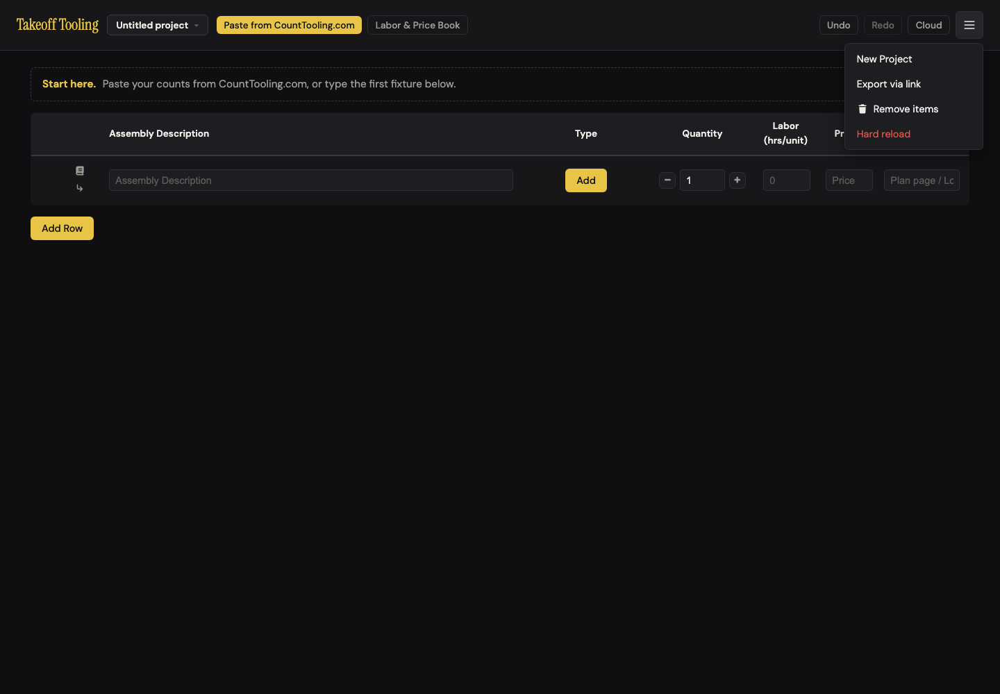
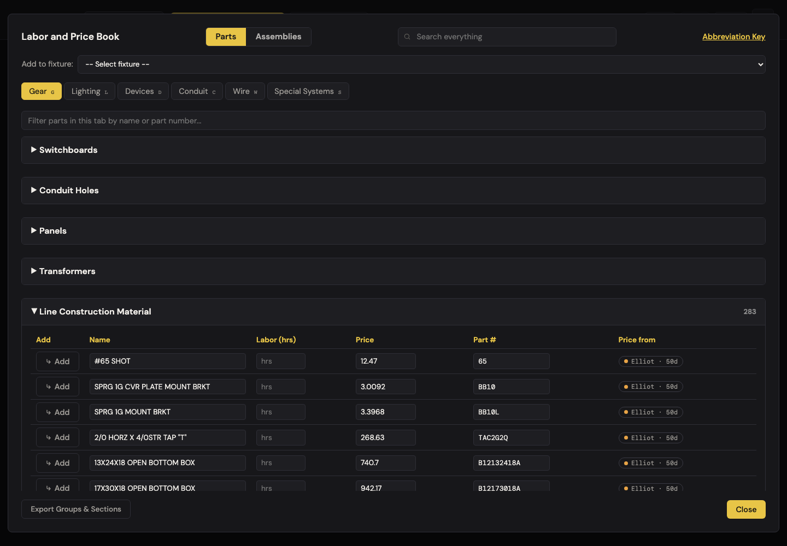
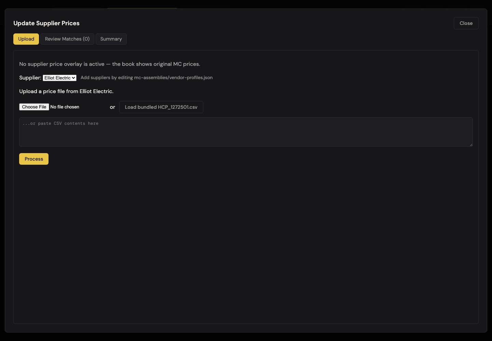
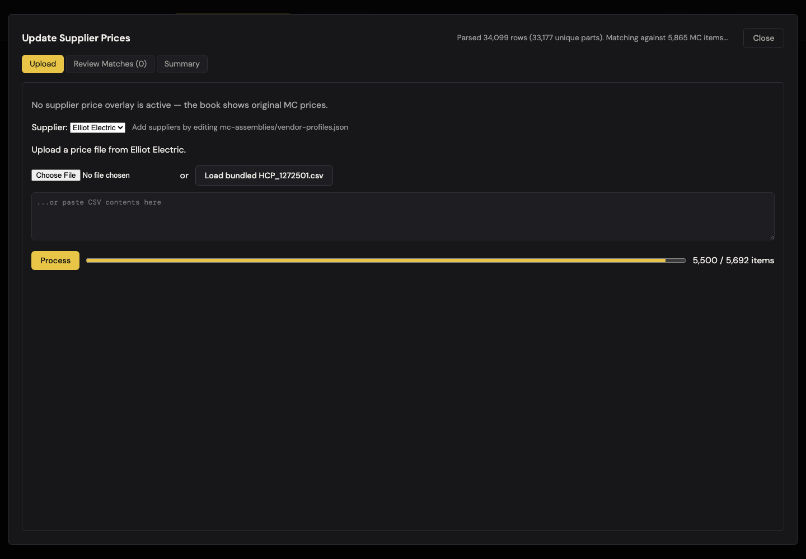
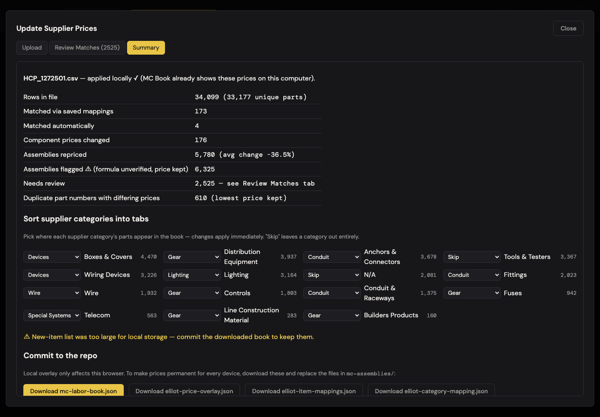
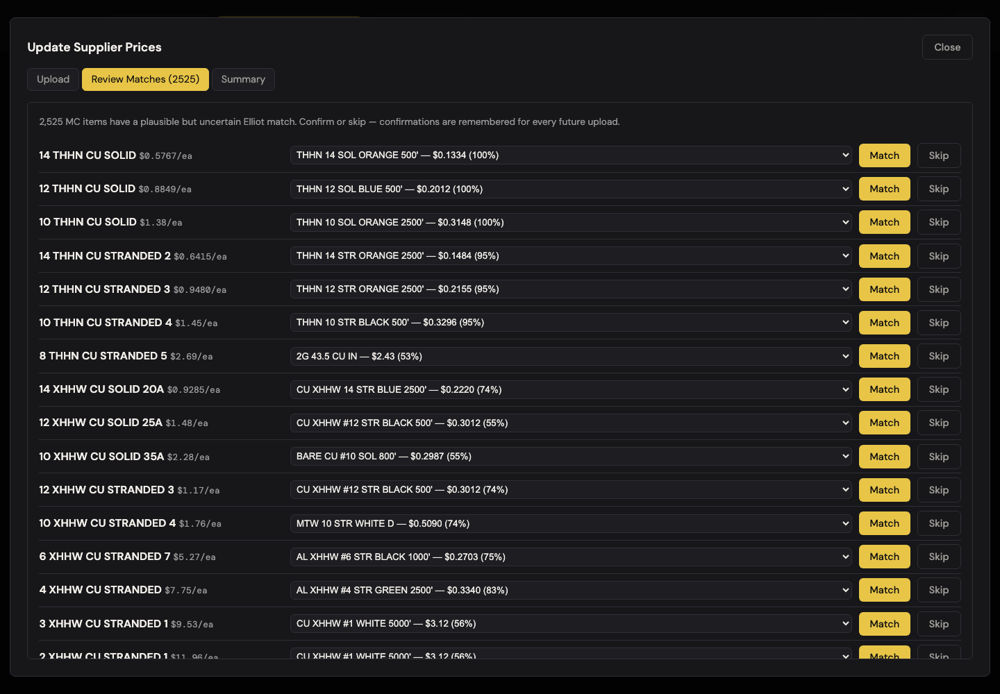
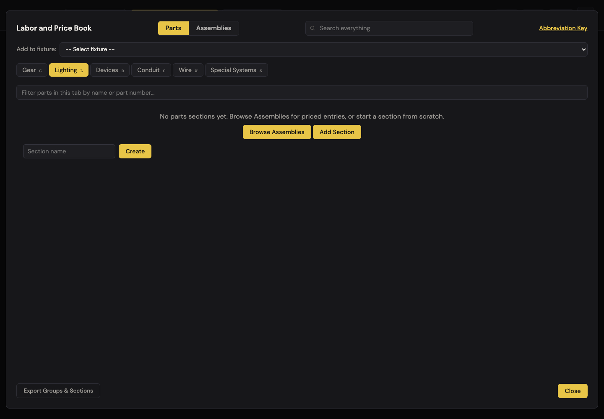
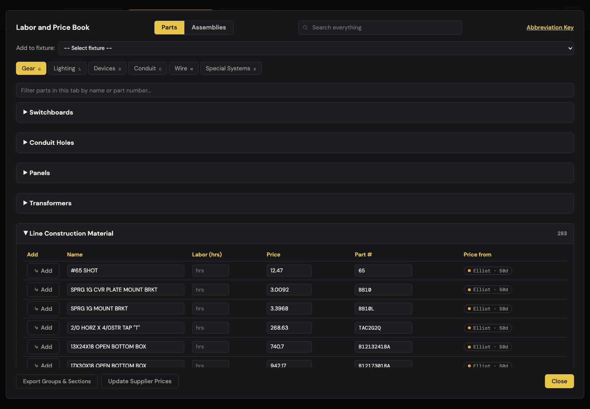

# J13 — Bring in the supply house's new prices, and let a new tester in

Personas: A · Status: ● walked 2026-09-06 · **verified 2026-09-07** (headless Chromium, :4188, signed out; supplier tool via test bypass; user management = wall, documented from code)

> Trigger — Elliot Electric sent this month's price file. The book maintainer wants every
> estimator's book to show the new numbers, sort the file's categories into the right
> tabs, and confirm the matches the computer wasn't sure about. Separately, the dev is
> letting a new alpha tester in.

## Entry points

- **Book footer** — `#mc-elliot-update-btn` "Update Supplier Prices" → `#mc-elliot-modal`. Shown only when signed in as admin/dev (cloud.js:556 toggles `hidden`) AND on the Parts side with no search term (laborBook.js:306 toggles `lb-hidden`). No other way in: no menu item, no hotkey, no hash route.
- **☰ header menu** — `#manage-users-btn` "Manage users" → `#users-modal` (dev only; cloud.js:553). `#review-suggestions-btn` "Review suggestions" (admin+dev; J12).
- **Outside the app** — `scripts/apply-elliot-prices.js <csv> [--match]` does the same match headlessly and writes the JSON directly (docs/DATA-PIPELINE.md). The in-app tool is the no-terminal version of that script.
- **Not an entry point but a dependency** — the four downloaded JSON files only reach other users through a git commit to `mc-assemblies/` and a GitHub Pages deploy. Nothing in the app performs or explains that step.

## Current route (walked 2026-09-06)

Happy path for the price update: **8 steps, ~2,544 decisions** (1 supplier pick, 15 category destinations, 2,525 review rows × 4 choices, 4 downloads; the 2,525 dominate). User provisioning: wall (needs a dev session on production).

1. Signed out, ☰ shows four items — New Project · Export via link · Remove items · Hard reload. "Review suggestions" and "Manage users" are `hidden` with computed `display: none` (A-5 holds). 
2. Open the book (header). Parts › Gear shows four curated sections plus five supply-house sections (Line Construction Material 283 · Distribution Equipment · Builders Products · Fuses · Controls — 7,125 parts on this tab, 27,556 across 13 sections). First row "#65 SHOT · 12.47 · part 65" carries the badge **"Elliot · 50d"** (title "Price recorded 2026-07-18 from Elliot"). Assemblies side: "24,291 assemblies loaded. Elliot prices applied (5,780 repriced, 27,556 new items)." The footer's Update Supplier Prices button is `hidden` (B-10 holds). 
3. **Test bypass**: removed the `hidden` attribute and `lb-hidden` class, clicked. Modal tabs: Upload · Review Matches (0) · Summary. Upload copy: *"No supplier price overlay is active — the book shows original MC prices."* Supplier `<select>` with one option (Elliot Electric) and the hint *"Add suppliers by editing mc-assemblies/vendor-profiles.json"*; file input · "or" · **Load bundled HCP_1272501.csv** · paste textarea · Process. 
4. Load bundled → status "Loading bundled file…" → "Parsed 34,099 rows (33,177 unique parts). Matching against 5,865 MC items…" → gold progress bar (`accent-color rgb(232,197,71)`, C-3 holds) "3,000 / 5,692 items" → auto-switch to Summary. **883 ms end to end.** 
5. Summary: "HCP_1272501.csv — applied locally ✓ (MC Book already shows these prices on this computer)." Stats: Rows 34,099 (33,177 unique) · Matched via saved mappings 173 · Matched automatically 4 · Component prices changed 176 · Assemblies repriced 5,780 (avg change −36.5%) · Assemblies flagged ⚠ (formula unverified, price kept) 6,325 · Needs review 2,525 · Duplicate part numbers with differing prices 610 (lowest price kept). Then "Sort supplier categories into tabs": 15 categories, each a Skip/Gear/Lighting/Devices/Conduit/Wire/Special Systems `<select>` with its row count (Boxes & Covers 4,470 … Builders Products 160; Tools & Testers 3,367 and N/A 2,081 = Skip). Then **"⚠ New-item list was too large for local storage — commit the downloaded book to keep them."** Then "Commit to the repo — Local overlay only affects this browser. To make prices permanent for every device, download these and replace the files in `mc-assemblies/`:" and four download buttons. 
6. Changed Tools & Testers Skip → Gear: status *"Tools & Testers" now goes to the Gear tab.* Reverted: *"Tools & Testers" now is skipped.* (What actually happened in the book: nothing — see finding 1/7.)
7. Downloads (captured): `elliot-price-overlay.json` 3,663 B · `elliot-item-mappings.json` 3,364 B (173 mappings) · `elliot-category-mapping.json` 528 B · `mc-labor-book.json` **4,063,536 B** (committed file: 7,786,102 B). Status after the book: "Downloaded mc-labor-book.json — replace the file in mc-assemblies/ and push."
8. Review Matches: "2,525 MC items have a plausible but uncertain Elliot match. Confirm or skip — confirmations are remembered for every future upload." 300 rows rendered (2,996 DOM nodes, 14,575 px tall), footer "Showing first 300." Prices format cleanly ($0.5767/ea, $1.38/ea — C-1 holds; 0 of 300 malformed) and every option reads "desc — $price (NN%)". Match on row 1 ("14 THHN CU SOLID $0.5767/ea" → "THHN 14 SOL ORANGE 500' — $0.1334 (100%)"): 251 ms re-render, tab → (2524), `mc-elliot-mappings` gains `THHN14S0L0R500 → 5`, overlay `itemPrices[5] = 0.1334`. **Status text: empty.** Skip on the next row: tab → (2523), status empty, mappings unchanged. 
9. Esc closes the tool; the book stays open. Reopened Upload: "Current overlay: Elliot Electric — HCP_1272501.csv imported 2026-09-06 — 177 item prices, **0 new items**. Remove overlay".
10. Closed everything, **reloaded**. Book › every tab: **0 supply-house sections** (gear 5→0, lighting 1→0, devices 2→0, conduit 3→0, wire 1→0, special systems 1→0). Lighting shows the first-run empty state "No parts sections yet…". Global search "#65 SHOT": *Elliot Parts 0 — No matching Elliot parts.* Assemblies status: "Elliot prices applied (5,946 repriced, **0 new items**)." 
11. Recovery: Upload › **Remove overlay** → confirm("Remove the local Elliot price overlay? MC Book returns to original MC prices. Saved match confirmations are kept.") → all 13 sections / 27,556 parts back, badge "Elliot · 50d" again, `McBook.elliotImportDate()` back to 2026-07-18. 

Divergences from the documented route:

- DATA-PIPELINE.md §Runtime Elliot flow step 5 says the Summary downloads "make supplier prices permanent for all users". In the walked state they would make the supplier **catalog disappear** for all users (finding 1).
- DATA-PIPELINE.md says `meta.elliot` "is currently null (no supplier data committed)" in the schema section and, two sections later, that Elliot outputs are committed. The second is true (importedAt 2026-07-18).
- ARCHITECTURE.md's storage table documents the ~2.5 MB cap and "`newItems` dropped if over" as a fact, not as the catalog-wipe it is.
- README.md:76 is the only user-facing line; roles and Manage Users are undocumented (JOURNEY-MAP coverage row already flags this).

## Naive attempt

I'm the office admin, not a developer. Stephen said "the Elliot file came in, load it." I opened the book and there was no button — I'm not signed in as admin on this laptop, and nothing tells me that's why. Once signed in, I found "Update Supplier Prices" at the bottom of the Parts side, but only after I cleared a search (the button hides while searching). The first screen told me no supplier prices were active, which confused me because every part in Gear says "Elliot · 50d". I clicked Load bundled because it was the only bright thing; it finished before I could read the progress bar. The summary was a wall of numbers — "formula unverified", "overlay", "commit to the repo" — and a yellow warning about "local storage" that told me to commit a downloaded book. I downloaded four files and now have them in Downloads with no idea who to hand them to. I opened Review Matches, saw 2,525 rows, and clicked Match on the first three because the options said 100%; nothing confirmed it except the number in the tab going down. When I came back after lunch the book's supply-house parts were gone.

## Evidence

- **Telemetry visibility:** none exists. A rework here should ship `supplier_file_processed {rows, matched, review, truncated}`, `review_decision {kind: match|skip}`, `supplier_files_downloaded {which}`, and — cheapest and most valuable — `catalog_sections_rendered {tab, count}` so a zero after an import is visible.
- **Doc coverage:** README.md:76 (one line); CLAUDE.md quick facts (role gating, provenance flags); ARCHITECTURE.md:123–125 (roles, auth), :139–142 (mc-elliot-* keys, the cap), :168/:174 (modal ownership); DATA-PIPELINE.md §Runtime Elliot flow, §Known issues (the 2,525 queue and −36.5% avg are documented there — this walk reproduced both exactly). Nothing anywhere explains the commit-and-deploy step to a non-developer or describes user onboarding.
- **Specs:** `labor-book.spec.js:20` asserts `#mc-book-status` contains "Elliot prices applied" — it would still pass in the broken state ("… (5,946 repriced, 0 new items)"). `elliotPriceCore.test.js` covers parsing/scoring/recompute. `cloud-sync.spec.js` covers sign-in round trips with the non-admin account, not roles. **No spec opens `#mc-elliot-modal`, no test covers `saveOverlay` truncation → `patchLaborBook`, no test touches `#users-modal`.**
- **Modals:** `#labor-book-modal` → `#mc-elliot-modal` (Esc closes only the inner one); `#users-modal` (wall); `#cloud-modal` for the tester's sign-in.
- **Hotkeys:** Esc only. The book's g/l/d/c/w/s tab keys still fire behind the tool when focus is outside an input (not exercised).
- **Storage / state touched:** `mc-elliot-overlay` (2,885 B after processing — truncated), `mc-elliot-review-queue` (847,158 B, 2,525 rows), `mc-elliot-mappings` (`{version:2, vendors:{elliot:{…}}}`, 4 auto + 1 manual), `mc-elliot-category-overrides` (`{"Tools & Testers": null}` after the revert). No undo frames (book edits are not undoable). No cloud pushes (these keys bypass `TakeoffStorage`; ARCHITECTURE.md:129). Console: 0 app errors; 2 × `net::ERR_FAILED` are the aborted Supabase requests (test stub).

## Friction findings

| # | Severity | What happens | Why it hurts | Verdict stamp (Phase 2b) |
|---|---|---|---|---|
| 1 | **blocker** | Processing the bundled file builds an overlay of **2,720,146 chars** (33,000 `newItems` as 5-tuples, all 15 categories kept for live re-sorting) — over the **2,500,000** cap in mcElliotState.js:10. `saveOverlay` (mcElliotState.js:136–144) stores it with `newItems: []`, `newItemsTruncated: true` (2,885 B). `getPatchedBook` then runs `patchLaborBook` with empty `newItems`, and its else-branch (elliotPriceCore.js:445–449) **strips every `supplier` section from the committed book**: 13 sections / 27,556 parts → 0, on every tab, immediately (`McBook.invalidate()` at mcElliotUpdate.js:158) and after every reload. Global search finds no Elliot parts; Lighting shows the first-run empty state. The **downloaded `mc-labor-book.json` has 0 supplier sections** (4.06 MB vs 7.79 MB committed; `meta.elliot.newItems: 0`) — and the ⚠ warning tells the maintainer to *"commit the downloaded book to keep them"*, which would push the wipe to every user. Either recent feature alone fits under the cap (tab-mapped-only 5-tuples: 2,279,973; all-cats 4-tuples: 2,291,146); together they don't. | The one tool that exists to *improve* the catalog deletes it, on the exact file that ships with the repo, in under a second, and then advises the maintainer to make it permanent. Recovery exists (Upload › Remove overlay, or delete the `mc-elliot-overlay` key) but nothing points to it — the Assemblies status even reports success ("Elliot prices applied … 0 new items"). Estimators on that machine lose 27,556 priced parts and their "Elliot · 50d" provenance until someone guesses. | **CONFIRMED (blocker holds)** — re-driven independently: 13 sections / 27,556 parts → 0 on every tab *immediately after processing* (book re-fetched, no reload) and again after reload; overlay 2,718,636 chars → stored 2,885 with `newItems: []`. Recovery works: Upload › Remove overlay restored 13/27,556 and the 2026-07-18 date. |
| 2 | **blocker** (numeric trust; scale: 4 parts) | The 4 "Matched automatically" items all collide with part numbers already in the committed mappings: the downloaded `elliot-item-mappings.json` silently changes `1709` 8706 "3/4 FLEX SQZ CONN DIE" ($6.94) → 8732 "3/4 FLEX SQZ CONN" ($6.52), `1711` and `1713` likewise (1¼" and 2" DIE → non-DIE, $31.17→$41.53, $57.93→$74.24), and `813400` 26452 "3/4 X 8' GRND ROD" ($30.00) → 26453 "3/4 X 10' GRND ROD" ($35.62). `setMapping` (mcElliotState.js:123–128) overwrites by part number; `{partNumber: itemNum}` is one-to-one, so one Elliot SKU cannot legitimately price two MC items, and the newest guess wins. The summary shows "4" with no hint they replaced saved matches; the mapping count stays 173. | A confirmed match is supposed to be the one thing the reviewer can trust ("confirmations are remembered for every future upload"). Committing this file re-prices the DIE-cast connectors and one ground rod at a different part's price, and un-maps four items that were deliberately mapped. It looks right — same file size, same count. | **CONFIRMED (blocker holds), mechanism sharpened** — diff reproduces exactly, and the harm is live in the overlay, not only in the file: in one run both MC items carry the same Elliot price (8706 DIE *and* 8732 non-DIE at $4.3233; 26452 8′ rod *and* 26453 10′ rod at $35.18 — the 8-footer priced as a 10-footer). A second import in the same session **flipped all four back** (1709→8706, 1711→8708, 1713→8710, 813400→26452), so the file oscillates every upload. One correction: the repo's 173 mappings are `apply-elliot-prices.js --match` output (DATA-PIPELINE.md:71), not human confirmations — "deliberately mapped" overstates; the severity rests on the wrong prices. |
| 3 | stumble | Upload copy: *"No supplier price overlay is active — the book shows original MC prices."* False on this build: the committed book already carries the 2026-07-18 import (5,780 repriced, 27,556 parts, every badge "Elliot · 50d"). The sentence describes the **local** overlay only (mcElliotUpdate.js:64–67). After an import it reads "… 177 item prices, **0 new items**" — the file had 33,000. | The first thing the maintainer reads contradicts the book behind the modal. "Original MC prices" is also the wrong mental model — the book's baseline *is* a supplier import, and the tool is a re-import. | **CONFIRMED** — measured with the modal open and no local overlay: `McElliotState.hasOverlay()` false while `McBook.elliotImportDate()` = 2026-07-18 and 13 sections / 27,556 badged parts render behind the modal. The sentence is false as written. |
| 4 | stumble | Match and Skip show **no confirmation**: `setStatus("Matched … Remembered for future uploads.")` (mcElliotUpdate.js:288) is immediately wiped by `renderBody()` → `setStatus('')` (:297 → :326). Observed status after both clicks: `""`. Only signals: the row vanishes, the tab count drops by one, 251 ms of full re-render. | For a 2,525-row queue the reviewer needs to know each click took — and which candidate it took. Two of the three feedback channels were built and then erased by the render. | **CONFIRMED** — `#mc-elliot-status` measured `""` (length 0) after both a Match and a Skip; only the tab count moved (2525 → 2524 → 2523). Re-render took 1.56 s in this run (walker measured 251 ms), so the dead time is worse than reported. |
| 5 | stumble | **Skip is not remembered.** `resolveQueueItem(itemNum, null, null)` (mcElliotState.js:175–187) only removes the row from the local queue; mappings unchanged (stayed at 5). The next upload re-derives the same 2,525 and the skipped item is back. Meanwhile the word "Skip" in the category table means "leave this category out of the book entirely" — a different, permanent action, two scroll-heights away. | The queue can never be finished across uploads — only the Match half of each decision persists. Two Skips with two meanings in one modal. | **CONFIRMED** — mappings 5 → 5 across a Skip (JSON byte-identical), and a full second import re-derived the identical 2,525-row queue. |
| 6 | stumble | The review queue is a flat list: 2,525 items, 300 rendered ("Showing first 300."), 14,575 px tall, **0 inputs** (no search, filter, sort, group, or bulk action). Every Match/Skip re-renders all 300 rows. Rows do not say *why* they're uncertain: "14 THHN CU SOLID" shows three candidates, all $0.1334 at 100% — the disagreement that kept it out of auto (a stranded variant at another price within the 0.15 margin; `classifyMatches` elliotPriceCore.js:315–318 checks *all* near-tied rivals but the row shows `slice(0,3)`, :328) is invisible. At ~5 s per decision the queue is 3½ hours, if #5 didn't undo half of it. | Nobody will finish this, so the 2,525 will stay 2,525 (DATA-PIPELINE.md already says so). The 100 %-with-identical-prices rows are the ones a bulk "accept all same-price ties" would clear in one click. | **CONFIRMED** — 300 rows, 2,996 DOM nodes, 14,575 px tall, **0** text inputs, 300 selects, footer "Showing first 300."; row 1 still offers three 100% candidates all at $0.1334 with no reason given. |
| 7 | stumble | Category re-sort promises *"changes apply immediately"*. In the walked state, Tools & Testers → Gear updated `enabledCategories` and said "now goes to the Gear tab", but Gear gained 0 sections (no `newItems` to place) and the Parts panel behind the modal did not re-render (still 5 stale blocks). The revert also wrote an override `{"Tools & Testers": null}` that duplicates the repo value. | The maintainer is told something moved; nothing did. In the non-truncated state the panel behind the modal also only catches up on its next render. | **CONFIRMED and escalated** — reproduced in the truncated state (Gear 0 → 0, status "now goes to the Gear tab", override written). The non-truncated path *was* reached (untruncated overlay written straight to localStorage, 13 sections back): changing one destination re-saves the overlay through the same `saveOverlay` cap, re-truncates it (2,718,636 → 2,903 chars) and **wipes all 13 sections again** — see NEW-3. |
| 8 | stumble | Software language for a non-developer maintainer: "Commit to the repo", "replace the files in `mc-assemblies/`", "… and push", "Add suppliers by editing mc-assemblies/vendor-profiles.json", "overlay", "local storage", "formula unverified". Nothing says **who** commits, that a GitHub Pages deploy follows, or that until then only this browser has the prices ("Local overlay only affects this browser" is the one true sentence, buried mid-panel). | Four files land in Downloads with no next step an office admin can take. The frame's spirit test #2 fails on every line of this panel. | **CONFIRMED** — every quoted string reproduced verbatim from this run's summary and upload panels. |
| 9 | stumble (code-derived; masked by #1) | Provenance dates reset on re-import. `stampNewItemDates` keeps a part's prior date only if the **local** prior overlay has it (mcElliotUpdate.js:153 passes `McElliotState.getOverlay()`, never the committed `elliot-price-overlay.json`, which is 4-tuple anyway). On a first in-app import every unchanged part is stamped today, and `meta.elliot.importedAt` moves to today (`McBook.elliotImportDate()` went 2026-07-18 → 2026-09-06 during the walk; downloaded book agrees). | The J7 "protected strength" — freshness tiers <30d/30–90d/>90d — would read "Elliot · 0d" on 33,000 parts whose price did not move. A wrong date that looks right. | **CONFIRMED (was "to verify")** — verified past #1 by restoring an untruncated overlay: `ALF34500` (price **unchanged** at 1.2172 since the committed 2026-07-18 import, and 4-tuple there so it carries no date) came back stamped `pricedAt: "2026-09-07"`, and `meta.elliot.importedAt` moved 2026-07-18 → today. |
| 10 | papercut | Tab label "Review Matches (2525)" vs body "2,525"; category counts in a code font; the 15-category table is 105 `<option>`s sorted by count, so Gear's five categories are scattered. | Polish. | **CONFIRMED** — tab read "Review Matches (2525)" against the body's "2,525"; 15 selects × 7 options = 105, ordered 4,470 → 160. |
| 11 | papercut | The downloaded overlay carries internal flags (`newItemsTruncated: true`, `allCats: true`) into a repo artifact; no size sanity check on any download (3.6 KB overlay vs 1.9 MB committed; 4.1 MB book vs 7.8 MB). | A maintainer comparing file sizes is the only safety net, and nothing suggests they should. | **CONFIRMED** — downloaded overlay carries `newItemsTruncated: true` and `allCats: true`; 3,663 B vs the committed 1,920,728 B, book 4,063,536 B vs 7,786,102 B. |
| 12 | papercut | Status line goes stale: after three downloads it still read *"Tools & Testers" now is skipped.*; only the book download replaces it. The Assemblies status after a re-import ("5,946 repriced, 0 new items") reports the catalog loss as success. | Low-cost confusion; the second one hides #1 from the one place an estimator looks. | **CONFIRMED** — only `downloadPatchedBook` calls `setStatus` (mcElliotUpdate.js:317); the other three handlers (:392–411) leave the prior line standing. Assemblies status reproduced verbatim: "24,291 assemblies loaded. Elliot prices applied (5,946 repriced, 0 new items)." |
| 13 | papercut (from code) | Manage Users: the temporary password field is `type="text"` (index.html:165), so the password is on screen; no copy button, no "send them this" hint; no way for anyone to change or reset a password afterwards (cloud.js has no `updateUser`/`resetPasswordForEmail`). | The tester keeps the temp password forever or switches to the emailed code — fine, but nobody is told. | **wall — CODE-VERIFIED** — index.html:165 is `type="text"`; `grep` over `js/` finds no `updateUser`, `resetPasswordForEmail`, or any password-change path, and the Edge Function exposes only create/delete (index.ts:49–66). |

Baseline check: A-5, B-10, C-1, C-3 hold (measured). No regressions found.

### Manage Users — the wall, from code

Needs a **dev** session on production; not driven. What the code does:

- **List**: `TakeoffCloud.listUsers()` → RPC `takeoff_list_users` (002:71–79) returns email, role, created, last sign-in; **returns zero rows for non-dev callers** (the `where public.takeoff_role() = 'dev'` clause), which users.js:54–57 renders as "No users visible — the dev role is required."
- **Set role**: `<select>` user/admin/dev per row → RPC `takeoff_set_user_role` (002:82–96): dev-only, can't demote yourself; the UI also disables your own row ("You can't change your own role"). The target's app learns of the change only on its next `onAuthStateChange` (cloud.js:517–520 → `fetchProfileRole`) — sign-in or token refresh — so a freshly promoted admin doesn't see "Review suggestions" until they sign out/in or wait for the hourly refresh.
- **Add**: email + "Temporary password (6+ chars)" → Edge Function `takeoff-admin` `create-user` with `email_confirm: true` (index.ts:49–58). The function re-verifies the caller's JWT and `takeoff_profiles.role === 'dev'` with the service key (index.ts:36–45). The signup trigger (002:35–47) gives the new account role `user` (or a seeded role for the two hardcoded emails).
- **Delete**: confirm("Delete the account …? Their cloud data rows are removed with it.") → `delete-user`; can't delete yourself. `takeoff_projects` and `takeoff_profiles` cascade (`on delete cascade`, 001:16 / 002:12); `takeoff_store` and `takeoff_suggestions` were created outside this repo's SQL, so the confirm text's promise is **unverified** for those two tables.
- **Fallback**: with `takeoff_profiles` unapplied, `isAdmin()` falls back to `ADMIN_EMAIL` (cloud.js:33, :335) — one hardcoded address; `is_takeoff_admin()` in SQL is role-driven only.

**Onboarding story for an alpha tester, end to end**: dev opens ☰ › Manage users → types the tester's email and a temp password → "Account created" → tells the tester the password out of band (text/call; the app sends nothing) → tester opens the site → "Sign In" (cloud button) → email + password → session → profile row exists with role `user` → local projects union-merge with the (empty) cloud → "✓ Cloud". Where it breaks: (a) the Edge Function must be deployed separately (`supabase functions deploy takeoff-admin`); if it isn't, "Add user" fails with a function error while list/roles still work; (b) the tester can skip the whole thing — "Email me a 6-digit sign-in code" uses `shouldCreateUser: true` (cloud.js:492), so **any email address self-provisions an account**; Manage Users is a directory, not a gate; (c) no password change/reset exists in the app — the temp password is permanent unless the tester switches to codes; (d) promotion to admin is invisible to the tester until re-auth; (e) delete may leave `takeoff_store`/`takeoff_suggestions` rows behind (unverified).

**Wall verdict (Phase 2b): CODE-VERIFIED.** Every line citation in this section was re-read and matches: 002:71–79 (the `where public.takeoff_role() = 'dev'` clause), users.js:54–57, 002:82–96 (dev gate, invalid-role guard, self-demotion guard at :91–93), cloud.js:517–520 (`fetchProfileRole` is called from `onAuthStateChange` and nowhere else — grep confirms one call site), index.ts:36–45 and :49–58, 002:35–47, the cascades at 001:16 / 002:12, cloud.js:33/:335 (`ADMIN_EMAIL` fallback), cloud.js:492 (`shouldCreateUser: true`). `supabase/` contains only 001 and 002, so the confirm text's cascade promise is indeed unverifiable for `takeoff_store` / `takeoff_suggestions`. The onboarding story (a)–(e) stands as written.

## Proposals

**P1 — rework: the import can never make the catalog smaller.** Two guards and one diet. (i) `patchLaborBook` must not strip the committed supplier sections when the overlay is `newItemsTruncated` (or when it has no `newItems` at all) — treat "no new items" as "leave the book's catalog alone", not "remove it". (ii) `downloadPatchedBook` refuses (or shouts) when the patched book has fewer supplier entries than the fetched one (27,556 → 0). (iii) Store only tab-mapped categories in `newItems` (2.28 M chars fits) or move the overlay to IndexedDB and drop the cap — with the cap gone, the ⚠ "local storage" sentence, the `newItemsTruncated` flag and finding 7's dead re-sort all go away. Spirit: (1) removes the recover-the-catalog step and the "which file do I trust" decision entirely; (2) "supply-house parts", "price file" — no "overlay", no "local storage"; (3) removes the warning line, the truncated flag, and the else-branch; (4) nothing to find — it just doesn't break. `spiritPass: true` (verifier — with two corrections to (iii): the 2.5 MB ceiling is **not** a browser limit, Chrome stored the full 2,718,636-char overlay with no `QuotaExceededError` when written directly, so `MAX_BYTES` is a self-imposed constant; and tab-mapped-only measures 2,278,974 chars — only 8.8 % of headroom, which one bigger Elliot file erases. Prefer "drop the cap / move to IndexedDB" over the diet, and keep guard (i) regardless: guard (i) alone is what makes the catalog un-losable).

**P2 — polish: collisions go to review, not to the mapping file.** When an auto match's part number already maps to a different MC item, push it to the review queue with the saved match shown as the current answer, and count it separately ("4 matched automatically · 0 replaced saved matches"). Spirit: (1) removes a silent decision the software was making; (2) "saved match" / "this part already prices …"; (3) removes the need to diff the downloaded mappings against git; (4) it shows up in the queue the maintainer is already working. `spiritPass: true` (verifier — it technically *adds* up to 4 decisions to a 2,525-row queue, which is noise, and they are precisely the 4 that today produce a silently wrong price; the fix must also stop the same Elliot part from pricing two MC items in one overlay, which is where the wrong dollars actually land).

**P3 — rework: a finishable review queue.** Group rows by MC category with a filter box (reuse `TakeoffUtils.makeTokenMatcher`), remember Skip as a decision (a `null` mapping, so the row stays gone next upload), say *why* each row is uncertain ("near-tie at a different price: THHN 14 STR $0.1484"), and add one bulk action: "Match all 100% ties with identical prices" (the wire rows at the top of the walk). Rename the row button "Skip" → "Not this" and keep "Skip" only for categories. Spirit: (1) collapses hundreds of identical-price decisions into one and stops decisions from coming back; (2) "not this", "same price", "wire" — not "candidate", "score"; (3) removes the 300-row cap and the second meaning of Skip; (4) the bulk button sits at the top of the list you're already looking at. `spiritPass: true` (verifier: the bulk rule must apply only when *all* near-tie rivals share the price, exactly the `samePrice` rule at elliotPriceCore.js:317 — confirmed at that line; note the row can only show `candidates.slice(0, 3)` from :328, so "all rivals" has to be recomputed, not read off the row).

**P4 — polish: tell the truth on the first screen, and keep the confirmation.** Upload copy becomes "The book's supply-house prices are from the file committed 2026-07-18 (27,556 parts). Nothing has been changed on this computer." / after an import "This computer is showing HCP_1272501.csv from today (176 prices moved, 33,000 parts) — not yet shared with anyone." Fix the wiped status (set it *after* `renderBody()`, or render it into the row's place). Spirit: (1) removes the "is it on or off?" question; (2) "shared", "this computer", "price file"; (3) removes the word "overlay" from the UI; (4) it's the first sentence. `spiritPass: true`.

**P5 — polish + teach: "Send the new prices to everyone".** Rename "Commit to the repo" → "Send the new prices to everyone", and the paragraph → "Right now only this computer sees them. Download these four files and hand them to whoever maintains the site; once they're published, every estimator's book updates on their next reload." Keep the file names visible (the maintainer *is* the person who will read them). The rest — that "publish" means a git commit to `mc-assemblies/` and a Pages deploy — is the guide's job. Spirit: (1) removes the "what now?" dead end, no new steps; (2) "send", "everyone", "site" — not "commit", "repo", "push"; (3) makes the `and push` status line unnecessary; (4) it's the section heading. `spiritPass: true`.

**P6 — keep: the role gate.** Signed out, none of the three admin surfaces render (A-5, B-10 verified by computed style). Keep the `[hidden]` CSS rules; add one Playwright assertion so the class of bug stays dead. `spiritPass: true` (verifier — adds no user-facing surface; the assertion is test-only, and the gate itself removes three surfaces from every estimator's app).

**P7 — polish: the summary as a "what changed" report.** The stats table already says the useful things (176 prices moved, avg −36.5% on 5,780 assemblies, 610 duplicate SKUs). Lead with a sentence — "Since July 18: 176 parts changed price; assemblies now average 36.5% lower; 4 new matches; 2,525 to look at" — and drop the "formula unverified" row into a tooltip. **Not** proposed as an estimator-facing surface: estimators already get per-part provenance and offers (J7); a second place to read price movement fails spirit #3 unless it replaces something. `spiritPass: true` for the maintainer wording; `gap` deferred for estimators. **Verifier: `spiritPass: false` as written** — it fails #3 (simplicity budget). The lead sentence is a fifth way to read the same eight numbers and a tooltip hides a row rather than removing it; nothing is retired. It passes if the sentence **replaces** the stats table (numbers behind a "show the details" toggle) instead of heading it — re-propose that way.

**P8 — gap / rework: onboarding a tester.** Either make Manage Users the gate (turn off `shouldCreateUser`, so "Add user" means something) or make it the directory it already is and drop the temp-password field — "Add user" just records the email and the tester signs in with the emailed code. Either way, add "change password" or remove the password path; today's mix has the worst of both. Spirit: (1) removes the temp-password hand-off (a whole out-of-band step) and the "which sign-in do I use?" decision; (2) "let them in", "sign-in code"; (3) removes the password field and finding 13; (4) the tester only ever sees "Email me a code". `spiritPass: true` with the verifier's caveat that this is a product decision (open vs invite-only alpha) the owner must make first.

## Guide actions

- First article: **"Loading the supply house's price file"** — who has the button (admin), where it is (bottom of the Parts side; hides while you search), what the summary numbers mean in trade terms (repriced = the computer's math; flagged = kept the old price because the MC formula didn't check out), what "Skip" means in each place, and the hand-off: four files → the site maintainer → everyone's book updates on reload. Include the recovery sentence for finding 1 until P1 ships: *"If the supply-house parts disappear, open Update Supplier Prices › Upload › Remove overlay."*
- Second article: **"Letting a new estimator in"** — the emailed-code path is self-serve; Manage Users is for roles; roles show up after the person signs in again.
- README rows to add: roles (user/admin/dev and what each unlocks); Manage Users; the fact that the four downloads only reach others via a commit. Fix DATA-PIPELINE.md's "`meta.elliot` is currently null".

## Demo moment

Drop a 34,099-row supply-house file on the tool and watch it match 5,692 items in under a second, with the gold progress bar and the summary that says "5,780 assemblies repriced, avg −36.5%" — screenshot 04 → 05. (Then don't reload.)

## Walk notes

- Server: read-only static server at `http://localhost:4188` (not started or stopped by this walk). Headless Chromium 1440×1000, fresh context, `acceptDownloads: true`, `context.route(/supabase/i, abort)` — **cloud is production; never signed in**. Dialogs auto-accepted and logged (one confirm, text quoted in step 11).
- **Test bypass**: `document.getElementById('mc-elliot-update-btn').removeAttribute('hidden')` + `classList.remove('lb-hidden')`, twice (before the import and again after the reload for recovery). Everything else is what the UI does. The gating itself was measured *before* the bypass (computed `display: none`).
- Seed: none — the app's own committed `mc-labor-book.json` (7,786,102 B, 13 supplier sections / 27,556 parts, `meta.elliot.importedAt` 2026-07-18) and the bundled `import-files/HCP_1272501.csv` (2,984,966 B, 34,099 rows). localStorage started with only the project index + one project.
- Timings: boot 917 ms; Load bundled → Summary 883 ms; downloads 17–115 ms; Match re-render 251 ms. Console: 0 app errors (2 × `ERR_FAILED` from the aborted Supabase stub).
- Overlay size reproduced offline in Node with `McElliotCore.parseVendorCsv` + `dedupeElliotRows`: 33,177 unique parts, 610 duplicates, simulated in-app overlay 2,720,146 chars (> 2,500,000); tab-mapped-only 2,279,973; 4-tuple all-cats 2,291,146.
- Captured downloads and `results.json` in the scratchpad walk dir (`walks/maintain-catalog-and-team/`): `elliot-price-overlay.json` 3,663 B · `elliot-item-mappings.json` 3,364 B · `elliot-category-mapping.json` 528 B · `mc-labor-book.json` 4,063,536 B.
- **Verifier, re-drive first**: finding 1 (process → `McBook.elliotSectionsForTab('gear').length` before/after, then reload; then Upload › Remove overlay), finding 2 (diff the downloaded mappings against `mc-assemblies/elliot-item-mappings.json` — expect `1709`, `1711`, `1713`, `813400`), finding 4 (`#mc-elliot-status` text right after Match).
- Not walked: choosing a file via the `<input type=file>` (bundled path used), pasting CSV, a second vendor (only Elliot exists), Manage Users (wall), Review suggestions (J12).

## Verification

**2026-09-07 — adversarial verify pass.** Method: three independent headless-Chromium drives (1440×1000, fresh context each, `acceptDownloads: true`, `context.route(/supabase/i, abort)` — **never signed in; cloud is production**) against the read-only server at `http://localhost:4188`, plus a line-by-line re-read of every code and SQL citation in this dossier. Dialogs auto-accepted and logged. Boot 940 ms; Load bundled → Summary **670 ms** (the walk measured 883 ms — variance, not a change). Console across all three runs: **0 app errors**; 1–3 × `net::ERR_FAILED` from the aborted Supabase stub.

*A prior verifier's stamps were reviewed.* Twelve Verdict cells were already filled in but no Verification section had been written. Every stamp was re-driven rather than inherited: eleven survive (some with sharper numbers), one had its mechanism corrected (#2), and the one unstamped row (#9) is now stamped from evidence.

**Test bypass (declared).** The supplier tool is admin-gated. Its gating was measured *first*, unbypassed — `#mc-elliot-update-btn` had `hidden` and computed `display: none`; then `document.getElementById('mc-elliot-update-btn').removeAttribute('hidden')` + `classList.remove('lb-hidden')` before each open. One further instrument, used only in run 3 and flagged wherever it produced a number: `McElliotState.saveOverlay` was wrapped in the page to record the payload size *before* truncation, and the captured untruncated overlay was later written straight into `localStorage` to reach the state this build cannot otherwise reach. No app file was modified.

### Re-drives

1. **The overlay hazard (finding 1) — reproduced, twice, in two fresh profiles.** Before: 13 supplier sections / **27,556** parts (gear 5 · lighting 1 · devices 2 · conduit 3 · wire 1 · specialSystems 1), `McBook.elliotImportDate()` 2026-07-18. Processing the bundled CSV builds an overlay of **2,718,636 chars** (33,004 `newItems`) against `MAX_BYTES = 2500000` (mcElliotState.js:10); `saveOverlay` (:136–144) stores **2,885 chars** with `newItems: []`, `newItemsTruncated: true`. `getPatchedBook` (:209–220) then hands `patchLaborBook` an overlay with no `newItems`, and the else-branch at elliotPriceCore.js:445–449 filters `!s.supplier && s.level1 !== 'Elliot'` out of **every** tab. Result, measured with the book re-fetched and **no reload**: 13/27,556 → **0/0 on all six tabs**, and identically after a reload. Global search "#65 SHOT": "Elliot Parts 0". Assemblies status: "…(5,946 repriced, **0 new items**)". The downloaded `mc-labor-book.json` is 4,063,536 B (committed: 7,786,102 B) with **0 supplier sections** and `meta.elliot.newItems: 0`, and the ⚠ line tells the maintainer to commit it. **Recovery confirmed**: Upload › Remove overlay → 13/27,556 back, `elliotImportDate()` 2026-07-18 (the walk's claim holds; an earlier measurement of mine that showed 0 was an artifact of not re-running `McBook.ensureLoaded()` after `invalidate()`). Feature-size arithmetic reproduced within 0.06 % of the walk: tab-mapped-only 5-tuples **2,278,974**, all-cats 4-tuples **2,289,584**, both-diets 1,920,746 — either one alone fits, together they don't. **Is the cap documented?** Yes — ARCHITECTURE.md:139 states it as a fact ("max ~2.5 MB, `newItems` dropped if over") with no hint that dropping them empties the catalog, and DATA-PIPELINE.md:66 says the downloads make prices "permanent for all users". **Does documentation change the severity?** No, and arguably it worsens it: the one maintainer who hits this reads a warning that blames the browser (see NEW-2), a success line in the Assemblies panel, and a doc row that reads like a housekeeping detail. Nothing in the app, the docs, or the specs connects "newItems dropped" to "27,556 parts gone", and `labor-book.spec.js:20` passes in the broken state. Blocker stands.
2. **"No supplier price overlay is active…" (finding 3) — FALSE, confirmed.** With `McElliotState.hasOverlay() === false`, `McBook.elliotImportDate()` returns **2026-07-18** and `book.meta.elliot` is `{sourceFile: "HCP_1272501.csv", importedAt: "2026-07-18T05:20:54.240Z", updated: 5780, flagged: 6325, newItems: 27556}` — 13 sections of supplier parts render behind the modal, every one badged "Elliot · 50d". The sentence is only true of the *local* overlay (mcElliotUpdate.js:64–67); as the first thing on the first screen it is simply wrong.
3. **Review-queue scale (finding 6) — confirmed.** 2,525 rows in the queue (847,158 B in `mc-elliot-review-queue`), **300 rendered**, **2,996 DOM nodes**, **14,575 px** tall, footer "Showing first 300.", **0 text inputs / 0 filters / 0 sort / 0 bulk actions**, 300 `<select>`s. Row 1 offers three candidates all at $0.1334 / 100 % with no statement of what made it uncertain. Match re-render measured **1,556 ms** here.
4. **Category → tab dropdown (finding 7) — confirmed and escalated.** Truncated state: "Tools & Testers" Skip → Gear wrote `{"Tools & Testers":"gear"}`, said *"…now goes to the Gear tab"*, and Gear went 0 → **0**; the revert wrote `{"Tools & Testers":null}`, duplicating the repo value. Reaching the non-truncated state (see NEW-3) showed the control is worse than inert there.
5. **"Commit to the repo" and the download shapes — confirmed.** Copy reproduced verbatim, including "replace the files in `mc-assemblies/`", "…and push", "Add suppliers by editing mc-assemblies/vendor-profiles.json". Downloads byte-for-byte as the walk recorded: `elliot-price-overlay.json` **3,663 B** (vs 1,920,728 B committed; carries `newItemsTruncated: true`, `allCats: true`), `elliot-item-mappings.json` **3,364 B** (173 entries), `elliot-category-mapping.json` **528 B** (identical to the repo mapping), `mc-labor-book.json` **4,063,536 B**.
6. **Alpha-tester onboarding — CODE-VERIFIED (wall).** See the stamp under "Manage Users — the wall, from code": all fourteen line citations re-read and correct, `supabase/` holds only 001 and 002, and `fetchProfileRole` has exactly one call site (cloud.js:519), which is what makes (d) true. Not driven — that requires a dev session on production.

### Code checks (no drive needed)

- **Finding 2's mapping collisions**, re-derived: the downloaded file and `mc-assemblies/elliot-item-mappings.json` are both 173 entries with **exactly four** differences — `1709` 8706→8732, `1711` 8708→8734, `1713` 8710→8736, `813400` 26452→26453 — nothing added, nothing removed. A **second import in the same session flipped all four back**, so the file oscillates on every upload (`setMapping`, mcElliotState.js:123–128, keys by part number; `runMatching` applies saved mappings first, then lets the auto pass overwrite the same key). The dollars: after import 2 the overlay prices **8706 and 8732 both at $4.3233** and **26452 and 26453 both at $35.18** — one Elliot SKU pricing two MC items, an 8′ ground rod carrying the 10′ rod's price.
- **Finding 9's premise**: the committed `elliot-price-overlay.json` is 4-tuple (27,556 rows, no `pricedAt`), and mcElliotUpdate.js:153 passes only `McElliotState.getOverlay()`, so a first in-app import has no prior dates to keep. Demonstrated, not just argued — see the stamp.
- **Finding 12's mechanism**: only `downloadPatchedBook` calls `setStatus` (mcElliotUpdate.js:317); the overlay / mappings / catmap handlers (:392–411) never touch it.
- **Spec coverage**: `elliotPriceCore.test.js:162` and `:210` exercise `patchLaborBook` **only with non-empty `newItems`** — the else-branch at :445–449 has no test. No spec opens `#mc-elliot-modal` or `#users-modal`. The walk's evidence section is accurate.
- **Doc divergences** re-checked: DATA-PIPELINE.md:53 says `meta.elliot` "is currently `null`" (false — it is populated, importedAt 2026-07-18) while :71 correctly says the Elliot outputs are committed; :66 promises the downloads make prices "permanent for all users"; ARCHITECTURE.md:139 documents the cap; README.md:76 is the only user-facing line.

### Counter-evidence hunts

- **Is the immediate wipe just a stale render?** No. Measured with `await McBook.ensureLoaded()` after `McBook.invalidate()`, so the book was genuinely re-fetched and re-patched: still 0 sections. (This is also where my first pass produced a false "recovery failed" — worth flagging for anyone re-driving: `elliotSectionsForTab` returns `[]` while `book` is null.)
- **Is the 2.5 MB cap a real browser limit?** **No.** Writing the full 2,718,636-char overlay straight into `localStorage` succeeded (`readBack` 2,718,636, no `QuotaExceededError`), and the catalog immediately came back at 13 sections / 27,556 parts. The wipe is caused entirely by an app constant. See NEW-2.
- **Were the four overwritten mappings really "deliberately mapped"?** No — DATA-PIPELINE.md:71 says the committed 173 are `apply-elliot-prices.js --match` output, i.e. the same algorithm's guesses. That part of finding 2's framing is overstated and is corrected in the stamp; the severity survives on the wrong prices, which are real.
- **Does finding 5's "the queue can never be finished" hold across a real second import?** Yes — import 2 re-derived 2,525, with "Matched via saved mappings 173 / Matched automatically 4" unchanged.
- **Observation, not a finding:** import 2 reported *661* duplicate part numbers against import 1's *610*. That is a consequence of my own enabling of "Tools & Testers" — `dedupeElliotRows` takes the category mapping — not a defect.

### NEW (found in passing)

- **NEW-1 · stumble.** `clearOverlay` (mcElliotState.js:145–151) removes `mc-elliot-review-queue` along with the overlay, but the confirm text promises only *"Saved match confirmations are kept."* Verified: after Remove overlay the queue key is gone (847 KB, 2,525 rows) and the tab reads "Review Matches (0)". So the **only documented recovery from finding 1 silently throws away the review work in progress**, including every Skip (which #5 already shows is unrecoverable). The confirm should say what it deletes, or the queue should survive.
- **NEW-2 · papercut with teeth.** The ⚠ copy *"New-item list was too large for local storage"* is **false** — local storage took the full payload. The limit is `MAX_BYTES` in mcElliotState.js:10. Because the sentence blames the browser, the remedy it offers ("commit the downloaded book to keep them") is the one action that spreads the damage; the true remedy is a code constant the maintainer cannot touch.
- **NEW-3 · hazard, code-verified and demonstrated under the bypass.** Every overlay *re-save* goes back through the same cap: `resolveQueueItem` after each Match (mcElliotState.js:175–187) and the category-destination handler (mcElliotUpdate.js:423–430). With a healthy untruncated overlay in place (13 sections rendering), changing **one dropdown** re-saved it, re-truncated it 2,718,636 → **2,903 chars**, and wiped all 13 sections — while the status line said *"…now goes to the Gear tab."* In the shipping build the first save already truncates, so this is not a second user-reachable path today; it means an overlay sitting just under the cap loses the entire catalog on the next Match or category change, with no import involved. P1's guard (i) closes this too; a diet alone (P1 iii) does not.

### Baseline

- **A-5 ✓** — signed out, ☰ renders exactly four items (New Project · Export via link · Remove items · Hard reload); `#review-suggestions-btn` and `#manage-users-btn` both carry `hidden` with computed `display: none` (css/styles.css:154).
- **B-10 ✓** — `#mc-elliot-update-btn` `hidden`, computed `display: none` via `.btn[hidden]{display:none!important}` (css/styles.css:869); the declared bypass was required to open the tool.
- **C-1 ✓** — 0 of 300 review rows and 0 of 900 option labels show float noise; sample `$0.5767/ea`, `$0.8849/ea`, `$1.38/ea` (4 places below $1, 2 above).
- **C-3 ✓** — `.mc-elliot-body progress { accent-color: var(--accent) }` (css/styles.css:2606); the gold bar rendered during the 670 ms run.

### Tally

13 friction findings: **13 CONFIRMED, 0 downgraded, 0 killed** — 2 blockers (#1, #2), 7 stumbles, 3 papercuts, 1 wall. #2's mechanism was corrected (oscillation + same-price-on-two-items, and its "deliberately mapped" premise dropped); #7 was escalated; #9 moved from "to verify" to confirmed. Wall items: **1 code-verified (#13) / 0 disputed**, plus the Manage Users section and the end-to-end onboarding story, both code-verified. Proposals: **7 `spiritPass: true` / 1 false** (P7, on the simplicity budget — re-proposable). Baseline A-5, B-10, C-1, C-3 all hold; no regressions. New in passing: **3** (NEW-1, NEW-2, NEW-3), all in the same blast radius as #1.
