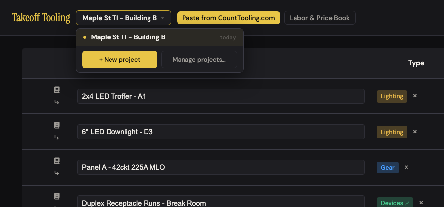
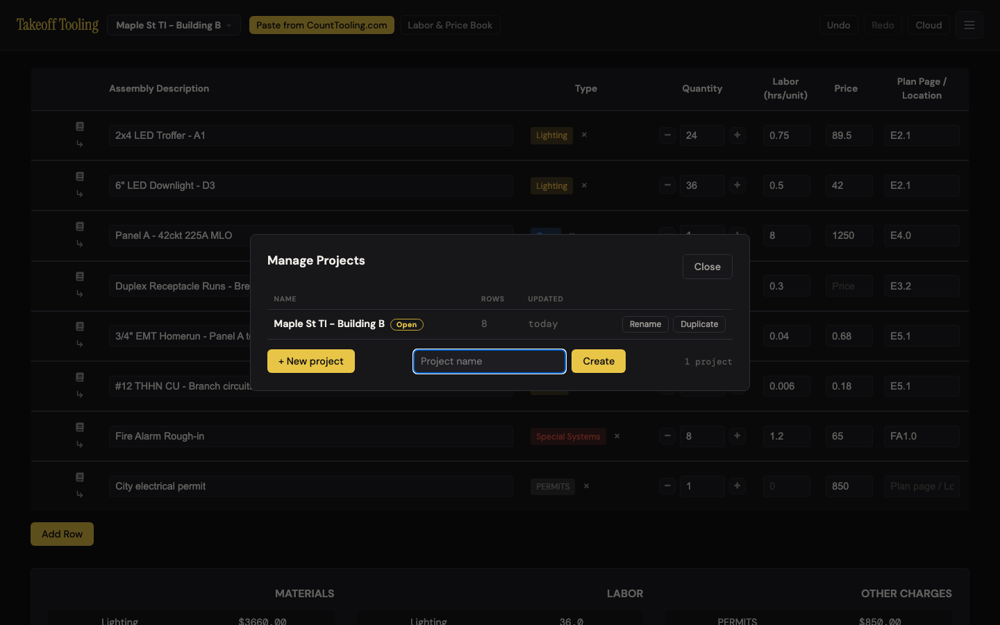
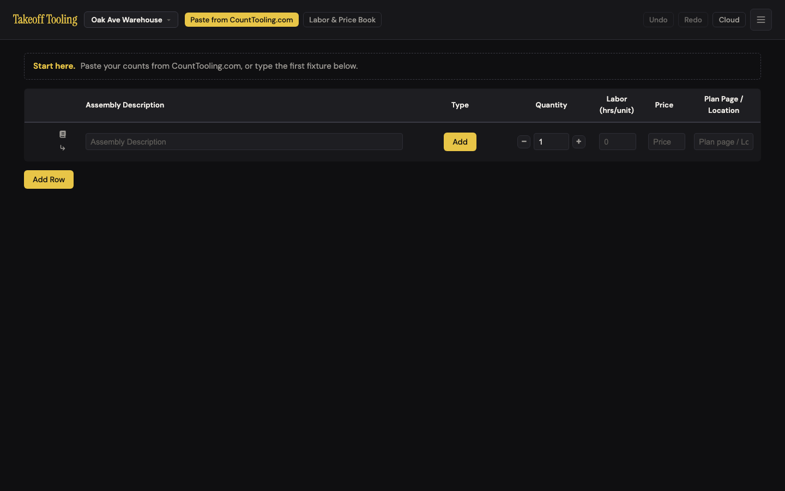
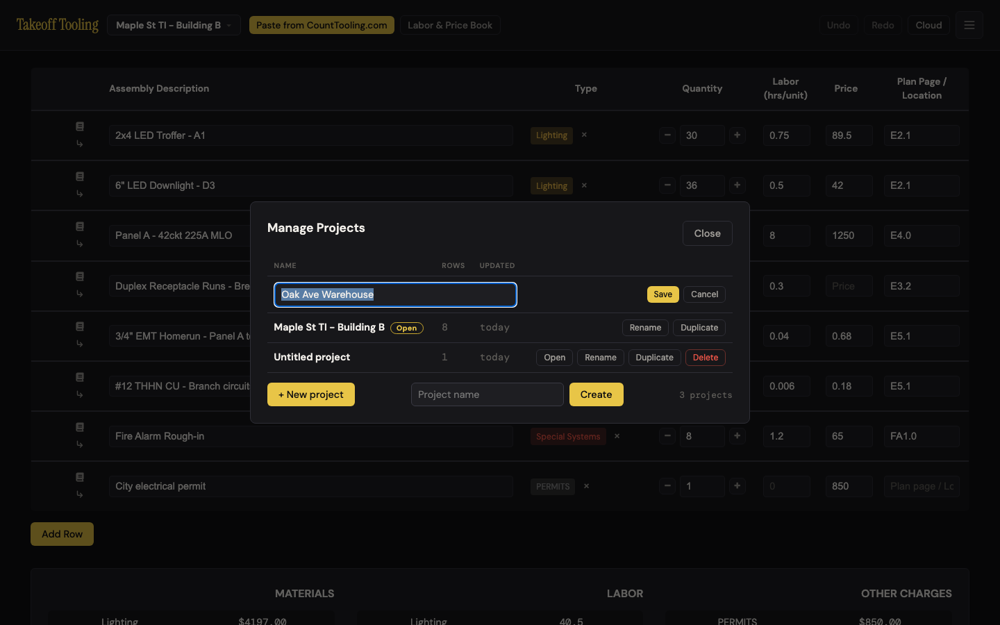
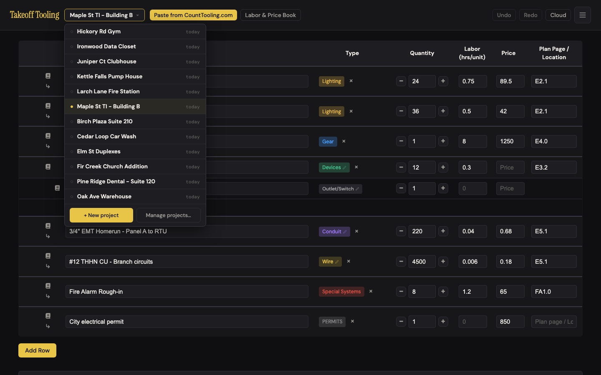
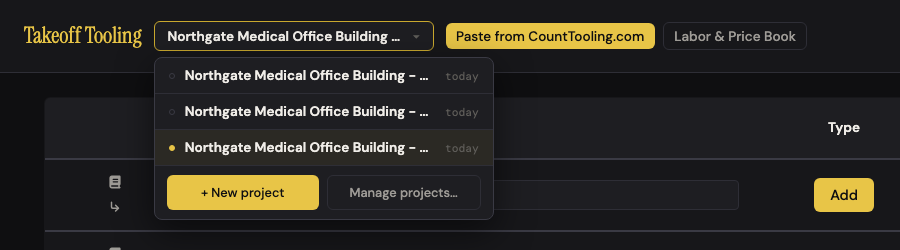
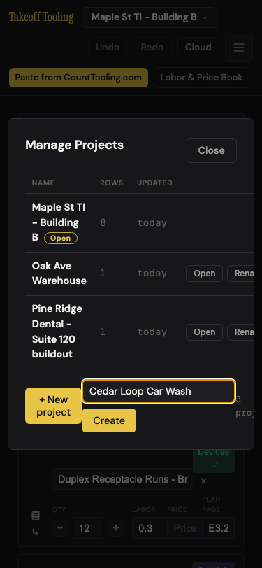

# J10 — Many bids at once

Personas: E · Status: ● walked 2026-09-06 (headless Chromium, :4188, signed out)

> Trigger — it is Tuesday and three bids are due this week. The estimator needs a second
> bid without losing the first, flips between them as GCs call, renames one when the job
> gets its real name, duplicates last month's near-identical job as a starting point, kills
> a bid that went dead, and opens a link a colleague sent from their own copy of the app.

## Entry points

- **Header switcher** — `#project-switch-btn` "<open project name> ▾" → `#project-menu`: one row per project (● on the open one, "today / yesterday / Nd ago"), **+ New project**, **Manage projects…** (projects.js:46-67). Click; `Esc` / click-outside close it.
- **+ New project** (menu footer) — opens Manage Projects with the inline name field focused (projects.js:212-214 → `openModal({create:true})`). Click.
- **Header ☰ → New Project** — `#new-takeoff-btn`, tooltip "Start a new project (the open one is kept)" → the same modal + field (app.js:360-362). Click. Two doors, one room.
- **Manage projects…** — `#projects-modal`: table Name · Rows · Updated · actions (Open / Rename / Duplicate / Delete), footer **+ New project** toggle + inline field + "N projects" (projects.js:129-175, index.html:172-186). Click.
- **Shared link** — `#d=<base64 {v:2, name, manifest}>` at boot or on `hashchange` → `createProject("<name> (shared <Mon D>)")` + `loadManifestFromExport` (app.js:438-451). Paste a URL; automatic.
- **Boot** — the index's `currentId` (or the first entry) is reopened (state.js:207-217). Automatic.
- *Not an entry point but on the path:* the manifest's `#labor-rate-input` — the rate is stored **per project** (storage.js:12).

## Current route (walked 2026-09-06)

Happy path for the week's five verbs plus the incoming link: **create 3 clicks + typing, switch 2 clicks,
rename 4 clicks + typing, duplicate 5 clicks, delete 5 clicks (6 if it is the open bid), shared link 0 clicks
— 24 clicks, 5 decisions** (name now or later · new vs duplicate · which of two identical "(shared)" twins ·
open another bid before you can delete this one · leave the flow editor first). Desktop 1440×900, seed:
"Maple St TI - Building B", 8 typed rows (Lighting ×2, Gear, Devices, Conduit, Wire, Special Systems, Permits),
labor rate $85.

1. Click the project name → menu "● Maple St TI - Building B · today", **+ New project**, **Manage projects…**. 
2. **+ New project** → Manage Projects opens over the table, name field focused, placeholder "Project name", row "Maple St TI - Building B **Open** · 8 · today · Rename Duplicate", "1 project". 
3. Type "Oak Ave Warehouse", Enter → header and tab title switch to "Oak Ave Warehouse — Takeoff Tooling" at once; a second `takeoff-project-<id>` key and an index entry appear; the modal **stays open** with the typed name still in the field and "2 projects". Esc ×2 → nothing (F2). Click **Close**.
4. The new bid: one blank row (qty 1), the dashed **Start here** hint, summary hidden, Undo disabled (N-7/N-9 hold). Labor rate **85** — inherited from Maple, not a default (F3). 
5. ☰ → **New Project** opens the same modal + field. Enter on an empty field → a third project **"Untitled project"** (state.js:287), no complaint. Manage… then Esc with nothing focused → closes. Deleted the stray later.
6. Switcher: "○ Oak Ave Warehouse · today / ● Untitled project · today / ○ Maple St TI - Building B · today". Esc closes; click-outside closes. Click Maple → 8 rows, rate 85, `canUndo` **false** (history cleared, state.js:272), header/title updated, `index.currentId` follows. Edit troffer qty 24 → 30; switch to Oak (blank row, rate 85, hint back); menu now lists Maple first (last edited); back to Maple → qty **30**, 8 rows, rate 85, undo empty. Exact restore, every time.
7. **Manage projects…** with three bids. **Rename** Oak → the name cell becomes an input with the text selected, Save / Cancel beside it. Type "Oak Ave Warehouse - Phase 2", Enter → saved, and the row **jumps to the top** (F5). Rename again, type junk, Esc → unchanged (modal stays open). Rename, clear, Enter → silently unchanged. Rename the **open** bid → header, tab title and stored name all update. 
8. **Duplicate** the open bid → "Maple St TI - Bldg B (copy)" at the top, 8 rows, rate 85, manifest JSON byte-identical; you stay on the original. **Open** the copy (modal stays open; Close), set troffer qty 99 → original still 30; switch back → original 30, copy 99. Independent.
9. Open bid's row has **no Delete** and no hint why. **Delete** Oak → native `confirm` **"Delete "Oak Ave Warehouse - Phase 2"? This can't be undone."** Cancel → 4 projects, 4 keys, nothing changed. OK → 3 projects, its `takeoff-project-…` key gone, "3 projects".
10. Reload → "Maple St TI - Bldg B", 8 rows, rate 85; keys `takeoff-book`, two `takeoff-project-…`, `takeoff-projects-index`.
11. **Shared link** built from Maple's manifest (2,535 chars); set my own rate to 60 first, then `location.hash = '#d=…'` → new project **"Maple St TI - Bldg B (shared Sep 6)"** opens with 8 rows, rate **60** (mine, not the sender's 85 — F3), hash stripped, undo empty. Paste the same link again → a **second identical "…(shared Sep 6)"**; both appear in the menu and modal, indistinguishable (F15). Renamed one "Maple St TI - from Dave" — fine.
12. Edge — switch while inside the Devices editor for "Duplex Receptacle Runs" with an unsaved row typed: no question asked; header says "Oak Ave Warehouse", **`#main-content` is empty** (0 buttons, 0 chars). Same via Manage → Open. Wordmark asks "Discard unsaved changes in this editor?"; reload lands on Oak's manifest; switching back to Maple re-shows the editor with the typed row still there and Save writes it to Maple (correct bid). (F1) 
13. Edge — 12 projects: the menu is 487 px tall, no scroll, ● Maple sixth (F5). At 24 the footer sits at y 922 in a 900 px window; the page (header not sticky) scrolls to it. Manage modal scrolls inside (810 px cap); its footer "+ New project / 24 projects" below the fold. 
14. Edge — 63-char name "Northgate Medical Office Building - Phase 2 TI - Suites 300-340": header shows "Northgate Medical Office Building - …" (237 of 420 px), tooltip is just "Switch project"; the menu clips at 250 px with no tooltip, so the original, its "(copy)" and its "(shared Sep 6)" read as **three identical lines** (F7). The modal wraps the name (83 px row) — fine. 
15. Edge — Rows column: a fresh bid shows **1** (the blank starter row), an imported empty manifest **0**, Maple with 3 child components under Duplex shows **8** (top-level only, projects.js:137); opened 30 ms after Add Row it still said 8 (in memory 9) — it reads the 400 ms-debounced store (F6).
16. Mobile 375×812 (touch): header 137 px; opening the switcher makes the **page 455 px wide** (menu anchored at x 117, `max-width: 90vw`); Manage Projects table is 513 px in a 351 px modal — Open is visible, **Rename is cut in half, Duplicate and Delete are off-screen** (x 266–539) behind an unhinted sideways scroll; "3 projects" clipped to "3 proj"; the create row wraps (Create under the field) but works — "Cedar Loop Car Wash" created, header updated (F9). 

Divergences from the documented route (README / CLAUDE.md / ARCHITECTURE.md):

- README has **no Projects section** (the JOURNEY-MAP coverage table lists "Projects (switcher, Manage Projects)" as a README feature — it is not; README mentions projects only in the cloud/test-account notes).
- `_surfaces.md` "Inline name fields: `Esc` dismisses" and "`#projects-modal` closes via Close / Esc / click-out": Esc from the create field neither dismisses the row (it never hid) nor closes the modal (F2; same as J1 F2).
- CLAUDE.md "Share links … import into a NEW project" — confirmed, with the "(shared Sep 6)" suffix (N-3 holds). Nothing documents that the new project takes the *recipient's open* labor rate.
- ARCHITECTURE.md:133-134 documents the two keys correctly; nothing documents the "Rows" semantics or that `updatedAt` (hence menu order) moves on rename and on *leaving* a project.

## Naive attempt

I had Maple open and a second set of drawings on the desk, so I clicked the job name at the top — that is where the name lives, so that is where a new one should start. A little list dropped down with my job in it and a gold **+ New project**. Good. A "Manage Projects" box appeared with a cursor blinking in a field, I typed "Oak Ave Warehouse" and hit Enter. The top bar changed to Oak Ave — but the box stayed, my typed name was still sitting in it, and a "2 projects" count made me wonder if I had made it twice. I hit Esc twice; nothing. I found Close. Behind it was an empty sheet with one blank row and the "Start here" line, which was exactly what I wanted. I did not notice the labor rate box already said 85 — I had set that on Maple — and would not have known to check.

Flipping between the two was easy: click the name, click the other job. Everything came back exactly, down to the quantity I had just changed, and Undo was greyed, which I took to mean "this is saved". When the GC gave the Oak job its real name I clicked the name in the header again expecting to type over it — no. The menu had no Rename. **Manage projects…** did, and after Enter the renamed job leapt to the top of the list, which made me look for it twice. Duplicate was obvious and did what it says; I was surprised to still be on the original afterwards, and the copy said "(copy)", which I liked. Delete was missing on the job I was in, with no explanation; I guessed I had to be somewhere else first, and I was right. The delete question was a browser pop-up.

Dave sent me a link. I pasted it and a new job called "Maple St TI - Bldg B (shared Sep 6)" opened — his rows, my labor rate (I did not notice that either). I pasted it a second time by accident and now had two of them with the same name. The one thing that stopped me: I was halfway through adding boxes to the Duplex row when the phone rang about Oak; I switched jobs from the header and got a completely black page — header only, nothing underneath, no Save, no Cancel. I clicked the logo, it asked whether to discard my edits, and I said yes because I did not know what else to do.

## Evidence

- **Telemetry visibility:** none exists in Takeoff Tooling. A rework on this route should ship `project_created` (source: switcher / menu / share-link / duplicate), `project_switched` (from view: manifest / device / conduit / wire, flowDirty), `project_renamed`, `project_deleted` (rows), `share_link_opened` (duplicate-of-existing: bool), and `labor_rate_set` (project, inherited-from).
- **Doc coverage:** README — none. CLAUDE.md "Persistence is local-first localStorage, organized as projects", "Share links (`v:2` envelope, now with `name`) import into a NEW project". ARCHITECTURE.md:133-134 (keys, "device-local, never synced (cloud rebuilds the list from `takeoff_projects` rows)"). `_baseline.md` C-6 (inline name field, holds), N-3 (suffix, holds), N-5 (inline rename, holds), N-9 (blank row on create, holds).
- **Specs:** `smoke.spec.js:27-29` reads `takeoff-projects-index` → current project to verify persistence; `cloud-sync.spec.js:106-161` drives `createProject` / `setProjectName` / `switchProject` / `deleteProject` **through the API** against the live cloud (needs the non-admin account; not run here). No spec touches the switcher, Manage Projects, Rename/Duplicate/Delete UI, the create row, `#d=` naming, or switching from inside a flow. No unit test covers state.js:242-327.
- **Modals:** `#projects-modal` (Manage Projects); `#form-modal` (Print with Form — observed for F12). Two native dialogs: `confirm()` on Delete (projects.js:282), `confirm()` "Discard unsaved changes in this editor?" (app.js:108). Two of eleven.
- **Hotkeys:** `Enter` confirms / `Esc` hides the create field (projects.js:239-245) and the rename field (289-301); `Esc` closes the menu, then the modal (303-313) — except when focus is in the create field. No hotkey opens the switcher.
- **Storage / state touched:** `takeoff-projects-index` on every save, switch, create, duplicate, rename, delete; `takeoff-project-<id>` written immediately by `createProject` (state.js:292) and `duplicateProject` (310), by `applyRename` for a non-open project (projects.js:189), debounced 400 ms otherwise, removed by `deleteProject` (storage.js:83-94); `takeoff-book` (bootstrap only). Undo frames: none pushed by any project verb; the stack is **cleared** on switch and create (state.js:260-264, 272, 291). Cloud: `TakeoffStorage.saveProject` → `TakeoffCloud.onProjectSaved` and `deleteProject` → `onProjectDeleted` (storage.js:69-94) would fire on every create / duplicate / rename / delete when signed in — not exercised (signed out, SDK aborted).

## Friction findings

| # | Severity | What happens | Why it hurts | Verdict stamp (Phase 2b) |
|---|---|---|---|---|
| F1 | **blocker** | Switching projects from inside a flow editor (switcher item or Manage → Open) calls `switchProject` then `TakeoffApp.render()` with the view still `device`/`conduit`/`wire` and the *old* project's item id (projects.js:69-74); `TakeoffDeviceView.render` returns `''` for an unknown item (device.js:61-62) → **`#main-content` is empty: 0 buttons, 0 text** (screenshot 05). No "Discard unsaved changes?" is asked although `flowDirty` is true; the dirty buffer survives. Exits: wordmark (asks, then discards), reload (lands on the new bid's manifest), or switching back (editor reappears with the typed row; Save wrote it to the correct bid — no cross-project write observed). Also reproduced via Manage → Open. | A phone call about bid B mid-edit on bid A ends on a black page with no control on it. Every estimator with two live bids will hit it; the recovery they will find (logo → "Discard?") throws away the edit. | **CONFIRMED (blocker), independently re-driven twice.** Device, conduit and wire × dirty true/false × switcher and Manage → Open: 0 dialogs, `#main-content` `innerHTML.length` **0** every time (view stays `device`/`conduit`/`wire`, `currentItemId` still the old bid's); wordmark-dismiss leaves the blank page, wordmark-accept discards the edit ("lost edit" nowhere in storage); Esc and Undo/Redo do nothing from there. Two corrections to the walker: (a) the "no cross-project write" half is wrong for twins — **NEW F1b**, a "(copy)" or "(shared …)" bid shares item ids, so the editor re-renders on the twin and Save writes the row *there*; (b) the dead end is not switch-only — **NEW F1c**, creating a bid from the blank screen (☰ New Project / + New project) also lands blank, because `createProject` leaves the view untouched too. |
| F2 | **stumble** | The create row never hides (`.projects-new-row {display:flex}`, styles.css:3667-3673, beats `[hidden]`; projects.js:89-92) so after Enter the modal stays open with the name still in the field; `Esc` from the field only calls `hideCreateRow` and stops propagation (239-245) → two Esc presses close nothing; Enter again = **duplicate project**; Enter on an empty field = silent **"Untitled project"** (state.js:287); the footer "+ New project" toggle does nothing visible. Same root cause as J1 F2; this journey owns the surface. | Creating a bid — the first verb of the week — costs an extra Close click and leaves junk projects ("Untitled project" ×1 in this walk, ×3 in J1's). | **CONFIRMED (stumble), re-driven twice.** After Enter: `hidden=true` yet computed `display:flex`, 34.4 px tall, the typed name still in the field, modal open, "2 projects"; Esc ×2 from the field closes nothing (projects.js:241-244 `stopPropagation`) while Esc with focus outside the field does close it; Enter again made a second identically-named bid, empty Enter made "Untitled project". One root cause with J1 F2 — dedupe in synthesis. |
| F3 | **stumble** | A new bid's labor rate is whatever bid was **open at the moment** (`createProject` never touches `laborRate`, state.js:284-294): Oak created from Maple($85) → 85; Pine created from Oak($60) → **60**. The share envelope carries no `laborRate` (app.js:314-320), so a colleague's bid opens at the recipient's current rate: on the 8-row seed (93.0 hrs) the sender sees Labor **$7,905.00** at $85, the recipient **$5,580.00** at $60 — a $2,325 difference that looks right on both screens. | The rate box is not visible when the bid opens (summary hidden until a row is described; the shared bid shows it, but nobody re-reads a number they did not type). Wrong labor dollars on a new or shared bid. Cross-ref J9 (envelope) and J8 (rate). | **CONFIRMED (stumble), narrowed to the share-link half.** Inheriting the open bid's rate on create (re-driven 92→92, then 47→47) is a **reasonable default**, stated as intent in code (state.js:281-283 "the labor rate carries over as the default") — a shop rate is usually shop-wide — so that half is a papercut at most; the fault is that it is silent and invisible (`#manifest-below` is `display:none` on a fresh bid, so the rate box is off screen). The share-link half is a real wrong number: the envelope has no `laborRate` (keys `v, app, exportedAt, name, manifest`), so on 65.7 hrs the sender at $92 sees **$6,044.40** and the recipient at $47 sees **$3,087.90**; a recipient who never set a rate sees **Labor Total $0.00**. |
| F5 | papercut | The list re-sorts under you: `getProjects` sorts by `updatedAt` (state.js:245); renaming a non-open bid stamps `savedAt` → it **jumps to the top** (projects.js:188-194); duplicating puts the copy on top; switching away flushes the bid you *left* (`persistAllNow` → `touchIndexEntry`), so the **open bid is not pinned** — ● Maple was sixth of twelve (screenshot 06). | Two looks to find the bid you just touched; the open bid is the one you most need to find. | **CONFIRMED (papercut).** Renaming a non-open bid moved it to row 1 of the modal in both re-drives; with 24 bids the open one sat at index 19 (first run) and 13 (second) of 24 in the menu — never pinned. |
| F6 | papercut | **Rows** counts top-level entries of the *stored* manifest (projects.js:136-137): fresh bid **1** (the blank row), empty import **0**, 8 rows + 3 components **8**; opened <400 ms after an edit it lags (8 shown, 9 in memory). No tooltip on the column. | "1" for an empty bid and "8" for an 11-line bid both mislead when choosing which to reuse or delete. | **CONFIRMED (papercut).** Opened <30 ms after Add Row the column read 6 while memory held 7 (second re-drive: 5 vs 6); 500-600 ms later it caught up. A fresh bid reads 1. The <400 ms race is rare; the "1 for an empty bid" half is the daily one. |
| F7 | **stumble** | Names clip at ~35 chars in the header (237 of 420 px; `max-width: 280px`, styles.css:3719) and at 250 px in the menu, with **no full-name tooltip** (button `title="Switch project"`, index.html:17; menu items have none, projects.js:54-58). The suffixes that distinguish bids — "(copy)", "(shared Sep 6)", "- Phase 2" — are exactly what gets cut: three Northgate variants render as three identical lines (screenshot 07). | Opening the wrong bid and editing it is the classic multi-bid error; the copy you meant as a template gets the changes. | **CONFIRMED (stumble).** Header name 237 px visible of 519-536 px (button `max-width: 280px`), button `title="Switch project"` and the name span has **no** `title`; menu names clip at 250 px, also with no `title`. Three Northgate variants (63/70/78 chars) all render as "Northgate Medical Office Building …" — identical; same result for three Westbrook variants in the first re-drive. |
| F8 | papercut | The menu has no `max-height`/scroll (styles.css:3738-3750, `overflow: hidden`): 12 bids = 487 px, 24 bids push **+ New project / Manage** to y 922 in a 900 px window — reachable only because the header is not sticky and the page scrolls. The Manage modal scrolls inside its 810 px cap with its footer (+ New project, count) below the fold. No archive/close state for dead bids, so the list only grows. | A season of bids makes the two most-used buttons the farthest away. | **CONFIRMED (papercut).** At 24 bids the menu is 919 px (`max-height: none`, `overflow: hidden`), footer top at y 922 in a 900 px window, header `position: static`, page 1,503 px tall; the Manage footer sits at y 1,190 inside an 810 px-capped modal. An edge (24 bids), so papercut holds. |
| F9 | **stumble** | 375 px: opening the switcher widens the layout to **455 px** (menu at x 117 + `max-width: 90vw` = 337 px; the page reflows, then snaps back on close). Manage Projects: the table is 513 px inside a 351 px modal; Open is visible, **Rename half cut, Duplicate and Delete off-screen** (x 266–539) behind an unhinted `overflow-x: auto`; "3 projects" reads "3 proj". The create row wraps to 76 px but works (screenshot 08). A-6/A-7/C-11 hold for the manifest — this is a new surface. | On a phone in the truck you can open a bid but cannot rename, copy or delete one without discovering a sideways scroll. | **CONFIRMED (stumble).** 375 px, re-driven twice: opening the switcher makes `documentElement.scrollWidth` **455** (menu x 117–455, 338 px wide) and closing it snaps back to 375; in Manage Projects the table is 528 px in a 351 px modal — Open ends at x 335, then **Rename, Duplicate and Delete all start past the 375 px edge** (Rename 341–409 in the first run, 406–473 in the second: how much of Rename survives depends on the name column, none of the three is usable); the sideways scroller is the whole `.modal-content` (`overflow-x: auto`), not the table; "3 projects" overflows the modal edge (x 399 vs 364). Create row wraps to 76 px and works. |
| F10 | papercut | Delete is a native `confirm()` ("Delete "X"? This can't be undone.", projects.js:282) after N-5 retired the `prompt()`s; it does not say how many rows die. The open bid has no Delete button and nothing says why (projects.js:158 — omitted, no tooltip); you must Open another bid first. Dismiss keeps all 4 keys; accept removes the key + index entry and updates the count — correct. | The browser dialog breaks the app's look; the missing button reads as a bug until you guess the rule. | **CONFIRMED (papercut).** Open row renders only Rename · Duplicate, neither carrying a `title`; `confirm("Delete \"…\"? This can't be undone.")` names the bid but not its row count; dismiss left the project keys unchanged (8 → 8), accept removed exactly one (24 → 23) and the count text followed. |
| F11 | papercut | Language is uniformly "project" (8 strings; no "bid"/"job"), consistent with Count Tooling — but casing drifts: "Manage Projects" (title) vs "Manage projects…" (menu) vs "New Project" (☰) vs "+ New project" (menu). "Rows" and "Updated" are software words. | Small, but the two New buttons with different casing read as two features. | **CONFIRMED (papercut).** Strings read back as "Manage Projects" (h2) / "Manage projects…" / "New Project" (☰) / "+ New project" ×2. Title-case heading vs sentence-case menu item is conventional; only the two New buttons genuinely differ. |
| F12 | **stumble** | A project is `{id, name, manifest, laborRate}` (storage.js:12) — **no bid metadata**. Print with Form's Address / Permit NO / Builder or Occupant / Electrical Count live only in the `#form-details` DOM (index.html:269-274), read at print time (app.js:407-415 → pdf.js:161-167), never stored: reopening on the same bid shows them (DOM), **switching to another bid shows the same values** (global DOM), reload wipes them (`""`); no localStorage key contains them. | Re-type the job address every print; print Maple's address on Pine's form if you don't look. No client, GC, due date or bid number anywhere. | **CONFIRMED (stumble), re-driven twice.** Filled Address / Permit / Builder on bid A, cancelled, switched to bid B, reopened: all three pre-filled with A's values; no localStorage value contains them (searched every key); reload → "". Mechanism is app.js:407-415 reading `#form-details` at print time — the fields live in `index.html:269-274` and belong to the page, not the bid. |
| F15 | papercut | Pasting the same share link twice yields two projects with byte-identical names "Maple St TI - Bldg B (shared Sep 6)" (app.js:446-448 suffixes by date only). N-3 fixed the same-name-as-own case, not the same-link-twice case. Rename fixes it. | Two identical entries; the estimator opens one at random. | **CONFIRMED (papercut).** Same link twice → two "Harbor View Clinic (shared Sep 6)" entries, indistinguishable in menu and modal. |

Numbers matter: every manifest, child list and per-project rate round-tripped exactly through switch, duplicate, delete and reload; the only wrong-looking figure on this route is F3's inherited/recipient labor rate.

## Proposals

**P1 — rework (small) · Leave the editor before you leave the bid.** `switchTo`, `createFromRow`, the ☰ New Project path and the duplicate→Open path call `TakeoffApp.navigateToManifest()` first (it already asks "Discard unsaved changes in this editor?" when dirty, app.js:106-117) and abort the switch if the user keeps their edits; defensively, `TakeoffApp.render` falls back to the manifest when a flow's item is missing (app.js:15-24). Fixes F1. (1) Removes the blank-screen dead end and the logo-then-discard recovery (2 clicks and a lost edit). (2) "Discard unsaved changes" is already the app's wording. (3) Removes an unreachable state; no new surface. (4) The question appears exactly where the estimator clicked. `spiritPass: true` — **verifier**: holds, and the scope must widen: `createProject` leaves the view alone too (NEW F1c), and the `render` fallback is not merely defensive — without it a twin bid *silently succeeds*, writing the row into the wrong bid (NEW F1b). Land the `render` fallback (app.js:15-24) even if the confirm half slips.

**P2 — polish · `hidden` hides, and Create finishes.** `.projects-new-row[hidden] {display:none}` (the A-5 pattern); after Create clear the field and **close the modal**; Esc from the field closes the modal. Shared with J1 P2. Fixes F2. (1) Create drops from 3 clicks to 2; the duplicate/Untitled failure disappears. (2) unchanged. (3) Removes a broken toggle and a `stopPropagation` special case. (4) The box goes away when the name is confirmed. `spiritPass: true` — verifier: holds; the `[hidden]` half is a one-line CSS fix and is the same defect class as baseline A-5.

**P3 — polish · The rate is a shop setting with a per-bid override.** Keep `defaultLaborRate` in the account-level BOOK document, set whenever the estimator types a rate; new bids start from it, not from whatever was open. Carry `laborRate` in the share envelope and use it for the "(shared …)" project (the recipient can change it). Fixes F3. (1) Removes a silent decision on every new and shared bid. (2) "Labor rate", "shop rate". (3) Makes re-entering the rate unnecessary; one field in the envelope, no new control. (4) Nothing to find — the number is right when the bid opens. `spiritPass: true` — caveat: J9 owns the envelope; land as one change. Verifier: the create half is a *reasonable* default, so the shop-rate change is optional polish there; the envelope half is the correctness fix and should not wait for it.

**P4 — polish · Pin the open bid; sort the rest by last edit.** Open bid first (marked), others by `updatedAt`; rename does not stamp `updatedAt` (a name is not an edit) — or split `updatedAt` from `renamedAt`. Fixes F5. (1) Removes the second look. (2) "Last edited". (3) Nothing added. (4) The bid you are in is always on top. `spiritPass: true` — verifier: holds; note the same stamp fires on *leaving* a bid (`persistAllNow` → `touchIndexEntry`), so pinning the open bid is the half that actually removes the second look.

**P5 — polish · Names you can tell apart.** `title` = full name on the header button and each menu row; ellipsize in the middle so the suffix survives ("Northgate Medical … Suites 300-340"); render "(copy)" and "(shared Sep 6)" as small chips after the name; when a `#d=` link lands on an existing identical name, append " 2". Fixes F7, F15. (1) Removes wrong-bid opens. (2) "copy", "shared by link". (3) Nothing added; the suffix text becomes a chip. (4) Hover shows the whole name. `spiritPass: true` — verifier: holds; hover is desktop-only, so the middle-ellipsis half is the one that carries the phone (F9), and the " 2" suffix should apply to Duplicate as well, which also produces byte-identical "(copy)" names on a second run.

**P6 — polish · The menu scrolls; the buttons don't move.** `max-height: min(60vh, 480px); overflow-y: auto` on the item list with the footer outside the scroll; sticky footer in the Manage modal. Fixes F8. (1) + New project is always one click. (2) n/a. (3) Nothing added. (4) n/a. `spiritPass: true` — verifier: holds (measured 919 px of menu against a 900 px window at 24 bids, `max-height: none`); the archive idea in F8 is a separate proposal, not part of this one.

**P7 — polish · Phone layout for the switcher and Manage Projects.** Under 640 px: menu `position: fixed; left: 8px; right: 8px`; Manage table as cards (name · "8 rows · today" · actions row), the same treatment the manifest already has. Fixes F9. (1) Removes the sideways-scroll discovery. (2) unchanged. (3) Reuses the card pattern; removes a horizontal overflow. (4) The buttons are on screen. `spiritPass: true` — verifier: holds; the `position: fixed` half also removes the 455 px page-widening, which is a separate symptom of the same `max-width: 90vw` anchoring.

**P8 — polish · Delete in place, with the facts.** Inline confirm in the row ("Delete 8 rows? Delete / Keep", the inline-field pattern from N-5) instead of `confirm()`; the open bid shows a disabled Delete with "Open another bid first". Fixes F10. (1) One fewer context switch; removes the guess. (2) "rows", "bid". (3) Removes the last native dialog on this route. (4) The reason is on the button. `spiritPass: true` — verifier: holds; "Delete 8 rows?" must use the same top-level count as the Rows column, so it inherits F6's under-count until that is fixed.

**P9 — gap · Bid details belong to the bid.** Add `details: {client, address, permitNo, builderOrOccupant, dueDate}` to the project document (storage.js:12, mirrored in the cloud row's `data`); edit them from the header name (click → "Bid details" sheet with Rename inside); Print with Form prefills from them and prints directly, retiring the "Fill Form Details" modal. Fixes F12 (and J1 F5's "click the name to rename" reflex). (1) Removes the 4-field modal before every form print and the re-typing. (2) "Job address", "GC / owner", "bid due", "permit #". (3) Removes one modal (`#form-modal`) and makes the Manage Rename verb secondary. (4) Clicking the job name is what the naive attempt did. `spiritPass: true` — caveat: a storage-shape change; coordinate with J9 (form PDF) and J11 (cloud `data` column). Verifier: this is the largest surface add on the route (a sheet plus five fields), so it passes test 3 only because `#form-modal` actually retires — if the sheet ships and the modal stays, it fails. The details must also stay optional: nothing here may become a step before typing the first fixture.

**P10 — polish · One casing, one noun.** "Manage projects…" / "New project" everywhere; keep "project" for parity with Count Tooling (the same estimator uses both) and put "bid" in the guide; column "Rows" → "Lines", "Updated" → "Last edited". Fixes F11, half of F6. (1) Removes a "two features?" hesitation. (2) "lines", "last edited". (3) Nothing added. (4) Self-labeling. `spiritPass: true` — caveat, and the one claim the verifier trims: renaming the column "Rows" → "Lines" does **not** fix half of F6. Both words describe the same number, which still counts top-level entries only (an 8-row bid with 3 components reads 8, a blank bid reads 1). F6 needs the count changed, not the header; P10 is a pure language pass.

**P11 — keep · Verified strengths.** Switch restores rows, children and per-bid rate exactly and clears undo (no cross-bid undo — correct); duplicate is a deep copy and independent at once; delete removes the storage key and index entry, dismiss changes nothing; reload reopens the same bid; a shared link never touches the recipient's own bids (N-3 holds) and lands with the sender's name; recency labels; Esc and click-outside on the menu; Enter/Esc/select-all on the inline rename. Document as-is. `spiritPass: true` (vacuous — a `keep` proposes no change). Verifier: every claim re-verified, with one correction — "duplicate is a deep copy" is true of the *data* but the copy re-uses the source's item ids, which is what makes F1b possible; if P1's `render` fallback does not land, the safer fix is to re-id on duplicate and on `#d=` import (`sanitizeImportedItem`, state.js:55, currently keeps any well-formed `raw.id`).

**P12 — teach.** The guide carries: a project is one bid; the header name is the open bid; Rename, Duplicate and Delete live under Manage projects; "(copy)" is your template, "(shared <date>)" is a colleague's — rename it; you cannot delete the bid you are in; and until P1 lands, **save or cancel the editor before switching bids**; until P3, **check the labor rate on every new or shared bid**. `spiritPass: true` — a `teach` verdict is what spirit test 4 prescribes for the residue; verifier: add the F1b line while P1 is open — *if you do end up on the blank screen, do not switch to a copy of the same bid; go back to the bid you were editing.*

## Guide actions

- Article "Running several bids": create (switcher → + New project), switch, rename (Manage → Rename), duplicate as a template, delete (open another first), and what a shared link does — screenshots 01, 02, 04.
- Call-outs: check the rate box on a new/shared bid (F3); leave the Devices/Conduit/Wire editor before switching (F1); the "Rows" number counts lines, not components (F6).
- README: add a **Projects** section (switcher, Manage Projects, "(copy)" and "(shared <date>)" naming, per-project labor rate) — the coverage table already assumes it exists; correct `_surfaces.md` on Esc in the create field (F2) and add the projects-modal horizontal scroll under 640 px.

## Demo moment

Click the bid name, click **Duplicate**, open the copy, change one quantity, flip back — the original is untouched and the copy remembers, in under ten seconds (screenshots 04 → 06 show the list and switcher; step 8 in the route is the moment).

## Walk notes

- Server: the read-only static server at http://localhost:4188 (not started or stopped by the walk). Build: review branch `9975c89` plus the N-series.
- Profile: fresh Playwright contexts, signed out, `context.route(/supabase/i, abort)` in every context — so the Supabase SDK `<script>` is aborted, the header button reads "Cloud" (not "Sign In"), and each boot logs one `Failed to load resource: net::ERR_FAILED` (5 in total across 5 boots). **No app console or page errors** in any context. Cloud never touched.
- Seed: "Maple St TI - Building B", 8 typed top-level rows (see the script), rate 85; edges added Oak Ave Warehouse, Pine Ridge Dental, nine more named bids, 12 "Bid N", a 63-char name, "Zero Rows" (empty import) and "Fresh Blank"; three components under Duplex for the Rows probe.
- Artifacts reused from the cut-off walker: `scratchpad/walks/many-bids-at-once/walk.js` + `walk.log` (A0–A5: naive create, both entrances, switcher, Manage verbs with **dismiss and accept** delete runs, reload, shared link ×2) and screenshots 01–04. New: `walk2.js` + `walk2.log` (C0 rate inheritance, C0b Rows lag / re-sort, C1 mid-flow switch incl. dismiss run + reload + Manage→Open, C2 form fields, C3 12/24 projects, C4 long name, C5 Rows, C6 language, B mobile), `probe-mobile.js` (overflow attribution), `probe-header.js` (screenshot 07 retake) and screenshots 05–08. Part 1 died at C1 because `tr:has-text()` cannot see `<input value>`; part 2 selects rows by `input[data-field="description"][value*=…]`.
- Not exercised: signed-in cloud mirroring of create/rename/delete (`cloud-sync.spec.js` covers the API path with the test account); PDF output of Print with Form (J9); the labor-book "Add to fixture" path from the F1 blank screen (a stale target row from the other bid — verifier should try it).
- Walls: none.
- Verifier: re-drive **F1 first** (open the Devices editor on any row, type in a component, switch bids from the header — expect an empty `#main-content`), then **F3** (create a bid while a $60 bid is open; paste a `#d=` link while your rate differs from the sender's), **F9** at 375 px (open the switcher — `document.documentElement.scrollWidth` 455; open Manage — Delete at x > 375), **F7** (three 60-char names in the menu). F2 is J1 F2's root cause; verify once.

## Verification

**Verified 2026-09-07** (adversarial pass, headless Chromium against the read-only server at :4188, signed out,
`context.route(/supabase/i, abort)` in every context). A first verifier had already stamped all twelve friction
rows on 2026-09-06 but was cut off before writing this section; **every one of its stamps was re-driven from a
fresh profile with a different seed rather than accepted** — where my numbers differ the stamp now carries both.

**Method / seed.** Two new scripts under `scratchpad/walks/many-bids-at-once/verify/`: `redrive.js` (+ `redrive.log`,
`redrive-blank-1440.png`, `redrive-menu-375.png`, `redrive-manage-375.png`, `redrive-names.png`) and `probe2.js`
(+ `probe2.log`, `probe2-header.png`). Independent seed: **"Alpha Tower Fitout"**, 5 typed top-level rows
(lighting / devices / conduit / wire / permits, 65.7 labor hrs), rate **$92**; edges added "Bravo Ridge Clinic",
"Cedar Point Shell", an "Alpha Tower Fitout (copy)", two `#d=` twins, three 63/70/78-char Northgate names and
24 "Bid N". Desktop 1440×900 and mobile 375×812 (`isMobile`, `hasTouch`). Both a dismiss run and an accept run
of every native `confirm`. Console/pageerror listeners on every page: **no app errors**, only the expected
`net::ERR_FAILED` per boot from the aborted Supabase SDK (10 across 10 boots). Cloud never touched, no sign-in.
The first verifier's `verify.js` / `f1-twins.js` logs were read, not re-used.

**Re-drives.**

- **F1 (blocker) — confirmed, and it is worse than walked.** All twelve combinations (device × conduit × wire ×
  `flowDirty` true/false × switcher and Manage → Open) end with `#main-content` `innerHTML.length` **0**, zero
  dialogs, `getCurrentView()` still the flow and `getCurrentItemId()` still the *old* bid's row. From that page
  Esc does nothing, Undo/Redo are disabled, the Labor & Price Book opens but lists only the *new* bid's fixtures,
  and closing it leaves the page blank. Exits are unchanged: wordmark (asks, then discards), reload (new bid's
  manifest), or switching back (editor returns with the typed row intact).
- **F3 (stumble) — confirmed, halved.** Create-inheritance re-driven 92 → 92 and 47 → 47; it is a defensible
  default and is stated as intent at state.js:281-283, so the correctness weight sits entirely on the share
  envelope, whose keys are `v, app, exportedAt, name, manifest` — no `laborRate`. Same 65.7-hr bid: sender
  $6,044.40 at $92, recipient $3,087.90 at $47, $0.00 for a recipient who never set a rate. On a *new* bid the
  rate box is genuinely off screen (`#manifest-below` computes `display: none` until a row is described).
- **F12 (stumble) — confirmed.** Address / Permit NO / Builder typed on bid A, cancelled, then shown pre-filled
  on bid B; no localStorage key anywhere contains the values; reload empties them.
- **F9 (stumble) — confirmed, one measurement sharpened.** At 375 px the open switcher takes
  `documentElement.scrollWidth` to **455** and closing it snaps back to 375. In Manage Projects the table is
  528 px inside a 351 px modal; Open ends at x 335 and Rename / Duplicate / Delete all begin past the 375 px
  edge (Rename 341–409 in the first pass, 406–473 in mine — the walker's "half cut" is name-length dependent,
  the outcome is the same). The scroller is `.modal-content` (`overflow-x: auto`), unhinted.
- **F7 / F15 (stumble / papercut) — confirmed.** A 78-char open bid shows 237 px of 519 px in the header, the
  button's only `title` is "Switch project" and the name span has none; menu names clip at 250 px, also with no
  `title`, so three Northgate variants (63/70/78 chars) render as one identical line. The same `#d=` link pasted
  twice yields two byte-identical "(shared Sep 7)" bids.
- **F2 (stumble) — confirmed against projects.js.** `.projects-new-row, .inline-name-row {display:flex}`
  (styles.css:3667-3673) beats the `hidden` attribute set at projects.js:89-92: after Enter the row measures
  `hidden=true`, computed `display:flex`, 34.4 px tall, name still in the field. Esc from the field is swallowed
  by the `stopPropagation` at projects.js:241-244 (twice → nothing); Esc from anywhere else does close the modal.
  Enter again duplicates the bid; empty Enter creates "Untitled project" (state.js:287). The claim holds exactly
  as written.
- **F5 · F6 · F8 · F10 · F11 — confirmed** (rename of a non-open bid jumps to row 1; open bid at index 13 of 24
  in the menu; Rows read 5 while memory held 6 within the 400 ms debounce and caught up after 600 ms; menu 919 px
  tall against a 900 px window with `max-height: none`, footer top at y 922, header `position: static`; open row
  offers only Rename · Duplicate with no `title`; dismiss 8 → 8 keys, accept 24 → 23; the four strings drift
  exactly as reported).

**Counter-evidence hunts (things I tried to use to kill a finding).**

- *Is the F1 blank screen actually harmless because the buffer survives?* No — it survives only when you return
  to the same bid. Switching to an id-sharing twin instead lands the editor on the twin (F1b).
- *Is F1 recoverable by any in-page control?* Tried Esc, Undo/Redo, the Labor & Price Book, and ☰ New Project
  from the blank page: none of them re-render `#main-content` (☰ New Project produced F1c).
- *Is F3's create-inheritance a bug at all?* Judged **no** — it is a reasonable default with an explicit code
  rationale; the row is narrowed rather than killed, and P3's create half demoted to optional polish.
- *Does P10 really fix half of F6?* No. "Rows" → "Lines" renames the same top-level-only count; the caveat is
  now on the proposal.
- *Does the walker's F9 "Rename half cut" survive a different seed?* Not literally (mine was fully off-screen);
  the finding survives, the pixel figure is now given as a range.
- *Is the 24-bid menu overflow an artificial edge?* Yes, and the severity stays papercut for that reason.

**NEW bugs found in passing.**

- **F1b — NEW, blocker-grade (cross-bid write).** `sanitizeImportedItem` keeps any well-formed `raw.id`
  (state.js:55, `SAFE_ID_RE` accepts UUIDs) and `duplicateProject` deep-clones ids verbatim (state.js:303-309),
  so a "(copy)" or "(shared …)" bid carries the *same* item ids as its source. Switching to such a twin from
  inside a flow editor therefore does **not** blank the page — the editor re-renders on the twin's matching row
  with your unsaved component still typed in, and **Save writes it into the twin**. Measured: twin shares all 5
  ids; row "MEANT-FOR-ALPHA" typed on "Alpha Tower Fitout", switched to "Alpha Tower Fitout (copy)", Saved →
  Alpha's children `[]`, the copy's children `["MEANT-FOR-ALPHA"]`. Silent, no dialog, and the estimator's own
  header says the right-looking name. This is the reason P1's `render` fallback must land even if the confirm
  half slips.
- **F1c — NEW, part of F1.** Creating a bid while on the blank screen (☰ New Project, or the menu's
  + New project) leaves you on the blank screen: `createProject` swaps the manifest but never resets
  `currentView`/`currentItemId`, so `TakeoffApp.render()` re-enters the flow branch with a now-missing id.
  P1 already names `createFromRow` and the ☰ path — this is the evidence for why.
- **Duplicate-name twins are not share-link-only** (extends F15): duplicating one bid twice produces two
  byte-identical "X (copy)" entries, so P5's " 2" disambiguation should cover Duplicate as well as `#d=`.

**Baseline re-verified.** **C-6 ✓** New Project uses the inline name field, zero `prompt()` dialogs in either
script. **N-3 ✓** `#d=` lands in a new "(shared Sep 7)" project and the recipient's own bids are untouched.
**N-5 ✓** Rename is an inline input with Save/Cancel, Enter/Esc bound; the only native dialogs on this route are
the two `confirm()`s. **N-7 ✓** a fresh bid shows the "Start here" hint and `#manifest-below` is `display: none`.
**N-9 ✓** `createProject` seeds exactly one blank row (qty 1, no description).

**Final tally.** 12 walker findings: **12 CONFIRMED** (F1 blocker; F2, F3, F7, F9, F12 stumbles; F5, F6, F8, F10,
F11, F15 papercuts), **0 downgraded**, **0 killed** — F3 narrowed within its severity and F9's pixel figure
widened to a range. Two NEW findings added by this pass (F1b, F1c), both inside F1's blast radius, one of them a
silent wrong-bid write. Proposals: **12 of 12 spiritPass true** (P1–P10 re-tested, P11 vacuous as a `keep`, P12
consistent with spirit test 4); no proposal failed, but P10 loses its claim on half of F6, P9 passes test 3 only
if `#form-modal` actually retires, and P1's `render` fallback is promoted from "defensive" to required.
Numbers on this route still round-trip exactly through switch, duplicate, delete and reload; the only wrong
figures remain F3's share-link labor dollars.
