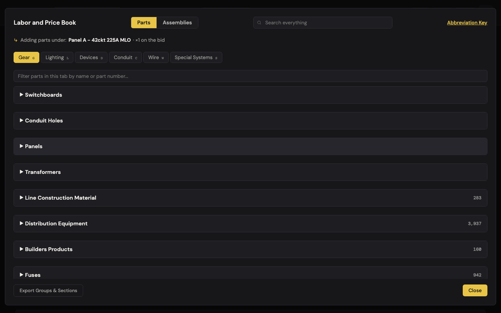
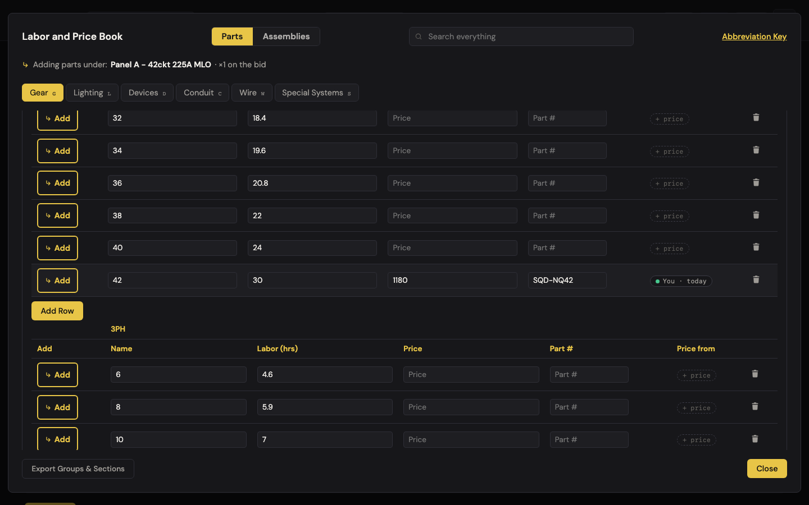
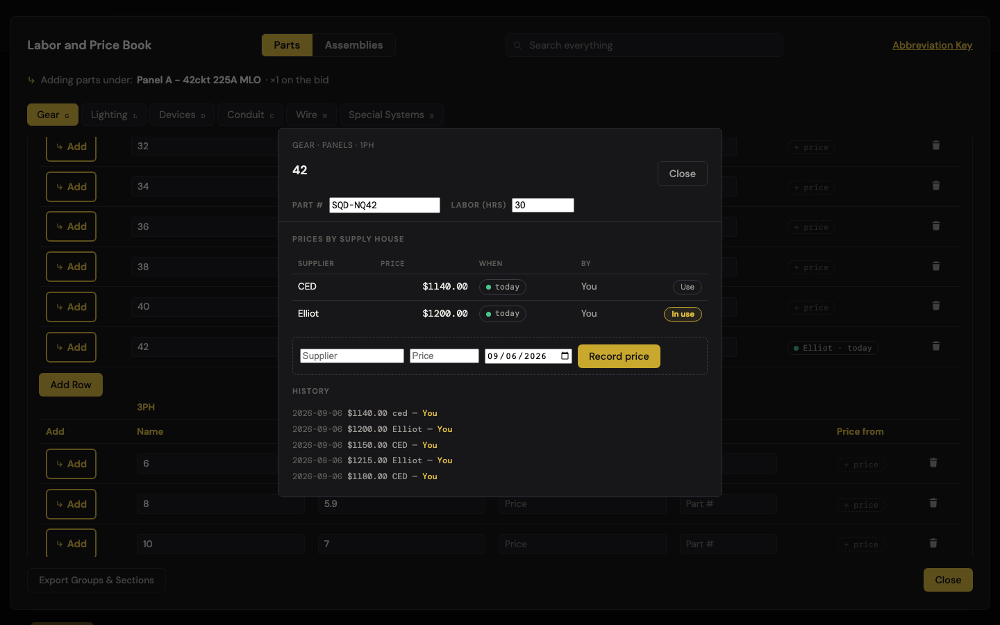
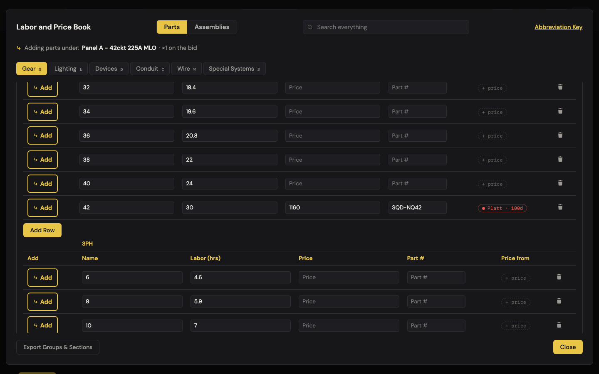
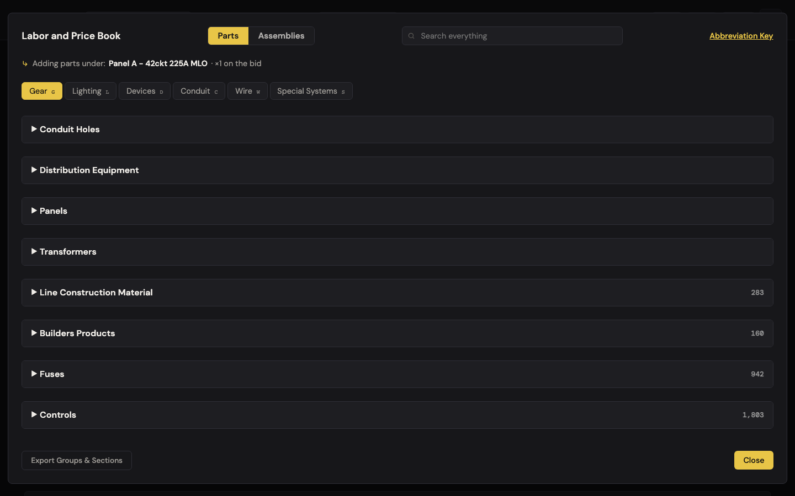
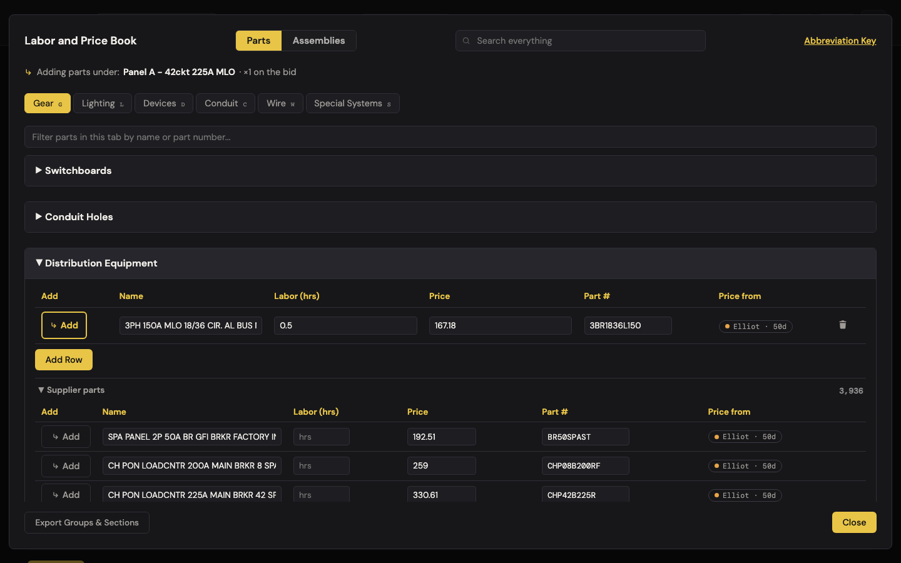
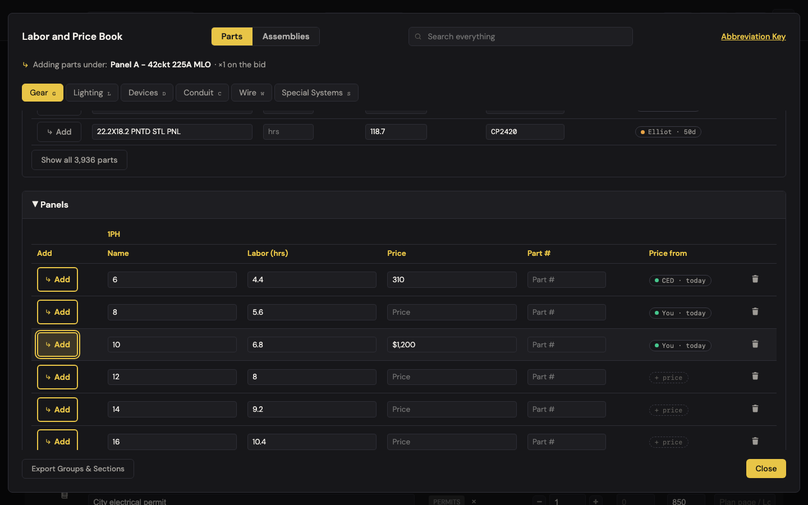
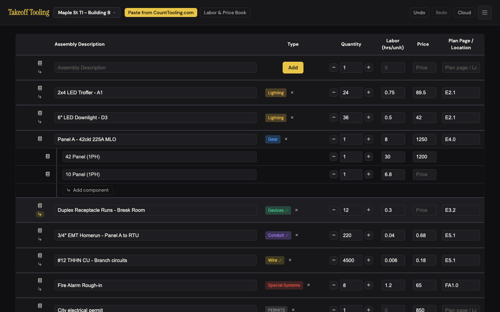

# J7 — Price and quote: record what the supply house said, pick the one you're using

Personas: E · Status: ● walked 2026-09-06 (headless Chromium 1440×900, :4188, signed out, cloud aborted, seeded 8-row bid) · **adversarially verified 2026-09-07** (12 confirmed / 1 downgraded / 0 killed — see [Verification](#verification))

> Trigger — a supply house called back with quotes. The estimator wants to write down who
> quoted what and when on each part, switch which quote is "in use", and expects the bid to
> follow — and, weeks later, to be able to say where every price came from.

## Entry points

- **Manifest row book icon** — `.labor-book-icon-btn[data-id]` → opens `#labor-book-modal` on the row's tab (Gear for Panel A) with the banner "↳ Adding parts under: Panel A – 42ckt 225A MLO · ×1 on the bid". The only entrance that also targets a fixture.
- **Header "Labor & Price Book"** — `#labor-book-open-btn` → same modal, no fixture, "Add to fixture" `<select>` instead of the banner.
- **Provenance badge / "+ price" ghost** — `.lb-prov-cell .lb-prov-badge` on every curated row → `TakeoffLaborBookCard.openForBookRow` → `#part-card-modal` (laborBook.js:449–455).
- **Catalog row badge** — the "Elliot · 50d" badge on a supplier-catalog row → `openForCatalogPart` (laborBookElliot.js:222–235); the first edit in the card promotes the part.
- **Inline Price / Labor / Part # inputs** — curated rows (`.labor-book-price` etc., laborBook.js:504–537) and catalog rows (`.elliot-part-field`, laborBookElliot.js:178–202) both accept edits in place; a catalog edit promotes.
- **↳ Add** on any book row (`.labor-book-add-btn`) and — undocumented — **a click anywhere on the row that isn't an input or button** (laborBook.js:495–500) → child on the targeted fixture with the row's current price.
- Hotkeys while the book is open: `g l d c w s` switch tabs; `Esc` closes the card first, then the book.
- No hash route, no header-menu item; the card cannot be reached from the manifest without opening the book.

## Current route (walked 2026-09-06)

Happy path (record CED's $1,180 on the 42-circuit 1PH panel, starting from the bid): **8 steps, 3 decisions** (1PH or 3PH sub-table; type inline or open the card; keep today's date).

1. Clicked Panel A's book icon. The book opened on **Gear** with the banner "Adding parts under: Panel A – 42ckt 225A MLO · ×1 on the bid" and nine collapsed headers — Switchboards, Conduit Holes, Panels, Transformers, then five supplier sections with counts (Distribution Equipment 3,937). Columns: Add · Name · Labor (hrs) · Price · Part # · **Price from**. 
2. Opened **Panels**; the 1PH sub-table lists 6…42 with labor hours and empty Price fields; every row's "Price from" cell shows a quiet dashed **+ price** (C-2 holds; title "No price yet — record a quote").
3. Typed `1180` in row 42's Price and pressed Tab. The badge flipped in place to **● You · today** (green dot). State: `{price:'1180', priceSource:'You', pricedAt:'2026-09-06', edited:true}`. Panel A on the bid stayed `$1,250 / 8 hrs / 0 children` — nothing on the bid moved. Then set labor 30 and Part # `SQD-NQ42` inline (no badge change, `edited` already true). 
4. Clicked the badge → the **part card**: trail "GEAR · PANELS · 1PH" (B-9 holds), title "42", Part # and Labor inputs, "Prices by supply house" table showing one synthetic row **You · $1180.00 · today · — · In use**, a record form (Supplier with datalist ["Elliot"], Price, date defaulting to today, "Record price"), and "History — No changes recorded yet." Card 640×405 px at (400, 247).
5. Recorded **CED $1180** (today): the table now reads `CED $1180.00 today You In use` — the "You" row is gone; row `priceSource` became CED (first quote wins). Recorded **Elliot $1215 dated 2026-08-06**: `Elliot $1215.00 31d You Use` (amber dot); CED stays In use, price stays 1180. Clicked **Use** on Elliot → price 1215, `pricedAt: 2026-08-06`. Recorded CED $1150 (not in use) → price unchanged at 1215; recorded Elliot $1200 (in use) → price moved to 1200. Recorded "ced" $1140 (lowercase) → merged into the CED offer (case-insensitive), but History keeps the typed case: "2026-09-06 $1140.00 ced — You". Form clears after each record; date resets to today. 
6. Recorded **Platt $1160 dated 100 days ago** and clicked Use → badge on the row **● Platt · 100d** in red (`lb-prov-stale`, color rgb(232,84,71), title "Price recorded 2026-05-29 from Platt"). Tiers verified: today → fresh/green; 31d → aging/amber; 100d → stale/red. Closed with the Close button — Panels still open, book still open (B-8 holds). `Esc` with the card open closed only the card. 
7. With Elliot ($1,200) back in use, clicked **↳ Add** on row 42 → child `42 Panel (1PH) ×1 $1200 30 hrs` under Panel A. Then in the card switched In use to CED ($1,140), and set labor 31 inline. The child still reads **$1200 / 30 hrs**; the book row reads **$1140 / 31 hrs**. (Snapshot, by design — see finding 4.)
8. Expanded the supplier section **Distribution Equipment** (100 of 3,937 rows + "Show all 3,937 parts"); every catalog row is a live input row with badge "Elliot · 50d" (import 2026-07-18). Typed `0.5` in the labor of "3PH 150A MLO 18/36 CIR. AL BUS NEMA 1" and tabbed out. The whole panel re-rendered: **every section collapsed**, focus dropped to `<body>`, no message. A new curated section "Distribution Equipment" appeared third in the list (collapsed) holding the promoted row with `userAdded:true, offers:[Elliot 167.18 2026-07-18 by import], history:[labor 0.5 You; $167.18 Elliot import]`; the supplier list is now nested inside it as "Supplier parts 3,936" (deduped by part #).  
9. Opened the promoted row's card: trail "GEAR · DISTRIBUTION EQUIPMENT", offer `Elliot $167.18 50d import In use`, history two lines. Recorded CED $158.82 → second offer, Elliot stays in use. After reload and re-opening the book, `refreshSupplierOffers` left it alone (offers 2, history 3, price 167.18).
10. Ghost rows: clicked **+ price** on row 6 → card "No prices recorded yet." → recorded CED $310 → row now `310` with badge "CED · today". Row 8: typed 400 then cleared it → Price empty but badge still **● You · today** (finding 6). Row 10: typed `$1,200` → stored verbatim, badge "You · today"; ↳ Add → child "10 Panel (1PH)" with a **blank** Price on the bid (finding 1). 
11. Reload: `takeoff-book` `{v:1, savedAt, laborBook, laborBookMeta:{defaultsVersion:2, removed:{}}}`; row 42 came back with 4 offers, 7 history lines, part #, labor 31, in use CED $1,140; the promoted row intact; both children intact. 

Divergences from the documented route:

- ARCHITECTURE.md:109 says "the badge popover in the view can set [priceSource/pricedAt] without touching the price". **No popover exists** — the only "popover" left is a stale comment in shared.js:70. The card replaced it, and the card cannot change a source or date without recording a price.
- README.md:72 describes badges ("who supplied it and how old it is") but never mentions quotes, "In use", the card, or promotion. ARCHITECTURE.md:185 describes promotion correctly ("its catalog row is superseded") but not that the section list collapses.
- `addLaborBookRow` (state.js:526) marks promoted parts `userAdded:true`, so a promoted catalog part is shared as a `kind:'new'` correction with `price:"167.18"` — Elliot's own price offered back as a user correction (see Evidence → corrections).

## Naive attempt

I had CED's number for the panel — $1,180 — and Panel A was already on the bid at $1,250. I clicked the little book on Panel A's row because that's where prices live. The book opened on Gear, which was right, but everything was folded shut and the banner said I was "adding parts under" the panel; I wasn't trying to add anything, I wanted to *fix a price*. I opened Panels and found "42" under 1PH. There was no "quote" button anywhere, so I typed 1180 in the Price box like a spreadsheet. A little green pill said "You · today". Fine — but it said *You*, not *CED*, and I had no idea where to say CED. I hovered the pill (tooltip: "Price recorded 2026-09-06 from You"), then clicked it on faith. That opened the card, and it was obvious from there: a supplier box, a price, a date, Record. I recorded CED. The card said CED was "In use". Then I closed everything and looked at the bid: Panel A still said $1,250. I hadn't priced Panel A at all — I'd priced a book row called "42". I went back, hit ↳ Add on "42", and now the bid had Panel A $1,250 **and** "42 Panel (1PH)" $1,180 under it — $2,430 of gear plus 30 more labor hours for one panel. I deleted the child and typed 1180 into Panel A's own Price cell by hand, which is what I should have done first, and now the bid has no record that CED quoted it.

## Evidence

- **Telemetry visibility:** none exists. A rework here should ship `quote_recorded {supplier, hasDate, fromCard|inline}`, `quote_in_use_switched`, `catalog_part_promoted {field}`, and `book_row_added_to_bid {targetHasOwnPrice}` — the last one measures finding 3 directly.
- **Doc coverage:** README.md:20, :72 (badge only); CLAUDE.md "Persistence" bullet (provenance flags, offers/history); ARCHITECTURE.md:109 (offers/history/`recordPartPrice`/`usePartOffer` — correct, but the "badge popover" sentence is stale), :185 (card + promotion — correct). Nothing user-facing explains "In use", promotion, or that bid rows are snapshots.
- **Specs:** `labor-book.spec.js` opens the book and searches — it never touches a badge, the card, `recordPartPrice`, `usePartOffer`, or `promoteCatalogPart`. `laborBookMerge.test.js:72–93` covers `computeCorrections` (the J12 hand-off shape). Steps 3–10 above have **zero** automated coverage; the price-string finding (1) and the cleared-price badge (6) would both be one-line unit tests on `updateLaborBookRow`.
- **Modals:** `#labor-book-modal` → `#part-card-modal` (stacked; card 640 px wide, `max-height: 90vh`).
- **Hotkeys:** `g` (tab), `Esc` (card, then book). None inside the card; Tab from Labor lands on the first "Use" button, then walks the table before reaching the record form.
- **Storage / state touched:** `takeoff-book` on every book edit (400 ms debounce; `persistAllNow` flushes); `takeoff-project-<id>` on ↳ Add. Undo: one frame per ↳ Add (verified `children` restore path exists); **book edits, quotes, Use, and promotion are not undoable** (baseline "still true"). Signed in, each edit would queue a cloud upsert and — if corrections sharing is on — re-upsert `takeoff_suggestions`.
- **Corrections shape after this walk** (`TakeoffState.getBookCorrections()`): 4 rows — `edit` 6 (`price '' → '310'`), `edit` 10 (`price '' → '$1,200'`), `edit` 42 (`labor 29 → 31, price '' → '1140'`), `new` "3PH 150A MLO 18/36…" (`labor 0.5, price '167.18'`). Offers, suppliers, and dates are **not** in the shape — J12 would learn "1140" but not that it was CED on 2026-09-06 — and the literal `$1,200` string would ride along.
- **Console:** no app errors. The two `net::ERR_FAILED` lines in both runs are the walk's own `route(/supabase/i).abort()` killing the supabase-js CDN script.

## Friction findings

| # | Severity | What happens | Why it hurts | Verdict stamp (Phase 2b) |
|---|---|---|---|---|
| 1 | **blocker** | Typing `$1,200` in a book Price field stores the string verbatim; badge says **You · today** and the row looks priced. ↳ Add puts it on the bid as `price:"$1,200"`, which the manifest's `<input type=number>` renders **blank**; `getTotalPrice` adds $0, purchase list flags "10 Panel (1PH) — unpriced"; `getBookCorrections` would share `"$1,200"`. (state.js:549–571 never coerces; laborBook.js:519 passes the raw string.) | The book is the place that says "this is priced, by you, today" — and the same part is $0 on the bid. Dollar signs and commas are how estimators write money. | **CONFIRMED** — `$21,450.75` on gear→Switchboards "1200a": stored verbatim, badge "You · today", child on the bid `price:"$21,450.75"` with a blank number input, materials +$0 but labor +30 hrs, purchase list "1200a Switchboards — unpriced", corrections carry the string. Also NaN for `1,975` and `5,000.00`; ` 2400 ` alone survives (trimmed by `addRowToFixture`). |
| 2 | **blocker** | Editing a catalog row (labor 0.5 on a Distribution Equipment part, 100-row list open) re-renders the whole panel: **all nine sections collapse**, focus falls to `<body>`, no message. The edited part reappears in a *new* collapsed curated section "Distribution Equipment" three headers up; the catalog you were scrolling is now nested inside it as "Supplier parts 3,936". (laborBookElliot.js:184–201 → `TakeoffLaborBookView.render()`; `openSections` never learns the new section, `openSupplierBlocks` key changes host.) | "Where did my list go — did that save?" A user pricing ten catalog parts in a row loses their place ten times. Promotion is invisible and unexplained. | **downgraded to stumble** — re-driven in the walker's exact setup (Panels + Switchboards open, Distribution Equipment expanded to 100 rows): "all nine sections collapse" is **not** reproducible — open curated sections stay open (`openSections` is keyed `tab::name` and survives). What is true: focus drops to `<body>`, the catalog block is re-hosted inside a brand-new *collapsed* curated section (its own open flag survives, its host is closed), the edited row is in the DOM but invisible, and there is no message. The edit itself always lands — lost place, not a wrong number. |
| 3 | **blocker** (shared J6 / J8) | From Panel A's row icon the book is in "Adding parts under" mode. Recording the quote on "42" then pressing ↳ Add produces Panel A **$1,250 + 8 hrs** *and* child "42 Panel (1PH)" **$1,200 + 30 hrs**: Gear materials $1,250 → **$2,430**, labor 8 → **37 hrs**, grand total $16,159 → **$20,011** (+$3,852) for one panel. No warning that the fixture already carries a price. | The quoted part *is* the fixture. The only door from the bid to the book is add-a-part, and the result is a plausible-looking double count. | **CONFIRMED** — clean re-drive with parsable money: SWBD-1 ($18,400 / 30 hrs) + ↳ Add of book row "1200a" ($17,995 / 30 hrs) → gear materials $20,800 → **$38,795**, gear labor 66 → **96 hrs**, no warning of any kind. Counter-evidence hunt strengthens it: there is no fill/"PB" affordance on manifest rows at all (see NEW-1), so add-a-child really is the only door; one undo does recover. |
| 4 | stumble | Bid rows are snapshots: child "42 Panel (1PH)" keeps **$1,200 / 30 hrs** after the book moves to **CED $1,140 / 31 hrs**. Nothing on the bid row or in the card says so; the card's "In use" reads as "the price the bid is using". | An estimator who builds the bid first and quotes second (the trigger of this journey) expects "in use" to mean *on my bid*. It means *in my book*. Correct behavior, wrong words, no hint. | **CONFIRMED** — child "75KVA Transformers.3PH" stayed **$3,950 / 32 hrs** after the book row moved to Border States **$3,925 / 35.5 hrs**; the child carries no link back (`meta: null`, though every item already has a `meta` field). Snapshot semantics are documented **nowhere** user-facing — README's book section never mentions quotes, In use, or the rule. |
| 5 | stumble | The inline `1180` becomes a *synthetic* "You" offer (laborBookCard.js:32–36) that **disappears** the moment any real quote is recorded, and inline price edits never enter History (`updateLaborBookRow` writes no history). After recording CED, the table and History have no trace of the $1,180 the estimator first typed. | The provenance system's promise is "every number has a trail"; the most common way of entering a number leaves none. | **CONFIRMED** — inline 4025 showed as `You │ $4025.00 │ today │ — │ In use`; the first real quote (Border States $3,980) replaced the row outright and moved the working price *down*, and History's only line is the 3,980. Nothing anywhere remembers the 4,025 the estimator typed first. |
| 6 | stumble | Clearing a price inline (400 → empty) leaves badge **● You · today** on an empty Price; state `{price:'', priceSource:'You', pricedAt: today, edited:true}`. The in-place patch (laborBook.js:529) omits `hasPrice`, and even a full re-render keeps the badge because shared.js:78 only shows "+ price" when *no source and no date*. | A fresh green pill on a row with no price — the exact "looks right, isn't" failure. Also freezes the default row out of future upgrades (`edited`). | **CONFIRMED** — priced Switchboards "2000a" at 7250, then really cleared the field: `{price:'', priceSource:'You', pricedAt:'2026-09-07', edited:true}` and the badge reads "You · today" both in the in-place patch **and** after a full re-render (shared.js:78 needs *no source and no date* to show the ghost). |
| 7 | stumble (shared J6) | A click on any non-input part of a book row — the empty space beside the trash can, tested — silently adds it to the targeted fixture (laborBook.js:495–500): "42 Panel (1PH) ×1 $1,180 30 hrs" landed under Panel A with the book still open and no confirmation. | Pricing means clicking around rows for minutes. Each stray click is a hidden line on the bid. | **CONFIRMED**, and worse than reported — two *different* non-input areas (empty space right of the trash can, and the padding of the Name cell) each silently added "112.5KVA Transformers.3PH": two stray clicks = two hidden children carrying **+50 labor hrs each** (+$7,800 at $78/hr) with no price and no confirmation. |
| 8 | stumble | Promotion marks the part `userAdded` with Elliot's price, so `getBookCorrections` emits `kind:'new' … price:'167.18'` — the supplier's own catalog number offered back to J12 as a user correction; and the 4-offer, 7-line quote history is not in the shape at all. | The shared book learns the wrong thing (a catalog echo) and misses the right one (who quoted what). | **CONFIRMED** — two promotions (one inline, one from the card) emitted `kind:'new'` corrections `{labor:1.25, price:"106.29"}` and `{labor:0, price:"259"}` — Elliot's own catalog prices, one with zero labor. Offers, suppliers and dates never reach the shape; both survived a reload. |
| 9 | papercut | The card does not scroll: `.part-card-content{overflow:hidden}` (styles.css:3383) overrides `.modal-content{overflow-y:auto}`, and `.pc-body{overflow-y:auto}` has no bounded height. At 768 px tall with 7 offers + 30 history lines the card is 691 px holding 794 px of content; the wheel moves nothing; the last ~120 px of History are cut. Fits at 900 px (796 px). | Laptop estimators lose the oldest history — the part they came to check. | **CONFIRMED (papercut), mechanism corrected** — `.pc-history` is its own 180 px scrollport (679 px of content) and the wheel scrolls it fully at 1440×900, so nothing is lost there. At 1440×768 the card is 691 px holding 794 px behind `overflow:hidden` and does not scroll (`scrollTop` stays 0): the bottom 105 px — most of the History port — is unreachable; 700 px leaves 35 px of it. The record form stays reachable at every height tested. |
| 10 | papercut | "You" means three things: the synthetic supplier row ("You · $1180"), the By column for everyone signed out, and the badge source ("You · today"). Elliot is preloaded in the supplier list while "You" is not, yet "You" is what the row says. History keeps typed case ("ced") while the table merges into "CED". | Trade language is "hand-priced" or "my number", not "You". | **CONFIRMED** — the datalist held 7 real supply houses and never "You", while the row badge, the By column and the synthetic offer all said "You". New wrinkle: re-recording on the in-use supplier with different casing writes the typed case into `priceSource`, so a row badge can read "summit electric" while the card says "Summit Electric". |
| 11 | papercut | Record form: empty supplier + price 999 → button does nothing, no message (laborBookCard.js:166). Cleared date → silently today (state.js:599). No way to record a quote with **no** date, so the "no date" tier is unreachable from the card (only catalog parts without an import date show it). | Silent no-ops read as "did it take?"; a quote whose date you don't know is common ("last month sometime"). | **CONFIRMED** — empty supplier + 4444 → offers 2 → 2, zero error nodes, the price kept in the field; a supplier with an empty price is the same silent no-op; an emptied date recorded Crescent at today's date. |
| 12 | papercut | No provenance-only edit: you cannot correct a date or supplier on an existing offer without re-recording the price; ARCHITECTURE.md:109 still promises a badge popover that can. | Doc/app drift on the one thing this journey is about — *where the number came from*. | **CONFIRMED** — the card's whole control set is Part #, Labor, the Use buttons and the record form; the offers table has **0** editable cells. ARCHITECTURE.md:109 still promises the popover, and shared.js:70's comment still says curated badges "open the edit popover". |
| 13 | papercut | Column is "Price from", card is "Prices by supply house", pill is "In use", state is `priceSource`. Nothing names *the price on the row* ("working price" exists only in code comments). | Four names for one concept across a two-modal flow. | **CONFIRMED** — read off the live DOM: book column headers `Add · Name · Labor (hrs) · Price · Part # · Price from`; card headings "Prices by supply house" / "History"; pills "In use" / "Use"; state `priceSource`. |

Baseline check: B-8 (section survives recording), B-9 (trail), C-2 ("+ price" ghost) all hold. No regressions.

## Proposals

**P1 — polish — accept money the way people type it.** In `updateLaborBookRow` (and the catalog change handler) coerce price through one parser: strip `$`, commas, spaces; if the result isn't a finite number, keep the field text but store `price:''`, don't stamp provenance, and show a red "not a number" outline. (1) Removes a silent decision ("did I type it right?"); (2) n/a — it's a number; (3) removes the whole class of "priced in the book, $0 on the bid"; (4) automatic. `spiritPass: true`.
> **Verifier — `spiritPass: true`.** Fewer decisions (no "will this number take?"), no new surface, self-evident. Caveat: the parser must also cover the *catalog* price input (laborBookElliot.js:192) and the corrections shape, or `"$21,450.75"` still reaches J12; `" 2400 "` is already saved by `addRowToFixture`'s `.trim()`, so the bug is `$` and `,` only.

**P2 — polish — promotion keeps your place.** On promote: add the new curated section and the host supplier block to `openSections` / `openSupplierBlocks`, restore focus to the same field of the promoted row, and show a one-line inline note under it for ~4 s: "Now in your book under *Distribution Equipment* — supplier price kept as Elliot's offer." (1) Removes the "find it again" steps (≥3 clicks per promoted part); (2) "your book", "supplier price"; (3) makes the ARCHITECTURE explanation unnecessary for users; (4) it happens where they're looking. `spiritPass: true`.
> **Verifier — `spiritPass: true`, scope trimmed.** The premise is smaller than stated: open curated sections already survive, and the nested supplier block already keeps its own open flag. The whole fix is `openSections.add(tab::sectionName)` for the *new* section plus restoring focus to the field just edited. The 4-second note is added surface — keep it to one line or fold it into the section header, and it still passes (3) by making the ARCHITECTURE explanation unnecessary.

**P3 — rework (shared J6/J8) — the row icon on a priced fixture should price the fixture.** When the book is opened from a *top-level* row that has its own price and no children, ↳ Add on a curated row of the fixture's own type (gear → gear) should default to **"Use as Panel A's price"** (fill: description untouched, price + labor replaced, provenance carried onto the manifest row as `meta.priceSource/pricedAt`) with "Add as a part underneath" as the secondary action in the banner. (1) Removes the delete-child-and-retype loop and one decision on the daily path; (2) "price this panel" not "add child"; (3) makes the double-count impossible by default and removes the need for a "why is gear $2,430" guide entry; (4) the banner says it. `spiritPass: true` — verifier should confirm it doesn't break fill-mode PB flows.
> **Verifier — `spiritPass: true`, and cheaper than it looks.** The fill machinery for this exact target already exists and is unused: `TakeoffApp.showPartBookSearchForManifestItem(itemId)` → `{kind:'manifest-row'}` → `TakeoffLaborBookTargets.addEntryToTarget` (laborBookTargets.js:37–38), with a banner label already mapped at laborBook.js:339 — it has **zero callers** (NEW-1), and README already promises it ("Apply a selected entry to a manifest row"). PB flows are untouched: they route through the same function by a different `fill.kind`. One caveat that must be fixed for P3: the manifest-row branch overwrites `description` too, so "description untouched" needs a flag on the call, not a change to the shared branch.

**P4 — teach + polish — say what "In use" means.** Card footer line: "In use = the price this book row carries. Parts already on a bid keep the price they were added with." Rename the pill **"On the row"**? No — keep "In use" but add the sentence. Guide article carries the snapshot rule. (1) Zero steps; one fewer wrong expectation; (2) "on the bid", "book"; (3) removes support questions, not surface; (4) sits next to the pill. `spiritPass: true` (teach).
> **Verifier — `spiritPass: true`.** One sentence, no steps, trade words, and it is the only place the snapshot rule is stated anywhere (README and ARCHITECTURE are both silent). Do not rename the pill — "In use" is what the offers table teaches.

**P5 — gap — refresh bid rows from the book.** Manifest children added from the book carry `meta.book:{type, section, name, partNumber}`; when the book's in-use price differs, the row shows a quiet amber "book: $1,140" chip; clicking it updates the row (one undo frame). (1) Removes re-add/delete when a quote changes after the bid is built — the exact trigger of this journey; (2) "quote", "bid", "book"; (3) makes the snapshot warning (P4) largely unnecessary; (4) it appears on the row that's stale. `spiritPass: true` with caveat: adds one chip to the manifest — only render when a difference exists.
> **Verifier — `spiritPass: true`, storage already exists.** Every manifest item already carries a `meta` field that is sanitized on import (state.js:68), cloned on export (state.js:390) and seeded null on create (state.js:289) — only the conduit flow writes it today, so `meta.book` needs no schema change and survives share links and reload. Hold the caveat hard: the chip must appear only on a real difference, or it becomes standing furniture on every book-sourced row.

**P6 — polish — the trail is complete.** Inline price edits push a `You` history line and a real `You` offer (drop the synthetic path); clearing a price clears `priceSource/pricedAt` and returns the "+ price" ghost; history stores the canonical supplier casing. (1) None removed, none added; (2) n/a; (3) deletes the synthetic-offer branch in laborBookCard.js:32–36 and the in-place badge patch's special case; (4) automatic. `spiritPass: true`.
> **Verifier — `spiritPass: true`.** (1) is neutral rather than positive — no step is removed — but nothing is added either, and (3) is real: the synthetic branch (laborBookCard.js:32–36) and the badge special case both disappear. Add the promoted-catalog case while you are there: on a promoted part the import offer already occupies `offers[0]`, so the estimator's first *real* quote does not become the working price (NEW-2).

**P7 — polish — rows add only from the Add button.** Drop the whole-row click handler (laborBook.js:495–500); the ↳ Add button is already on every row. (1) Removes a silent side effect; (2) n/a; (3) removes 6 lines and a class of mystery children; (4) the button is labeled. `spiritPass: true` — check J6 doesn't rely on row-click.
> **Verifier — `spiritPass: true`.** Checked: no spec touches `.labor-book-row` (labor-book.spec.js only opens the modal, switches sides and searches), and no other module depends on the handler — the only callers of `addRowToFixture` are the ↳ Add button and this row listener (laborBook.js:487–500). Safe to delete.

**P8 — polish — card housekeeping.** `.part-card-content{overflow:auto}` (or `.pc-body{max-height:calc(90vh - header)}`); inline "Supplier is required" on empty submit; allow an empty date (store `at:null`, badge "no date"). (1) Fewer dead-end clicks; (2) n/a; (3) makes the 768-px clipping and the silent no-op go away; (4) automatic. `spiritPass: true`.
> **Verifier — `spiritPass: true`, first fix verified in the page.** Injecting `.part-card-content{overflow:auto}` makes the card scroll at 768 px (content 794 px vs client 689 px), which is exactly the unreachable band. The `.pc-body{max-height}` variant is unnecessary — History already has its own working scrollport. The empty-date tier needs `recordPartPrice` to stop defaulting `at` (state.js:599), not just card copy.

**P9 — teach — docs.** Fix ARCHITECTURE.md:109 (no popover; the card owns provenance); README "Labor and Price Book" gains two sentences: quotes per supply house with In use, and "editing a supplier part copies it into your book". `spiritPass: true`.
> **Verifier — `spiritPass: true`.** Add a third doc fix: README's fill-mode line already claims "Apply a selected entry to a manifest row", which the app cannot do (NEW-1) — either ship P3 or correct the sentence.

**P10 — keep — the provenance core.** Tier math (today / 31d amber / 100d red), first-quote-wins, in-use-supplier-moves-the-price, explicit Use, per-part history, and full persistence through reload all behaved exactly as documented. Protect with a spec (see Guide actions).
> **Verifier — CONFIRMED, with one exception to pin in the spec.** Independently re-derived on different parts: boundaries are exactly `<30d` fresh / `30–90d` aging / `>90d` stale (29→fresh, 30→aging, 90→aging, 91→stale, 100 and 365→stale, row badge and card badge agreeing); first-quote-wins, "a quote from a supplier that is not in use never moves the price", explicit Use, case-insensitive offer merge, and persistence through reload (offers, history, part #, labor) all held. The exception: **first-quote-wins does not apply to a promoted catalog part** (NEW-2).

Verdict count: keep 1 · polish 5 (P1 P2 P6 P7 P8) · rework 1 (P3) · teach 2 (P4 P9) · hide 0 · gap 1 (P5).

## Guide actions

- First article "Recording a quote": book icon → find the row → **click the price pill** (that's the door) → supplier, price, date → Record. Explain the three pill colors by age. Explain "In use" and the snapshot rule in one sentence each.
- "Pricing a part from the supplier catalog": editing it copies it into *your* book under the same section name; the supplier's price stays as their offer; add your own quote beside it.
- README rows to add: quotes per supply house / In use; catalog promotion; "bid rows keep the price they were added with".
- Fix ARCHITECTURE.md:109 popover sentence.
- Spec to add (`labor-book.spec.js`): open card from badge → record two quotes → Use switches price → reload → offers/history persist; unit tests for `updateLaborBookRow('$1,200')` and the cleared-price badge.

## Demo moment

Type a quote, watch the pill turn from "+ price" to "CED · today", record a second supply house, click **Use** and the row's price flips — then open the card a month later and the pill has gone amber on its own. Screenshot 03 (the card) and 04 (the red 100-day pill).

## Walk notes

- Server: read-only static server on :4188 (not started or stopped by this walk). Fresh Chromium context per run, 1440×900 (one 768-px resize for finding 9). Signed out; `context.route(/supabase/i).abort()` — the only network failures were that stub.
- Seed via `page.evaluate`: project "Maple St TI - Building B", 8 rows as specified (Panel A gear ×1 / 8 hrs / $1,250 / E4.0), labor rate 85; `McBook.ensureLoaded()` awaited before opening the book. Seed total $7,239.60 (materials $6,389.60).
- Scripts: `scratchpad/walks/price-and-quote/walk.js` (main), `walk2.js` (promotion moment, double count, `$1,200`), `walk3.js` (long-history card), `errs.js` (console-error origin). Logs `log.txt`, `log2.txt` beside them.
- Verifier: re-drive findings 1–3 first — they are one Tab-out each: (1) type `$1,200` in any curated Price, ↳ Add, look at the bid's Price cell and the summary; (2) expand Distribution Equipment, type any labor, watch the panel; (3) from Panel A's icon, ↳ Add "42" and read the Gear bucket ($2,430) and hours (37).
- Not exercised: signed-in cloud pushes and `takeoff_suggestions` upserts (production); the admin Update Supplier Prices path (J13); the 900-px card at 375 px (J14).

## Verification

**Adversarial verify pass — 2026-09-07.** Method: five independent Playwright scripts
(`verify/v2-core.js`, `v2-promote.js`, `v2-card.js`, `v2-reach.js`, `v2-collapse.js`, plus
`v2-scroll.js` / `v2-overflow.js` for the card geometry), fresh Chromium context per run at
1440×900 (also 768 and 700 for finding 9), signed out, `context.route(/supabase/i).abort()`,
dialogs and console errors logged, real typing and real clicks in the book and the card.
Deliberately different inputs from the walk: bid **"Harbor Point Fire Station"** (SWBD-1
1200A $18,400 / 30 hrs, T-1 75KVA ×2, labor rate $78), parts **gear → Switchboards "1200a"
/ "800a" / "1600a" / "2000a" / "4000a"** and **Transformers.3PH "75KVA" / "150KVA" /
"300KVA"** (never the walker's Panels.1PH "42"), supply houses **Border States · Summit
Electric · Crescent · Rexel · Graybar · City Electric**, prices $3,875–$21,450.75, dates 0 /
1 / 3 / 29 / 30 / 46 / 90 / 91 / 100 / 365 days back, and promotion driven in **Line
Construction Material** (283 parts) and from the card in **Distribution Equipment** rather
than only the walker's inline path. The app was never signed in and no server was started
or stopped. Console: only the two `net::ERR_FAILED` lines from the aborted supabase CDN.

**Re-drives.** Every friction row was re-derived from state.js first, then reproduced.
Expected-behaviour derivations that held exactly: `recordPartPrice` moves the working price
only when `use`, or the supplier is already in use, or `offers.length === 1`; `usePartOffer`
copies price + source + `at` onto the row; `updateLaborBookRow` stamps `You`/today on any
*changed* price string, `edited` on any value change; `renderPriceProvenance` shows the
ghost only when there is no source **and** no date. Numbers recorded: gear materials
$20,800 → **$38,795** and gear labor 66 → **96 hrs** for one ↳ Add (finding 3); a book row
at Border States $3,925 / 35.5 hrs against a bid child frozen at $3,950 / 32 hrs (finding
4); corrections `[{Switchboards/1200a, price "$21,450.75"}, …, {Line Construction Material/
SURGE ARRESTER…, kind:'new', price "106.29"}]` (findings 1 and 8); card 691 px holding
794 px at 768 (finding 9).

**Counter-evidence hunts.** (a) *Is finding 3 an artefact of a missed path?* No — there is
no fill/"PB" control on any manifest row, and `showPartBookSearchForManifestItem` has zero
callers; add-a-child is the only door (this also makes P3 cheap — see NEW-1). (b) *Is the
snapshot rule documented, so finding 4 is a `teach` not a defect?* README's book section
never mentions quotes, In use or snapshots, and ARCHITECTURE.md describes the book side
only — the cost lands on the user either way, so the stumble stands. (c) *Does finding 2
really collapse everything?* It does not — reproduced with the walker's own sections open
and they stayed open; downgraded. (d) *Does the card really refuse to scroll?* Partly —
History has its own scrollport that works at 900 px; the clipping is the card box at ≤768 px.
(e) *Baseline duplication:* none of the 13 findings restates B-8, B-9, C-2 or N-1; findings 3
and 8 legitimately share ground with J6/J8/J12 and are labelled as such.

**Baseline re-check.** **B-8 ✓** — the Transformers section survived 12 quote records, six
Use switches and the card's Close; Switchboards and Panels survived tab switches and
promotion. **B-9 ✓** — trails read "Gear · Transformers · 3PH" and "Gear · Distribution
Equipment". **C-2 ✓** — unpriced rows show the dashed "+ price" with title "No price yet —
record a quote", and it opens the card. **N-1 ✓** — global search for "receptacle" returned
80+ Elliot parts (`TR DUPLEX RECP 20A…`) and 80+ assemblies; "recp" matched the same set.

**New bugs found in passing** (not walker findings):

- **NEW-1 · stumble (shared J6, feeds P3)** — fill mode for a *manifest row* is fully built
  and unreachable: `TakeoffApp.showPartBookSearchForManifestItem` → `{kind:'manifest-row'}` →
  `addEntryToTarget` (laborBookTargets.js:37) with a banner label at laborBook.js:339, and
  **no caller anywhere**. README already advertises it ("Add to fixture / fill mode — Apply a
  selected entry to a manifest row"), so the app under-delivers a documented feature — and
  the double count of finding 3 exists because the built path has no button.
- **NEW-2 · stumble** — on a **promoted catalog part** the estimator's first recorded quote
  does *not* become the working price: the import offer already fills `offers[0]`, so
  `offers.length === 1` is false and the row stays at the vendor's catalog number. Recording
  Crescent $221.40 on a promoted part left the row at **Elliot $259**, with "In use" still on
  Elliot and no explanation. The rule the rest of the journey teaches (first quote wins)
  silently inverts exactly where a user is most likely to be recording their own number.
- **NEW-3 · papercut** — History is rendered in insertion order while every line shows a
  date, so back-dated quotes and `refreshSupplierOffers`' import lines interleave out of
  chronology (observed: `2026-05-30 … / 2025-09-07 … / 2026-06-08 …` adjacent). A change log
  that is not in date order is hard to read as a trail.
- **NEW-4 · papercut** — `recordPartPrice` writes the *typed* casing into `row.priceSource`
  when the supplier is already in use, so the row badge can read "summit electric" while the
  offers table reads "Summit Electric" (offers merge case-insensitively; the row does not).

**Final tally.** 13 walker findings: **12 CONFIRMED**, **1 downgraded** (finding 2, blocker →
stumble: the "all nine sections collapse" mechanism is not reproducible), **0 killed**.
Severity after verification: blocker 2 (1, 3) · stumble 6 (2, 4, 5, 6, 7, 8) · papercut 5 (9–13). Proposals: **10 of 10 `spiritPass: true`**, three with scope
corrections (P2 narrower than written, P3 cheaper than written but must not overwrite the
row description, P8's `.pc-body` clause unnecessary). Plus 4 new findings above.
