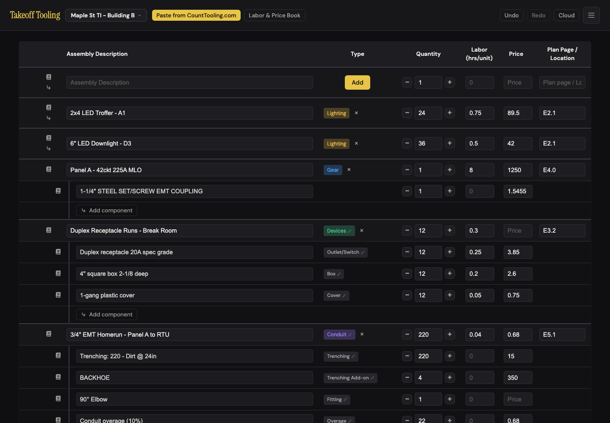
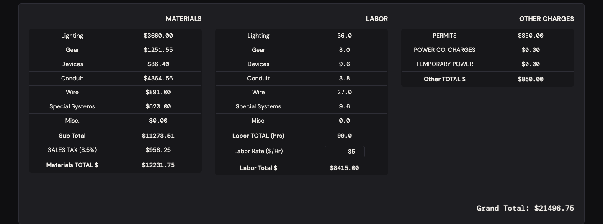
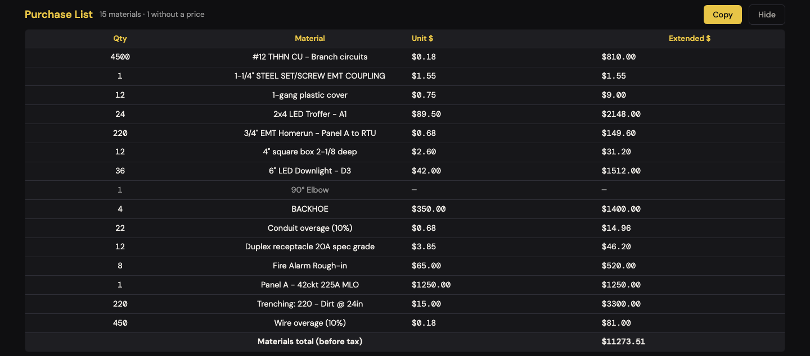

# J8 — Prove the number: check every dollar and hour before the bid goes out

Personas: E (estimator) · Status: ● walked 2026-09-06 (headless Chromium, :4188, signed out; five scripted passes, calculator alongside) · **verified 2026-09-06** (adversarial pass, independent seed — see § Verification: 12/12 findings confirmed, P6 and P11 fail the spirit test)

> Trigger — the takeoff is done and the bid leaves in an hour. The estimator reads the
> summary line by line against the manifest, generates the purchase list and checks that
> it says the same thing, hunts for anything unpriced or counted twice, and sets the labor
> rate. Every figure gets multiplied out by hand at least once.

## Entry points

- **Below the manifest table** — the summary block appears automatically once any row has a description (hidden until then, N-7): three panels MATERIALS · LABOR · OTHER CHARGES and the `.manifest-summary-grand-total` line. No button opens it; there is no other place the totals appear on screen.
- **Inside the LABOR panel** — `#labor-rate-input` "Labor Rate ($/Hr)" (number, `min="0"`, placeholder `0`); commits on `change` (Tab, Enter, click-away)
- **Below Print Options** — `#purchase-list-toggle-btn` "Generate Purchase List" → inline report (Qty · Material · Unit $ · Extended $, "Materials total (before tax)") with `#purchase-list-copy-btn` "Copy" (TSV) and "Hide"
- **Header** — `#undo-btn` / `#redo-btn` (the check often ends in "put that back")
- **Any manifest input** — quantity spinner `−`/`+`, qty / labor / price fields: each edit patches the summary in place (`updateSummaryOnly`, manifest.js:162) — the summary is live while you correct
- **Devices flow** (indirect) — the only place the parent-plus-components labor is explained: "Job labor: parent 3.6 + components 6.0 = 9.6 hrs" (B-11). The summary itself carries no such line.
- Not present: a per-project sales-tax rate; any hover or footnote on a summary figure; a "where did this number come from" drill-down; the purchase list in any PDF (J9 finding 4).

## Current route (walked 2026-09-06)

Happy path: **6 steps, 2 decisions** (is the labor rate right for this job; is "n without a price" acceptable to send). Every figure below was recomputed by hand from the seed; the table records expected vs shown.

1. Seeded the standard bid: 8 top-level rows (two lighting, a panel, a device run, a conduit run, a wire run, fire alarm, a permit) plus 9 children — device run: receptacle 12 × $3.85 / 0.25 h, box 12 × $2.60 / 0.2 h, cover 12 × $0.75 / 0.05 h; conduit run: trenching 220 × $15, BACKHOE 4 × $350, 90° elbow 1 × *(no price)*, overage 22 × $0.68; wire overage 450 × $0.18; panel add-on: 1-1/4" coupling 1 × $1.5455 (a 4-decimal supplier price). Labor rate $85. 
2. Read the summary against the calculator. Every bucket, subtotal, tax, hours and the Grand Total agreed (table below). 
3. **Generate Purchase List** → "15 materials · 1 without a price"; the elbow is greyed with `—` in both money columns; the device-run parent (price-less grouping) is absent; the 220 ft of 3/4" EMT is present (A-1 holds); "Materials total (before tax) $11273.51" equals the summary Sub Total to the cent. 
4. **Copy** → button read "Copied!"; clipboard held 17 TSV lines: header `Qty\tMaterial\tUnit $\tExtended $`, 15 materials sorted by description (the elbow's two money cells empty), `\tTOTAL\t\t11273.51`. No `$` in cells; unit prices two decimals.
5. Set the labor rate: click, type 95, Tab → Labor Total $9405.00, Grand Total $22486.75 (99.0 × 95 = 9,405 ✓). Enter also commits (rate 95, $9405.00) but leaves focus on `<body>`.
6. Corrected a quantity inline (box 12 → 20) and watched the summary move (Devices $86.40 → $107.20, 9.6 → 11.2 hrs, subtotal $11294.31). Undo → everything back to step 2's figures, purchase list included.

**Expected vs shown** (seed above; SALES_TAX_RATE 0.085, rate $85):

| Figure | Hand calculation | Expected | Shown | ✓ |
|---|---|---|---|---|
| Materials · Lighting | 24 × 89.50 + 36 × 42.00 | 3,660.00 | $3660.00 | ✓ |
| Materials · Gear | 1 × 1250 + 1 × 1.5455 | 1,251.5455 | $1251.55 | ✓ (rounds correctly) |
| Materials · Devices | 12 × (3.85 + 2.60 + 0.75); parent price-less | 86.40 | $86.40 | ✓ |
| Materials · Conduit | 220 × 0.68 + 220 × 15 + 4 × 350 + 22 × 0.68 (+ elbow 0) | 149.60 + 3,300 + 1,400 + 14.96 = 4,864.56 | $4864.56 | ✓ |
| Materials · Wire | 4500 × 0.18 + 450 × 0.18 | 810 + 81 = 891.00 | $891.00 | ✓ |
| Materials · Special Systems | 8 × 65 | 520.00 | $520.00 | ✓ |
| Materials · Misc. | blank starter row (qty 1, no price) | 0.00 | $0.00 | ✓ |
| Sub Total | Σ | 11,273.5055 | $11273.51 | ✓ |
| SALES TAX (8.5%) | 11,273.5055 × 0.085 | 958.2480 | $958.25 | ✓ |
| Materials TOTAL | | 12,231.7535 | $12231.75 | ✓ |
| Labor · Lighting | 24 × 0.75 + 36 × 0.5 | 36.0 | 36.0 | ✓ |
| Labor · Gear | 1 × 8 (coupling 0) | 8.0 | 8.0 | ✓ |
| Labor · Devices | parent 12 × 0.3 = 3.6 **+** components 12 × (0.25 + 0.2 + 0.05) = 6.0 | 9.6 | 9.6 | ✓ arithmetic — but see finding 6 |
| Labor · Conduit | 220 × 0.04 | 8.8 | 8.8 | ✓ |
| Labor · Wire | 4500 × 0.006 | 27.0 | 27.0 | ✓ |
| Labor · Special Systems | 8 × 1.2 | 9.6 | 9.6 | ✓ |
| Labor TOTAL (hrs) | Σ | 99.0 | 99.0 | ✓ |
| Labor Total $ | 99.0 × 85 | 8,415.00 | $8415.00 | ✓ |
| Other · PERMITS | 1 × 850 (not taxed, not in materials) | 850.00 | $850.00 | ✓ |
| Grand Total | 12,231.7535 + 8,415 + 850 | 21,496.7535 | $21496.75 | ✓ |
| Purchase list · lines | 15 buyable lines; permit and device-run grouping excluded | 15 · 1 without a price | "15 materials · 1 without a price" | ✓ |
| Purchase list · total | = Sub Total | 11,273.51 | $11273.51 | ✓ |
| TSV TOTAL | | 11273.51 | `\tTOTAL\t\t11273.51` | ✓ |

The happy path is numerically clean. Every finding below came from the stress pass — the corrections an estimator makes *while* proving the number.

Divergences from the documented route:

- README documents none of this: no summary, no labor rate, no sales tax, no purchase list (JOURNEY-MAP coverage table already lists purchase list and labor rate as undocumented). The 8.5 % tax appears nowhere in user-facing text except the summary row label.
- ARCHITECTURE.md:148 describes `updateSummaryOnly()` as patching "only the summary" — accurate, and the root of finding 1: the purchase list sits outside the patch.
- _baseline.md A-1 says the list "agrees with the summary to the cent"; true for the seed, false the moment a quantity is edited inline (finding 1), a priced row sits at qty 0 (finding 2), a price is negative (finding 3), or two 4-decimal supplier prices are on the job (finding 10).

## Naive attempt

I had the bid on screen and a calculator in my hand. The summary was where I expected it, under the table, and the first pass was reassuring: lighting 24 × 89.50 plus 36 × 42 is 3,660, and it said $3660.00 — no comma, which made the five-digit numbers slower to read than they should be, but right. Devices labor said 9.6. My row says 12 runs at 0.3 hours; that's 3.6. I stared at it for a while before I remembered the components carry their own hours; nothing on the summary said so, and I only found the "parent 3.6 + components 6.0" line by opening the devices flow.

Then I did what I always do before sending: I zeroed the panel to see what the job looks like without it. Gear still said $1251.55 and 8.0 hours. Zero panels, twelve hundred dollars. I typed 1 back and moved on, unsure whether I'd just found a bug or a rule. I generated the purchase list; it matched the subtotal to the penny, which is the thing I most wanted to see. I went back up and bumped the box count from 12 to 20. The summary moved. The purchase list, still open on the same screen, did not — it kept saying $11273.51 under a subtotal that now said $11294.31. If I hadn't been looking at both, I'd have copied the old list to the supply house.

Trenching and the backhoe are in "Conduit" and taxed at 8.5 %; I don't pay sales tax on a trench. There's no place to change the rate, and my county isn't 8.5. I ended up doing the tax in the spreadsheet after pasting the list — which is where I used to do the whole bid.

## Evidence

- **Telemetry visibility:** none exists. A `summary_viewed` event would be pointless (the summary is always on screen); the events a rework should ship are `purchase_list_generated` (`lines`, `unpriced`, `agreesWithSummary: bool`), `labor_rate_set` (`from`, `to`, `perProject`), and `qty_zero_priced_row` (fires when a described row with a price is saved at qty 0 — the counts-once rule's trigger) so the rule's real-world frequency is known before deciding finding 2.
- **Doc coverage:** README — nothing (the "Export" section is the nearest). CLAUDE.md — "Labor rate … not undoable"; ARCHITECTURE.md:119 (`getSummaryBreakdown`, `getPurchaseList` rules, `SALES_TAX_RATE`), :148 (`updateSummaryOnly` patches only the summary). Neither says qty 0 counts once, that overage merges by description, or that 8.5 % is fixed.
- **Specs:** `selectors.test.js` covers the data: counts-once for labor (`quantity: 0, labor: 1.5 // counts once`), purchase-list merge, priced parent kept, other-charges skipped, children rolled into the parent bucket and taxed. No spec touches the DOM: `#labor-rate-input`, `#purchase-list-*`, the summary's rendered strings, `updateSummaryOnly`, or the summary-vs-list agreement after an inline edit. `smoke.spec.js` / `labor-book.spec.js` do not reach this route.
- **Modals:** none. (The devices flow, if opened for the B-11 line, is a view, not a modal.)
- **Hotkeys:** none. Enter / Tab commit the labor rate; Meta+A select-all in any field.
- **Storage / state touched:** every inline edit → `TakeoffState.updateItem` → debounced 400 ms `takeoff-project-<id>` write and an undo frame (typing "20" over "12" undid in one step). Labor rate → `setLaborRate` → same project document; **not** an undo frame. Purchase list toggle → module-level `purchaseListVisible` (manifest.js:265) — not persisted, survives project switches within the session. No cloud pushes signed out.

## Friction findings

| # | Severity | What happens | Why it hurts | Verdict stamp (Phase 2b) |
|---|---|---|---|---|
| 1 | **blocker** | Inline edits (typed qty/labor/price, the `−`/`+` spinner) call `updateSummaryOnly()` (manifest.js:395, :411, :424), which replaces only `.manifest-summary` (:165-167). An open purchase list is left as it was. Box 12 → 20: summary Sub Total **$11294.31**, list "Materials total (before tax)" **$11273.51**, both on one screen (img 07). Panel `−` to 0: summary unchanged (counts once), list still shows "1 · Panel A · $1250.00". The list catches up only on a full render (Add Row, Undo, Tab out of the labor rate, Hide → Generate). | The two artifacts the estimator is reconciling disagree *because* they are reconciling — the check itself desynchronizes them. Copy at that moment sends the old list to the supply house. The app's named failure mode: a wrong figure that looks right, with the right one six inches above it. | **CONFIRMED blocker.** Re-driven on a fresh seed: box 15 → 25 (typed, Tab) put Sub Total **$7825.65** above a list still reading **$7806.15**; panel `−` to 0 left "1 · Panel LP-2 · $980.00" on the list; Hide → Generate and Add Row refreshed it. Correction to the walker's refresh paths: Tab out of the labor rate refreshes the list only on a fresh render — after any inline edit the swapped listener patches in place and the list stays stale (list $2227.50 vs fresh $2301.75). Genuinely new seam, not A-1 (A-1 was data; this is DOM refresh). |
| 2 | **blocker** | A described row with a price at **qty 0 counts once** in the summary (`effectiveQty = qty > 0 ? qty : (price > 0 ? 1 : 0)`, selectors.js:145; same for labor :148) but is **dropped** from the purchase list (`if (!desc \|\| qty <= 0) return`, selectors.js:69). Panel at 0: Gear **$1251.55 / 8.0 hrs**, manifest row reads `0 · 8 · 1250` (img 08); regenerated list "14 materials", total **$10023.51** — off by exactly $1,250.00 (img 04). Fire alarm at 0: $65.00 and 1.2 hrs for zero devices. | "Zero the row to see the job without it" is the most common what-if in a bid check, and it shows the job *with* it, at one unit, plus the hours to install one. The list and the summary then disagree by the unit price. The rule is in a code comment; nothing on screen hints at it. | **CONFIRMED blocker.** Panel LP-2 ($980 / 6.5 h) at qty 0: Gear **$981.85 / 6.5 hrs**, regenerated list "14 materials" **$6826.15** vs Sub Total $7806.15 — Δ exactly **$980.00**; data drops typed 0 → $28.00 / 0.9 hrs. Counter-evidence weighed: the rule is deliberate (selectors.js:24 comment, `selectors.test.js:18` "counts once") — but the list's `qty <= 0 return` (:69) is equally deliberate, so two intended rules contradict on one row, and both the manifest (manifest.js:383) and the devices flow (qty-1 seeding, verified: described+priced row saved at qty 1) already make the "described but never quantified" case visible at 1, leaving qty 0 to mean only "the estimator typed 0". Wrong number regardless of intent. |
| 3 | **stumble** (numbers) | Negative values are accepted. Price −65 on 8 fire-alarm devices: summary Special Systems **$0.00** (the `p > 0` guard), list row **"$-65.00 · $-520.00"**, list total $10233.51 vs Sub Total $10753.51 (Δ $520). Labor rate −85: Labor Total **$-8415.00**, Grand Total **$4666.75** (img 05). Both inputs carry `min="0"` (manifest.js:89, :144); `:invalid` matches, but no CSS rule styles it (0 rules), so the field looks normal. | A stray minus sign (or a credit typed as a negative) produces a summary that ignores it and a list that honours it. A negative rate turns the grand total into a number that is 78 % low with no red anywhere. | **CONFIRMED stumble.** Price −28 × 20: Special **$0.00** on the summary, list **"$-28.00 · $-560.00"**, list $6686.15 vs Sub Total $7246.15 (Δ $560). Rate −92: Labor Total **$-7935.00**, Grand Total **$1154.67** (was $17024.67). Two more facets found: labor −0.4 × 10 *subtracts* 4.0 hrs (no guard on labor), and qty −10 falls into the counts-once branch (Lighting +$38.00 / +0.4 hrs, list drops it) — three different treatments of a minus sign. `:invalid` matches but border colour equals a valid neighbour's (rgb(46,46,54)); no CSS rule. |
| 4 | **stumble** | Two rows with the same description at different prices (Panel A at $1,250 and $1,100) merge into **"2 · Panel A - 42ckt 225A MLO ≠ · $1250.00 · $2350.00"**: 2 × 1,250 ≠ 2,350 (img 06). The explanation ("highest is shown; extended is exact per line") is a `title` tooltip on a 14 px glyph. Copy emits `2\tPanel A…\t1250.00\t2350.00` — the ≠ is gone (run 2/3 TSV). | The calculator says the row is wrong by $150. In the spreadsheet the supply house or the boss opens, there is no glyph at all — just a line that doesn't multiply. | **CONFIRMED stumble.** Panel LP-2 at $980 and $850 → **"2 · Panel LP-2 - 30ckt 100A MCB ≠ · $980.00 · $1830.00"** (2 × 980 = 1960 ≠ 1830); glyph 14.4 px with the `title` tooltip; clipboard TSV `2\tPanel LP-2…\t980.00\t1830.00`, no ≠ (read back via `navigator.clipboard.readText`). |
| 5 | **stumble** | Overage is a child named "Conduit overage (10%)" and the list merges by description, so two runs' overages become one line: **"32 · Conduit overage (10%) ≠ · $1.10 · $25.96"** — 22 ft of 3/4" EMT at $0.68 and 10 ft of 1" EMT at $1.10 (img 10). Even with one run, "22 · Conduit overage (10%)" is not something a counter can pull; the buyable line "3/4" EMT" says 220, not 242. Wire is the same ("450 · Wire overage (10%)"). | A-2 made overage cost money; the purchase list still cannot say what it is overage *of*. The supply house gets a quantity of an abstraction and the wrong footage on the real item. | **CONFIRMED stumble.** Second run 80 ft 3/4" at $0.68 with 8 ft overage → **"23 · Conduit overage (10%) ≠ · $1.12 · $22.24"** (15 × 1.12 + 8 × 0.68; 23 × 1.12 = 25.76). Single run: "15 · Conduit overage (10%)" while the EMT line says 150, not 165. Same description string for every run is by construction (conduit.js:522, wire.js:151). |
| 6 | **stumble** | The summary shows Devices **9.6 hrs** against a manifest row reading 12 × 0.3. The other 6.0 hrs are the three components' labor; the only sentence explaining it is inside the devices flow (B-11). The summary has zero `title` attributes, notes, or drill-downs (run 1 S10: no "component/parent/rolled" text). | Estimator with a calculator gets 3.6, sees 9.6, and either distrusts the app or opens the flow to hunt. Same for any bucket whose parent has labored children. | **CONFIRMED stumble.** Manifest row 15 × 0.35 = 5.25; summary Devices **11.3** (parent 5.25 + components 6.0); `.manifest-summary [title]` count 0, no "component/parent" text anywhere in the summary. B-11 line present in the flow: "Job labor: parent 5.3 + components 6.0 = 11.3 hrs". |
| 7 | **stumble** | Sales tax is a constant (`SALES_TAX_RATE = 0.085`, selectors.js:12) applied to every material bucket. Trenching $3,300 + BACKHOE rental $1,400 = $4,700 of services sit in Conduit and draw **$399.50** of the $958.25 tax. No per-project rate; no way to mark a line non-taxable. | Estimators outside an 8.5 % jurisdiction cannot use the Grand Total at all; everyone else over-taxes labor-like children (trenching, rentals) by 8.5 %. On this seed that is a $399.50 error the summary presents as arithmetic. | **CONFIRMED stumble** (the *route* verdict is gap, per P7). Trenching $1,800 + COMPACTOR $550 = $2,350 draw **$199.75** of my seed's $663.52 tax; `TakeoffSelectors.SALES_TAX_RATE` 0.085, no input anywhere matches /tax/. Severity stays stumble because the estimator recovers in a spreadsheet; for a non-8.5 % jurisdiction it is a wall. |
| 8 | **stumble** | A fresh project starts with the labor rate blank (placeholder `0`): 18.0 hrs, Labor Total **$0.00**, Grand Total $2330.58 with no flag (run 3 FRESH). The rate is per project and a new project inherits the current one (85 → 85; set 120, switch back → 85, forward → 120 — correct), but project #1 and a share-link copy (J9 finding 1) begin at 0. | A grand total that silently omits labor is the same wrong-number-looks-right class as J9-1; here it is the estimator's own first bid. | **CONFIRMED stumble.** Fresh profile, first row typed with the real keyboard (30 × 0.6 h × $74.25): rate `""`, **18.0 hrs, Labor Total $0.00, Grand Total $2416.84** (= materials + tax only), no flag text. `createProject` inherits the open project's rate (77 → 77) and `duplicateProject` copies it (state.js:308) — the blank case is project #1 and share-link copies only, as the walker said. |
| 9 | **papercut** | Price **0** and price **blank** look alike but count differently: 0 → "$0.00 · —", *not* in "without a price"; blank → "— · —", counted (img 09: "17 materials · 2 without a price" with three dashed rows). A $0.00 unit with a `—` extended reads as unpriced. | Owner-furnished ($0) and not-yet-priced (blank) are different bid facts; the list shows them the same way and the counter disagrees with the eye. | **CONFIRMED papercut.** "6 · Owner-furnished AP · $0.00 · —" (not in the unpriced class) beside "1 · Rack - TBD · — · —" and "5 · 1\" EMT Coupling · — · —" (both unpriced); meta "17 materials · 2 without a price" with three dashed extendeds. Mechanism manifest.js:282 `l.extended ? … : '—'`. |
| 10 | **papercut** (numbers) | Two supplier parts at **$1.5455**: summary rounds the raw sum (1,253.091 → Gear $1253.09, Sub Total **$11275.05**); the list rounds per line (1.55 + 1.55) → **$11275.06**; TSV TOTAL 11275.06. One cent, but it is the promised "to the cent" and it appears with exactly the 4-decimal prices Elliot supplies (C-1). | An estimator who reconciles to the penny stops on a one-cent difference and cannot find the line that causes it (both show $1.55). | **CONFIRMED papercut.** 2 × $0.9233 + 1 × $1.2466: raw 3.0932 → Gear **$983.09**, Sub Total **$7807.39**; list per-line 1.85 + 1.25 → **$7807.40**; TSV `\tTOTAL\t\t7807.40`. Both lines display two decimals ($0.92, $1.25) so the cause is invisible. |
| 11 | **papercut** | No thousands separators anywhere: `$21496.75`, `$11273.51`, `$12231.75`, qty `4500` (`formatMoney` = `toFixed(2)`, manifest.js:112). | Five- and six-digit figures are misread by a digit when checked by eye; every number on this route is one. | **CONFIRMED papercut.** `$17024.67`, `$7806.15`, qty `3000`; no `\d,\d{3}` anywhere in the summary. |
| 12 | **papercut** | Labor rate commit: Enter commits and drops focus to `<body>` (typing "9" afterwards lands nowhere — run 3); Tab commits via a full `TakeoffApp.render()` (manifest.js:362-365) and focus lands on "Print Options". After any inline edit the field is re-created with a *different* listener (manifest.js:168-171) that patches in place and calls `setLaborRate` twice (:164 and :169). | Two code paths for one field; "type a rate, Enter, type a correction" loses the correction. Low cost, but it is the field that multiplies 99 hours. | **CONFIRMED papercut.** Instrumented `setLaborRate`: fresh-render listener → 1 call then full render, focus on `<body>` after **both** Enter and Tab (the walker's "Tab lands on Print Options" is the swapped listener); swapped listener → **2 calls** per change, Enter → `<body>`, Tab → Print Options; no stacking (still 2 after three inline edits). Typing "8" after Enter landed nowhere on both paths (rate stayed 95 / 88). |

Baseline regressions: none. A-1 (EMT footage present, device grouping absent, list = subtotal on the seed), A-2 (overage priced: $14.96 / $81.00), B-11 (flow line present), N-7 (summary hidden until content), N-9 (new project has a blank row) all hold. Finding 1 is a *pre-existing* seam A-1's fix did not cover (the list agreed on a fresh render; it was never re-rendered on inline edits).

## Proposals

**P1 — The purchase list moves when the summary moves.** verdict: **polish** (finding 1).
`updateSummaryOnly()` also re-renders `.purchase-list-open` when `purchaseListVisible` (same `outerHTML` patch, re-bind Copy/Hide). (1) Removes the Hide → Generate step and the "which one is right?" decision. (2) "Purchase list", "materials total" — words already on screen. (3) Makes the Hide/Generate refresh cycle unnecessary; one render path instead of two states. (4) Nothing to find — the list is simply current. `spiritPass: true`. — **Verifier: spiritPass: true.** Caveat: the re-render must also fire from the swapped labor-rate listener (manifest.js:168-171) — that is the path where the stale list survives today (verified: Tab out of the rate after an inline edit leaves the list at $2227.50 vs a fresh $2301.75).

**P2 — Zero means zero, and the row says so.** verdict: **rework** (finding 2; touches the counting rule in selectors.js:145/148 and getTotalLabor:25).
Drop the counts-once branch: qty 0 contributes 0 to materials, labor, and the list — the three agree by construction. Keep the existing "typing a description sets qty to 1" (manifest.js:383-386) so the case the rule was protecting (a described row nobody quantified) still counts once, *visibly*, as 1. Grey the qty cell when a described, priced row sits at 0. (1) Removes a hidden rule and the summary-vs-list reconciliation it forces. (2) "Quantity 0 — not counted". (3) Removes two `effectiveQty` branches and the one-line-vs-none disagreement. (4) The row itself shows 0 and looks switched off. `spiritPass: true` — verifier's caveat: the rule was deliberate ("same rule as price"); if the owner keeps counts-once, the fallback is to emit the line at qty 1 on the list with the same grey treatment so the two agree. **Verifier: spiritPass: true.** Evidence for dropping the branch rather than keeping it: both the manifest (description → qty 1, manifest.js:383) and the devices flow (blank rows seeded at qty 1; a described + priced row with the quantity untouched saved at qty 1 — verified live) already make the protected case visible, so today a described row at 0 means only "the estimator typed 0". `selectors.test.js:15-22` ("counts once") changes with it.

**P3 — Refuse negatives at the field.** verdict: **polish** (finding 3).
On `change`, clamp price / labor / qty / labor rate to ≥ 0 and flash the field (`:invalid` rule in css, currently absent); alternatively treat a negative price as a credit consistently in both selectors. (1) Removes the "why is the list $520 lower?" hunt. (2) None needed. (3) Makes the `p > 0` guard's silent zeroing unnecessary. (4) The field turns red where they typed. `spiritPass: true`. — **Verifier: spiritPass: true.** Caveat: pick one — clamp *or* credit; the "alternatively" is a second proposal. Clamp is the one that also covers the two extra treatments found (negative labor subtracts hours; negative qty counts once).

**P4 — Show the price range, carry it into the copy.** verdict: **polish** (finding 4).
When prices vary, Unit $ reads **"$1100.00–$1250.00"** and the TSV cell reads `1100.00-1250.00`; drop the ≠ glyph and its tooltip. (1) Removes a hover. (2) A range is what a counter says. (3) Removes the tooltip and the glyph. (4) It is in the cell they are checking. `spiritPass: true`. — **Verifier: spiritPass: true.** Caveat: `1100.00-1250.00` makes the TSV Unit $ cell non-numeric in a spreadsheet; acceptable because Extended $ stays numeric and is the column that gets summed.

**P5 — Fold overage into the run it belongs to.** verdict: **rework** of `getPurchaseList` grouping (finding 5).
Overage children (`type === 'overage'`) add their quantity to the *parent's* purchase line — "242 · 3/4" EMT Homerun - Panel A to RTU (incl. 10 % overage)" — and never merge across runs. Manifest and summary unchanged (the child still exists and still costs $14.96). (1) Removes one un-buyable line per run and the ≠ case it creates. (2) "incl. 10 % overage", "footage". (3) Removes the abstract "Conduit overage (10%)" line from the list and the PO. (4) The EMT line says 242 where the counter looks. `spiritPass: true`. — **Verifier: spiritPass: true.** Caveat: fold by `parentId` + `type === 'overage'`, never by description; an overage child with a null price (unpriced run) folds as unpriced qty on the parent's line; wire gets the identical fold.

**P6 — Say where the hours came from, on the summary.** verdict: **polish** (finding 6).
Under the LABOR panel, one muted line when any parent has labored children: "Devices 9.6 = runs 3.6 + components 6.0" (reuse the B-11 string). (1) Removes the trip into the flow. (2) "runs", "components", already B-11's words. (3) Makes the flow-only explanation unnecessary for the check. (4) It sits under the number they doubted. `spiritPass: true`. — **Verifier: spiritPass: false.** Fails (3): the line is pure addition. "Makes the flow-only explanation unnecessary" is not true — the B-11 line stays because the flow needs it while editing — so nothing is removed. Route: `teach` (Guide actions bullet 1 already carries the 3.6 + 6.0 example) for now; if synthesis wants a UI shape, replace the bare Devices hours cell text ("11.3 · runs 5.3 + parts 6.0") rather than adding a row, and re-test.

**P7 — A tax rate the estimator can set.** verdict: **gap** (finding 7) + **teach** for what is taxed.
Add "Sales Tax (%)" as an input beside "Labor Rate ($/Hr)", stored per project like the rate (`project.taxRate`, default 8.5, in the share envelope with the rate per J9-P1). Do **not** add per-line taxable toggles yet; the guide says trenching and rentals are taxed as materials and how to carry them as Other Charges if they shouldn't be. (1) Removes the spreadsheet re-tax. (2) "Sales tax", "%". (3) Replaces a hardcoded constant; removes the "the app only works in one county" wall. (4) Next to the rate they already set. `spiritPass: true` — caveat: the teach half is a stop-gap; if walks show most jobs carry trenching, a "not taxed" mark on trenching/rental types becomes the rework. **Verifier: spiritPass: true.** (3) holds because the constant is removed, not wrapped; the share-envelope half depends on J9-P1 landing first.

**P8 — A blank rate is a flag, not a zero.** verdict: **polish** (finding 8; companion to J9-P1).
When hours > 0 and the rate is blank, the Labor Total $ cell reads "set a rate →" in the accent color and the Grand Total gets a small "labor not included" note. (1) Removes a silent omission. (2) "Labor rate". (3) Makes the recipient/first-bid phone call unnecessary. (4) It's on the total line. `spiritPass: true`. — **Verifier: spiritPass: true.** Replaces a misleading `$0.00` in the same cell rather than adding a surface; the blank-rate case verified live renders $0.00 / Grand Total $2416.84 with no flag today.

**P9 — $0 is a price; blank is not.** verdict: **polish** (finding 9).
A `0` price renders "$0.00 · $0.00" (not `—`) and is never "without a price"; blank stays dashed and counted. Optional: "(no charge)" beside a $0.00 extended. (1) Removes one ambiguity. (2) "No charge", "unpriced". (3) Makes the `l.extended ? … : '—'` special case unnecessary. (4) Visible in the row. `spiritPass: true`. — **Verifier: spiritPass: true.** Drop the optional "(no charge)" text — the `$0.00 · $0.00` pair already says it and the option is the only additive part.

**P10 — Round the same way in both places.** verdict: **polish** (finding 10).
Sum cents-rounded per-line extendeds in `getSummaryBreakdown` too (the invoice will), so summary and list share one rounding. (1) Removes a penny hunt. (2) None. (3) Removes one of two rounding conventions. (4) N/A. `spiritPass: true`. — **Verifier: spiritPass: true.** Extend the same rule to hours (Verification, NEW-1): the summary shows 1-dp hours but multiplies raw hours, so 86.3 × $92 on a calculator is $4.60 off the Labor Total shown.

**P11 — Thousands separators.** verdict: **polish** (finding 11). `formatMoney` → `toLocaleString('en-US', {minimumFractionDigits: 2, maximumFractionDigits: 2})`; quantities likewise; TSV stays bare. (1) Removes misreads. (2) None. (3) Nothing removed — flagged; the budget is paid by touching one function. (4) N/A. `spiritPass: true` with the verifier's caveat on (3). **Verifier: spiritPass: false** as a standalone item — fails (1) (reading correctly is not a step) and (3) (nothing removed, as the walker concedes). It should ride inside P10's `formatMoney` touch, not stand on its own in the shortlist.

**P12 — One listener for the labor rate; keep focus.** verdict: **polish** (finding 12). Bind the rate once via delegation on `#main-content`, patch in place (never full render), set the rate once, restore focus/selection after the patch. (1) Removes a lost keystroke. (2) None. (3) Removes a duplicate code path (manifest.js:168-171 vs :362-365). (4) N/A. `spiritPass: true`. — **Verifier: spiritPass: true.** Must cover both paths: the fresh-render listener drops focus to `<body>` on Tab as well as Enter (full render), and the swapped one calls `setLaborRate` twice — both verified with an instrumented `setLaborRate`.

**Keep** (pre-registered strength, verified on the seed): purchase list merges by description, greys "n without a price" instead of hiding it, keeps the EMT footage and drops the device-run grouping, and Copy yields a clean TSV with header and TOTAL. Keep: labor rate is per project and a new project inherits the current one; Undo does refresh the list (full render via `navigateToManifest`); the blank starter row contributes exactly 0 to Misc. Keep the live in-place summary on every keystroke — it is the right behaviour; P1 extends it to the list rather than replacing it.

## Guide actions

- "Check the bid" article: how each bucket is built (children roll into the parent's type; parent labor **and** component labor both count — with the 3.6 + 6.0 = 9.6 example); what the purchase list includes and excludes (permits, groupings) and why its total is *before tax*; what "n without a price" means and that the dashed rows are the things to price before sending.
- Until P2 lands: **a priced row at quantity 0 still counts once** in the summary and is absent from the purchase list — zero a row by removing it, not by typing 0.
- Until P7 lands: tax is fixed at 8.5 % and applies to trenching and rentals; move non-taxed items to an Other Charges type if the jurisdiction differs.
- Until P4/P5 land: what ≠ means, and that overage lines must be added to the run's footage by hand on the order.
- README rows to add: Summary (buckets, tax, labor rate per project), Purchase List (contents, Copy). Fix ARCHITECTURE.md:119 to state the qty-0 rule and the merge-by-description rule explicitly.

## Demo moment

Click "Generate Purchase List" on a bid with a fitting nobody priced: the report lands with "15 materials · 1 without a price", the elbow greyed, the device run's grouping row gone, the 220 ft of EMT present, and "Materials total (before tax) $11273.51" matching the Sub Total to the cent (img/prove-the-number-03.png). Do not edit a quantity while the list is open until P1 lands.

## Walk notes

- Server: read-only static server at `http://localhost:4188` (not started or stopped by this walk). Playwright 1.61.1 headless Chromium, 1440×1800, fresh profile per run, signed out; every context aborted `/supabase/i` — the only console error per boot is the resulting `Failed to load resource: net::ERR_FAILED` (expected). No cloud writes.
- **Reused artifacts:** this dossier was written from a previous walker's four scripts and three logs (`walk.js`…`walk4.js`, `run1.log`…`run3.log`) and screenshots 01–08, which survived a rate-limit cut-off before the dossier was written. A fifth pass (`walk5.js` → `run5.log`) re-confirmed the spinner path (finding 1), the Enter/Tab paths (finding 12), the one-cent split with raw values (finding 10: subtotal 11275.051 vs list 11275.06), and took screenshots 09 (price 0 vs blank) and 10 (cross-run overage merge). All five scripts and logs: `scratchpad/walks/prove-the-number/` in the session scratchpad.
- Seed: via `page.evaluate` — `setProjectName('Maple St TI - Building B')`, 8 rows in one batch, 9 children in a second batch, `setLaborRate(85)`. Stress mutations were driven through the real inputs (click, Meta+A, type, Tab / Enter / spinner clicks) except where noted as `TakeoffState.addItem` for adding rows.
- **Page error, script-only:** run 1 logged three `NotFoundError: Failed to set the 'outerHTML' property` at manifest.js:170, each on `page.fill` + `dispatchEvent('change')` against `#labor-rate-input` after an inline edit had swapped in the patch-in-place listener. Runs 2, 3 and 5 drove the same field with real keyboard paths (Tab, Enter, click-away) and produced **no** page error; the synthetic dispatch re-enters `updateSummaryOnly` while the summary is mid-replacement. Not a user-facing finding; recorded so the verifier does not chase it. The double `setLaborRate` per change (manifest.js:164 + :169) is real and folded into finding 12.
- Values to re-drive first (all deterministic): finding 1 — open the list, type 20 into the box qty, Tab, compare Sub Total ($11294.31) with the list total ($11273.51); finding 2 — click `−` on the panel to 0, read Gear ($1251.55, 8.0 hrs), Hide → Generate ($10023.51). Then finding 3 (−85 in the rate → $4666.75).
- Purchase-list visibility is a module variable: it stayed "open" across `createProject` / `switchProject` in one session (run 3); on an empty project the whole below-table block is hidden (N-7), so it is invisible rather than wrong. Observation only.
- Nothing was committed; app code, tests and other dossiers were not touched. Files written: this dossier and `docs/journeys/img/prove-the-number-09.png`, `-10.png` (01–08 pre-existing from the earlier walker).

## Verification

**Date:** 2026-09-06 · **Verifier:** adversarial pass, Phase 2b · **Method:** three independent Playwright scripts (`scratchpad/walks/prove-the-number/verify/verify.js`, `verify2.js`, `verify3.js` → `verify*.log`), headless Chromium 1440×1800, fresh profile per run, signed out, `/supabase/i` aborted (the only console error is the expected `net::ERR_FAILED` at boot; **zero page errors** in all three runs — the walker's script-only `NotFoundError` was not chased). All stress edits were typed with the real keyboard (`click` → `Meta+A` → `type` → `Tab`/`Enter`) or spinner clicks; rows were seeded via `TakeoffState` in batches. Every expected value below was computed by hand **before** the run.

**Independent seed** (deliberately different from the walker's — rate **$92**, hours that do not fall on .0/.5): lighting 30 × $74.25 / 0.6 h and 10 × $38 / 0.4 h; gear Panel LP-2 1 × $980 / 6.5 h with child connector 2 × $0.9233; devices Switch Runs 15 × 0.35 h (no price) with children switch 15 × $4.10 / 0.2, box 15 × $1.95 / 0.15, plate 15 × $0.55 / 0.05; conduit 1" EMT 150 × $1.12 / 0.05 with trenching 150 × $12, COMPACTOR 2 × $275, coupling 5 × *(no price)*, overage 15 × $1.12; wire 3000 × $0.31 / 0.007 with overage 300 × $0.31; special systems 20 × $28 / 0.9; permit 1 × $620; plus the blank starter row.

**Happy path re-derived** — every figure matched the hand calculation: Lighting $2607.50 · Gear $981.85 (raw 981.8466) · Devices $99.00 · Conduit $2534.80 · Wire $1023.00 · Special $560.00 · Misc $0.00 · Sub Total **$7806.15** (raw 7806.1466) · tax **$663.52** · Materials TOTAL $8469.67 · hours 22.0 / 6.5 / 11.3 / 7.5 / 21.0 / 18.0 → **86.3** (raw 86.25) · Labor Total **$7935.00** · PERMITS $620.00 · Grand Total **$17024.67**. Purchase list "15 materials · 1 without a price", total **$7806.15** = Sub Total.

**Re-drives, in the priority order given:**

1. *Open list stale (F1)* — CONFIRMED blocker. With the list open: box 15 → 25 typed + Tab → summary Devices $118.50 / 12.8 hrs, Sub Total **$7825.65**; list still **$7806.15**, box row still "15 · 1-gang box"; `TakeoffState.getPurchaseList().totalCost` was already 7825.65 (data right, DOM stale). Spinner panel 1 → 0: list still "1 · Panel LP-2 · $980.00". Refresh paths verified: Hide → Generate ✓, Add Row ✓, Undo ✓ (full renders). **Walker correction:** "Tab out of the labor rate" refreshes only while the fresh-render listener is bound; after any inline edit (even one keystroke — the `input` handler swaps it) the rate's `change` patches in place and the list stays stale (verify2: $2227.50 shown vs fresh $2301.75).
2. *Qty 0 counts once (F2)* — CONFIRMED blocker. Panel `−` to 0: manifest cell `0`, Gear **$981.85 / 6.5 hrs** unchanged, Labor Total $ unchanged; regenerated list "14 materials" **$6826.15** — Δ vs Sub Total exactly **$980.00** (the unit price). Data drops typed 0 → Special $28.00 / 0.9 hrs. Counter-evidence hunt: the rule is intended (selectors.js:24 "same rule as price"; `selectors.test.js:15` asserts it) — but the list's `qty <= 0 return` (:69) is also intended, and the two contradict on the same row; and the case the rule protects (a described row nobody quantified) is already handled visibly by the manifest (description → qty 1) and by the devices flow (verify3: a row given only a description and a price saved at **qty 1**, not 0). Intent does not make a $980 disagreement acceptable; the finding stands as a wrong-number outcome.
3. *Negatives (F3)* — CONFIRMED stumble. Price −28 × 20: summary Special **$0.00**, Sub Total $7246.15; list "20 · Data drops Cat6 · **$-28.00 · $-560.00**", total $6686.15 (Δ $560). Rate −92: Labor Total **$-7935.00**, Grand Total **$1154.67**. Extra facets: labor −0.4 × 10 → Lighting hrs 14.0 (subtracted — no guard on labor); qty −10 → Lighting **+$38.00 / +0.4 hrs** (falls into the counts-once branch) while the list drops the row. `:invalid` matches on both inputs; computed border colour identical to a valid neighbour (rgb(46,46,54)); `grep ':invalid' css/styles.css` → 0 rules.
4. *Cross-run overage merge (F5)* — CONFIRMED stumble. Second run 80 ft 3/4" EMT at $0.68 + 8 ft overage → "**23 · Conduit overage (10%) ≠ · $1.12 · $22.24**" (23 × 1.12 = 25.76); single-run case "15 · Conduit overage (10%)" beside "150 · 1" EMT". Description is the same string for every run by construction (conduit.js:522, wire.js:151).
5. *Fixed 8.5 % on services (F7)* — CONFIRMED stumble (route verdict gap). Trenching $1,800 + COMPACTOR $550 = $2,350 → **$199.75** of $663.52 tax; `TakeoffSelectors.SALES_TAX_RATE === 0.085`; no input on the page matches /tax/.
6. *F4* — CONFIRMED: "2 · Panel LP-2 - 30ckt 100A MCB ≠ · $980.00 · $1830.00"; TSV line `2\tPanel LP-2…\t980.00\t1830.00`, no ≠; Copy button read "Copied!". *F6* — CONFIRMED: Devices 11.3 vs row 15 × 0.35; 0 `title` attributes in the summary; B-11 line in the flow "Job labor: parent 5.3 + components 6.0 = 11.3 hrs". *F8* — CONFIRMED on a fresh profile with the first row typed by keyboard: rate `""`, 18.0 hrs, Labor Total **$0.00**, Grand Total **$2416.84**, no flag; `createProject` inherits (77 → 77). *F9* — CONFIRMED: "6 · Owner-furnished AP · $0.00 · —" not in the unpriced class; "17 materials · 2 without a price" with three dashed rows. *F10* — CONFIRMED: 2 × 0.9233 + 1 × 1.2466 → Gear $983.09 / Sub Total **$7807.39** vs list **$7807.40**, TSV `TOTAL 7807.40`. *F11* — CONFIRMED: no `\d,\d{3}` in the summary. *F12* — CONFIRMED with an instrumented `setLaborRate`: fresh listener 1 call + full render, focus → `<body>` on **both** Enter and Tab; swapped listener **2 calls**, Enter → `<body>`, Tab → Print Options; no listener stacking (2 calls after three inline edits); a digit typed after Enter lands nowhere on either path.

**Baseline re-verified (one line each):** A-1 ✓ "150 · 1" EMT - LP-2 to Roof" present, "Switch Runs - Corridor" grouping absent, list = Sub Total on a fresh render. A-2 ✓ driven live through the conduit wizard (Next → Next → 10 % → Save): overage child `{quantity: 15, labor: 0, price: 1.12}`, Conduit $184.80 / 7.5 hrs. B-11 ✓ flow line present (above). N-7 ✓ fresh boot has `.manifest-below.manifest-empty-hide`. N-9 ✓ `createProject` → 1 top-level row. No regressions. Finding 1 is not an A-1 duplicate (A-1 fixed `getPurchaseList` data; F1 is the DOM never re-rendering it).

**Counter-evidence hunts that failed to kill anything:** (a) an alternative refresh path for the open list — none; only full `TakeoffApp.render()` calls re-run `renderPurchaseList` (manifest.js:258), and `updateItem` only persists. (b) "Counts-once makes the disagreement acceptable" — no; see re-drive 2. (c) "Negative price is a credit" — the summary zeroes it while the list honours it, so no consistent reading exists. (d) Doc citations checked: ARCHITECTURE.md:119 and :148 say what the walker says they say. (e) PDF path: pdf.js prints hours via `getTotalLabor` only, no dollar totals — no third rounding convention hiding there.

**NEW in passing:**
- **NEW-1 (papercut, J8)** — hours are displayed to one decimal but dollars use the raw hours: total shows **86.3 hrs** and **$7935.00** (= 86.25 × 92); a calculator gives 86.3 × 92 = **$7939.60**. Devices shows 11.3 for 11.25; the B-11 string rounds each part ("parent 5.3 + components 6.0 = 11.3") so with other hours the parts will not add. Invisible on the walker's seed (all hours on .0/.5). Belongs with P10.
- **NEW-2 (observation, J5 — not chased)** — clicking Next through the conduit wizard's trenching step without touching it commits a child "Trenching: 0 - N/A @ N/A" (qty 0, no price, no labor) to the manifest. $0 effect on every total; noted for the J5 verifier.

**Final tally:** 12 findings → **12 CONFIRMED**, 0 downgraded, 0 KILLED (one factual correction folded into F1's refresh-path list; F12's focus claim refined). Proposals → `spiritPass: true` ×10; **false ×2**: P6 (pure addition, fails the simplicity budget — route to `teach`) and P11 (nothing removed, no step removed — ride inside P10). Baseline A-1, A-2, B-11, N-7, N-9 all hold. Only this file was edited; scripts and logs live in the session scratchpad under `walks/prove-the-number/verify/`.
