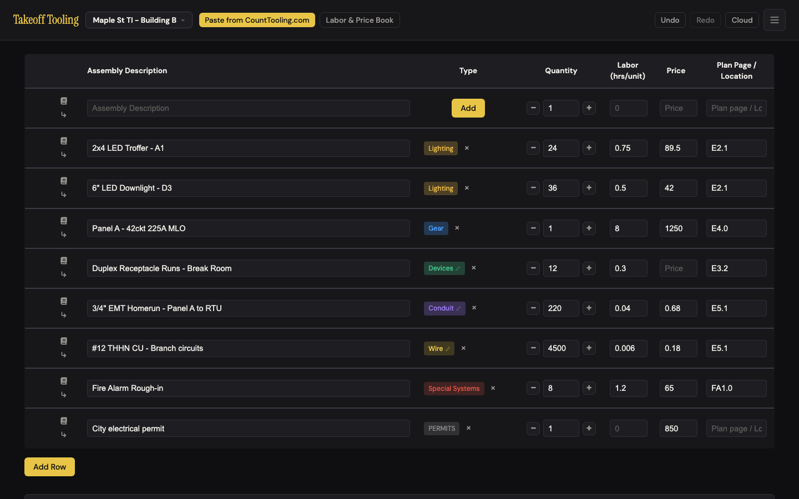
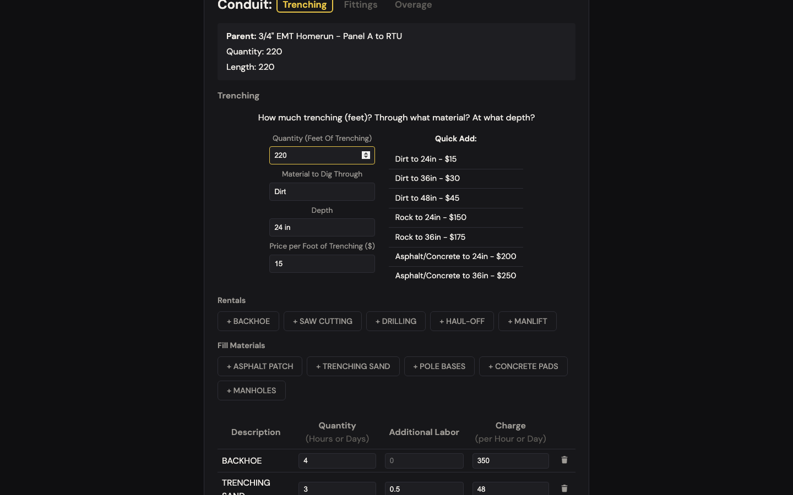
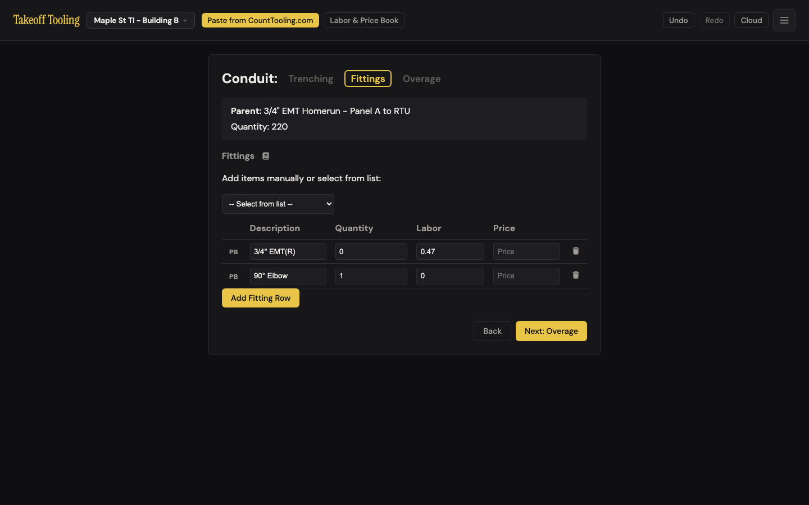
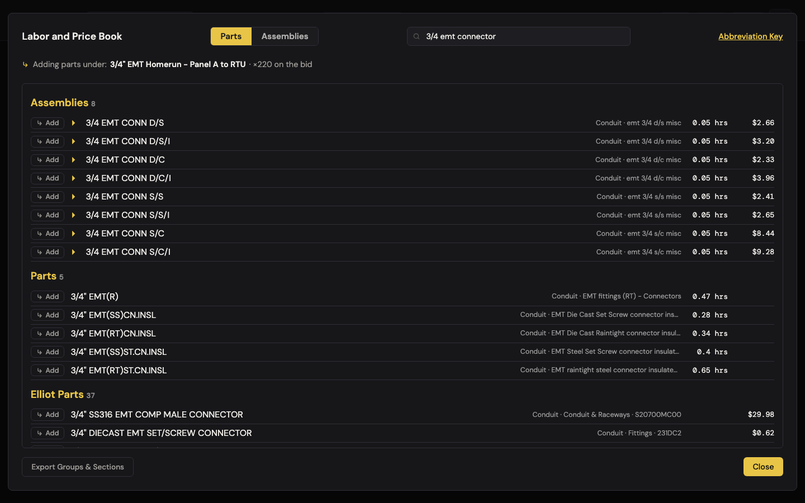
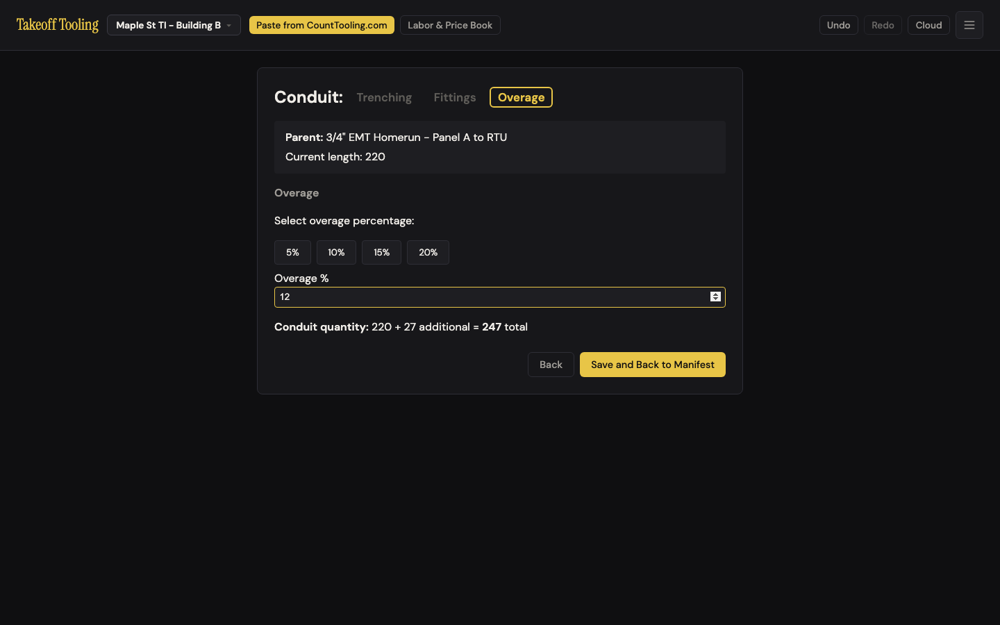
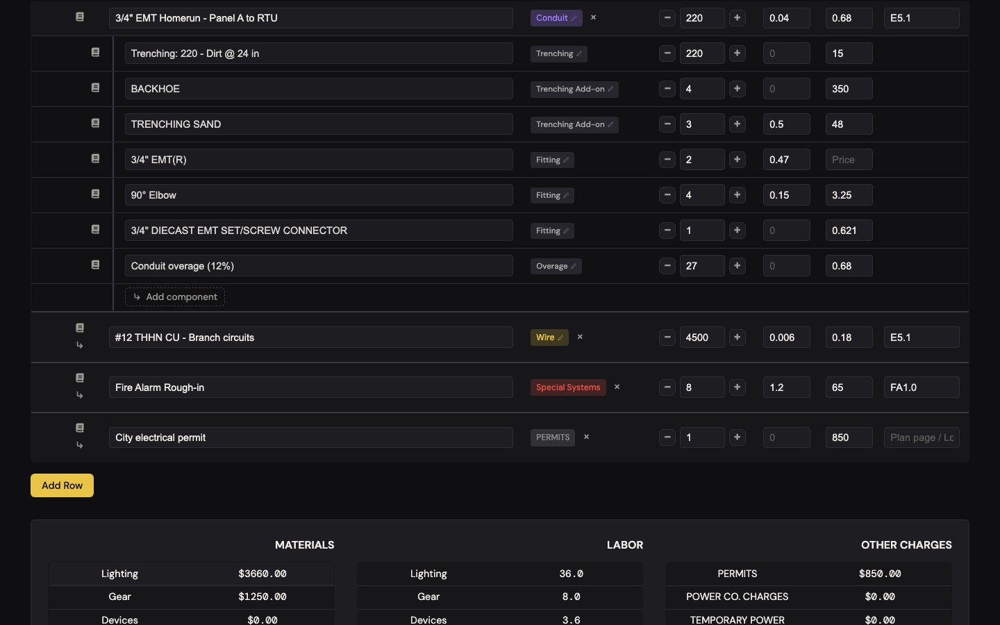
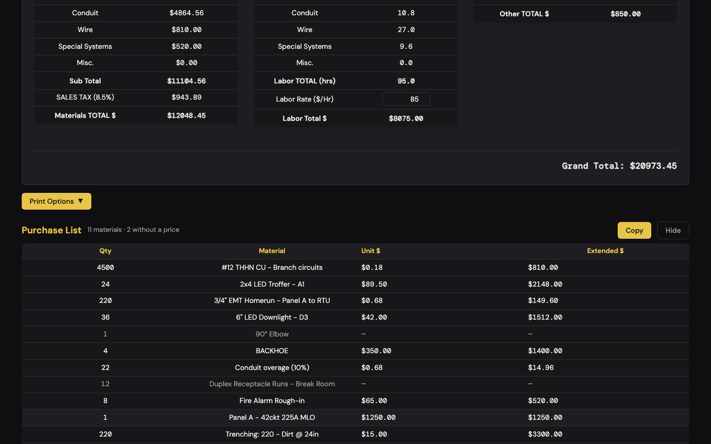
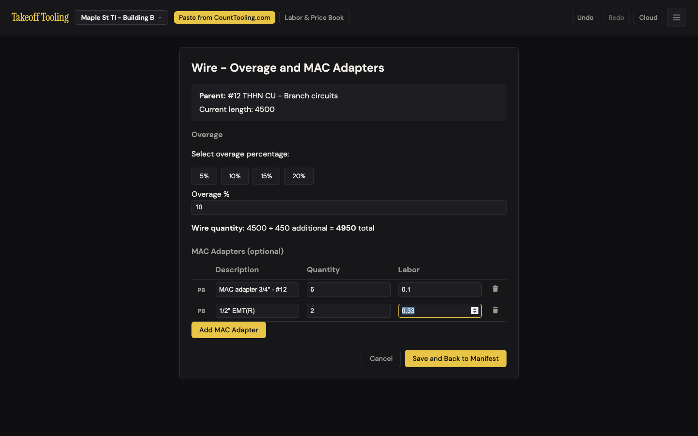
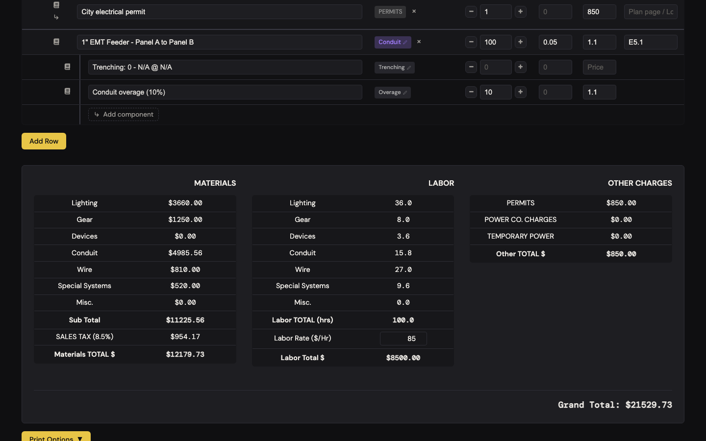

# J5 — Run conduit and wire (the homerun's trench, fittings and waste)

Personas: E · Status: ● walked 2026-09-06 (headless Chromium, :4188, signed out)

> Trigger — the bid has a 220 ft 3/4" EMT homerun from Panel A to the RTU at $0.68/ft and
> 0.04 hrs/ft, and 4,500 ft of #12 THHN at $0.18/ft. Part of the homerun goes underground,
> so it needs 220 ft of trenching, a backhoe for four hours, some sand, a handful of fittings
> and 10–12% waste footage; the wire needs 10% waste and a few MAC adapters. The footage,
> the dollars and the hours all have to come out right on the summary.

## Entry points

- **Manifest row chip** — `.type-badge-flow` "Conduit ✎" / "Wire ✎" (title "Edit in flow") on the parent row → `TakeoffApp.navigateToConduit` / `navigateToWire` (manifest.js:59-61, 450-454). The pencil is the only cue (B-2 holds).
- **Any child chip** — "Trenching ✎", "Trenching Add-on ✎", "Fitting ✎", "Overage ✎", "MAC Adapter ✎" on a child row targets the *parent's* flow (manifest.js:50-54); the conduit wizard then opens at the inferred step (below), not at the child's step.
- **Type modal → Conduit / Wire** — picking the type, or pressing `C` / `W`, sets the type and jumps straight into the flow (modal.js:14-16). Undocumented.
- **Step inference on entry** (app.js:156-207): no children → step 1; a trenching child → step 2; fittings → step 2; an overage child → step 3. So a run that already has an overage always reopens on Overage, whatever chip you clicked.
- *Look-alikes:* the row's `↳` adds a blank untyped child on the manifest; the row's book icon adds book parts as children inheriting the parent's qty **220** (laborBookTargets.js:104-114) — 220 elbows, one click. Neither is the flow.
- No hash route or import path opens either flow.

## Current route (walked 2026-09-06)

Happy path as driven: **conduit 19 actions, 7 decisions; wire 8 actions, 3 decisions.**
Decisions: quick-add vs typing the trench; which rentals/fill; per-hour vs per-day for the
backhoe; preset vs PB vs typed fitting; which search hit; preset % vs custom; whether the
qty-0 PB-filled row needs a quantity.

1. Seeded bid, manifest view. The conduit row shows book icon · `↳` · "Conduit ✎" · × · 220 · 0.04 · 0.68 · E5.1. Summary before anything: Conduit **$149.60** (220 × 0.68), **8.8 hrs**; Wire **$810.00**, **27.0 hrs**; Sub Total $6,389.60. 
2. Clicked "Conduit ✎". Step header "Conduit: **Trenching** · Fittings · Overage" (pills, clickable). Parent panel: "Parent: 3/4" EMT Homerun - Panel A to RTU · Quantity: 220 · Length: 220" (two lines, same number — #12). Fields: Quantity (Feet Of Trenching) · Material to Dig Through · Depth · Price per Foot of Trenching ($), all blank. Quick Add table of 7 presets ("Dirt to 24in - $15" … "Asphalt/Concrete to 36in - $250"). Rentals (+ BACKHOE, SAW CUTTING, DRILLING, HAUL-OFF, MANLIFT) and Fill Materials (+ ASPHALT PATCH, TRENCHING SAND, POLE BASES, CONCRETE PADS, MANHOLES). Cancel · Next: Fittings.
3. Clicked "Dirt to 24in - $15" → fields **220 / Dirt / 24in / 15** (B-7 holds: footage prefilled from the run). No children yet (`childrenBeforeNext: 0`).
4. "+ BACKHOE" → a row appears in a table headed **Description · Quantity (Hours or Days) · Additional Labor · Charge (per Hour or Day)**. Typed 4 · (blank) · 350. "+ TRENCHING SAND" → 3 · 0.5 · 48 — sand under a header that says "Hours or Days" (#10). Tab moves cleanly between these fields and keeps every value (J4's #1 does *not* apply here — conduit.js:385-398 patches the buffer on `change` without re-rendering). Retyped depth as "24 in". 
5. Cancel → `confirm` "Discard unsaved changes in this editor?" → Cancel → still on step 1, every field intact (B-3 holds).
6. "Next: Fittings" → step 2. **At this moment the manifest already holds three children** — `Trenching: 220 - Dirt @ 24 in` (220 @ $15), `BACKHOE` (4 @ $350), `TRENCHING SAND` (3 @ $48, 0.5 hrs) — and an undo frame was pushed; the page says nothing about it. `flowDirty` is false again. Header "Quantity: 220". One blank fitting row (PB · Description · 0 · 0 · Price · trash).
7. Selected "90° Elbow" in "-- Select from list --": **a second row appeared under the blank one** ("90° Elbow · 1 · 0 · Price"); the select snapped back to the placeholder. The blank row stays (C-7 — still true; #11). 
8. "PB" on the blank row → book in fill mode, search focused, banner "Fill: **fitting row 1** — selecting an entry replaces this row's description, labor, and price". Searched "3/4 emt connector": **Assemblies 8** (3/4 EMT CONN D/S, 0.05 hrs $2.66 …) · **Parts 5** (3/4" EMT(R), 0.47 hrs, no price …) · **Elliot Parts 37** ($0.62 diecast set-screw …). Clicked the first Parts Add → row "3/4" EMT(R) · **0** · 0.47 · (no price)"; book closed. Quantity stayed 0 (#8). 
9. "Add Fitting Row" → third blank row. Set the elbow to 4 · 0.15 · 3.25, the EMT(R) to qty 2, trashed the blank. Buffer: EMT(R) 2/0.47/–, Elbow 4/0.15/3.25.
10. Header book icon (beside "Fittings") → book opens **not** in fill mode: banner "↳ Adding parts under: **3/4" EMT Homerun - Panel A to RTU** · ×220 on the bid"; the search box still held my "3/4 emt connector" from step 8, so the Fittings group it was meant to open was not visible (#9). Clicked Add on the Elliot "3/4" DIECAST EMT SET/SCREW CONNECTOR $0.62" → **a fitting row was appended** (qty **1**, labor 0, price "0.621" as a string) and the book stayed open — not ×220 as the banner implies (laborBookTargets.js:92-100). Cleared the search: tab "Conduit", groups Fittings (OPEN) · Connectors · Couplings · Tubing · Special (collapsed) ✓. Closed. 
11. Back → step 1: fields 220 / Dirt / 24 in / 15, both add-on rows intact; the three committed children still on the manifest; no "saved" indicator anywhere on the page. Next → the three fitting rows are still in the buffer. "Next: Overage" → six children on the manifest (trenching, 2 add-ons, 3 fittings — `3/4" EMT(R)` with price `null`); a second undo frame.
12. Step 3: "Current length: 220"; buttons 5% 10% 15% 20%; "Overage %" input; line "**Conduit quantity:** 220 + 0 additional = **220** total". Presets: 5% → "+ 11 = 231", 10% → "+ 22 = 242", 15% → "+ 33 = 253", 20% → "+ 44 = 264". No button shows a pressed state (#12). Typed a custom **12**: focus stayed in the input for both digits (N-8 holds); line "220 + **27** additional = **247** total" — 26.4 ceil'd to 27 (shared.js:15). 
13. "Save and Back to Manifest" → no dialog; manifest. Seven child rows under the homerun, chips **Trenching · Trenching Add-on ×2 · Fitting ×3 · Overage**, then "↳ Add component". Calculator check of the **Conduit bucket $5,025.58**: 149.60 (220 × 0.68) + **3,300.00** (220 × $15) + **1,400.00** (4 × $350) + 144.00 (3 × $48) + 13.00 (4 × $3.25) + 0.62 (1 × 0.621) + **18.36** (27 × 0.68) = 5,025.58 ✓. **Conduit labor 11.8 hrs**: 8.8 (220 × 0.04) + 1.5 (3 × 0.5) + 0.94 (2 × 0.47) + 0.6 (4 × 0.15) = 11.84 ✓. Sub Total $11,265.58; **SALES TAX (8.5%) $957.57** ✓ arithmetically — but $4,844 of that base is trenching, a backhoe and sand, i.e. **$411.74 of tax on services and rentals** (#7). Labor Total $ 96.04 × 85 = $8,163.40 ✓. Grand Total $21,236.56. 
14. Generate Purchase List: "**14 materials** · 2 without a price" — lines include "220 · Trenching: 220 - Dirt @ 24 in · $15.00 · $3300.00", "4 · BACKHOE · $350.00 · $1400.00", "3 · TRENCHING SAND", "27 · Conduit overage (12%) · $0.68 · $18.36", "2 · 3/4" EMT(R) · — · —". Footer $11,265.58 = Sub Total ✓ to the cent (A-1 holds). 
15. Re-entered via the chip → **step 3** directly, 12 in the input, "220 + 27 = 247". Clicked 20% → Save → exactly one overage child, "Conduit overage (20%)" 44 @ 0.68 — replaced, not duplicated ✓. Re-entered via the *Trenching* child chip → still step 3. Back → Back: fittings and trench fields hydrate exactly; Cancel with nothing dirty → no dialog ✓.
16. Changed the parent's quantity to **300** on the manifest. Children unchanged: overage still **44** (20% of 220), Conduit bucket **$5,091.54**. Re-entered: the flow says "Current length: 300 … 300 + **60** additional = **360** total" while the bid still carries 264. Saved → overage 60 → the correct **$5,102.42** (#4). Reset to 220 / 10% (22 @ 0.68 = $14.96).
17. Wire: "Wire ✎" → "Wire - Overage and MAC Adapters"; "Current length: 4500"; same overage section; "MAC Adapters (optional)" table **PB · Description · Quantity · Labor · trash — no Price column**. 10% → "4500 + 450 additional = 4950 total". Typed a MAC row (6 · 0.1) — Tab keeps every value ✓. Added a row, PB → banner "Fill: MAC adapter row 2"; searched "mac" → **Assemblies 0 · Parts 0 · Elliot Parts 0** (#14); fell back to "connector" and took a Parts hit ("1/2" EMT(R)", 0.33 hrs). 
18. Save → children: `Wire overage (10%)` 450 @ 0.18, two MAC adapters (price `null`). **Wire bucket $891.00** = 810 + 81 ✓; **Wire labor 28.3** = 27 + 0.6 + 0.66 = 28.26 ✓. Purchase list "17 materials · 4 without a price"; footer $11,343.18 = Sub Total ✓. A no-change re-save left the children identical (new IDs, one more undo frame — #13).
19. Guards: wire dirty → Cancel → dialog → Cancel keeps you; OK leaves with the saved children intact. Conduit dirty on step 3 → title click → same. **Undo while dirty** → the dialog appears — but see #1.
20. Fresh run "1" EMT Feeder" (100 ft @ $1.10): entered on step 1, pressed Next · Next · 10% · Save without touching trenching → children **"Trenching: 0 - N/A @ N/A" (qty 0, no price)** and "Conduit overage (10%)" 10 @ 1.1 (#8). 

Divergences from the documented route:

- README.md:45-51 is two sentences ("Multi-step flow: Trenching → Fittings → Overage" / "Overage percentage and optional MAC Adapters"). It does not say that Next writes to the bid, that Back does not undo, what an overage costs, or that MAC adapters have no price column.
- ARCHITECTURE.md:155-156 is accurate and even records the invisible MAC price ("no price column in UI; price can still arrive via PB fill") as a design fact rather than a bug — #3 disagrees.
- `_baseline.md` "Still true": *commits at each step transition; Back does not undo* — confirmed, and the UX cost of it is #2 and #5 below (the fact is not re-reported; its consequences are).
- JOURNEY-MAP's pre-registered strength "Focus survives typing … (all flows)" **holds** in both these flows, across fields as well as within them.

## Naive attempt

The homerun needed a trench, so I looked at its row. Three things sat left of the
description — a book, an arrow, a purple "Conduit" chip with a pencil — and nothing said
"trench". The arrow gave me a blank indented row, which I could have typed "Trenching" into,
but I'd be pricing it by hand. Undo. The pencil chip took me to a page whose first word was
Trenching, so that was right. I clicked "Dirt to 24in - $15" and the four boxes filled
themselves, footage included — good. I added a backhoe and, because the column said "Hours
or Days", typed 4 and $350 and hoped it meant hours. Adding sand into the same table felt
wrong: three *hours* of sand? I pressed Next, typed an elbow, pressed Back to check the
backhoe, changed my mind and pressed Cancel — no question asked, so I assumed nothing had
happened. Back on the bid, the homerun now had a $3,300 trenching row and a backhoe under it,
and my elbow was gone. I had to go back in to find out what had and hadn't stuck. Later I
pressed Undo while I was still choosing an overage, answered "Cancel" to the warning, and the
overage line I'd saved earlier had vanished from the bid anyway.

## Evidence

- **Telemetry visibility:** none exists. A rework here should ship `flow_saved {kind:'conduit'|'wire', steps, trenchFt, addons, fittings, overagePct, overageQty}`, `flow_step_committed {kind:'conduit', step}` (to see how often Next is pressed and then Cancel), `flow_discarded {kind, dirty, via:'cancel'|'title'|'undo'}`, and `book_fill {kind:'conduit-fitting'|'wire-mac', resultKind, hadPrice}` — the last would have shown #3 in a day.
- **Doc coverage:** README.md:45-51 (two sentences, see divergences); CLAUDE.md "Flow editors" paragraph (commit at each step — accurate); ARCHITECTURE.md:93 (meta shapes), :100-101 (child types), :155-156 (accurate; documents #3 as a quirk).
- **Specs:** `selectors.test.js:50-64` covers a conduit run with an overage child in the purchase list (parent footage + overage both listed). **No `*.spec.js` drives either flow**: quick-add prefill, add-on rows, step commits, pill jumps, Back/Cancel semantics, the discard guard, PB fill, overage ceil, re-entry step inference, and re-save replacement are all uncovered. `shared.js:computeOverage` has no unit test.
- **Modals:** `#labor-book-modal` in fill mode (PB, conduit fitting ×2, wire MAC ×2) and in "Adding parts under" mode (fittings header icon). Native `confirm()` "Discard unsaved changes in this editor?" ×7 across the walks (Cancel, title, Undo). No other modal.
- **Hotkeys:** `C` / `W` in the type modal (→ straight into the flow). Inside a flow `Esc` does nothing and `Enter` in a field does not advance the step (probed). In the book, `Esc` clears the search first, then closes.
- **Storage / state touched:** `takeoff-project-<id>` and `takeoff-projects-index` only (debounced 400 ms); `takeoff-book` untouched. **Undo frames: three per conduit wizard pass** — one per Next (commitStep1/commitStep2 each wrap a batch, conduit.js:53/96) plus one for Save; one per wire Save; one more for a no-change re-save. Pressing Undo once after a conduit Save removes only the overage; the fittings need a second press, the trench a third. Cloud pushes: none (signed out; supabase aborted).

## Friction findings

| # | Severity | What happens | Why it hurts | Verdict stamp (Phase 2b) |
|---|---|---|---|---|
| 1 | **blocker** (trust) | The Undo button undoes *before* asking. app.js:336-340 runs `TakeoffState.undo()` and only then `navigateToManifest()`, which raises "Discard unsaved changes in this editor?". Answering **Cancel** leaves you in the flow, but the manifest has already been rolled back: with a saved 10% overage (22 ft) on the bid and the flow dirty at 15%, Undo → Cancel → the flow still shows "Current length: 220", the bid now has **no overage child**, Conduit dropped from $4,872.04 by $14.96, and Undo stays lit. Saving then wrote 15% (33 ft) — a different number from either the one on screen before or the one the user thought they'd kept. Same for Redo (app.js:343-347). | The one dialog whose job is "nothing happened" lies; the manifest changes behind an open editor. | **CONFIRMED** (blocker, trust). Re-drove with `dismiss()`: dialog shown, view stays `conduit` step 3 dirty, the saved 10% child (15 @ 1.10) is gone, Conduit $181.50 → $165.00, Redo lit; Redo variant also confirmed — Redo → Cancel put a 23-ft overage back under an open step-2 editor whose buffer had no %, and the next Save deleted it again. |
| 2 | **blocker** | `goToStep` clears `flowDirty` on **every** move, backward included (conduit.js:126), but only forward moves commit. On step 2 I typed "90 deg elbow 3/4 · 4 · 0.15 · 3.25" (**$13.00, 0.6 hrs**), pressed Back, then Cancel: **no dialog**, manifest view, the row gone; re-entering shows one blank fitting row. Same loss via the title or Undo after a Back. The discard guard B-3 installed is defeated by the Back button. | Silent loss of typed work, on the button an estimator presses to double-check the previous step. | **CONFIRMED** (blocker). Typed fitting 3 · 0.12 · 2.40 ($7.20 / 0.36 h) → Back: `flowDirty` false while the buffer still holds the row → Cancel: 0 dialogs, row gone, re-entry shows one blank row. Compounded by a NEW fact: steps 2 and 3 render no Cancel button (Back/Next, Back/Save), so Back→Cancel is the *only* Cancel route from them. |
| 3 | **blocker** (trust) | Wire MAC rows have no Price column (wire.js:46) but PB fill writes one (laborBookTargets.js:55-61) and Save persists it (wire.js:168). Filling a MAC row from the Elliot "3/4" DIECAST EMT SET/SCREW CONNECTOR $0.62" and typing qty 6: the row shows `description · 0 · 0`, nothing with a `$`; saved child `6 @ 0.621`; **Wire bucket $894.73** where everything on screen says **$891.00**. Re-entering the flow hydrates the price back into the buffer (app.js:219) so it survives forever, invisibly. ARCHITECTURE.md:156 records this as intended. | A dollar figure the estimator cannot see, cannot edit in the flow, and did not choose. Small here ($3.73); a $29.98 SS316 connector × 6 is $180. | **downgraded to stumble (trust)**. Mechanism reproduced, bigger: Elliot "SERVICE POST CONNECTORS" $206.45 × 6 → Wire **$2,294.71** with **$1,056.00** visible in the flow, price re-hydrated on re-entry. Downgraded because the estimator *did* see and choose the price — the search hit shows "$206.45", the fill banner says "…labor, and price" — and it sits editable in the MAC child's Price cell on the manifest the moment Save lands; it is hidden in one table, not from the user. The documentation does not lower severity further: an estimator never reads ARCHITECTURE.md. |
| 4 | **blocker** (trust) | Overage is a snapshot, not a percentage. Save computes `ceil(qty × %)` and copies the parent's unit price once (conduit.js:511-528, wire.js:140-157). Parent 220 → **300** on the manifest: the child stays **44 ft** (20% of 220) and the bucket reads **$5,091.54**; the correct 60 ft gives **$5,102.42**. Parent price 0.68 → 0.75: the overage stays @ 0.68 ($4,879.96 vs $4,881.50). Re-entering shows the *right* line ("300 + 60 additional = 360 total") while the bid carries the wrong one, and only a Save reconciles them. The chip says "Overage" and the row says "(20%)", so it reads as live. | Every quantity tweak after the wizard silently under- or over-buys waste; the app displays two different totals for the same run. | **downgraded to stumble (trust)**. Numbers reproduce exactly: parent 150 → 200 leaves 15 ft (Conduit **$236.50** vs correct **$242.00**); price 1.10 → 1.25 leaves the child @ 1.10 ($272.00 vs $275.00); re-entry shows "200 + 20 = 220" and only Save reconciles. Downgraded because every child row on the manifest is a snapshot the estimator can edit in place (the overage row's qty/price inputs are live, not read-only), the error is bounded by `ceil(Δft × %) × $/ft`, and a Save fixes it — users recover; the real cost is the two-totals display. |
| 5 | stumble | **Cancel does not cancel once Next has been pressed.** Step 1 → Next commits the trench (walk 2a: `Trenching: 220 - Dirt @ 24in` 220 @ $15 = **$3,300**) → Back → Cancel: **no dialog**, and the $3,300 stays on the bid. Nothing on any step says "on the bid" / "saved"; the only clue is the Undo button lighting up. Baseline "Still true" records the mechanism; the label is the finding. | An estimator who bails out believes nothing was added; the bid is $4,844 heavier. | **CONFIRMED** (stumble). Quick-add + BACKHOE 4 @ 350 → Next → Back → Cancel: 0 dialogs; "Trenching: 150 - Dirt @ 24in" $2,250 and BACKHOE $1,400 stay (Conduit **$3,815.00**), and nothing in `#main-content` matches saved / on the bid / committed. Not a baseline duplicate: the baseline records the commit rule as a fact; this records that the button is still labelled Cancel and never asks. |
| 6 | stumble (trust) | The trenching child's manifest quantity and its `meta.feet` diverge. Edited the child qty 220 → **200** on the manifest (Conduit −$300 → $3,150.22 ✓ live). Re-entered → step 2 → pill "Trenching": the field reads **220** (app.js:171 prefers `meta.feet`); pressing Next re-commits **220** and the $300 is silently back. Only the wizard writes meta; the manifest never does. | A manifest correction that looks saved gets reverted the next time anyone opens the run. | **CONFIRMED** (stumble, trust). Child qty 150 → 100 on the manifest (Conduit −$750 → $3,214.74) → re-enter lands on step 3 → pill Trenching: field reads **150** → Next: child back to 150, **$3,964.74**. `meta.feet` wins at app.js:171 and `handleFieldUpdate` (manifest.js:373-396) never touches `meta`. |
| 7 | stumble (trust) | Trenching, rentals and fill are **materials**. `trenching`/`trenchingAddon` children roll into the Conduit materials bucket (selectors.js:137-155) so the 8.5% sales tax applies: **$4,844 of trench, backhoe and sand → $411.74 of tax** on this bid. The purchase list counts them among "14 materials" and lists "220 · Trenching: 220 - Dirt @ 24 in · $15.00 · $3300.00" and "4 · BACKHOE · $350.00 · $1400.00" as things to buy (selectors.js:85-94). The sand's 0.5 hrs labor does land correctly in Conduit labor. | Sub-contract and rental dollars taxed as stock and handed to purchasing as a shopping line — a wrong number that looks right, and a PO nobody can place. | **CONFIRMED** (stumble, trust) with a caveat that reshapes P6. $3,650 of trench + backhoe drew **$310.25** of the 8.5% tax and the purchase list carries "150 · Trenching: 150 - Dirt @ 24in · 15 · 2250" and "4 · BACKHOE · 350 · 1400". Counter-evidence: equipment rentals *are* taxable in many states and TRENCHING SAND / ASPHALT PATCH / CONCRETE PADS are real stock that belongs on a PO — the clear-cut error is the sub-contract trench line, not every add-on. |
| 8 | stumble | Phantom and half-counted children. (a) `commitStep1` always adds a trenching child (conduit.js:59-73): Next past an untouched step 1 yields **"Trenching: 0 - N/A @ N/A"** (qty 0, no price) on the bid — every conduit run without a trench carries one. (b) A "+ BACKHOE" click left blank commits "BACKHOE · 0 · —" (only `description` is checked, :78). (c) A PB-filled fitting keeps **qty 0** but a priced qty-0 row **counts once** in the summary (selectors.js:145: `effectiveQty = qty > 0 ? qty : price > 0 ? 1 : 0`): the $0.621 connector at qty 0 put Conduit at $3,450.22 vs $3,449.60, while the purchase list skips qty-0 lines — the two reports disagree by design. | Junk rows on every run; a rule meant for top-level "one panel" rows leaks into components; summary ≠ purchase list. | **CONFIRMED** (stumble). (a) untouched step 1 → "Trenching: 0 - N/A @ N/A" qty 0 / price null on every pass; (b) "+ SAW CUTTING" left blank → child 0 @ null; (c) a PB-filled fitting at qty 0 / $58.4697 adds exactly **$58.47** to Conduit while the purchase list skips it — Sub Total **$5,824.74** vs purchase-list footer **$5,766.27**, so the walker's "A-1 holds to the cent" was seed-dependent (its qty-0 fitting had no price). |
| 9 | papercut | The fittings-header book icon opens "Adding parts under: **3/4" EMT Homerun** · **×220 on the bid**", yet Add appends a fitting row at **qty 1** (laborBookTargets.js:92-100) — the ×220 wording belongs to the manifest-row door (:104). The stale fill-mode search ("3/4 emt connector") is kept, so the Fittings group the button promises to open is hidden until the search is cleared. Adding from here also stores the price as the string `"0.621"`. | Two banners, two quantity rules, one icon; the promised section isn't on screen. | **CONFIRMED** (papercut). Banner "Adding parts under: 1" EMT Feeder - Panel B to AHU · ×150 on the bid"; the search box still held "1 emt connector", the results panel was showing and the Fittings group was not; Add appended qty **1** with price string `"58.4697"` and left the modal open. `commitStep2` parseFloats the string (conduit.js:109), so no data harm. |
| 10 | papercut | The add-on table has one unit vocabulary for two kinds of thing: **Quantity (Hours or Days)** and **Charge (per Hour or Day)** head the rows for TRENCHING SAND, ASPHALT PATCH and CONCRETE PADS as well as BACKHOE. "Additional Labor" has no unit (per hour of rental? per unit?). | The estimator invents the unit; the bid records "3 hours of sand". | **CONFIRMED** (papercut). Headers read verbatim `Description · Quantity (Hours or Days) · Additional Labor · Charge (per Hour or Day)` over one table (conduit.js:191) that receives TRENCHING SAND and BACKHOE alike; the two button groups above it (Rentals / Fill Materials, :170/:180) already know the difference. |
| 11 | papercut (C-7, confirmed) | "-- Select from list --" appends the preset **below** the blank seed row and resets itself (conduit.js:414-424); the blank row stays until trashed (dropped at commit, so no data harm). The six presets carry no labor or price. | One trash click per run, and a preset that saves nothing but a name. | **CONFIRMED** (papercut). Select → rows `["", 0, 0, ""]` then `["90° Elbow", 1, 0, ""]`, select reset to ""; `FITTINGS_LIST` is six bare strings, so there is no labor/price to carry. Not a baseline duplicate: C-7 is explicitly handed to J5 ("folded into J5's walk as an observation"). |
| 12 | papercut | Parent panel says the same number three ways: step 1 "Quantity: 220 / Length: 220", step 2 "Quantity: 220", step 3 "Current length: 220"; none says **ft**. The four % buttons never show a pressed state (`class=""` after a click), only the input beneath moves. | Reads as two different facts; the picker looks unresponsive. | **CONFIRMED** (papercut). "Quantity: 150" / "Length: 150" on step 1, "Current length: 200" on step 3, no unit anywhere; all four % buttons `class=""` after clicking 10% (shared.js:41-46 renders no state). |
| 13 | papercut | Three undo frames per wizard pass and one for a no-change re-save (walk 3 C/H: 18 → 19 frames with nothing changed). After Save, one Undo removes only the overage — a user expecting "undo the wizard" gets a third of it. | Undo is a protected strength; partial and phantom frames erode it. | **CONFIRMED** (papercut). Undo depth (counted non-destructively: undo to empty, redo back): no-change re-save from step 3 **15 → 16**; a no-change full pass (pill 1 → Next → Next → Save) **16 → 19**; one Undo after a Save removed only the overage and left the phantom trench child. |
| 14 | papercut / gap | The wire flow names "MAC Adapters" but the book has none: "mac" and "mac adapter" return **Assemblies 0 · Parts 0 · Elliot Parts 0**, so the PB button on every MAC row leads nowhere useful. | A door with nothing behind it; the estimator types the adapter and its labor from memory. | **CONFIRMED** (papercut/gap) — cause re-diagnosed. "mac" and "mac adapter" → 0 · 0 · 0 reproduced; but "mc connector" in the same MAC fill mode → **Assemblies 2 · Elliot Parts 43** (SNAP TYPE MC CONNECTOR, 4-SCREW MC CONN …) and `mc-labor-book.json` holds 15 "MC CONN" rows. The parts exist; the word on the screen does not reach them — a vocabulary gap for the N-1 synonym table, not an empty book (P11 re-shaped). |

Confirmed holding (not re-reported): A-2 overage priced at the run's unit price (27 × 0.68 = $18.36; 450 × 0.18 = $81.00), labor 0 · B-1 centered flow · B-2 pencil on chips · B-3 guard on title/Cancel when dirty, none when clean (except #2) · B-7 quick-add prefills 220 ft · C-3 trash icons on every row · N-8 custom % keeps focus, total patched live · A-1 purchase list = summary to the cent ($11,265.58 / $11,343.18). C-7 assessed: still present, papercut (#11).

## Proposals

**P1 — polish — ask, then undo.** In app.js:336-347 check `getFlowDirty() && view !== 'manifest'` and `confirm()` *before* `TakeoffState.undo()/redo()`; return on Cancel. Same three lines for Redo.
(1) removes the "what just happened" re-open after a Cancel; (2) no words; (3) removes an impossible state — a flow open over a manifest that changed under it; (4) invisible: Cancel means cancel. `spiritPass: true` — verifier: confirmed; the guard must fire only while a flow view is open (as written), and the Redo handler needs the identical three lines — the Redo variant restores a child the open buffer never hydrated, and the next Save deletes it again.

**P2 — polish — Back keeps your edits armed.** In `goToStep` (conduit.js:118-128) clear `flowDirty` only on forward moves (which commit); on backward moves leave it. Cancel/title/Undo after a Back then ask, as B-3 intended.
(1) removes silent loss; (2) n/a; (3) one condition, no new surface; (4) the existing dialog appears where it already appears elsewhere. `spiritPass: true` — verifier: after P3 this becomes moot; land P2 only if P3 slips. Verifier (2b): agreed; note that steps 2 and 3 have no Cancel button at all, so even with P2 the estimator's route to Cancel from those steps is Back first — P2 alone protects the title/Undo exits, and a Cancel on every step is the missing half.

**P3 — rework — one Save for the whole run.** Make Next and Back pure navigation (no `commitStep1/2`), keep everything in the temp buffer, and write trench + add-ons + fittings + overage in **one** batch on "Save and Back to Manifest" (the wire flow already works this way, wire.js:131-177). Cancel discards all of it and the guard covers all of it. Skip the trenching child when feet ≤ 0 and skip add-on/fitting rows with no description **or** qty 0 (fixes #8a/b; #5; #13's extra frames).
(1) removes two hidden decisions ("is this on the bid yet?", "is Cancel safe?") and two undo frames per run; (2) "Save", "Cancel", "run" — no "commit"; (3) removes `commitStep1/commitStep2`'s mid-wizard writes (~60 lines), the `Trenching: 0 - N/A @ N/A` child on every non-trenched run, the three-frame undo, and the Back/Cancel special cases; (4) it behaves like every other editor they've used. `spiritPass: true` — caveat: `showLaborBookModalForConduitFittings`' "add under" path (laborBookTargets.js:92-100) already writes to the buffer, so it survives; the step-1 fields are read from the DOM (conduit.js:37-40) and must move to the buffer on `input` first. Verifier (2b): `spiritPass: true` confirmed — two more caveats: the step pills also commit on a forward jump (conduit.js:121-124) and must become pure navigation too; and the same change should put a Cancel on steps 2 and 3 (today only step 1 has one), which with a single Save is the natural shape and costs no new concept.

**P4 — rework — overage that follows the footage.** Treat an overage child as `{percent}` and derive qty/price at read time: in `manifest.js` `handleFieldUpdate`, when a parent's `quantity` or `price` changes and a child has `meta.overagePercent`, recompute `quantity = ceil(qty × %)` and `price = parent.price` (or do it in `getSummaryBreakdown`/`getPurchaseList` and render the derived values read-only). Child row reads "Conduit overage (20%) · 60 · 0.75" the moment the parent changes.
(1) removes the re-enter-and-save round trip after every quantity change; (2) "waste follows the footage"; (3) removes the two-totals state (#4) and the "(20%)" label lying about being live; (4) the row moves when the run moves. `spiritPass: true` — caveat: the overage child's qty/price inputs on the manifest should become read-only or be treated as overrides that drop `meta.overagePercent`; decide one. Verifier (2b): `spiritPass: true` only for the **write-time** half (recompute in `handleFieldUpdate` when the parent's qty/price changes). The read-time alternative fails (3): pdf.js, share links, `getPurchaseList` and `getSummaryBreakdown` all read the stored child, so deriving at render would create a new stored-vs-shown split. Take the override rule (manual edit drops `meta.overagePercent`) — read-only child inputs would add a special row type. Finding downgraded to stumble, so this is a polish-grade fix, not Tier 1.

**P5 — polish — show what PB filled.** Add the Price column to the MAC table (wire.js:46-48, mirror the fittings table) and drop the `if (priceNum != null)` special case (laborBookTargets.js:61) so wire-mac fills exactly like conduit-fitting. Delete the ARCHITECTURE.md:156 quirk note.
(1) removes an invisible number and the surprise on the summary; (2) "Price"; (3) removes a branch and a documented exception — the two flows share one rule; (4) the column is where the other flow has it. `spiritPass: true` — the added column is a surface, but it replaces a hidden field that already exists. Verifier (2b): confirmed `spiritPass: true`; the manifest child row already shows the price after Save, so the column brings the flow in line with what the manifest shows rather than adding a new number.

**P6 — rework — trenching and rentals are a charge, not stock.** Give `trenching` and `trenchingAddon` children their own summary line — "Trenching & rentals $4,844.00" under OTHER CHARGES beside Permits (untaxed by default, with the 8.5% rule stated on the summary as applying to materials only) — and list them in the purchase list under a separate "Rentals & subs" heading (or leave them out with a count: "3 rentals/services not listed"). Keep their labor in Conduit labor.
(1) removes the mental subtraction an estimator does today to find the *material* number; (2) "trench", "rental", "sub"; (3) removes $411.74 of wrong-looking tax and two unbuyable PO lines; (4) it lands where permits already land. `spiritPass: true` — caveat: rental taxability varies by state; default untaxed and say so, do **not** add a toggle. Verifier (2b): **`spiritPass: false` as written, true re-shaped.** As written every `trenchingAddon` leaves materials — but TRENCHING SAND, ASPHALT PATCH, POLE BASES, CONCRETE PADS and MANHOLES are stock that belongs taxed and on the PO, so the proposal fails (3) by swapping one wrong number for another and its own caveat concedes rentals are often taxable. Re-shape: move only the `trenching` line (a sub-contract) plus the add-ons from the **Rentals** button group (the UI already separates Rentals from Fill Materials, conduit.js:170/180 — record the group on the child) to the other-charges line; Fill Materials stay materials. That version passes all four.

**P7 — polish — components with qty 0 count 0.** In selectors.js:145/148 apply the "priced qty-0 row counts once" rule only to top-level items; for children use `qty`. Seed PB-filled fitting/MAC rows with qty **1** (as the preset does) so the estimator sees a number to change.
(1) removes the summary-vs-purchase-list disagreement; (2) n/a; (3) removes a special case from the component path; (4) a filled row shows "1", the obvious thing to edit. `spiritPass: true` — verifier: the seed-1 half touches J4 P2's "seed with the run count" question — for fittings, 1 is right (fittings aren't per foot). Verifier (2b): confirmed `spiritPass: true`; the labor twin of the rule (selectors.js:25 and :148, `laborQty = qty > 0 ? qty : unitLabor > 0 ? 1 : 0`) must get the same top-level-only split or a qty-0 labored child still counts one hour-unit while the purchase list ignores it. The live disagreement this fixes was $58.47 in my seed.

**P8 — polish — the manifest edits the trench too.** When a `trenching` child's quantity or price changes on the manifest, update `meta.feet`/`meta.pricePerFoot` and regenerate the description (manifest.js `handleFieldUpdate`), so re-entering the wizard shows the corrected value.
(1) removes a silent revert; (2) "feet"; (3) removes the two-sources-of-truth split for the trench; (4) invisible. `spiritPass: true`. Verifier (2b): confirmed; P4's write-time recompute and this land in the same `handleFieldUpdate` branch, so ship them as one change.

**P9 — polish batch — step 1 and step 2 labels.** Split the add-on table into **Rentals** (Description · Hours/Days · Rate · Labor) and **Fill & site** (Description · Qty · Unit price · Labor); parent panel once, with the unit: "220 ft"; `.active` class on the chosen % button (shared.js:41-46, conduit.js:481-489, wire.js:67-75); the preset select fills the blank seed row when one is empty (C-7) and carries the preset's labor from `js/data/fittings.js` when present; the fittings-header book icon clears the fill search and drops "×220 on the bid" from its banner.
(1) removes a trash click per run and a unit guess per add-on; (2) "ft", "rate", "hours"; (3) removes one misleading banner variant and a duplicated line; (4) the words are the ones on the header. `spiritPass: true`. Verifier (2b): confirmed; "carries the preset's labor when present" is a data task first — `FITTINGS_LIST` is six bare strings today, so that clause ships nothing until fittings.js grows fields. The Rentals / Fill split is also what re-shaped P6 needs, so record the button group on the add-on row here.

**P10 — teach — until P3 lands.** The first guide must say: "In the Conduit editor, **Next puts that step on the bid**. Back does not take it off — use Undo (once per step). Cancel only throws away the step you are looking at." `spiritPass: n/a` (teach).

**P11 — gap — MAC adapters in the book.** Add a "MAC adapters" section to the Wire tab defaults (js/data/laborBookDefaults.js, bump `LABOR_BOOK_DEFAULTS_VERSION`) with the common sizes and a labor figure, and map the supplier's MAC/MC-connector category to it, so the PB on a MAC row finds something.
(1) removes typing every adapter and its labor from memory; (2) "MAC adapter" is the trade word already on the screen; (3) removes an empty search on a button the flow already shows; (4) same PB, now with hits. `spiritPass: true`. Verifier (2b): `spiritPass: true` but re-shaped smaller. "mc connector" in MAC fill mode already returns Assemblies 2 · Elliot Parts 43, so the estimator's word is the gap, not the book: a synonym group (`mac` ↔ `mc`, "mac adapter" ↔ "mc connector") in the `TakeoffUtils` token-matcher table (utils.js, the N-1 groups near :68) fixes #14 with zero new surface. A defaults section is only warranted for the labor figures the Elliot rows lack.

**Keep (document as-is):** quick-add prefilling the run's footage; the live "220 + 27 additional = 247 total" line with a custom % that keeps focus; overage priced at the run's unit price with zero labor; one overage child per run (replaced, never duplicated; blank % removes it); step inference on re-entry; exact hydration of every field on Back; Tab working across every field in both flows; discard guards on title and Cancel; the purchase list agreeing with the summary to the cent; conduit and wire labor math exact to the hundredth.

## Guide actions

- Article "Trench, fittings and waste on a conduit run" must carry: the chip with the pencil (or `C` in the type modal) is the door; quick-add sets material/depth/$-per-ft *and* the footage; rentals are hours-or-days × rate; **Next saves the step onto the bid — Back does not undo it** (until P3); fittings: PB fills a row from the book, the preset list only fills a name; overage is `ceil(ft × %)` bought at the run's $/ft with no labor, and today it is **frozen at Save** — re-open and Save after changing the run's footage (until P4); MAC adapters take a price only through PB and don't show it (until P5).
- README rows to fix/add: expand "Conduit Flow"/"Wire Flow" (README.md:45-51) with the above; add the overage rule and the trenching-is-taxed-as-material fact (or its P6 replacement); note `C`/`W` in the type modal open the flow directly.

## Demo moment

Click "Dirt to 24in - $15" and watch 220 ft fill itself, press Next twice, type 12 into
Overage % and read "220 + 27 additional = 247 total" as you type, Save — the homerun grows
seven child rows and the Conduit line reads $5,025.58, which a calculator confirms line by
line. Screenshots 02 → 06 → 07.

## Walk notes

- Server: the read-only review server at `http://localhost:4188` (not started or stopped here). Headless Chromium via `@playwright/test`, fresh context 1440×900, signed out, `context.route(/supabase/i, abort)` — the single console error `Failed to load resource: net::ERR_FAILED` on every run is that abort.
- Seed via `page.evaluate`: project "Maple St TI - Building B", the standard 8 rows, labor rate 85 (Sub Total $6,389.60 / 93.0 hrs before the walk). Walk 2 seeded only the conduit and wire rows.
- Dialogs auto-handled with a switchable mode (`dismiss` for stay-put tests, `accept` otherwise); every dialog was the same `confirm`.
- **Reused artifacts from the first walker** (cut off before writing this dossier): `walks/run-conduit-and-wire/walk.js` → `results.json` (the full route, screenshots 01-08) and `walk2.js` → `results2.json` (Cancel-after-Next, qty-0 fitting, stale trench meta, invisible MAC price, undo-while-dirty on wire, assembly fill). Screenshots 01-08 are theirs and were checked against the results before reuse. This walker added `walk3.js` → `results3.json` (Back-clears-dirty, Undo-before-guard on conduit with exact children before/after, Tab-focus probe on add-on/fitting/MAC rows, undo frame count per wizard pass, stale overage price after a parent price change, % button active state, Esc/Enter in a flow) and screenshots 09-10. All scripts live in the scratchpad, not the repo.
- **Verifier: re-drive #1 first** (`walk3.js` section D: dirty on step 3, click `#undo-btn`, dismiss the dialog, read `TakeoffState.getItemById(conduit).children` — the overage child is gone while `getCurrentView()` is still `conduit`), then #2 (section B: type a fitting, Back, Cancel — no dialog, row gone), then #3 (walk2 section d: MAC row DOM has no `$`, saved child carries `0.621`, Wire bucket 894.726).
- Not walked: the conduit/wire flows at tablet and phone widths (J14 — the flow tables scroll in their own strip per A-7); the row's book icon adding ×220 children to a conduit run (J6); printing a bid with trenching lines (J9); how Count Tooling imports type conduit/wire rows (J2).

## Verification

**Date:** 2026-09-06 (Phase 2b adversarial pass). **Method:** headless Chromium via `@playwright/test`, fresh context 1440×900, signed out, `context.route(/supabase/i, abort)`; dialogs driven in both `dismiss()` and `accept()` modes; console errors logged (only the expected `net::ERR_FAILED` from the Supabase abort, every run). Own scripts, not the walker's: `scratchpad/walks/run-conduit-and-wire/verify/verify.js` → `results.json` (sections A–E) and `mcsearch.js` (book vocabulary probe). **Seed (independent):** project "Verify J5 - Oak Ave Shell", rate 92 — Panel B 1 @ $900 / 6 h; **1" EMT Feeder 150 ft @ $1.10 / 0.05 hrs-ft** (Conduit $165.00, 7.5 h); **#10 THHN 3,000 ft @ $0.32 / 0.007** (Wire $960.00, 21.0 h). Every dollar/hour figure below was derived by hand first, then read from `TakeoffSelectors.getSummaryBreakdown` *and* the rendered summary table.

**Re-drives (expected → observed):**

| # | Re-drive | Expected | Observed | Stamp |
|---|---|---|---|---|
| 1 | Saved 10% (15 @ 1.10) → re-enter → 15% (dirty) → Undo → dialog → Cancel | dialog, nothing changes | dialog; view `conduit`/step 3/dirty; overage child gone; Conduit 181.50 → 165.00; Redo lit; screen still "150 + 23 = 173"; Save wrote 23 ft. Redo variant: 23-ft child restored behind an open step-2 editor, deleted again by the next Save | CONFIRMED |
| 2 | Type fitting 3 · 0.12 · 2.40 → Back → Cancel | dialog | `flowDirty` false after Back (buffer intact), 0 dialogs, fitting never on the bid, re-entry one blank row | CONFIRMED |
| 3 | MAC row PB → Elliot "SERVICE POST CONNECTORS" $206.45, qty 6 → Save | Wire 960 + 96 = 1,056.00 visible | Wire **2,294.71** (= 1,056 + 6 × 206.451); row DOM `description · 0 · 0`, no `$` in the MAC section; re-entry re-hydrates 206.451; manifest child Price cell shows 206.451 | downgraded → stumble |
| 4 | Parent 150 → 200; then price 1.10 → 1.25 | 242.00; 275.00 | 236.50 (child 15 ft); 272.00 (child @ 1.10); re-entry "200 + 20 = 220"; Save → 242.00 | downgraded → stumble |
| 5 | Quick-add 150/Dirt/24in/15 + BACKHOE 4 @ 350 → Next → Back → Cancel | — | 0 dialogs; Conduit 3,815.00 = 165 + 2,250 + 1,400; no "saved" text in `#main-content` | CONFIRMED |
| 6 | Trench child qty 150 → 100 on manifest → re-enter → pill 1 → Next | 100 kept | −750 live (3,214.74), field reads 150, Next restores 150 (3,964.74) | CONFIRMED |
| 7 | Tax share of trench + backhoe | 3,650 × 8.5% = 310.25 | 310.25; both on the purchase list as buy lines | CONFIRMED (caveat) |
| 8 | Untouched step 1 → Next; blank SAW CUTTING; qty-0 fitting @ 58.4697 | — | "Trenching: 0 - N/A @ N/A" 0/null; SAW CUTTING 0/null; summary +58.47 vs purchase list 0 → Sub Total 5,824.74 vs footer 5,766.27 | CONFIRMED |
| 9 | Header book icon after a fill search | — | banner "…· ×150 on the bid", stale "1 emt connector", Fittings group hidden, Add → qty 1, price `"58.4697"` string, modal stays open | CONFIRMED |
| 10–13 | headers / preset / labels / frames | — | headers verbatim; preset below blank + reset; "Quantity: 150 / Length: 150", `class=""` ×4; frames 15→16 (re-save), 16→19 (no-change pass) | CONFIRMED |
| 14 | "mac", "mac adapter", then "mc connector" | 0 / 0 / ? | 0·0·0, 0·0·0, **2·0·43** | CONFIRMED, cause re-diagnosed |

**Counter-evidence hunts:** (a) *Documentation as a defence* — the step-commit rule (CLAUDE.md, ARCHITECTURE.md:155, baseline "Still true") and the MAC-price quirk (ARCHITECTURE.md:156) are documented for developers; no estimator reads them, so documentation moved no severity. The baseline's "Still true" lines describe the mechanism; #2 (the guard has a hole) and #5 (the label lies) are its consequences, not duplicates. (b) *#3* — the price is visible at pick time (search hit "$206.45") and in the manifest child's Price cell right after Save: hidden in one table, not from the user → stumble. (c) *#4* — every child on the manifest is an editable snapshot; the overage row's qty/price inputs are live (`disabled:false, readOnly:false`), so the estimator can correct it in place and Save reconciles → stumble; the two-totals display remains the real cost. (d) *#7* — fill materials are genuine stock and rentals are taxable in many states; the sub-contract trench line is the clear-cut case (reshaped P6). (e) *#11* — C-7 is delegated to J5 by the baseline, so not a duplicate. (f) *#14* — the catalog holds the parts under "MC CONN"; the fix is vocabulary (reshaped P11). (g) *Walker's "A-1 holds to the cent"* — seed-dependent: it holds only while no priced qty-0 child exists; with one, summary and purchase list differ by that price (#8c). Not an A-1 regression (different mechanism), but the protected strength "agrees to the cent" carries that condition — flagged for J8.

**NEW in passing:**
- **NEW-1 (stumble):** conduit steps 2 and 3 have **no Cancel button** — step 2 renders Back / Next: Overage, step 3 Back / Save (conduit.js:263-266, 286-289). The only Cancel is on step 1, reachable only via Back, which clears the guard (#2). Exits from steps 2/3 are therefore Back→Cancel (never asks) or the app title (asks). Folded into P2/P3 caveats.
- **NEW-2 (papercut):** flow price inputs and the manifest child Price cell show sub-cent supplier prices raw — `58.4697`, `206.451` (Elliot prices are stored to 4 decimals). C-1 fixed the review queue only; the flows and the manifest inputs did not get the rule.
- **NEW-3 (belongs to #1):** Redo while a flow is dirty re-inserts a child the open buffer never hydrated; because the buffer's `overagePercent` is `null`, the very next Save deletes that child again (observed: the 23-ft overage). P1's Redo lines are not optional.

**Baseline re-verified:** B-2 ✓ chip `title="Edit in flow"` with the pencil SVG · B-3 ✓ dirty Cancel asks on conduit step 1 and on wire; dismiss keeps you with fields intact, accept leaves with saved children intact · B-7 ✓ quick-add filled 150 / Dirt / 24in / 15 · A-2 ✓ overage 15 @ 1.10 labor 0 and 300 @ 0.32 labor 0 · N-8 ✓ typing "12" kept focus in `#overage-percent`, line patched live to "150 + 18 additional = 168 total".

**Tally:** 14 findings → **CONFIRMED 12 / downgraded 2 (#3, #4 → stumble) / KILLED 0**. Proposals: `spiritPass` true 9 (P1, P2, P3, P4 write-time only, P5, P7, P8, P9, P11 re-shaped smaller) · **false 1 (P6 as written — fill materials are stock; passes re-shaped to trench + Rentals group only)** · n/a 1 (P10). Cloud pushes: none.
