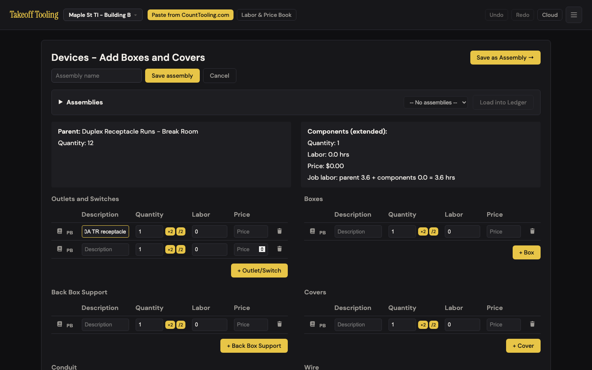
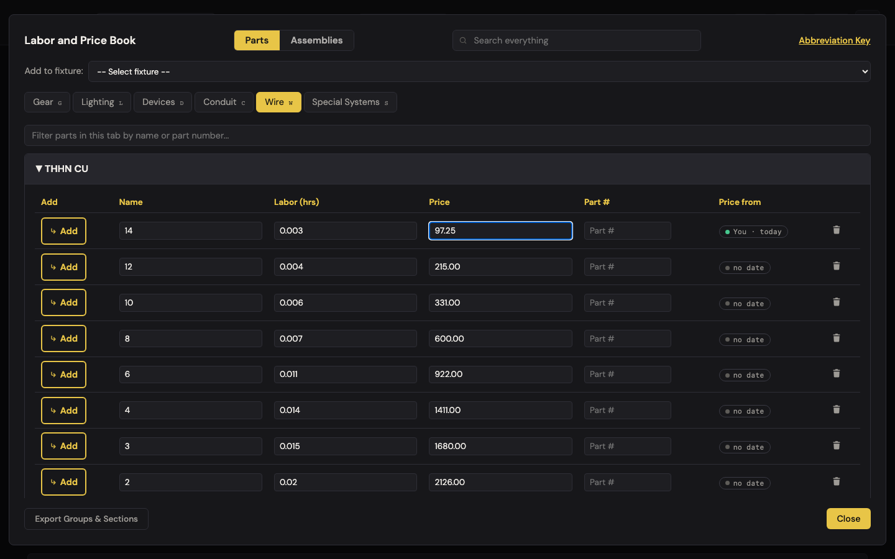
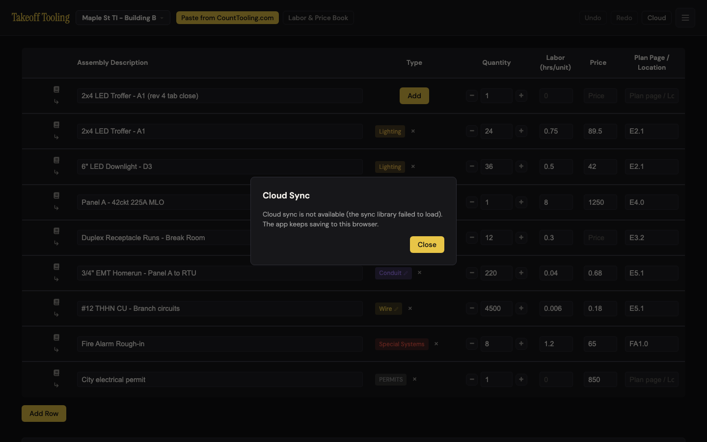
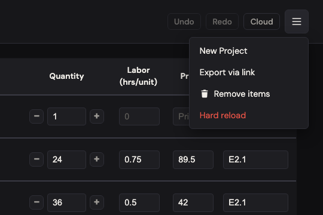
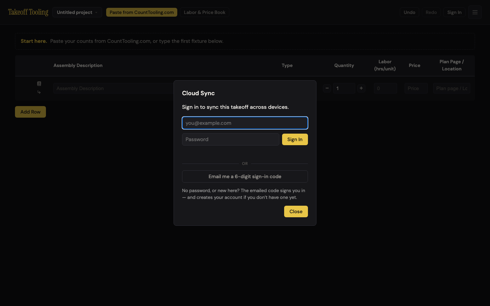
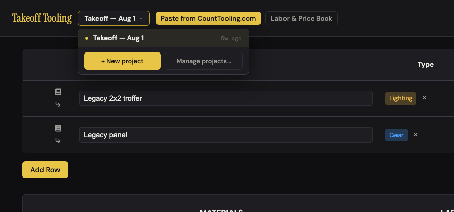

# J11 — Close the laptop, get the bid back (and have it follow you)

Personas: E T · Status: ● walked 2026-09-06 (headless Chromium 1440×900, review server :4188, fresh profile per context, **signed out**; cloud interior = wall, documented from `js/cloud.js` — never signed in, never sent a code, no request ever reached `*.supabase.co`)

> Trigger — it's 5:40 pm, the Maple St bid is half priced, and the estimator shuts the
> laptop without looking for a Save button. Tomorrow it has to be exactly where they left
> it. A week later they sign in so the same bid shows up on the office desktop too.

## Entry points

- **Automatic** — every manifest / labor-rate / project-name edit schedules a 400 ms debounced write of `takeoff-project-<id>` (`js/state.js:147-150`); book edits do the same for `takeoff-book` (`:161-164`); assemblies write immediately (`js/storage.js:119-126`). There is no Save button, hotkey, or menu item anywhere in the app.
- **`beforeunload`** — flushes both documents (`js/app.js:378-380` → `TakeoffState.persistAllNow`). Fires on reload, tab close, navigation. No prompt is ever shown.
- **Boot** — `TakeoffState.restoreOnBoot()` (`js/state.js:200-218`): migrate legacy → load book → load the index's `currentId` project. Synchronous, before first paint.
- **`#cloud-btn`** "Sign In" / "Cloud" / "Syncing…" / "✓ Cloud" / "⚠ Cloud" (title "Sync this takeoff across devices") → `#cloud-modal` (`js/cloud.js:536-542, 693-698`).
- **Session restore** — `onAuthStateChange` on load with a stored Supabase session → `syncDown()` once per page load (`js/cloud.js:516-528`). *(wall)*
- **`visibilitychange` → hidden** — `flushPending()` pushes queued cloud writes (`js/cloud.js:529-531`). *(wall)*
- **☰ → Hard reload** — `persistNow()` then `caches.delete(*)` then `location.replace` (`js/app.js:367-375`). Title: "Reload the app with a cleared code cache (keeps your data)".
- **Project switcher** `#project-switch-btn` — the only place a "when" is shown: each project row carries a relative age ("5w ago", "just now").

## Current route (walked 2026-09-06)

Happy path (local half): **0 steps, 0 decisions** — the estimator does nothing and it works. Signed-in half (designed, not walked): **3 steps, 1 decision** on the second device (open app → Sign In → find the bid in the project switcher; the decision is password vs. emailed code).

1. Seeded the standard bid (8 rows, $85/hr, project "Maple St TI - Building B"). Header shows Undo · Redo · **Cloud** (this context blocks the sync CDN) · ☰. Scanned every button label and `title` in the DOM for the word "save": **zero hits**. 
2. Typed a new description ("… (rev 2)"), waited 500 ms, reloaded → row, project name, and $85 rate all back. `takeoff-project-<id>.savedAt` advanced.
3. Typed "(rev 3 immediate)" and reloaded **the same tick**. localStorage still held "(rev 2)" at that instant (debounce pending); after reload the input read "(rev 3 immediate)" — the `beforeunload` flush works.
4. Opened the Devices flow via the chip's pencil, added an Outlet/Switch row, typed "Duplex 20A TR receptacle" (flowDirty = true; children in storage = 0), reloaded. **0 dialogs**, back on the manifest, children = 0. The unsaved flow buffer is gone with no warning (inside the app, leaving via the title/Cancel does ask — B-3). 
5. Typed "(rev 4 tab close)" and closed the tab (real close → `beforeunload` runs); new tab in the same profile → "(rev 4 tab close)" present, 9 rows.
6. Typed "(rev 5 crash)" and killed the page without unload handlers (crash / force-quit inside the 400 ms window) → new tab shows "(rev 4 tab close)". The last keystrokes of a crash are lost; expected for a debounce, recorded as a design fact.
7. Labor & Price Book → Wire tab → expanded "THHN CU" → changed the first price 95.00 → 97.25 via the real input, closed, saved an assembly, reloaded. `takeoff-book` holds `{price:"97.25", priceSource:"You", pricedAt:"2026-09-06", edited:true}`; `takeoff-assemblies` holds "Break-room duplex kit". 
8. Clicked **Cloud** (CDN blocked): modal reads exactly "Cloud sync is not available (the sync library failed to load). The app keeps saving to this browser." Esc closes. 
9. ☰ menu: New Project · Export via link · Remove items · **Hard reload** (red). Typed "(rev 6 hard reload)", clicked it → edit and the 97.25 book price both survived. 
10. Went offline (signed out): Add Row, typing, Parts side of the book, summary — all work. Reload while offline → `net::ERR_INTERNET_DISCONNECTED`, empty document, no app. Back online → the offline-added row is there. The book's **Assemblies** side offline says "Could not load mc-assemblies/mc-labor-book.json — serve the app locally." 
11. Second context, CDN allowed, auth untouched: header reads **Sign In**; modal copy verbatim: "Sign in to sync this takeoff across devices." · email (placeholder you@example.com, focused on open) · Password · **Sign In** · "OR" · **Email me a 6-digit sign-in code** · "No password, or new here? The emailed code signs you in — and creates your account if you don't have one yet." · Close. Clicking **Sign In** with both fields empty: nothing happens, no message. Clicking the code button with no email: "Enter your email first." Esc closes. No `sb-*` keys, no request to `supabase.co`. 
12. Third context, legacy `takeoff-workspace` (`savedAt` 2026-08-01, two rows, $75) planted before boot → project **"Takeoff — Aug 1"** open, $75 rate, index `updatedAt` = the legacy date, switcher shows "5w ago", `takeoff-workspace` left intact as the backup. 

Divergences from the documented route:

- README "Cloud Sync": "Newest save wins for the workspace" — stale; there is no workspace any more, it is **per project** (`takeoff_projects` rows, last-write-wins by `updated_at`, `js/cloud.js:172-246`) plus a whole-book newest-`savedAt` rule (`:89-108`).
- ARCHITECTURE.md line 125 says accounts "are provisioned in the project's auth tables"; the code creates one on the emailed-code path (`signInWithOtp({ shouldCreateUser: true })`, `js/cloud.js:492`) and the modal copy says so (C-10). Password accounts are the provisioned ones (dev → Manage Users). Two truths, one doc.
- CLAUDE.md "Quick facts" lists tables `takeoff_store` + `takeoff_suggestions`; `takeoff_projects` and `takeoff_profiles` are missing.
- ARCHITECTURE.md line 125 also says pulls go through `TakeoffState.adoptWorkspace`; the functions are `adoptBook` / `adoptProject` (`js/state.js:222-238`).
- `js/cloud.js:1-25` header comment still says "no passwords" and "Keys mirror localStorage: 'workspace' and 'assemblies'" — both superseded in the same file.

## Naive attempt

I priced six rows and went to close the laptop. Looked at the header for Save — Undo, Redo, "Cloud", a hamburger. Opened ☰: New Project, Export via link, Remove items, and a red **Hard reload**. Red plus "hard" read like it wipes something, so I left it alone. "Cloud" felt like where saving lives, so I clicked it: a dialog told me syncing wasn't available and "The app keeps saving to this browser." That was the first time anything told me it saves at all. I still exported a link to myself as insurance.

Next morning it was all there. I never learned *when* it saved; the only clock in the app is "just now" next to the project name in the switcher, and I found that by accident while looking for a second job.

On the office machine the button said **Sign In**. I don't have an account — the dialog says the emailed code makes one, fine. But I hesitated: does "Sign In" mean I've been working without an account this whole time and it wasn't really saved? (No — but nothing says "already saved here; sign in only to carry it to another computer.") What I'd hit next, from the code: after signing in my screen would still show the blank "Untitled project" the office machine started with; the Maple St bid would be one click away in the switcher, and that blank Untitled project would now be on my laptop too.

## Evidence

- **Telemetry visibility:** none exists. A rework here should ship `cloud_signed_in {method: password|code, new_account}`, `cloud_sync_conflict {kind: project|book|assembly, winner: local|remote}`, and `cloud_push_failed {code}` — conflicts are the one thing on this route nobody can see today, in the app or the dashboard.
- **Doc coverage:** README "Cloud Sync" (one paragraph; stale merge rule; no mention of what happens on a second device or that projects are per-row). ARCHITECTURE "Cloud sync" + "localStorage keys" (accurate on keys, debounce, `beforeunload`; stale on `adoptWorkspace` / provisioning). CLAUDE.md "Persistence" bullet (accurate). Nothing anywhere says "there is no Save button".
- **Specs:** `smoke.spec.js` — edit → `persistNow()` → key holds it (calls persist directly, does not test the debounce or `beforeunload`). `cloud-sync.spec.js` — with a real test account: sign-in → "✓ Cloud"; opt-in sharing → a book correction lands in `takeoff_suggestions`, revert prunes, opt-out withdraws; create project → row appears with the manifest, rename follows, delete removes. **Not covered anywhere:** the `beforeunload` flush, the legacy migration, `syncDown` merge outcomes (book newest-wins, assemblies union, project per-row LWW), the legacy cloud `workspace` row, `visibilitychange` flush, the `⚠ Cloud` state, two devices. No unit test touches `storage.js` or `cloud.js`.
- **Modals:** `#cloud-modal` (three bodies: disabled / signed-out form / code-entry; signed-in body with Sync Now · Sign Out · sharing toggle). `#labor-book-modal` incidentally (step 7).
- **Hotkeys:** Esc closes the cloud modal (`js/cloud.js:710-717`); Enter in email → focuses password; Enter in password → Sign In; Enter in code → Verify.
- **Storage / state touched:** `takeoff-projects-index`, `takeoff-project-<id>`, `takeoff-book`, `takeoff-assemblies`, legacy `takeoff-workspace` (read-only after migration). No undo frames on this route (persistence is not undoable; `adoptProject` *clears* the undo stack, `js/state.js:234-236`). Cloud pushes (wall): `takeoff_store` rows `book` / `assemblies`, `takeoff_projects` upserts, 1.2 s debounce (`js/cloud.js:35, 248-303`).

## Friction findings

Verified live unless marked **WALL** (designed route read from code; needs the dedicated non-admin test account from `.env.local` to re-drive).

| # | Severity | What happens | Why it hurts | Verdict stamp (Phase 2b) |
|---|---|---|---|---|
| 1 | stumble | No Save control and no saved-state indicator anywhere: zero "save" words in the DOM, no timestamp, no "Saved" flash. The only recency surface is the relative age inside the project switcher menu (`js/views/projects.js`). Signed out, the header button's title is the only sentence about persistence and it talks about devices, not saving (`index.html:29`). | The lid-close moment has no answer to "is it saved?"; first-timers export a link or print as insurance (extra steps on a 0-step route), and "Sign In" is misread as the save. | **CONFIRMED (stumble)** — re-scanned every button/`title`/`aria-label` and `body.innerText` in the manifest view: 0 hits for save/saved/saving/autosave; the project button's only `title` is "Switch project". Two scope corrections, both of which strengthen it: the flow editors *do* say "Save" (3 buttons), and the recency surfaces (switcher menu + Manage Projects "Updated" column) are day-granularity — `fmtAgo` renders "today", never "just now" (NEW-1). |
| 2 | stumble | Unsaved flow-editor edits vanish on reload / tab close with **0 dialogs** (walk step 4): `beforeunload` only flushes (`js/app.js:378-380`), never sets `returnValue`, even though `TakeoffState.getFlowDirty()` is true and the in-app exits do prompt (B-3). | The rest of the app autosaves every keystroke, so the estimator has no reason to expect the Devices page is different. Cmd-R, a browser update, or a laptop reboot mid-run loses the run silently. | **CONFIRMED (stumble), strengthened** — re-drove through the real UI (`.add-device-section-btn` + a typed row): `flowDirty=true`, buffer holds the row, storage children 0 → reload = **0 dialogs**, lands on manifest, children 0; a real **tab close** loses it identically. Counter-evidence hunt confirms the inconsistency: the same dirty state exiting in-app *does* prompt "Discard unsaved changes in this editor?" (B-3 holds). |
| 3 | papercut | A crash / force-quit inside the 400 ms debounce loses the last keystrokes (walk step 6: "rev 5" gone). Real closes are fine (steps 3, 5). | Rare and small; noted so the verifier doesn't rediscover it. Design fact, not a defect. | **CONFIRMED (papercut, design fact)** — reproduced with a real renderer kill (CDP `Page.crash`) inside the window: that edit is gone, the previous one survives. The counter-half holds too — edit-then-reload-same-tick and edit-then-tab-close both survived, so `beforeunload`→`persistAllNow` makes the 400 ms window safe for every non-crash exit. |
| 4 | papercut | **Sign In** with empty email/password does nothing — no message (`js/cloud.js:663-666` returns silently); the code button in the same modal says "Enter your email first." | Two buttons, two behaviors; a user who clicks Sign In first thinks the button is broken. | **CONFIRMED (papercut), strengthened** — with the CDN loaded, empty **Sign In** left `#cloud-modal-msg` empty and fired zero network requests. Worse, `msgEl` is never cleared on the silent return: after the code button's "Enter your email first.", that now-wrong message stays on screen while Sign In keeps doing nothing (NEW-3). |
| 5 | papercut | "Where do accounts come from" has two answers: the modal says the emailed code creates one; ARCHITECTURE.md says accounts are provisioned; README says nothing. A password-less (code-created) account can never use the password field, and nothing says so after the first sign-in. | Estimator T asks the office admin for a password that doesn't exist, or the admin provisions one the estimator never needed. | **CONFIRMED (papercut)** — all three sources read as claimed: `signInWithOtp({ shouldCreateUser: true })` (`js/cloud.js:492`), ARCHITECTURE.md's "accounts are provisioned in the project's auth tables", README's Cloud Sync paragraph silent on creation. The signed-in modal body (`:607-621`) carries no account-kind hint either. |
| 6 | papercut | ☰ **Hard reload** is styled `header-menu-item-danger` (red); the reassurance "(keeps your data)" is a hover title only (`index.html:43`). Verified it does keep data. Note: `caches.keys()` is empty with no service worker, so it is functionally a plain `location.replace`. | Red + "hard" reads as "wipe"; users who need a fresh copy of the app avoid the one control meant for it. | **CONFIRMED (papercut)** — class `header-menu-item header-menu-item-danger`, computed colour `rgb(232,84,71)`, reassurance only in the hover `title`; `caches.keys()` = `[]` and `serviceWorker.getRegistrations()` = 0, so it clears nothing. Re-drove the click: the description edit and the $102 rate both survived. |
| 7 | stumble | Offline, everything edits fine, but a reload is a blank `ERR_INTERNET_DISCONNECTED` page (step 10) — no service worker, no web manifest, so the app is neither installable nor reloadable without a connection. The book's Assemblies side offline says "…serve the app locally." (`js/mcBook.js:383`) — a developer message. | Persona T on a truck laptop with no signal loses the whole app to an accidental refresh, and is told to "serve the app locally". | **CONFIRMED (stumble)** — offline: add-row, typing and totals all fine ($473.60 recomputed); reload → `net::ERR_INTERNET_DISCONNECTED`, `chrome-error://chromewebdata`, empty body, no `#main-content`. 0 service-worker registrations, no `<link rel="manifest">`, empty cache storage; the Assemblies message reproduced verbatim, and back online the offline-added row was still there. |
| 8 | stumble | A legacy `takeoff-workspace` whose `laborBook` is `{}` (or any partial object) migrates into an **empty** Parts book: `migrateLegacyWorkspace` writes the book for any object (`js/storage.js:156-158`), `restoreOnBoot` adopts it, and `upgradeLaborBook`'s bootstrap stamps `defaultsVersion: 2` with `removed: {}` without ever running `mergeDefaults` (`js/state.js:179-190`) — so it never self-heals. Re-drove: all six tabs show 0 curated sections; Wire tab shows only the supplier catalog. The cloud legacy `workspace` row takes the same path (`js/cloud.js:92-93`). | The Gear/Conduit/Wire defaults (6 + 44 + 3 sections) disappear for that user, permanently. Realistic exposure is low (the old app saved the full book), but it is a one-line guard. | **CONFIRMED (stumble), strengthened** — three legacy shapes on my own seed (2026-07-14): `{}` → all six tabs 0 sections / 0 rows, meta `{defaultsVersion:2, removed:{}}`; **absent** → defaults intact (gear 6/65, conduit 44/373, wire 3/43) as the control. "Realistic exposure is low" is too generous: a *partial* legacy book (gear only) kept its one row and silently destroyed conduit's 44 and wire's 3 sections (NEW-5). |
| 9 | stumble **WALL** | First sign-in on a new device: `syncProjects` only adopts a remote row into the open view when its id matches the current project (`js/cloud.js:199-206`); a fresh device's current project is the empty "Untitled project" created at boot (`js/state.js:212-217`). So after "✓ Cloud" the screen still shows a blank table; the bid is in the switcher. Worse, that blank Untitled project is a "local-only project" and is pushed up (`js/cloud.js:213-219`), then appears in every other device's switcher. | The whole promise of J11 is "my bid shows up"; instead the estimator sees an empty table with a checkmark, and every new device adds an "Untitled project" to the account. | **CODE-VERIFIED (wall)** — `if (r.id === current.id)` (`:199`) is the only adopt path, and `restoreOnBoot`'s else-branch mints a fresh UUID + `persistNow()` (`js/state.js:212-217`), so the ids can never match on a new device; `:213-219` then pushes that starter. Counter-evidence hunt found no auto-switch anywhere — `syncDown` ends at `TakeoffApp.render()` (`:135`), and even the legacy-workspace fallback (`:226-245`) creates a project without opening it. |
| 10 | blocker **WALL** | Two devices, same project: no realtime, no polling — `syncDown` runs once per page load (`syncedThisLoad`, `js/cloud.js:521-524`) or on **Sync Now**. Device B open all day never sees A's pushes; when B next saves, B's `savedAt` is newer and B's whole project overwrites A's on the next reconcile (`:185-211` — whole-row, no field merge, no conflict copy, no notice); `adoptProject` clears B's undo stack (`js/state.js:234-236`) so nothing can bring A's version back. `savedAt` is the client clock, so a wrong clock always wins or always loses. | Silent loss of a day's pricing on one of two machines, with a "✓ Cloud" showing on both. This is the trust question the multi-device persona will hit first. | **CODE-VERIFIED (wall) — blocker held, claim narrowed** — no `realtime`/`channel`/`setInterval` anywhere in cloud.js; `pushProjectNow` (`:263-269`) upserts the whole row with `updated_at: project.savedAt`, so B overwrites A on B's *own push*, before any reconcile; `adoptProject` clears undo (`js/state.js:234-236`). Narrowing from the baseline hunt: last-write-wins is a pre-registered design fact (`_baseline.md`, "Still true"), so this rests on *silent + unrecoverable + ✓ on both*, not on LWW existing. |
| 11 | stumble **WALL** | Deletes don't win: assemblies merge as a union by id (`js/cloud.js:111-128`) so an assembly deleted on the laptop comes back from the desktop's copy; a project deleted on A stays in B's device-local index (sync only adds/updates it, `:185-211`) and is re-uploaded as "local-only" (`:213-219`), resurrecting it in the cloud. | "I deleted that and it came back" is the fastest way to stop trusting sync. | **CODE-VERIFIED (wall)** — the union seeds from remote then overlays local (`:114-116`), so a locally-deleted id survives in whichever device still holds it; `deleteProject` (`js/state.js`) drops A's index entry and `onProjectDeleted` (`:476-482`) deletes the cloud row, but nothing tells B, whose index entry re-uploads at `:213-219`. Precision note: the delete *does* reach the cloud from A — the resurrection needs the second device, exactly as written. |
| 12 | stumble **WALL** | Book newest-`savedAt`-wins is whole-book, and every book save stamps `savedAt = now` including the silent defaults-merge save on boot after a `LABOR_BOOK_DEFAULTS_VERSION` bump or a legacy migration (`js/state.js:152-158, 190`). A device that boots after an app update re-stamps its (possibly stale) book newer than the cloud's; if `syncDown` compares after that 400 ms write (`js/cloud.js:95-108`), the stale book is pushed and overwrites corrections made on the other device, which then adopts it. | Price corrections recorded on one device evaporate after an unrelated app update; provenance says "You · today" for a price you never touched. Timing-dependent, so it will look random. | **CODE-VERIFIED (wall), strengthened** — `persistBookNow` stamps `savedAt: new Date()` unconditionally (`:152-158`) and `upgradeLaborBook`'s `dirty` path schedules it (`:190`); confirmed live in the legacy re-drive (the stored book's `savedAt` was boot time, not the legacy date). Both routes push the re-stamped book — the save's own `onBookSaved`→`queuePush`, or `syncDown`'s `localT > remoteT` branch (`:106-108`) — so it is *less* timing-dependent than the walker allowed. |
| 13 | papercut **WALL** | "✓ Cloud" is shown while pushes are still queued — only `syncDown` sets `syncing` (`js/cloud.js:78`); debounced pushes flip nothing. Lid-close relies on `visibilitychange` + a plain `fetch` (no `keepalive`), and `signOut` clears the book/assembly timers without flushing pending project pushes (`:507-514`; `pushProjectNow` then refuses because `session` is null). | The checkmark lies for up to 1.2 s plus network time — exactly the lid-close window. Sign-out can drop the last edit from the cloud (local copy is kept). | **CODE-VERIFIED (wall), strengthened** — `setStatus('syncing')` appears only at `:78`; neither `queuePush` nor `queueProjectPush` changes status. `signOut` (`:507-514`) clears `pushTimers` **without pushing**, so a queued *book/assemblies* write is dropped too, not just project pushes; and `beforeunload` (`js/app.js:378-380`) never calls `flushPending` — `visibilitychange` (`:529-531`) is the only flush (NEW-4). No `keepalive` anywhere in the repo. |
| 14 | papercut **WALL** | **Sync Now** is a pull-and-merge (`syncDown`, `js/cloud.js:615-618`), not a push; the error text for `⚠ Cloud` lives only inside the modal (`:610`). | Users press Sync Now to "send my changes" and get the opposite direction. | **CODE-DISPUTED → half KILLED, stays papercut** — `syncDown` pushes in three places: a newer local book (`:106-108`), any project whose index `updatedAt` beats the remote row (`:207-210`), and every local-only project (`:213-219`). "Get the opposite direction" is wrong — Sync Now is a two-way reconcile. What survives: it is an unlabelled reconcile with no direction feedback, and the `⚠ Cloud` error text really is modal-only (`:610`; `updateUi` sets no error `title`). |

Baseline check: C-10 (account-creation copy) holds verbatim; A-5 (admin items hidden signed out: review/users/Elliot all `hidden`) holds. No regressions.

## Proposals

**P1 · polish — put the saved stamp where the recency already is.** Show "Saved just now / 2 min ago" as the subline (or `title`) of `#project-switch-btn`, reusing the relative-age formatter the switcher menu already has; signed in, append "· synced 12:47" from `lastSyncedAt`. (1) Removes the insurance step (export/print before closing) — 0 new decisions. (2) "Saved", "synced". (3) Makes the "Cloud" button's title sentence and the switcher's per-row age carry one message instead of two; no new control. (4) It's on the project name, the one header element everyone reads. `spiritPass: true` — verifier: the subline must not wrap the header below 900 px (J14). **Verifier — `spiritPass: true`, with one correction:** there is no formatter to reuse for "just now". `fmtAgo` (`js/views/projects.js:13-22`) is day-granularity — `today` / `yesterday` / `Nd ago` / `Nw ago` / a date — so P1 must add a minute-level branch, not reuse the existing one; a stamp reading "today" would answer nothing at the lid-close moment. Four answers still hold: (1) removes the export-as-insurance step, 0 new decisions; (2) "Saved", "synced" are trade-plain; (3) it makes the Cloud button's title and the per-row age say one thing, adds no control; (4) it sits on the project name.

**P2 · polish — warn before losing a run.** In the existing `beforeunload` handler set `e.returnValue` when `TakeoffState.getFlowDirty()` and the view isn't `manifest`. (1) Adds one decision only at a loss moment; zero on the happy path. (2) Browser-native wording, no new copy. (3) Removes the inconsistency with the in-app "Discard unsaved changes?" — one rule everywhere. (4) Nothing to find; the browser interrupts. `spiritPass: true`. **Verifier — `spiritPass: true`.** (1) Zero decisions on the happy path — I confirmed `flowDirty` is false on the manifest and on flow *entry*, so the guard only fires on a genuinely dirty editor; (2) browser-native copy, nothing to translate; (3) removes a rule ("editors are different") rather than adding surface — the in-app prompt already exists and was re-observed firing; (4) the browser interrupts, nothing to find. Caveat: the guard must also cover the `location.replace` in Hard reload, which today unloads with no prompt.

**P3 · polish — one behavior for both sign-in buttons.** Empty **Sign In** click shows "Enter your email and password." like the code button does; after a code-created account's first sign-in, the signed-in body's hint reads "Signed in as … (email-code account)". (1) Removes the "is it broken?" retry. (2) Plain words. (3) Removes a second feedback path — both buttons share `msgEl`. (4) Inline, where the click happened. `spiritPass: true`. **Verifier — `spiritPass: true`, scope widened:** (1) removes the "is it broken?" retry; (2) plain words; (3) collapses two feedback behaviours into the one `msgEl` both buttons already share — a removal, not an addition; (4) the message lands under the click. Must also clear `msgEl` on every entry to `signIn`/`send`: I reproduced a stale "Enter your email first." sitting under a Sign In click that had nothing to do with email (NEW-3).

**P4 · polish — Hard reload isn't dangerous, stop dressing it that way.** Label "Reload app (keeps your data)", drop `header-menu-item-danger`. (1) Removes a hesitation. (2) "keeps your data". (3) Removes a red style rule; the hover title becomes redundant. (4) It's already in the menu. `spiritPass: true`. **Verifier — `spiritPass: true`.** (1) removes a hesitation on a recovery route; (2) "keeps your data" is plain; (3) deletes a CSS rule and makes the hover title redundant — a net removal; (4) already in ☰. Evidence: the handler is `persistNow()` + `caches.delete(*)` + `location.replace`, and `caches.keys()` is empty, so nothing it does is destructive today.

**P5 · gap — the app should survive an offline reload.** A minimal app-shell service worker (index, css, js, the five `mc-assemblies` JSONs) plus a web manifest; the Assemblies-side offline message becomes "You're offline — the assemblies book needs a connection once to download." (1) Removes the "can't refresh in the truck" failure entirely. (2) "offline", "connection". (3) Makes **Hard reload** finally do what its name says (there is now a cache to clear) — and makes P4's rename accurate. (4) Nothing to find; refresh just works. `spiritPass: true` — verifier: the SW must never cache `supabase.co` and must bypass cache on the `?v=` bump the pipeline uses. **Verifier — `spiritPass: true`, two conditions.** (1) Removes the failure outright (re-confirmed: 0 registrations, no manifest link, empty caches, dead reload); (2) "offline", "connection"; (3) the added surface is invisible to the estimator and it retires a developer-voiced error string — passes the budget on the removal, not on the addition; (4) refresh just works. Conditions: the SW must not touch `supabase.co` or the jsdelivr CDN, so P11's "zero network while signed out" property stays testable; and P4's rename must land *with* it, since only then does "Hard reload" have a cache to clear.

**P6 · polish — an empty book is "no book".** In `migrateLegacyWorkspace` and the cloud legacy-`workspace` stand-in, only adopt `laborBook` when it has at least one tab with a section; otherwise fall through to defaults. Or run `mergeDefaults` after `bootstrap` in `upgradeLaborBook`. (1) Removes a support call. (2) n/a (internal). (3) Removes a dead-end state. (4) Invisible by design. `spiritPass: true`. **Verifier — `spiritPass: true`, and prefer the second variant.** (1) removes a support call; (2) internal; (3) removes a dead-end state; (4) invisible. My re-drive says the "at least one tab with a section" guard is not enough on its own: a *partial* legacy book (gear only) passes that guard and still loses conduit + wire (NEW-5). Running `mergeDefaults` after `bootstrap` in `upgradeLaborBook` fixes both shapes with one line and self-heals books already in this state.

**P7 · rework (WALL) — first sign-in lands on the bid.** After `syncProjects` on a device whose current project is a description-less starter and remote rows exist: switch to the most recently updated remote project, and never push a starter project that has no described row (the same "meaningful row" test import already uses, B-6). (1) Removes the switcher hunt — the step count on device 2 drops from 3 to 2 — and stops the "Untitled project" multiplication. (2) "your latest takeoff". (3) Removes a class of junk projects rather than adding a cleanup UI. (4) It's what the user already expects to happen. `spiritPass: true` — verifier: re-drive with the test account on two contexts. **Verifier — `spiritPass: true`.** (1) 3 steps → 2 on device 2 and no junk projects; (2) "your latest takeoff"; (3) removes a class of rows instead of adding a cleanup UI; (4) it is what the user expects. Code check supports the shape: the starter project always carries exactly one description-less row (`js/state.js:212-217` + the boot `addItem` in app.js), so B-6's meaningful-row test identifies it exactly. Add: the legacy-workspace fallback (`js/cloud.js:226-245`) creates its project without opening it either — it needs the same switch.

**P8 · rework (WALL) — never overwrite silently.** When `syncProjects` would replace a local project whose `savedAt` is within the session (or whose manifest differs from the incoming one), keep the loser as "<name> (conflict · <device time>)" in the same account instead of discarding it, and show a one-line notice in the header ("Updated from another device — your earlier copy is kept as …"). Same for the book: keep the loser's corrections as pending offers rather than dropping them. (1) Removes the manual "export a link before switching machines" ritual. (2) "another device", "earlier copy". (3) Makes conflict *detection* unnecessary as a user skill — the app keeps both, no merge UI. (4) The notice appears at the moment it matters. `spiritPass: true` with caveat — the verifier should reject any version that adds a merge dialog; the whole point is "keep both, say so". **Verifier — `spiritPass: true`, caveat upheld and extended.** (1) removes the "export a link before switching machines" ritual, 0 happy-path steps; (2) "another device", "earlier copy"; (3) removes conflict detection as a user skill, adds no merge UI; (4) the notice fires at the moment it matters. Extension from #10's narrowing: the overwrite also happens on the *pushing* device's upsert (`:263-269`), which never consults the remote row — so P8 needs the loser kept at the reconcile *and* an `updated_at` precondition (or a server-side check) on the push, or the earlier copy is already gone from the cloud by the time anyone reconciles.

**P9 · rework (WALL) — deletes should win.** A `deleted_at` tombstone on `takeoff_projects` rows and on assembly entries (union then filter); `syncProjects` removes tombstoned ids from the device index. (1) Removes re-deleting on every device. (2) n/a (internal). (3) Removes the "it came back" support path; no new UI. (4) Invisible. `spiritPass: true`. **Verifier — `spiritPass: true`.** (1) removes re-deleting on every device; (2) internal; (3) removes the "it came back" support path with no new UI; (4) invisible. Code check: the union at `:114-116` and the index-only add/update at `:185-219` are exactly the two places a tombstone has to be honoured, and `onProjectDeleted` (`:476-482`) is the natural place to write one.

**P10 · teach — say what saves where.** README "Cloud Sync" rewrite: "Everything saves in this browser as you type — no Save button. Sign in only if you want the same takeoffs on another computer. Each takeoff is its own record; the newer save wins. **Sync Now** pulls the latest from the cloud. Signing out keeps everything on this computer." Fix the stale "workspace" sentence, add `takeoff_projects`/`takeoff_profiles` to CLAUDE.md, fix `adoptWorkspace` → `adoptBook/adoptProject` and the provisioning sentence in ARCHITECTURE.md, and refresh the `js/cloud.js` header comment. (1–4) Doc-only; spirit test not applicable beyond trade wording. `spiritPass: true`. **Verifier — `spiritPass: true`, with one line to fix before it ships:** "**Sync Now** pulls the latest from the cloud" repeats the claim I disputed in #14 — `syncDown` also pushes anything local that is newer (`:106-108`, `:207-219`). Write it as "**Sync Now** reconciles this computer with the cloud — the newer copy wins each way." All four doc divergences re-checked against source and confirmed (README's workspace sentence, ARCHITECTURE's provisioning + `adoptWorkspace`, CLAUDE.md's missing tables, the `js/cloud.js:1-25` header).

**P11 · keep — the local-first spine.** Synchronous boot from localStorage; 400 ms debounce with a `beforeunload` flush that survived reload-same-tick and tab close; book/assemblies persistence with provenance; the legacy migration (named from its date, backup kept); full editing offline; **zero network to Supabase while signed out** (only the CDN script loads). Document as-is; protect in the verifier's re-drive. `spiritPass: true`. **Verifier — `spiritPass: true`; every claim re-driven and holding.** Synchronous boot with zero app-authored console errors; edit-then-reload-same-tick and edit-then-tab-close both recovered the last keystroke; book + assemblies persistence with provenance; the legacy migration named itself "Takeoff — Jul 14" from *my* seed date and left `takeoff-workspace` intact; full editing offline ($473.60 recomputed with no network); and **zero requests to `*.supabase.co`** in the CDN-loaded context — 1 CDN script load, nothing else, no `sb-*` keys. This is the spine; P2/P5 must not disturb it.

## Guide actions

- Lead with "There is no Save button — the app saves as you type, in this browser" and show the switcher's "just now" as the proof. Say what is *not* autosaved: an open Devices/Conduit/Wire editor until you press Save.
- "Sign In is optional. Use it when you want the same takeoffs on another computer." Then the two paths: password (the office gave you one) vs. emailed code (creates your account; you'll always use the code afterwards).
- What syncs: takeoffs (each separately), your Labor & Price Book, saved assemblies. What doesn't: which takeoff is open (per device), supplier-price overlays (`mc-elliot-*`).
- Rules in one line each: newer save wins per takeoff; the book follows the newest edit; assemblies add up. Until P8/P9 land, the honest advice: "Reload before you start editing on a second machine; Sync Now pulls, it doesn't push."
- Offline: works until you refresh. Don't refresh without signal (until P5).
- README rows to fix: the stale "Newest save wins for the workspace" sentence; add "Projects sync individually"; add "Hard reload keeps your data".

## Demo moment

Type a price, slam the laptop shut, open it on the other machine, sign in, and the same number is there — that's the ten seconds. Today the honest demo is the local half: type "(rev 3)" and hit reload in the same breath; it's there (walk step 3, `img/save-sync-return-01.png` for the header with nothing to click). The cross-device half is not demo-safe until P7 lands (the second machine opens on a blank Untitled project).

## Walk notes

- Server: the read-only review server at `http://localhost:4188` (not started or stopped by the walk). Headless Chromium via `@playwright/test`, three fresh contexts at 1440×900. Script and raw log: `scratchpad/walks/save-sync-return/{walk.js,extra.js,log.json}` (session scratchpad, not committed).
- Seed: the standard 8-row "Maple St TI - Building B" bid via `page.evaluate` in one `beginBatch/endBatch`, `setLaborRate(85)`.
- Cloud: **production — never signed in, never submitted the form, never sent a code.** Contexts A and C aborted every request matching `/supabase/i` (this also blocks the jsdelivr CDN script, which is why the header read "Cloud"). Context B let the CDN load to observe "Sign In" and the modal; the only clicks were the two buttons with **empty** fields, both of which return before any network call (`js/cloud.js:666, 673`). Request log confirms: 11 CDN script loads, **zero** requests to `*.supabase.co`, no `sb-*` keys written.
- Dialogs: none in any context (including across the flow-editor reload — that is finding #2). Console errors: only `Failed to load resource: net::ERR_FAILED` from the deliberate CDN abort and `ERR_INTERNET_DISCONNECTED` from the offline reload — none from the app; context B was clean. No `pageerror` anywhere.
- Legacy seed used `laborBook: {}` as specified — that surfaced finding #8; a real legacy key from the old app carries the full book, so re-drive #8 with both shapes.
- Verifier, re-drive first: #2 (reload inside a dirty Devices flow — expect no prompt), #8 (legacy `{}` book — expect six empty tabs), then with the test account: #9 (fresh context, sign in, expect the blank Untitled project still on screen and a new "Untitled project" row in `takeoff_projects`), #11 (delete an assembly on context 1, Sync Now on context 2, Sync Now on context 1 — expect it back), #10 (two contexts editing the same project; the later `savedAt` overwrites).
- Screenshots: 01 header (no Save) · 02 dirty Devices flow pre-reload · 03 book price edit · 04 Cloud modal, CDN blocked · 05 ☰ with Hard reload · 06 offline reload · 07 Cloud Sync modal signed out · 08 migrated legacy project in the switcher.

## Verification

**Adversarial verify pass — 2026-09-07.** Headless Chromium via `@playwright/test`, 1440×900, a fresh
context per case, signed out, on the read-only review server `http://localhost:4188` (not started or
stopped). Independent scripts and a **different seed** from the walk — "Oak Ridge Clinic — Phase 2",
$102/hr, 5 typed rows, legacy seed dated 2026-07-14 — so nothing here re-reads the walk's artifacts:
`scratchpad/walks/save-sync-return/verify/{a-local.js, a2-flow-offline.js, b-legacy.js, c-cdn.js}`
(session scratchpad, not committed).

**Cloud safety.** Production was never touched. Contexts A/A2/B aborted every request matching
`/supabase/i` (which also blocks the jsdelivr CDN — header reads "Cloud"). The single observation
context (C) let the CDN load but still hard-aborted the `*.supabase.co` host at the network layer, so
no request could reach the project even in principle; the only clicks were the two auth buttons with
empty fields, both of which return before any network call (`js/cloud.js:666, :673`). Request log:
1 CDN script, **0 requests to `*.supabase.co`** (0 blocked, 0 attempted), no `sb-*` keys, no code sent,
no form submitted. The cloud interior stays a wall — findings 9–14 are verified against the code, not
against the service.

### Re-drives (local half)

| Re-drive | Result |
|---|---|
| `beforeunload` vs the 400 ms window | Edit → reload **in the same tick**: storage still held the old value at the moment of reload, the app came back with the new one. Edit → `page.close({runBeforeUnload:true})` → new tab: same. The flush is real; the debounce is safe on every ordinary exit. |
| Crash inside the window | CDP `Page.crash` (a real renderer kill, no unload handlers) → that edit is lost, the previous one survives. #3 confirmed as a design fact. |
| Dirty flow editor + reload | Real UI: `.add-device-section-btn[data-section="outletsAndSwitches"]` → typed a description → `flowDirty=true`, temp buffer holds it, storage children **0** → reload: **0 dialogs**, manifest view, children 0. Same on a real tab close. #2 confirmed. |
| B-3 counter-evidence | Same dirty state, in-app exit → `confirm("Discard unsaved changes in this editor?")` fired. The prompt exists; only the browser-level exits skip it. That is the inconsistency, not a missing feature. |
| Save-word scan | 0 hits across buttons/`title`/`aria-label`/`body.innerText` on the manifest view. But the flow editors carry three: "Save as Assembly →", "Save assembly", "Save and Back to Manifest". #1's scope is the manifest view, not the app. |
| Hard reload | `header-menu-item-danger`, computed `rgb(232,84,71)`, `caches.keys()` = `[]`, 0 service-worker registrations; data survived. |
| Offline | Editing, totals ($473.60) and the Parts book all fine; reload → `chrome-error://chromewebdata`, empty body; Assemblies message reproduced verbatim; back online the offline row was still there. |
| Legacy migration, 3 shapes | `laborBook:{}` → six tabs at 0 sections/0 rows, meta `{defaultsVersion:2, removed:{}}`, never self-heals. **absent** → defaults intact (gear 6/65, conduit 44/373, wire 3/43) — the control. **partial (gear only)** → gear reduced to its one legacy row, conduit's 44 and wire's 3 sections gone. Project named "Takeoff — Jul 14" from my seed date; `takeoff-workspace` left intact. |
| Signed-out cloud UI (CDN loaded) | Header "Sign In", title "Sync this takeoff across devices"; modal copy matches the walk verbatim; empty Sign In → empty message, no request; empty code button → "Enter your email first." |

### Code checks for the cloud half (the wall)

Each cited line was read in `js/cloud.js` / `js/state.js` and matched the walker's reading: the
`r.id === current.id` adopt gate (`:199`), the local-only push (`:213-219`), the whole-row upsert with
`updated_at: project.savedAt` (`:263-269`), the assemblies union seeded from remote then overlaid with
local (`:114-116`), `onProjectDeleted` (`:476-482`), the unconditional `savedAt: new Date()` in
`persistBookNow` (`js/state.js:152-158`) reached from `upgradeLaborBook`'s `dirty` path (`:190`),
`setStatus('syncing')` appearing only at `:78`, and `signOut` clearing `pushTimers` without pushing
(`:507-514`). Absence checks: no `realtime`, no `channel(`, no `setInterval`, no `keepalive` anywhere;
one `beforeunload` listener (no `returnValue`); one `visibilitychange` listener. One reading did **not**
survive: #14's "Sync Now is not a push" — `syncDown` pushes at `:106-108`, `:207-210` and `:213-219`.

### Counter-evidence hunts

- **A missed save indicator?** Looked past the switcher: Manage Projects has an "Updated" column
  (`js/views/projects.js:152`) using the same `fmtAgo`. So there are two recency surfaces, not one —
  but both are day-granularity and neither says "saved". #1 survives, with its evidence corrected.
- **Documented design?** Last-write-wins by `savedAt` and the device-local (never-synced) index are
  both pre-registered in `_baseline.md` ("Still true"). That narrows #10 to *silent + unrecoverable +
  a checkmark on both devices*, and is why #10 stays a blocker rather than being killed as "by design".
- **Baseline duplication (C-10)?** None. C-10 is the account-creation *copy*, which holds verbatim;
  #5 is the contradiction between that copy, ARCHITECTURE.md and README — a different object.
- **Spec coverage?** `cloud-sync.spec.js` really is two tests (corrections round trip; projects round
  trip), both gated on `.env.local`; no unit test imports `storage.js` or `cloud.js`. The walker's
  "not covered anywhere" list holds.

### New in passing

- **NEW-1** — *The app never renders "just now".* `fmtAgo` (`js/views/projects.js:13-22`) returns
  `today` / `yesterday` / `Nd ago` / `Nw ago` / a date; `grep "just now"` over `js/`, `index.html`,
  `css/` finds nothing. The dossier quotes "just now" in Entry points, Naive attempt, P1, Guide actions
  and Demo moment — read those as "today". This *strengthens* #1: no surface can tell "saved 2 seconds
  ago" from "saved this morning".
- **NEW-2** — *After the legacy migration the one "when" surface reports a stale date.* The index entry
  is written with the legacy `savedAt` (`js/storage.js:159`), so the project you are looking at reads
  "Jul 14" in both the switcher and Manage Projects until the first edit calls `touchIndexEntry`.
- **NEW-3** — *The sign-in modal's message is never cleared on a silent return.* Verified: after the
  code button's "Enter your email first.", filling the email and clicking **Sign In** (password empty)
  leaves that now-irrelevant message on screen while nothing happens. Extends #4; folded into P3.
- **NEW-4** — *Sign-out drops queued book/assembly pushes too.* `signOut` clears `pushTimers` without
  calling `pushNow`, and `beforeunload` never calls `TakeoffCloud.flushPending()` — `visibilitychange`
  is the only flush. Extends #13.
- **NEW-5** — *A partial legacy book is worse than an empty one.* A gear-only legacy `laborBook`
  survives any "is it empty?" guard and still destroys conduit's 44 and wire's 3 default sections,
  permanently. Extends #8 and changes P6's preferred variant to the `mergeDefaults` one.

### Tally

14 findings: **12 CONFIRMED** (7 live re-drives — #1 #2 #3 #4 #6 #7 #8 — of which #2, #4, #8 and #12
came out stronger than written; 5 CODE-VERIFIED at the wall — #9 #10 #11 #12 #13), **1 narrowed but
held** (#10 — blocker retained on the silent/unrecoverable half after the LWW design fact was ruled
out), **1 half-KILLED / CODE-DISPUTED** (#14 — the "pull, not push" claim is wrong; the residual
papercut stands). No finding was killed outright, no severity was raised. 11 proposals: **11 pass the
spirit test**, three with binding conditions (P1 needs a new minute-level formatter, P5 must not cache
`supabase.co`/the CDN, P8 needs an `updated_at` precondition on the push as well as at the reconcile)
and one with a wording fix before it ships (P10's Sync Now sentence). Baseline: **C-10 holds verbatim**
("No password, or new here? The emailed code signs you in — and creates your account if you don't have
one yet."). 5 new observations recorded above. No app code, tests or other files were modified.
