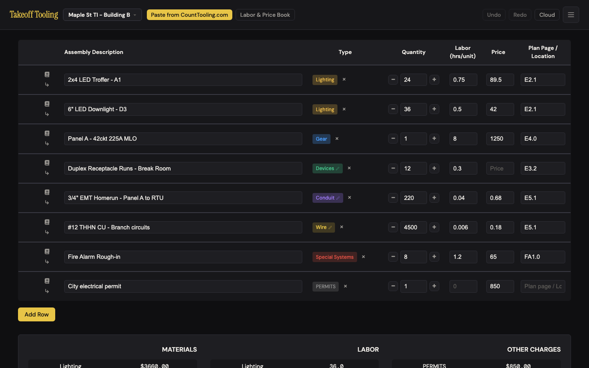
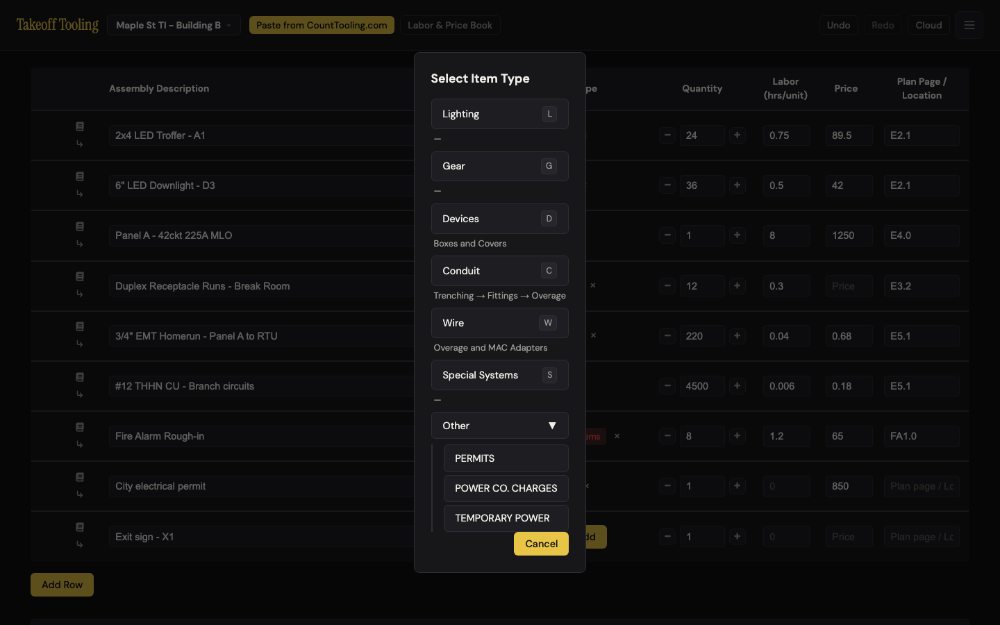
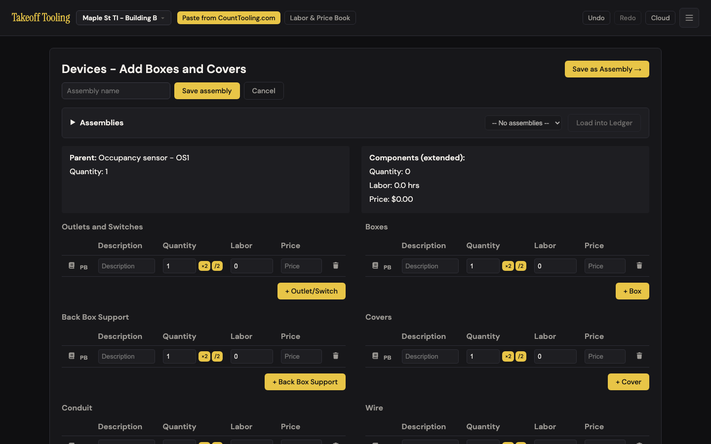
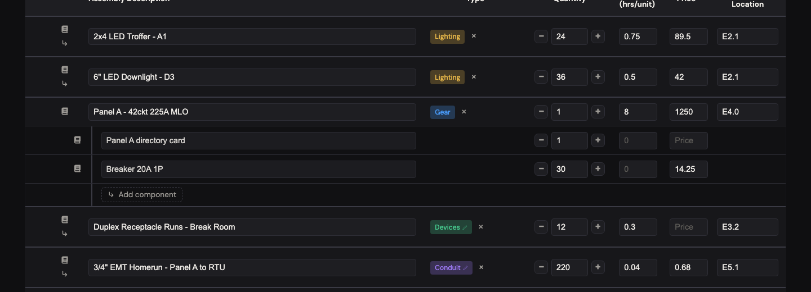
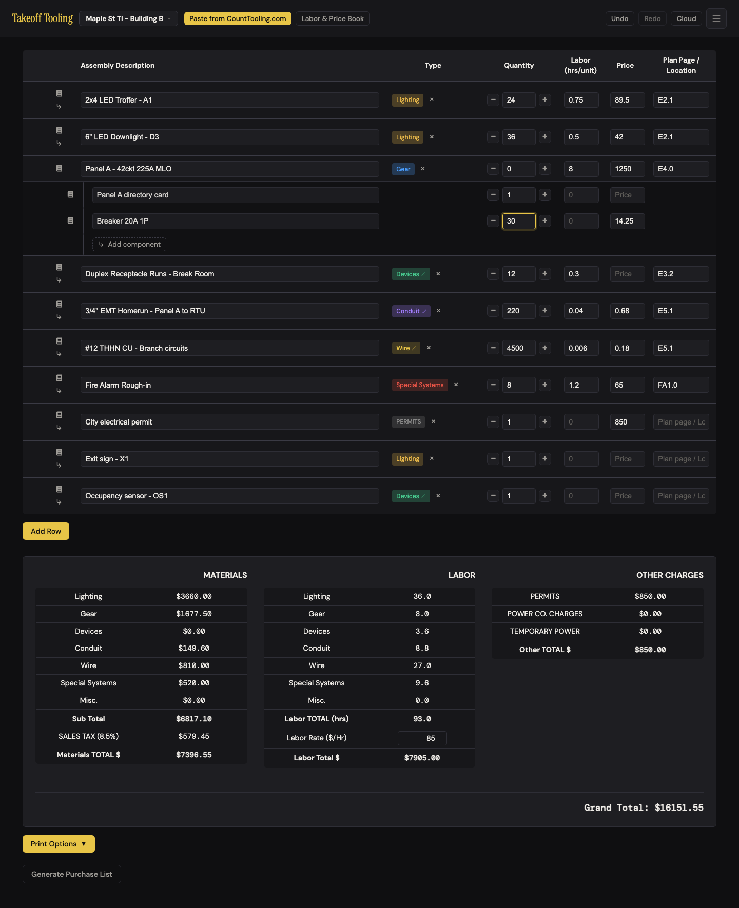
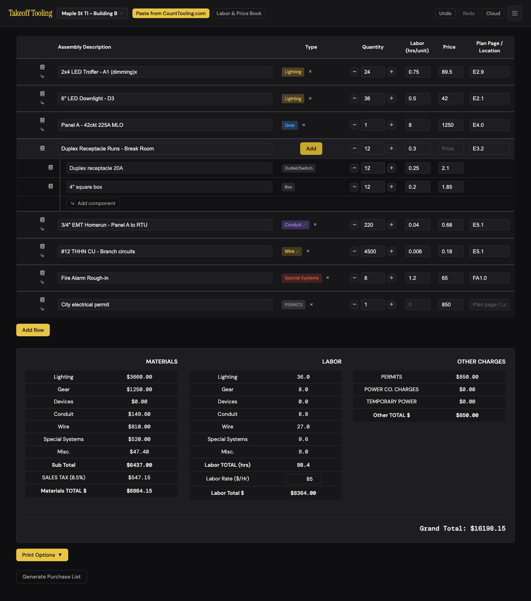
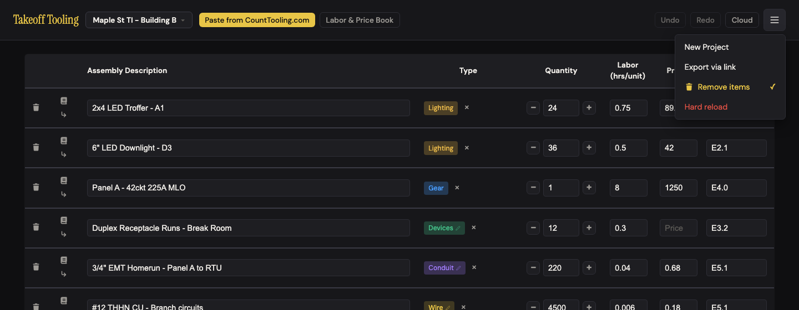
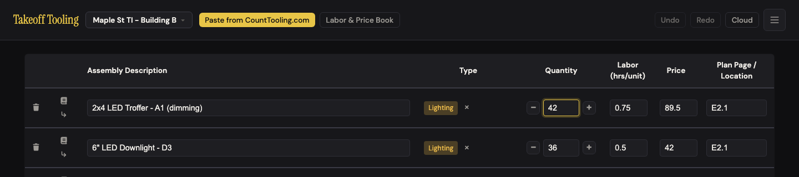

# J3 — Shape the manifest

Personas: E · Status: ● walked 2026-09-06 (headless Chromium, :4188, signed out)

> Trigger — the counts are in (typed, pasted, or linked over from Count Tooling). Now the
> estimator makes the list *look like the bid*: every row gets a type, quantities get
> corrected against the sheets, plan pages get filled in, a panel gets its breakers listed
> under it, a row that shouldn't be there goes away — and when a hand slips, Undo is the
> thing they reach for.

## Entry points

- **Table row** — `.select-type-btn` gold **"Add"** in the Type column of an untyped row → `#type-modal` (click / Enter); once typed, the chip `.type-badge` (a `` for Lighting / Gear / Special Systems / Other; a `<button title="Edit in flow">` with a pencil for Devices / Conduit / Wire → opens that row's flow editor) plus `.clear-type-btn` **×** `title="Remove type"` (click)
- **Type modal** — click an option; hotkeys `G` `L` `D` `C` `W` `S`; **Other ▾** expands PERMITS / POWER CO. CHARGES / TEMPORARY POWER (stays expanded for the session); Cancel / `Esc` / click-outside close it (index.html:54-96, js/views/modal.js)
- **Quantity** — `.qty-down-btn` **−** / `input[type=number]` / `.qty-up-btn` **+** (click, typing, ↑↓ arrow keys on the input); Labor, Price, Plan Page / Location are plain inputs; every keystroke fires `input` *and* blur fires `change`, both routed to `handleFieldUpdate` (manifest.js:373-401)
- **Child rows** — the rail `.add-child-btn` **↳** under the book icon of a childless row (click) → a blank child with focus in its description; once a row has children the rail ↳ disappears and a ghost row **"↳ Add component"** (`.add-child-row-btn`) closes the block (manifest.js:76-79, 176-183)
- **Remove** — `#header-menu-btn` ☰ → `#remove-toggle-btn` "Remove items" (toggle, `aria-pressed`, ✓ when on) → per-row `.remove-btn` trash appears in the first column → `confirm('Remove this item?')` (app.js:349-357, manifest.js:460-472)
- **Undo / Redo** — header `#undo-btn` / `#redo-btn`, enabled only when the stacks are non-empty *as of the last render*; both navigate back to the manifest (app.js:335-347). No keyboard shortcut.
- **Add Row** — `#add-row-btn` below the table (click; reachable by Tab from the last row's Plan Page, Enter activates)
- **Keyboard** — Tab walks every control in a row: book · ↳ · description · × · − · qty · + · labor · price · plan page (10 stops, 5 of them fields)

## Current route (walked 2026-09-06)

Happy path for one row that arrived untyped from a paste — **type it, fix the count, add a
component, delete a stray row: 9 clicks, 3 decisions** (Add → pick = 2 clicks / 1 decision;
click qty, type = 1 click; ↳, type name, Tab, type qty = 1 click; ☰ → Remove items → trash →
OK = 4 clicks / 2 decisions — and the trash click has to land on the button's 4 px padding,
see finding #1). Undo is 1 click when the button is live; it is not always live (#2).

Seed: "Maple St TI - Building B", 8 rows, $85/hr — Lighting $3,660.00 · Gear $1,250.00 ·
Conduit $149.60 · Wire $810.00 · Special Systems $520.00 · Labor 93.0 hrs = $7,905.00 ·
PERMITS $850.00 · **Grand Total $15,687.72**. 

1. **Give a row a type.** Add Row → a blank row lands at the bottom with qty **1** (not 0 — README:19 says 0), focus on `<body>`. Clicked into the description, typed "Exit sign - X1", clicked **Add** → *Select Item Type* with six options, each with a `kbd` hotkey and a one-line subtitle naming what the flow adds ("Boxes and Covers", "Trenching → Fittings → Overage", "Overage and MAC Adapters", "—" for the plain types). **Other ▾** hides the three charge types. Pressed `L` → chip **Lighting**, modal closed, view stays on the manifest. 
2. **Pick a flow type.** Second new row "Occupancy sensor - OS1" → Add → `D` → the manifest is *replaced* by **Devices - Add Boxes and Covers**: eight component sections, Assemblies bar, "Save as Assembly →". Nothing was edited, so the wordmark took me back with no confirm; the row now carries a green **Devices** chip with a pencil. 
3. **Change a type.** Lighting chip is inert (click, double-click: nothing). The **×** beside it clears the type: row shows **Add** again and its $2,148.00 moves from Lighting to **Misc.** in the summary until re-typed. × → Add → Gear within 1.2 s is **one** undo frame (Undo goes Gear → Lighting directly); with a pause between, two. On a Devices row the chip opens the flow, so a type change is × → Add → pick: 3 clicks, and the children ride along (step 8).
4. **Quantities.** + × 3 on the troffer: 24 → 27, one undo frame, Lighting $3,660.00 → $3,928.50 (+3 × 89.50 ✓) live without a re-render. Typed 0 → Lighting **$1,601.50** = 36 × 42 + **89.50 counted once** (labor 18.8 = 18.0 + 0.75). − at 0 stays 0. Typed **-5** → accepted into state, still $1,601.50, no visual cue (`input.validity.valid` is false, nothing styles it). 12.5 → $2,630.75; + → 13.5. 1e9 → Grand Total $160,857,512,337.57 (no cap). ↑ on the input → 25.
5. **Labor / price.** Labor blank → 0 hrs; 0.755 → 36.1 hrs (36.0 + 0.005 × 24 ≈ 0.12 → 36.12). Price blank → `null`, purchase list "2 without a price"; price **0** → priced at $0, "1 without a price". 89.505 accepted (`step="1"` on the price input has no visible effect). Typed **2** in the permit row's Labor: the field keeps the 2, **Labor TOTAL (hrs) does not move** (18.0 on a two-row probe; the previous walker's 98.4 was 93.0 + 5.4 h of components, not the permit) — but `TakeoffState.getTotalLabor()` goes 18 → **20**, and that is the figure the PDF prints (pdf.js:33). Permit qty 3 → PERMITS $2,550.00 (price × qty, fine), labor still invisible on screen.
6. **Child rows.** Panel A → ↳ → a child row indented under it: **Remove** (hidden until remove mode), book icon, description (placeholder still "Assembly Description"), an empty Type cell, − qty + (starts **0**), labor, price, **no Plan Page**. Focus is in the description; typing "Panel A directory card" flipped qty to 1. The rail ↳ is gone from the parent; the ghost **↳ Add component** row closes the block. Ghost → "Breaker 20A 1P", 30, $14.25 → Gear **$1,250.00 → $1,677.50** (+30 × 14.25 = 427.50 ✓), labor unchanged 8.0. Grand Total **$16,151.55** (+427.50 × 1.085 ✓). 
7. **Qty 0 on a parent with children.** Panel qty → **0**: Gear stays **$1,677.50 / 8.0 hrs** — the panel's $1,250 and 8 hrs are counted once because the row carries a price. Breaker qty → 0 as well: Gear **$1,264.25** (1,250 + 14.25 once). 
8. **Clear a flow parent's type.** Receptacle Runs (Devices, two components: Duplex receptacle 20A 12 × $2.10 / 0.25 h, 4" square box 12 × $1.85 / 0.2 h → Devices $47.40 / 9.0 hrs) → **×**: chip becomes **Add**, the two children stay with their **Outlet/Switch** / **Box** labels (now plain spans), summary moves **$47.40 and 9.0 hrs to Misc.** Add → `D` → the Devices editor opens **with both components in place**; back; × → Add → `L` → children kept, Lighting $3,660.00 → $3,707.40. No trap — a detour. 
9. **Remove.** No trash anywhere on the row. ☰ → **Remove items** (menu closes; trash icons appear in column 1 on every row including children; the ☰ button itself shows no state).  Clicked the troffer's trash **on the icon** → *Remove this item?* → OK → **the row is still there, 0 undo frames**. Clicked 2 px inside the button's corner → OK → gone. Enter on the focused trash → gone. Removing Panel A with two children → **one frame**; Undo brings back the panel *and* both children. Deleting all 8 rows one by one → a blank row is re-seeded, summary hidden, first-run hint back, trash still showing. Reload → remove mode off (not persisted).
10. **Undo.** Typed 10 characters → **1 frame**; two 1.3 s pauses inside a phrase → 3 frames; description → qty → description within 1.2 s → separate frames per field. 60 alternating edits → **50** frames (cap holds). After typing in a fresh session the Undo button stays **greyed** although `canUndo()` is true; it wakes up on the next full render (Add Row, ×, a type pick…). 
11. **Redo cleared by a new edit** — the stack is cleared, the button stays lit until the next render; clicking it does nothing.
12. **Undo from inside a dirty flow** (Receptacle Runs editor, one component renamed): Undo → *Discard unsaved changes in this editor?* → **Cancel** → still in the editor — but the troffer's plan page had already gone E2.9 → E2.1 underneath; **Save and Back** then wrote the components onto the undone manifest and cleared Redo. From a clean flow, Undo silently returns to the manifest and undoes.

Divergences from the documented route:

- README:19 *"Quantity: Spinner controls (+, −) and direct input; default 0"* — Add Row and a re-seeded blank row start at **1**; a child starts at 0 and flips to 1 on the first description keystroke (manifest.js:333-343, 383-387, 444).
- README:22 *"Remove toggle: 'Remove items' in the header ☰ menu shows/hides remove buttons on rows"* — true, but the buttons don't work when clicked on the icon (finding #1).
- README:88 *"Undo / Redo — History for manifest changes (manifest only)"* — says nothing about keystroke coalescing (1.2 s), the 50-frame cap, or that the buttons refresh only on render.
- `_surfaces.md` — "`#undo-btn` / `#redo-btn` (disabled when empty …)" is true only at render time; they are also disabled when *not* empty after typing.
- Baseline B-2 (pencil on flow chips), C-5 (Cancel in the type modal), N-7 (hint + hidden summary on an empty bid) all hold. No regressions.

## Naive attempt

The receptacle row came over from the count typed as Devices and I wanted it to be
Lighting — a sconce, not a run. I clicked the green **Devices** chip and the whole page
turned into "Devices - Add Boxes and Covers" with eight empty tables. I didn't want boxes. I
clicked the Takeoff Tooling name to get out and nothing was lost. Back at the row the only
other thing near the chip was a small grey **×**. Hovering said *Remove type*. I clicked it
expecting… I wasn't sure — the row went back to a gold **Add** and, down in the totals,
$47.40 slid from Devices into a line called *Misc.* Add → L and it said Lighting. Three
clicks for what I thought was one.

Then I wanted a stray "View link:" row gone. There is no trash on the row. The × says
*Remove type*, not remove. The book icon opens the price book. The ↳ under it added a blank
line *under* the row, which I then also had to get rid of. I found **Remove items** in the
☰ menu, the menu closed, and trash cans appeared down the left. I clicked the can, OK'd
*Remove this item?* — and the row was still there. I did it again. Still there. Third time
I must have hit the edge of the button, because it finally went. I now believe delete is
flaky.

Fixing a count: I typed 42 over the troffer's 24, saw Lighting jump to $5,271.00, realized I
was on the wrong row and looked at **Undo** — greyed out. So I retyped 24 by hand. Later,
after I'd added a row, I noticed Undo had lit up on its own; I never worked out why. On
another slip I pressed ⌘Z out of habit: inside the field it reverted the field (the
browser's own undo), anywhere else it did nothing.

Adding the breakers under the panel was the good part: ↳, type the name, Tab, 30, Tab,
14.25 — and the Gear line moved as I typed. The little "↳ Add component" row that appeared
told me where the next one would go.

## Evidence

- **Telemetry visibility:** none exists in Takeoff Tooling. A rework here should ship `row_typed {type, via: click|hotkey, wasRetype}`, `row_removed {hadChildren, via: click|key}`, and `undo {frames, fromView}` — the last one tells us how often Undo is pressed from inside a flow (finding #5) and how many presses are no-ops (finding #4).
- **Doc coverage:** README.md:14-22 (Manifest Table — columns, item types, shortcuts, spinner, "Edit in flow", remove toggle; the qty default is wrong), README.md:88 (Undo/Redo, one line). CLAUDE.md "Undo/redo covers the manifest only… `beginBatch`/`endBatch`", "`getItemById` only searches two levels deep — don't create grandchildren" (holds: no UI can make one; the ghost row targets the top-level parent). ARCHITECTURE.md: state shapes. Nothing documents coalescing, the remove-mode path, the qty-0-counts-once rule, or that × orphans a flow row's components into Misc.
- **Specs:** `smoke.spec.js:5-40` — fill a description (auto qty 1), Add Row, persist, **two Undo clicks** (the only click on `#undo-btn` in the suite; both happen after a render, so it never meets finding #2). `selectors.test.js:15-22` — the qty-0-counts-once labor rule; `:78` — children roll into the parent's bucket. **Not covered:** the type modal (click, hotkeys, Cancel/Esc/outside), the flow-chip navigation, ×, the spinner, child rows and the ghost row, Remove items (toggle, confirm, last-row re-seed), keystroke coalescing, the 50 cap, redo. `js/views/manifest.js` and `js/views/modal.js` are IIFEs — no `*.test.js` can reach `handleFieldUpdate` or the remove handler.
- **Modals:** `#type-modal` only. Two native `confirm()`s: *Remove this item?* and *Discard unsaved changes in this editor?*
- **Hotkeys:** `G` `L` `D` `C` `W` `S` and `Esc` while the type modal is open — matched on `e.key.toUpperCase()` with no modifier check (modal.js:55-60): `⌘C` picks Conduit and opens the conduit editor, `Ctrl+L` picks Lighting. Inline fields: browser-native ↑↓ on number inputs, native per-field ⌘Z. No app-level Undo/Redo key.
- **Storage / state touched:** every edit → `TakeoffState.updateItem` → `schedulePersist()` → `takeoff-project-<id>` after 400 ms, `takeoff-projects-index` `savedAt`. Undo frames as measured in steps 3, 9, 10 (1 per typing burst, per spinner burst, per delete, per type pick; **+1 phantom on a paused blur**, finding #4; +1 for the blank re-seed after the last delete). `showRemoveIcons` is ephemeral `uiState` — not persisted (confirmed by reload). Cloud push would follow when signed in (not exercised — production).

## Friction findings

| # | Severity | What happens | Why it hurts | Verdict stamp (Phase 2b) |
|---|---|---|---|---|
| 1 | **blocker** | Clicking a row's trash **on the icon** shows *Remove this item?*, takes the OK, and removes **nothing** — 8 of 8 attempts in the first walk, 1 of 1 re-driven; 0 undo frames pushed. The handler reads `e.target.dataset.id` (manifest.js:463-465) and the target is the `<path>` inside the 16 × 16 SVG; only the 4 px padding ring of the 24 × 24 button (or Enter on the focused button) carries the id. | The route is already 4 clicks behind a menu; the last click fails wherever a person naturally aims. A confirmed "OK" that does nothing reads as *delete is broken* and sends the estimator to workarounds (qty 0 — which still counts the price once, #6). The previous walker's entire remove pass was silently a no-op because of it. | **CONFIRMED** (blocker). Re-drove on a different seed: `locator.click()` at the 24 × 24 button's centre lands on the SVG `<path>` (`dataset.id=undefined`) — the confirm fires, OK is accepted, top-level rows stay **6 → 6** and `canUndo()` stays **false** (0 frames); a raw mouse click 2 px inside the corner, `click({position:{x:2,y:2}})` and focus+Enter each removed. Counter-evidence hunt found none: no `closest(` anywhere in manifest.js, no `pointer-events` guard on `.remove-btn svg`, and every sibling handler that works (`labor-book-icon-btn`, `add-child-btn`, `type-badge-flow`) already uses `e.currentTarget`. |
| 2 | **stumble** | After typing into any field the **Undo button stays greyed** although `TakeoffState.canUndo()` is true — `updateUndoRedoButtons()` runs only inside `render()` (app.js:25-34) and field edits deliberately skip rendering (manifest.js:394-395). Every session boots with an empty stack, so the first slip of the day has a dead Undo until something else re-renders (Add Row, ×, a type pick). No `⌘Z`/`Ctrl+Z` at the app level; inside a field ⌘Z is the browser's per-field undo. | The journey's trigger is *relies on undo when they slip*; the button is dead exactly then. The estimator retypes by hand and learns Undo "doesn't cover typing", so they stop reaching for it. Screenshot 06. | **CONFIRMED** (stumble), with one premise corrected. On the realistic returning session (seed → `persistNow` → reload) the stack boots empty; typing 99 into a qty made `canUndo()` **true** while `#undo-btn.disabled` stayed **true** and Playwright could not click it (timeout) — identical after a `loadManifestFromExport` share-link import and after a spinner click; Add Row woke it. The walker's "every session boots with an empty stack" is wrong for a **first-ever** boot only (app.js:483 `addItem`s the blank row, pushing a frame, so the button is already live there); `updateUndoRedoButtons` has exactly one call site (app.js:25, inside `render`) and is not exported, and no app-level ⌘Z/Ctrl+Z exists. |
| 3 | **stumble** | Typing a value, pausing > 1.2 s, then clicking or tabbing away pushes a **second, empty undo frame** — the `change` event on blur re-sends the same value through `updateItem`, whose coalescing window has closed (manifest.js:398-400, state.js:411-415). Measured: type 30 → 1 frame; pause; blur → 2 frames. First Undo press: nothing visible changes (qty still 30); second press: 24. Type-then-Tab immediately: 1 frame. | "Undo did nothing" on the first press is the second reason (after #2) an estimator concludes Undo is unreliable; type-look-at-the-sheet-click-on is the normal rhythm at a desk. | **CONFIRMED** (stumble). Counted by unwinding the real stack: type 55 into a qty then Tab immediately = **1 frame**, values `[55, 40]`; type 55, pause 1.5 s, then Tab = **2 frames**, values `[55, 55, 40]` — the first Undo leaves 55 on screen; pause-then-click-another-field is identical. Coalescing itself is sound (one burst = 1 frame; two 1.4 s pauses inside a phrase = 3; three spinner clicks = 1). |
| 4 | **stumble** | **Undo pressed inside a flow editor with unsaved edits** applies the undo *first* and asks *Discard unsaved changes in this editor?* second (app.js:336-340 → `navigateToManifest`, app.js:106-108). Cancel keeps the editor open, but the manifest underneath is already one step back (troffer plan page E2.9 → E2.1 in the walk); Save and Back then writes the components onto the undone manifest and clears Redo — the E2.9 is gone for good. | A "Cancel" that doesn't cancel, and the loss lands on a row the estimator wasn't even looking at. Low frequency, high surprise. | **CONFIRMED** (stumble) — same mechanism J5 #1, which J5's verifier stamped **CONFIRMED blocker (trust)**. Re-drove in the *devices* flow: LED highbay plan page E3.1 → E3.9, chip → editor, typed into a component row (`flowDirty` true), Undo → dialog → **Cancel** → view still `device` but the plan page underneath already back to **E3.1**; "Save and Back to Manifest" then wrote the new component onto the undone manifest and cleared Redo — exhausting Redo could not recover E3.9. Severity mismatch with J5 flagged for synthesis. |
| 5 | **stumble** | Picking **Devices / Conduit / Wire** in the type picker (click or `D` `C` `W`) leaves the manifest and opens the full flow editor (modal.js:12-16). Clicking the chip later does the same; there is no way to open the picker from a typed flow row except × → Add. | An estimator labelling ten pasted rows is yanked into an eight-section editor three times and has to find the wordmark to get back each time; changing a flow row's type costs 3 clicks and a moment where its money sits in *Misc.* Not a trap — nothing is lost (step 8) — but the modal subtitles ("Boxes and Covers") are the only warning. | **CONFIRMED** (stumble). Pressing `D` in the picker put `getCurrentView()` at `device` ("Devices - Add Boxes and Covers") with no warning; the only door back into a typed flow row's editor is the chip itself (`.type-badge-flow` → `navigateToDevice/Conduit/Wire`, manifest.js:450-458), non-flow chips are inert ``s with no listener, and `.select-type-btn` renders only when `item.type` is null — so × → Add → pick really is the only retype route. |
| 6 | **stumble** | **Quantity 0 keeps the row's money.** Panel qty 0 → Gear still $1,677.50 / 8.0 hrs (the $1,250 and 8 hrs counted once); a child at 0 still contributes its $14.25 once. **Negative** quantities are accepted from the keyboard (−5 → state −5, priced as 1; `min="0"` only stops the − button) with no visible cue. Rule: selectors.js:24-26, 145-150; tested in selectors.test.js:15. | Zeroing a row is how estimators "take it out of the bid for now" — the totals don't move and nothing says why. The rule exists so a lump-sum line can have no quantity, but the seeded permit already carries qty 1. Shared with J8 (numeric trust). | **CONFIRMED** (stumble), both halves. On the verifier seed MDP 800A qty 1 → 0 left **Gear $9,400.00** and labor 62.8 hrs untouched, and a child at 0 still added its $2.40 (Devices $77.00 → **$45.80** = 14 × 3.10 + 2.40 once); typed **−5** was stored as −5, `validity.valid` false, and **no rule in the 2,900-line stylesheet styles `:invalid`**. The rule is deliberate (selectors.js:24-26 "counts once", selectors.test.js:15), so what survives is the *visibility* finding, not an arithmetic bug. |
| 7 | **stumble** | **Delete is undiscoverable and its only visible cousin lies.** No trash on a row by default; the row's controls are book, ↳, **×** (`title="Remove type"`), −, +. The × is the one control shaped like "remove", and it removes the *type* — the row drops to **Add** and its dollars move to *Misc.* until re-typed. The real delete is ☰ → Remove items → trash → OK (4 clicks, 2 decisions), and the menu closes on toggle so the ✓ that shows the mode is out of sight. | Two wrong turns before the right one; the first wrong turn changes the bid's totals (step 3). | **CONFIRMED** (stumble). `TakeoffState.removeItem` has exactly **one** caller in the whole app (manifest.js:465) — there is no second delete route to find; by default row 1 exposes book · ↳ · × (`title="Remove type"`) · − · + with the trash `visible:false`, and `#header-menu` computes to `display:none` immediately after the toggle, so the ✓ that records the mode is off-screen. |
| 8 | **stumble** | **Keyboard entry fights the row.** Tab order per row: book · ↳ · description · × · − · qty · + · labor · price · plan page — **10 stops for 5 fields**, 3 Tabs from description to quantity. Enter in the last field does nothing; Tab reaches **Add Row**, Enter adds a row and **focus lands on `<body>`** (the click path too — the new description is not focused). | Someone re-keying a 40-row count from paper doubles their keystrokes and re-clicks into every new row. The devices editor already focuses its new row; the manifest doesn't. | **CONFIRMED** (stumble). Measured tab stops from a row-1 description: `× · − · qty · + · labor · price · planPage` then the next row's `book · ↳ · description` — 10 stops per row, **3 Tabs from description to quantity**, and no `tabindex` on any of the six row buttons. Enter in plan page did nothing (rows 6 → 6); Add Row by click **and** by Enter both left `document.activeElement` on `<body>`, while ↳ correctly focused the new child's description. |
| 9 | papercut | **Redo button stays lit** after a new edit has cleared the redo stack (same root cause as #2 — no render); clicking it does nothing. | Another dead-looking control on the same pair of buttons. | **CONFIRMED** (papercut). After an Undo click then one fresh keystroke: `canRedo()` **false** while `#redo-btn.disabled` was **false**; clicking the lit button left rows at 6 and the view on `manifest`. Same single call site as #2. |
| 10 | papercut | After deleting the **last** row, the blank row that is re-seeded gets its **own undo frame** (removeItem then addItem, manifest.js:465-467). Undo #1 → an empty table with no rows at all (hint shows); Undo #2 → the row is back. | One more "Undo did nothing" moment; trivially batched. | **CONFIRMED** (papercut). Deleting all six seeded rows (padding-ring clicks) ended with one blank row and the first-run hint; Undo #1 → **0 top-level rows** (empty table, hint still showing), Undo #2 → the deleted row back. |
| 11 | papercut | Type modal: focus stays on the **Add** button *behind* the modal; Tab moves to the qty spinner behind it (no focus trap, no focused option). Hotkeys ignore modifiers — **⌘C picks Conduit and opens the conduit editor**, Ctrl+L picks Lighting. | A reflexive copy while the picker is open silently types the row and changes the page. | **CONFIRMED** (papercut). With the picker open `document.activeElement` was the `.select-type-btn` **behind** it and one Tab escaped to `.qty-down-btn` outside the modal (`#type-modal.contains(activeElement) === false`); pressing `Meta+c` set the row's type to `conduit` and navigated to the conduit editor. |
| 12 | papercut | Label case and language: chips and summary shout **PERMITS · POWER CO. CHARGES · TEMPORARY POWER** next to *Lighting*, *Special Systems*; summary rows *SALES TAX (8.5%)*, *Materials TOTAL $*, *Labor TOTAL (hrs)*. Header and placeholder **"Assembly Description"** — on parents *and* children — collides with the devices editor's *Save as Assembly* and the book's *Assemblies* tab; the estimator's word is fixture / run / item. | Reads like three apps in one column; "assembly" is used for three different things on one screen. | **CONFIRMED** (papercut), verbatim. Summary text read `SALES TAX (8.5%)` · `Materials TOTAL $` · `Labor TOTAL (hrs)` · `PERMITS` · `POWER CO. CHARGES` · `TEMPORARY POWER` beside *Lighting / Gear / Special Systems*, and **"Assembly Description"** is both the column header and the `placeholder` on parents *and* children. |
| 13 | papercut | Price field `step="1"`, labor `step="0.1"` (manifest.js:88-89): 89.505 and 0.755 are accepted, but the browser marks the input invalid and would refuse a native form submit; no visible effect today. | Latent — surfaces the moment anything validates the form or styles `:invalid`. | **KILLED** — not a friction finding. Grepping the 2,900-line stylesheet for `:invalid` and for `:valid` returns **nothing**, and the manifest inputs sit in no `<form>` at all (the only `<form>` in the app is `#form-details`, `onsubmit="return false"`), so the mismatched `step` produces no symptom a user can perceive — neither an outcome nor polish, which is what the severity bands measure. Kept as a code note for whoever adds validation; the concrete half (negatives) is already carried by #6 / proposal 7. |
| 14 | **stumble** | **Labor hours on a Permits / Power co. / Temporary power row vanish from the screen and reappear in the PDF.** The Labor field on an Other-type row accepts a value (permit labor 2 → field shows 2), the summary's *Labor TOTAL (hrs)* ignores it (18.0 → 18.0; `getSummaryBreakdown` adds only `priceAmount` for `OTHER_TYPES`, selectors.js:152-154), but `getTotalLabor` counts it (18 → **20**, selectors.js:18-33) and `pdf.js:33` prints that total. | A field that takes a number and shows no effect teaches "labor doesn't apply here"; the printed bid then disagrees with the screen by exactly those hours × $85. Shared with J8 / J9. | **CONFIRMED** (stumble), with exact figures on an independent seed. Permit labor **3** (qty 1): the field keeps 3, the screen's *Labor TOTAL (hrs)* stays **62.8**, `TakeoffState.getTotalLabor()` goes 62.8 → **65.8**, and pdf.js:33 → :72 prints that 65.8 — a **$276.00** screen-vs-print gap at $92/hr. Mechanism as cited: `getSummaryBreakdown` adds only `priceAmount` for `OTHER_TYPES` (selectors.js:150-152) while `getTotalLabor` filters on no type at all (selectors.js:18-33). |

Numbers checked: 42 × 89.50 + 36 × 42 = **$5,271.00** (shown ✓); 42 × 0.75 + 36 × 0.5 =
**49.5 hrs** ✓; troffer qty 0 → 1,512.00 + 89.50 = **$1,601.50** ✓ (should arguably be
$1,512.00 — #6); Panel children 30 × 14.25 = **$427.50** → Gear $1,677.50 ✓, Grand Total
15,687.72 + 427.50 × 1.085 = **$16,151.56** (shown $16,151.55 — cent rounding); Devices
components 12 × (2.10 + 1.85) = **$47.40**, 12 × (0.3 + 0.25 + 0.2) = **9.0 hrs** ✓.

## Proposals

1. **polish** — Fix the trash handler: `e.currentTarget.dataset.id` (manifest.js:463-465), and add a Playwright spec that clicks the icon. Spirit: (1) delete works on the first click — removes the repeat click and the second confirm; (2) none needed; (3) removes the "OK did nothing" outcome and the qty-0 workaround it drives; (4) it is the icon they already aim at. `spiritPass: true` — one token; the fix for #1. **Verifier (2b): `spiritPass: true` confirmed.** Caveat: make the same edit at manifest.js:431 (`.select-type-btn`) and :437 (`.clear-type-btn`), which also read `e.target.dataset.id` — they work today only because their content is a bare text node, and they break the day either grows an icon. The spec should click the icon's **centre** (`locator.click()`), which is exactly the failing case.
2. **rework** — One door for type. Every chip opens the picker (span or button, flow or not); the picker gains **"Open the Devices editor →"** as its first row when the row is a flow type, and **"No type"** at the bottom; the **×** goes away. Picking a flow type from the picker still opens the editor (the estimator asked for a run) *but* the modal subtitle says so plainly: *Devices — opens the boxes & covers editor*. Spirit: (1) change a type: 3 clicks → 2; label-without-editing stays 2; removes the decision "is this chip a button?"; (2) "editor", "run", "no type"; (3) removes the × from every row and the two chip behaviours; (4) the chip is what everyone clicks first (naive attempt). `spiritPass: true` — fixes #5 and half of #7; the verifier should confirm the flow-chip pencil (B-2) still earns its place as the "open editor" hint. **Verifier (2b): `spiritPass: false` as written.** It fails spirit test 1 on the *daily* path: today a flow row's editor is **one** click (the chip, `.type-badge-flow` → `navigateToDevice`, manifest.js:450-458); under this proposal it becomes chip → picker → "Open the Devices editor →" = **two**, so the rare act (retype: 3 → 2) is paid for by the common one (open my run: 1 → 2), and a modal is planted in front of the very affordance baseline **B-2** installed to make the editor discoverable. A variant does pass: keep the **pencil** as the direct one-click editor door and make the chip's *text* (or a small caret beside it) open the picker with "No type" at the bottom — 1-click editor, 2-click retype, × still gone. Land that shape instead.
3. **rework** — Delete lives on the row. Show the trash on row hover/focus (always on touch widths, where hover doesn't exist), keep the confirm, and **drop the "Remove items" mode and its menu entry**. Spirit: (1) 4 clicks / 2 decisions → 2 clicks / 1 decision, no mode to discover or forget; (2) none; (3) removes a menu item, a UI-state flag, and the ✓-out-of-sight problem; (4) it is where every other table on earth keeps delete. `spiritPass: true` with a caveat — the mode may have been a guard against fat-finger deletes; the `confirm()` (or an inline "Removed — Undo" receipt) is that guard. **Verifier (2b): `spiritPass: true` confirmed**, with two conditions: **proposal 1 is a prerequisite** (a row-level trash that still no-ops on the icon makes the flakiness *more* visible, not less), and an "Undo" receipt is only a real guard once proposal 4 lands — the Undo button is dead after a keystroke today (#2). Dropping the mode also removes `showRemoveIcons` from `uiState` and the `#remove-toggle-btn` menu row; nothing else reads either.
4. **polish** — Keep the header buttons honest: call `updateUndoRedoButtons()` from `handleFieldUpdate` and the spinner handlers (or have `TakeoffState` emit a change event the header subscribes to), and add **⌘Z / Ctrl+Z** and **⇧⌘Z / Ctrl+Y** when focus is not in a text field. Spirit: (1) the slip-and-undo path becomes 1 click or 1 key at any moment; (2) none; (3) removes the "why is it grey" question and the by-hand retype; (4) Undo has always been in the header — it just works now. `spiritPass: true` — fixes #2 and #9. **Verifier (2b): `spiritPass: true` confirmed for the button half; the hotkey half needs a boundary.** `updateUndoRedoButtons` has a single call site (app.js:25) and is not exported, so the cheap half — call it from `handleFieldUpdate` and both spinner handlers — closes #2 and #9 completely and adds **zero** surface, which is the part that clears spirit test 3 on its own. The ⌘Z half must define what happens *inside* a field: the browser's native per-field undo already writes through to state via the `input` listener (measured: qty 99 → 9 on a native ⌘Z), so an app-level handler that also fires there would run two undo systems on one keystroke. Ship it as "not in a text field", or ship the button half alone.
5. **polish** — No phantom frames: in `updateItem`, skip `pushUndo` (and the `lastEdit` reset) when every key in `updates` already equals the item's value (state.js:406-423); wrap the last-row re-seed in `beginBatch`/`endBatch` (manifest.js:462-469). Spirit: (1) one Undo press = one visible change; (2) none; (3) removes two "Undo did nothing" moments; (4) automatic. `spiritPass: true` — fixes #3 and #10. **Verifier (2b): `spiritPass: true` confirmed.** Caveat on the equality test: `handleFieldUpdate` coerces before it calls (`parseFloat(value) || 0` for quantity/labor, `'' → null` for price, manifest.js:376-378), so the no-op check must compare the **coerced** value and treat `null == null` as equal, or a blank price re-sent on blur will still push a frame. Both halves confirmed as the cause: pause-then-blur measured 2 frames with the first Undo changing nothing, and the last-row delete measured Undo #1 → 0 rows.
6. **polish** — Ask before undoing: in the header handlers, when a flow is dirty, run the *Discard unsaved changes?* confirm **first** and only then `TakeoffState.undo()` (app.js:336-347). Spirit: (1) no new steps; (2) the existing prompt; (3) removes the silent loss on Cancel; (4) automatic. `spiritPass: true` — fixes #4. **Verifier (2b): `spiritPass: true` confirmed — and this is the *same* edit as J5's P1**, whose verifier confirmed it against the conduit flow. One item, one plan of record: the guard must cover **Redo** as well (app.js:343-347), since Redo → Cancel restores a child behind an open editor that the next Save deletes again (J5 #1). Do not schedule it twice.
7. **polish** — Quantities that mean what they say: clamp typed negatives to 0 (the − button already does), and give a qty-0 row that still carries money a visible reason — e.g. the summary line for that type gets a small "1 lump sum" note, or the qty box shows *lump* as its placeholder — **or** change the rule so qty 0 counts 0 and lump sums are entered as qty 1 (the seeded permit already is). Spirit: (1) no steps; (2) "lump sum"; (3) removes a wrong-looking total; (4) the cue sits on the row. `spiritPass: true` for the clamp and cue; the rule change is a **J8 decision** (it changes existing bids' totals) — flag for synthesis. **Verifier (2b): `spiritPass: true` confirmed** for the clamp and the cue; the rule change is correctly deferred (the rule is deliberate — selectors.js:24-26 and selectors.test.js:15 both encode it). Two caveats: clamp on `change`/blur, not on `input`, or a user typing `-` before the digits gets their keystroke eaten mid-entry; and `getTotalPrice` (selectors.js:36-50) implements the **opposite** rule — no counts-once, and it counts Other-charges rows — so it disagrees with `materialsSubtotal` by construction. It is exported but called from no view or PDF; delete it or align it in the same change.
8. **polish** — Keyboard rhythm: `tabindex="-1"` on the five row buttons (book, ↳, ×, −, +) so Tab walks description → qty → labor → price → plan page; Enter in the last row's plan page = Add Row; Add Row (click or key) focuses the new description. Spirit: (1) 10 stops → 5 per row, 1 click saved per new row; (2) none; (3) removes 5 Tab presses per row and a click per row; (4) it is what Tab and Enter do in a spreadsheet. `spiritPass: true` — fixes #8. **Verifier (2b): `spiritPass: true` confirmed, with an accessibility caveat.** Measured stops and the missing focus both reproduce (10 per row; Add Row by click *and* by Enter leaves focus on `<body>`; ↳ already does the right thing, so the fix is one line copied from manifest.js:442-448). But `tabindex="-1"` on the book icon, ↳ and the trash makes them unreachable by keyboard entirely — for a keyboard-only estimator that removes the book and the delete, not five Tab presses. Take the five buttons **out of the row's inner tab order** while keeping one reachable entry (a roving-tabindex group, or put them after `planPage` so Tab still lands on them at the end of the row).
9. **polish** — Type modal hygiene: focus the first option on open, trap Tab inside, ignore hotkeys with ⌘/Ctrl/Alt held (modal.js:55-60). Spirit: (1) none removed, none added; (2) none; (3) removes the ⌘C-picks-Conduit surprise; (4) automatic. `spiritPass: true` — fixes #11. **Verifier (2b): `spiritPass: true` confirmed.** All three symptoms re-driven (focus left on the `.select-type-btn` behind the modal; one Tab escapes to `.qty-down-btn` outside it; `Meta+c` typed the row Conduit and navigated). Note the modifier guard must also cover the **Other ▾** rows and `Esc`, and that `⌘C` should keep working as copy once ignored.
10. **polish** — Labels in one voice: *Permits · Power co. charges · Temporary power*, *Sales tax (8.5%)*, *Materials total*, *Labor total (hrs)*; column header **"Item"** (or *Fixture / run*), placeholder *Fixture, run, or item* on parents and *Component* on children. Spirit: (1) none; (2) that is the point; (3) removes one meaning of "assembly" from the screen; (4) it is the header. `spiritPass: true` — fixes #12. **Verifier (2b): `spiritPass: true` confirmed**, and the same change should reach the **PDF**: pdf.js:53 prints `item.type` raw, so the Review sheet's Type column reads `specialSystems` / `powerCoCharges` (see NEW-1 in `## Verification`). One label map, used by the chip, the summary, the picker and the PDF.
11. **keep** — What is already right and was verified with numbers: one undo frame per typing burst (1.2 s), per spinner burst, per type pick, per delete-with-children (undo restores the whole block), per flow save; the 50-frame cap; × → Add → pick inside 1.2 s collapsing to one frame; child rows (↳ focuses the description, qty flips 0 → 1 on the first letter, no plan page / type controls on children, the ghost **↳ Add component** in exactly the place the row will appear, no grandchildren possible from the UI); clearing a flow parent's type keeps its components and the editor shows them again on re-type; − clamps at 0; the live summary on every keystroke; remove mode not surviving a reload; deleting the last row re-seeding a blank row with the first-run hint. `spiritPass: true`. **Verifier (2b): `spiritPass: true` confirmed** — independently re-measured on the verifier seed: one typing burst = 1 frame, two 1.4 s pauses inside a phrase = 3, three `+` clicks = 1, 60 alternating edits = **50** frames (`UNDO_STACK_SIZE = 50`, state.js:23/331), removing a parent with two children = 1 frame that restores the whole block, ↳ focuses the new description, − clamps at 0, and the hint returns with `manifest-empty-hide` on an emptied bid. The flow-save frame count is J4/J5's ground and was not re-driven here.
12. **polish** — One labor total: either count Other-type labor in the summary (add `laborHrs` to a `labor.other` bucket and the total, selectors.js:152-154) or make the Labor cell on Permits / Power co. / Temporary power rows read-only with an em dash — and in both cases have the PDF read the same `getSummaryBreakdown().laborTotal` the screen shows (pdf.js:33). Spirit: (1) none; (2) none; (3) removes a screen-vs-print disagreement and a field that silently discards input; (4) automatic. `spiritPass: true` — fixes #14; which branch is a J8 call. **Verifier (2b): `spiritPass: true` confirmed.** Whichever branch J8 picks, the load-bearing half is the second clause — pdf.js:33 must stop calling `TakeoffState.getTotalLabor()` and read the same figure the screen shows, otherwise the branch only changes *which* of the two numbers is wrong. `getTotalPrice` is a third, unused total on the same fault line (see proposal 7).
13. **teach** — Until 2 and 7 land: the guide must say that picking Devices / Conduit / Wire opens that editor and the wordmark brings you back; that × clears the *type* and parks the row's money in *Misc.*; that a row at quantity 0 with a price still counts once; that typing in one field is one Undo step. `spiritPass: false` — docs only; the verdict is teach. **Verifier (2b): `spiritPass: false` confirmed** — correct self-assessment; a `teach` verdict does not compete for the spirit test. Add one line to the list: **do not delete a row by zeroing its quantity** — the money stays (#6). Finding #1 must never appear in a guide.

## Guide actions

- README:19 — fix *"default 0"*: a new row starts at 1; a component starts at 0 and becomes 1 when you name it.
- README:22 — rewrite the Remove paragraph to whatever proposal 3 lands on. Finding #1 is not guide material ("aim for the button's edge") — it has to be fixed, not documented.
- README:88 — expand Undo/Redo: manifest only; typing in one field within about a second is one step; 50 steps; Undo from inside an editor leaves the editor.
- Add a "Types" paragraph: Add → pick or press G L D C W S; Devices / Conduit / Wire open their editor at once; the chip reopens it; × clears the type and the row's totals move to Misc. until re-typed; Other ▾ holds Permits / Power co. / Temporary power.
- Add a "Components under a fixture" paragraph: the ↳ under the book icon, the *Add component* row, components have no plan page and count toward the parent's type, deleting the parent deletes them and one Undo brings all of it back.
- Add the quantity-0 rule (or remove it — proposal 7) to the "Where the numbers come from" section J8 will produce.
- First guide article "Shaping the bid" walks steps 1, 3, 6, 9, 10 with screenshots 02, 04, 05, 06.

## Demo moment

Panel A → ↳ → "Breaker 20A 1P", Tab, 30, Tab, 14.25: the Gear line climbs $1,250.00 →
$1,677.50 as you type and an "↳ Add component" row appears under it; delete the panel and
one Undo brings the panel *and* its breakers back. Screenshot 04.

## Walk notes

- **Environment:** headless Chromium (`@playwright/test`), 1440 × 900, against the read-only review server at `http://localhost:4188` (not started or stopped by this walk). Fresh context per script, `context.route(/supabase/i, abort)` on every context. **Signed out throughout; nothing cloud-side touched.** Seed: the standard 8-row "Maple St TI - Building B" bid at $85/hr, injected via `page.evaluate` after boot; the undo history was cleared after seeding (`loadManifestFromExport` of the current manifest) so every frame counted is the walk's own.
- **Reused artifacts:** this journey was started by a walker that was cut off before writing the dossier. Its `walk.js` / `walk.log` (types, quantities, labor/price, child rows, coalescing, the flow-save frame, tab order) and `walk2.js` / `walk2.log` (Undo greyed after typing; × → Add → pick coalescing; new-row frames) were read and their results reused for steps 1-6 and 10 — every reused number is quoted from those logs. Two of its conclusions were **wrong and are corrected here**: (a) its remove pass reported "after deleting all rows: [8 rows]" — every one of its 8 trash clicks was a victim of finding #1, not a probe of remove mode; (b) "flow shows existing children? false" was a bad probe (`innerText` does not include input values) — the editor does show them (step 8). Both of its scripts also died on a self-recursive click helper; the same mistake was made and fixed once in this pass (`walk4.js`).
- **This pass:** `walk3.js` (remove click geometry — centre vs padding vs Enter; Undo button state; stale Redo; retype-after-undo; undo in a dirty flow; clear-and-retype a Devices row; keyboard; the 50 cap; all eight doc screenshots) and `walk4.js` (the paused-blur phantom frame, isolated; undo-in-dirty-flow re-driven without that confound; undo after the last-row delete; screenshot 06 retake). Scripts and their logs: `scratchpad/walks/shape-the-manifest/` (throwaway; `NODE_PATH=<repo>/node_modules node <abs path>`).
- **Console:** one `Failed to load resource: net::ERR_FAILED` per context — the deliberately aborted `cdn.jsdelivr.net/npm/@supabase/supabase-js@2.49.4/dist/umd/supabase.min.js`. No app-side errors, no page errors, across all contexts.
- **Dialogs seen (all `confirm`):** *Remove this item?* · *Discard unsaved changes in this editor?*
- **Walls:** none. Touch (hover-less) behaviour of a row-level trash (proposal 3) was not exercised — J14's territory.
- **Baseline check:** B-2 (pencil on flow chips) holds; C-5 (Cancel in the type modal) holds; N-7 (hint + hidden summary on an empty bid) holds after deleting the last row. No regressions.
- **Extra probe:** `probe-permit-labor.js` (two-row seed; permit labor 2 → summary 18.0 vs `getTotalLabor()` 20) for finding #14.
- **Verifier — re-drive first:** #1 (☰ → Remove items → `page.mouse.click` at the trash button's centre → accept → row count unchanged; then 2 px inside the corner → removed); #2 (fresh boot, type into any field, `#undo-btn.disabled === true` while `TakeoffState.canUndo() === true`); #3 (type 30 into a qty, wait 1.5 s, click another field, count frames = 2; first Undo leaves 30); #4 (set a plan page, Tab, wait, open the Receptacle Runs editor, edit a component, Undo, **Cancel** the confirm → the plan page has reverted while the editor is still open).
- **Screenshot index:** 01 seeded manifest · 02 type picker with Other expanded (new "Exit sign" row) · 03 `D` lands in the Devices editor · 04 Panel A with two components and the ghost "Add component" row (demo) · 05 ☰ open with Remove items ✓ and the trash column · 06 typed into description and quantity — Lighting $5,271.00 live, Undo still greyed · 07 Panel at quantity 0, Gear still $1,677.50 / 8.0 · 08 Devices type cleared — Add button, children kept as Outlet/Switch and Box, Misc. $47.40.

## Verification

Adversarial verify pass — **2026-09-07**, Phase 2b. Every finding was re-derived from the
code first, then re-driven with scripts written from scratch and a **different seed** from
the walker's: *"Cedar Ave Warehouse - Phase 2"*, **$92/hr**, 6 top-level rows (LED highbay
HB-1 40 @ 0.9 / $128 · Wallpack WP-2 6 @ 0.6 / $210 · MDP 800A 1 @ 12 / $9,400 · Dock
receptacle runs [Devices, price-less parent, two children: Duplex recept 20A 14 @ 0.25 /
$2.40, 4-11/16 box 14 @ 0.2 / $3.10] · Fire alarm horn/strobe 9 @ 0.5 / $88 · City
electrical permit 1 @ $1,150). Baseline totals: Lighting $6,380 · Gear $9,400 · Devices $77
· Special Systems $792 · **Sub Total $16,649.00**, tax $1,415.17, labor 62.8 hrs = $5,777.60,
Other $1,150 → **Grand Total $24,991.76** — reproduced by hand to the cent.

**Method.** Headless Chromium (`@playwright/test`), fresh context per scenario, 1440 × 900,
`context.route(/supabase/i, r => r.abort())` on every context, signed out throughout, against
the read-only server at `http://localhost:4188` (not started or stopped). Every dialog
scenario ran **twice — once accepting, once dismissing**. Undo depth was counted by
unwinding the real stack (`while (canUndo()) undo()`) and recording the probed value after
each step, so "N frames" below is a count, not an inference. Real input only: `locator.click()`
at element centres, `click({position})` on padding rings, `locator.type()` with a per-key
delay, `keyboard.press('Tab')`. Console across all contexts: one
`Failed to load resource: net::ERR_FAILED` per context (the deliberately aborted Supabase
CDN script) and **no app-side or page errors**. Scripts and logs (throwaway, outside the repo):
`scratchpad/walks/shape-the-manifest/verify/` — `lib.js` (seed + probes), `v1-remove.js`,
`v2-undo.js`, `v3-undo-btn.js`, `v4-rest.js`, `v5-dirtyundo.js`, `v6-saveafterundo.js`,
`v7-labels-baseline.js`, `v8-cap.js`.

### Re-drives, with counts

| # | Probe | Result |
|---|---|---|
| 1 | Remove mode on (8 trash buttons visible), `locator.click()` at the trash's centre, accept | Dialog *Remove this item?* shown; top-level rows **6 → 6**; `canUndo()` **false** (0 frames); `elementFromPoint` at the centre = `<path>` with `dataset.id=undefined`. Raw `mouse.click` at the centre: identical. Corner +2 px → **6 → 5**, `canUndo()` true. `click({position:{x:2,y:2}})` → 5 → 4. focus + Enter → 4 → 3. Dismiss run: all five paths leave 6 rows |
| 2 | Seed → `persistNow` → **reload** → type 99 into a qty | Boot `canUndo()` false / button disabled; after typing `canUndo()` **true** while `#undo-btn.disabled` **true** — Playwright's click **timed out** on the disabled button, qty stayed 99. Same after a share-link-style `loadManifestFromExport`, and after a single `+` spinner click. Add Row (a render) → enabled. `Ctrl+Z` / `Cmd+Z` outside a field: no app-level undo |
| 2 (counter) | **First-ever** boot, empty profile | `canUndo()` **true**, button **enabled** — app.js:483 `addItem`s the starter row and that pushes a frame. The walker's "every session boots with an empty stack" is wrong for this one case; the returning-session and post-import cases (the daily ones) hold |
| 3 | qty 55 → Tab immediately / → pause 1.5 s → Tab / → pause → click another field | **1 frame** `[55, 40]` · **2 frames** `[55, 55, 40]` · **2 frames** `[55, 55, 40]`. First Undo on the paused runs changes nothing on screen |
| 4 | planPage E3.1 → E3.9, chip → devices editor, type into a component row (`flowDirty` true), Undo | Dialog *Discard unsaved changes in this editor?*; **dismiss** → view still `device`, planPage already **E3.1**, Redo lit; **accept** → manifest, planPage E3.1. Then "Save and Back to Manifest" → the new component landed, **Redo cleared**, and exhausting Redo could not restore E3.9 |
| 5 | `D` in the picker on a fresh row | `getCurrentView()` = `device`, heading *Devices - Add Boxes and Covers*. Non-flow chips are listener-less ``s; `.select-type-btn` renders only when `type` is null |
| 6 | MDP qty 1 → 0 · child qty → 0 · typed −5 | Gear stays **$9,400.00**, labor 62.8 unchanged · Devices $77.00 → **$45.80** (14 × 3.10 + 2.40 once) · state stores **−5**, Gear still $9,400, `validity.valid` false, **no `:invalid` rule exists in css/styles.css** · `−` at 0 stays 0 |
| 7 | Default row controls; menu state after the toggle | Visible: book, ↳, ×(*Remove type*), −, +; trash `visible:false`. `#header-menu` computes `display:none` right after the toggle. `TakeoffState.removeItem` has **one** caller app-wide (manifest.js:465) |
| 8 | Tab from a row-1 description ×14; Enter in plan page; Add Row focus | `× · − · qty · + · labor · price · planPage` → next row `book · ↳ · description · …` = **10 stops/row**, **3 Tabs** description → quantity, no `tabindex` on any of the six buttons. Enter in planPage: rows 6 → 6. Add Row by click **and** by Enter → `activeElement` = `BODY`; ↳ → `INPUT[description]` |
| 9 | Undo (via button) then one keystroke | `canRedo()` **false**, `#redo-btn.disabled` **false**; clicking it: rows 6 → 6, view `manifest` |
| 10 | Delete all six rows, then Undo twice | Last delete → 1 blank row + hint; Undo #1 → **0 top-level rows** (empty table, hint showing); Undo #2 → the deleted row back |
| 11 | Picker open: `activeElement`, one Tab, `Meta+c` | `.select-type-btn` **behind** the modal; Tab → `.qty-down-btn`, `#type-modal.contains(activeElement)` **false**; `Meta+c` → type `conduit`, view `conduit` |
| 12 | Summary / header / placeholder text | `SALES TAX (8.5%)` · `Materials TOTAL $` · `Labor TOTAL (hrs)` · `PERMITS` · `POWER CO. CHARGES` · `TEMPORARY POWER`; column header **and** parent **and** child placeholder all read *Assembly Description* |
| 13 | `:invalid` styling; any `<form>` around the inputs | Grepping the 2,900-line stylesheet for `:invalid` and for `:valid`: **0 hits**. Only `<form>` in the app is `#form-details` (`onsubmit="return false"`), in the Print-with-Form modal. `step`: price 1, labor 0.1, qty 1, qty `min=0` |
| 14 | Permit labor 0 → 3, qty 1 | Field keeps 3; screen *Labor TOTAL (hrs)* **62.8 → 62.8**; `getTotalLabor()` **62.8 → 65.8**; pdf.js:33 → :72 prints 65.8 → **$276.00** screen-vs-print gap at $92/hr |
| keep (11) | Coalescing, cap, block undo | 1 burst = **1 frame**; two 1.4 s pauses = **3**; three `+` clicks = **1**; 60 alternating edits = **50** (`UNDO_STACK_SIZE = 50`, state.js:23/331); parent + 2 children removed = 1 frame restoring the block |

### Counter-evidence hunts (what could have killed a finding)

- **#1 — a `closest()` I missed?** No. `grep 'closest('` over `js/views/manifest.js`: zero hits.
  No `pointer-events` rule touches `.remove-btn`'s SVG (the only one in that block is
  `.remove-cell:not(.visible) .remove-btn`, which hides the button when the mode is off).
  The three row handlers that *do* work (`labor-book-icon-btn`, `add-child-btn`,
  `type-badge-flow`) all read `e.currentTarget`, so the remove handler is the outlier, not
  the pattern. Not a baseline duplicate: **C-3** is about an *unstyled* Remove button in the
  wire flow, not a dead one on the manifest.
- **#2 — a keyboard undo somewhere?** `updateUndoRedoButtons` is defined at app.js:29 and
  called from exactly one place (app.js:25, the tail of `render`); it is not exported. No
  `keydown` handler anywhere binds Z. The browser's own per-field ⌘Z *does* write through to
  state (measured 99 → 9 via the `input` listener) — which is why the finding matters: the
  only working undo is per-field and invisible.
- **#4 — baseline duplication?** No baseline item covers it. It *is* the same defect as
  **J5 #1**, which J5's verifier stamped CONFIRMED **blocker (trust)** against the conduit
  flow; re-driven here independently in the devices flow. J3 rates it stumble, J5 blocker —
  **synthesis must reconcile the severity and schedule one fix** (J3 P6 = J5 P1).
- **#6 — is qty-0-keeps-money a bug or a rule?** A rule: selectors.js:24-26 carries the
  comment *"a priced/labored line with qty 0 counts once (same rule as price)"* and
  selectors.test.js:15 pins it. The finding survives as a *visibility* finding only — which
  is how the walker framed it and what proposal 7 fixes.
- **#14 — is labor on a Permits row supposed to count?** The two functions disagree by
  construction: `getSummaryBreakdown` routes `OTHER_TYPES` to `otherCharges` and adds only
  `priceAmount` (selectors.js:150-152), while `getTotalLabor` (selectors.js:18-33) filters on
  no type at all. `pdf.js:33` calls the second. Nothing in the code, README or tests says
  which is intended — so it is a genuine screen-vs-print disagreement, not a documented rule.
- **Baseline duplication sweep** across all 14: none of the findings restate an A/B/C/N item.

### New bugs found in passing

- **NEW-1 (papercut, J9's ground).** The Review PDF prints `item.type` **raw**
  (`const typeLabel = item.type || '-'`, pdf.js:53), so the Type column reads
  `specialSystems`, `powerCoCharges`, `temporaryPower` — the internal keys. On the verifier
  seed the column would print `["lighting","lighting","gear","devices","-","-","specialSystems","permits"]`.
  Folded into proposal 10 (one label map, used by chip / summary / picker / PDF).
- **NEW-2 (latent, J8's ground).** `TakeoffSelectors.getTotalPrice` (selectors.js:36-50) is a
  **third** total that disagrees with `getSummaryBreakdown().materialsSubtotal` on two counts:
  it applies no qty-0 counts-once rule *and* it sums Other-charges rows. Measured on the
  verifier seed with MDP at qty 0: `getTotalPrice()` **8,399** vs `materialsSubtotal`
  **7,249 + $1,150 other**. It is exported from `TakeoffState` but called from no view and no
  PDF, so it is inert today; delete it or align it when proposal 12 lands.

### Baseline re-verification

- **B-2** ✓ — the flow chip is a `<button title="Edit in flow">` and still carries the pencil
  (`.type-badge-edit-icon` present).
- **C-5** ✓ — `#type-modal-cancel` present, visible, labelled *Cancel*; clicking it set
  `aria-hidden="true"`.
- **N-7** ✓ — a fresh profile shows `#manifest-first-run-hint` with
  `manifest-below manifest-empty-hide`; naming the row removes the hint and the hide class.
  No regressions.

### Final tally

**14 findings → 13 CONFIRMED · 0 downgraded · 1 KILLED** (#13, the `step` mismatch — no
user-visible symptom exists: no `:invalid` styling anywhere and the inputs are in no form).
One premise inside a confirmed finding corrected (#2: a first-ever boot *does* start with a
live Undo button; every other entry path does not). **13 proposals → 12 `spiritPass: true`
(one, P13, deliberately false as a `teach`), 1 flipped to `spiritPass: false`** — P2, because
routing every chip through the picker turns the daily one-click "open my run" into two clicks
to save one click on a rare retype, and puts a modal in front of the affordance B-2 installed;
a split-control variant (pencil = editor, chip text = picker) is proposed in its place.
**2 new bugs** recorded (NEW-1, NEW-2). The `keep` list (proposal 11) survived
re-measurement in full.
