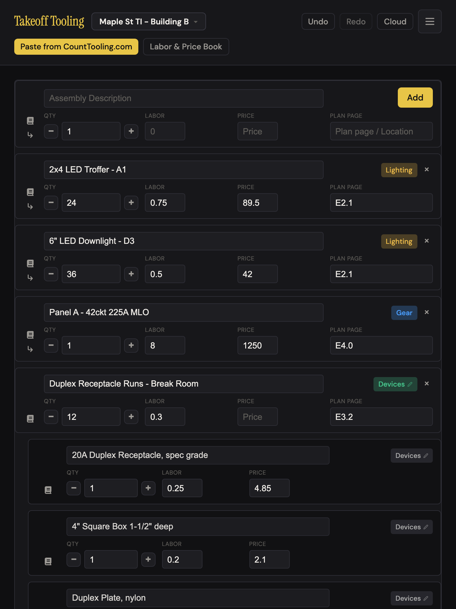
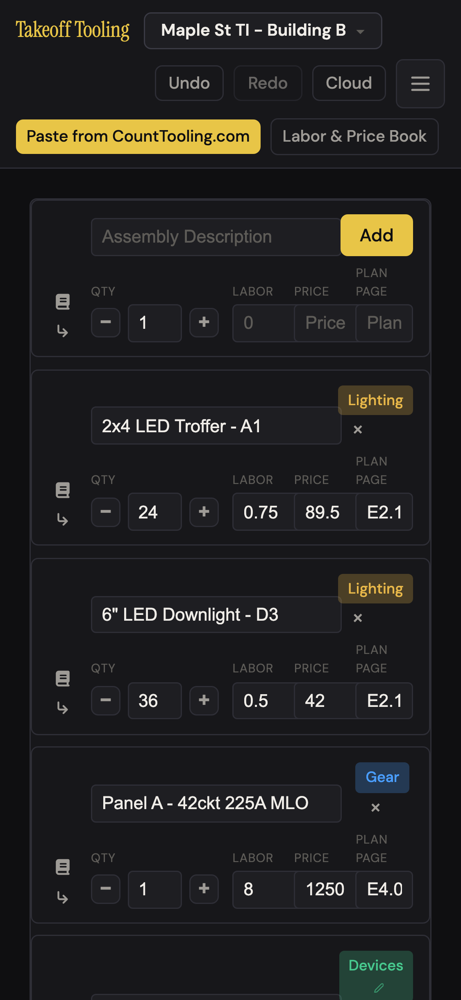
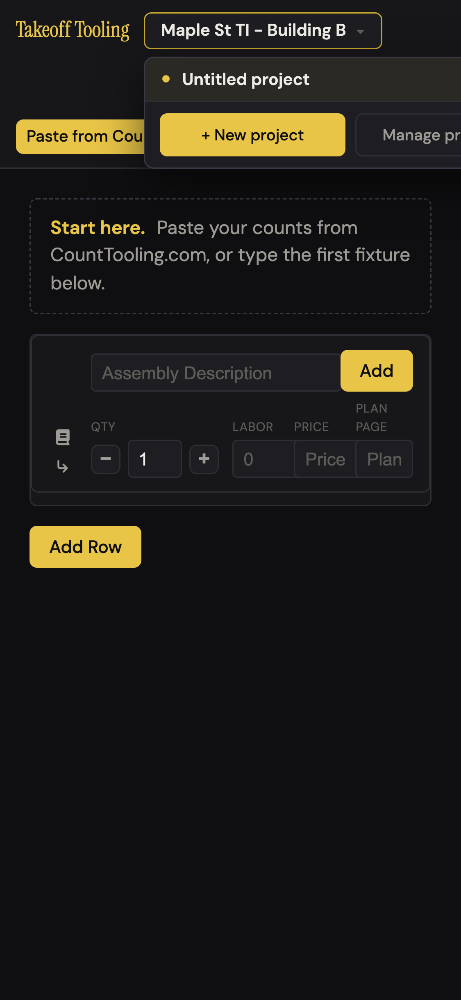
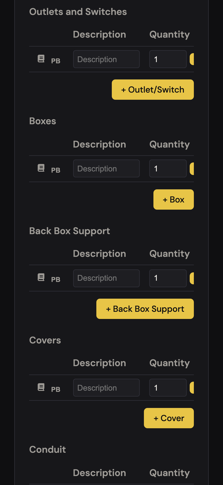
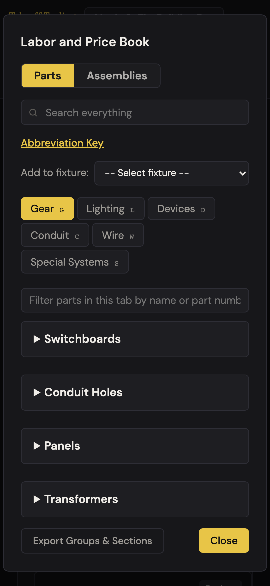
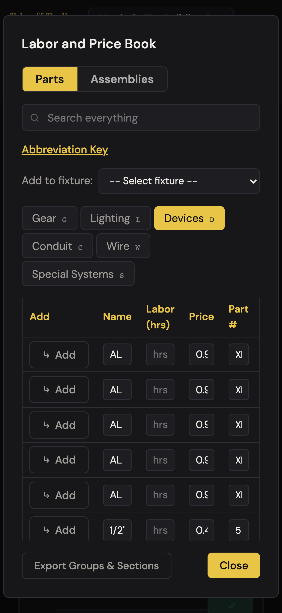
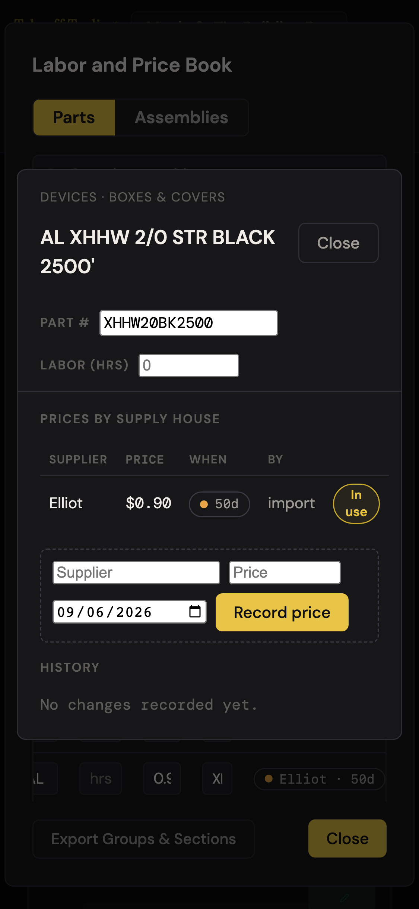
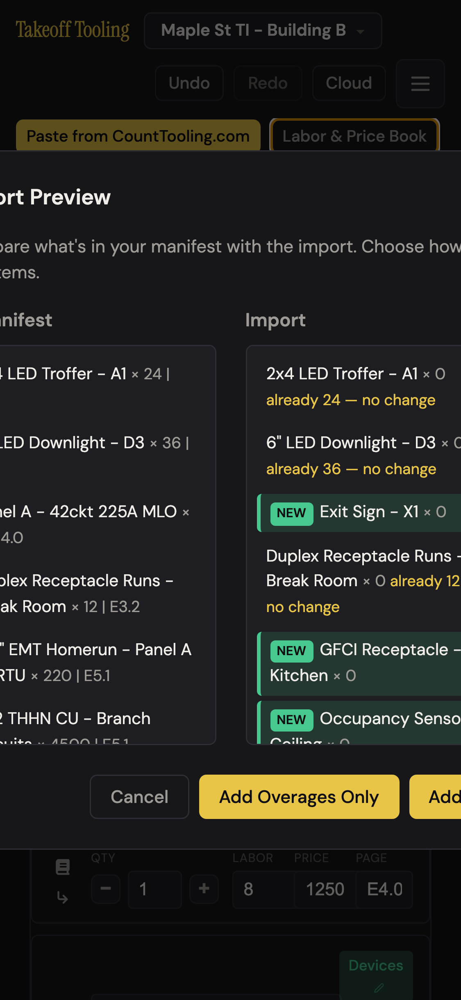
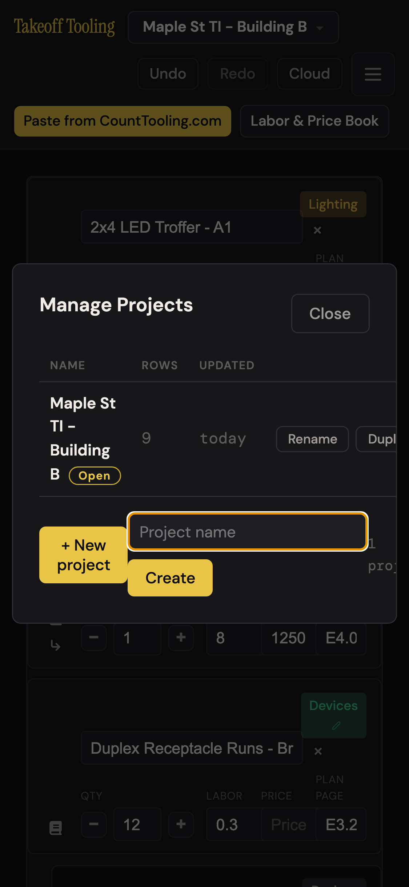
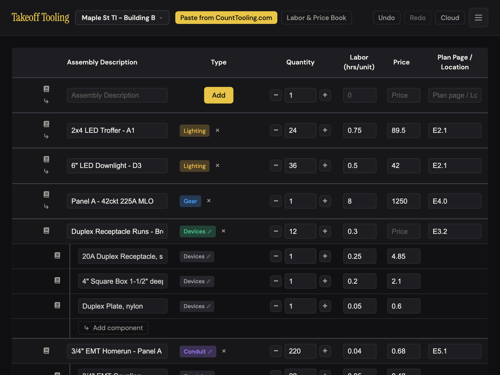

# J14 — Work from a tablet (the bid on an iPad in the truck)

Personas: F · Status: ● walked 2026-09-06 (headless Chromium device emulation, :4188, signed out) · **adversarially verified 2026-09-07** (own probes, four touch contexts — see [Verification](#verification): 12/12 findings confirmed, 2 stronger than reported, 1 new blocker, all 9 proposals keep spiritPass)

> Trigger — the estimator is on site or at the supply-house counter with an iPad (sometimes
> the phone) and needs to check a count, bump a quantity, read the total, or paste a fresh
> count from Count Tooling — with a finger, on a screen a third the width of the office
> monitor. No keyboard, no hover, no Esc key.

Viewports walked: **768×1024** (iPad portrait — every iPad in portrait lands in the 641–900 px
band: mini 744, 9th-gen 768, Air/10th-gen 820, Pro 11" 834), **1024×768** (iPad landscape;
also iPad Pro 12.9" portrait), **375×812** (iPhone 13 mini / SE-class), plus **390×664**
(iPhone 13 with Safari's bars, from Playwright's device descriptor) as a cross-check.
All with `isMobile`, `hasTouch`, a real iPad/iPhone UA and 2×/3× DPR. Seed: the standard
8-row "Maple St TI - Building B" bid, labor rate 85, Sub Total $6,416.79 / 96.4 hrs.

## Entry points

- **The same URL in Safari** — nothing is device-specific; there is no PWA manifest, `apple-mobile-web-app-*` meta or touch icon in index.html (grep: none), so "Add to Home Screen" gives a plain Safari bookmark.
- **`#import=` link opened on the phone** — Count Tooling's hand-off (J2) is the most likely reason a phone ever sees this app: the link lands straight in `#import-preview-modal` (finding #2).
- **`#d=` share link on a phone** (J9's recipient) — imports into a new project, then the manifest cards.
- **Rotation** — 1023 → 1024 px flips the manifest from cards to table (`@media (max-width: 900px)`, styles.css:584; `(min-width: 901px)`, :3660). A 9th-gen iPad crosses it every time it turns.
- **iPad Split View** — half-width (~507–590 px) gets the phone rules (`max-width: 640px`); two-thirds (~678–780) gets the card band.

## Current route (walked 2026-09-06)

Happy path (open the bid on the iPad, bump a quantity, read the total): **3 taps, 0 decisions**
— and in portrait it works: cards, a `+` tap took the troffer 24 → 25, the summary followed.
The measurement route below is what was actually driven, at each of the three widths.

1. Boot at 768×1024 → **card layout** (`display:grid`, 17 cards incl. children). Header wraps to two rows (110 px): title · switcher · Undo Redo Cloud ☰ on row 1, the two action buttons on row 2. Zero horizontal overflow (`scrollWidth` 768 = 768). Every field labelled QTY / LABOR / PRICE / PLAN PAGE; description across the top; chip + × top-right; book icon and ↳ in a rail on the left. 
2. Same bid at **375×812**: still cards, but the five-track grid is `24 | 104 | 39 | 39 | 47` px — Labor, Price and Plan Page fuse into one strip, the qty box shows three digits, the "Devices ✎" chip wraps to two lines (finding #4). Header is now 137 px tall (17 % of the screen), three rows. 
3. **☰ menu**: 200×154 at every width, four items 188×34. **Project switcher**: 338×91 menu at `left:0` of a button that sits at x=117 → right edge **455 px on a 375 px screen**; the mobile layout viewport widened from 375 to 455 (page shrinks / pans) (finding #10). 
4. **Type modal**: 244×617; the six type buttons are **194×44 — the only 44-pt targets in the app**; "Other" 194×39, Cancel 79×34. At 390×664 it scrolls internally (615 > 596) ✓.
5. **Summary**: three sections side by side at 768 (202 px each) and 1024 (287); a single column at 375 (293 wide) — clean, all figures whole. **Purchase list**: `table-layout: fixed`, four equal columns — 180 px at 768, **82 px at 375** where a description wraps to five lines (tallest row 120 px) (finding #11).
6. **Devices flow** (`Duplex Receptacle Runs`): at 768/1024 the eight section tables are 650 px in a 650 px strip (no scroll); at 375 each is **560 px in a 277 px strip** (A-7's floor) — Labor, Price and the trash are off-strip in every row, the ×2 button peeks in at the edge. PB button **26×16**. Page 2380 px tall at 375 (2.9 screens); Save and Cancel only at the bottom (y = 2279; zero `position:fixed` elements). "Load into Ledger" at x 338–486: **clipped to nothing** by `.assemblies-section { overflow:hidden }` — `elementFromPoint` returns `<main>` (finding #3). 
7. **Conduit** step 1: four fields 191×33, centred (x=92 at 375), quick-add rows are the tap target (245×35), page 1616 px at 375. Step 2: fittings table 560 in a 277 strip at 375 (the Labor input sits 78 px past the strip edge); preset `<select>` 200×35 at 13.3 px. Step 3: 5/10/15/20 % buttons 53–61×35, custom % input 277×30, `inputmode` none. Back / Save wrap to 52 px tall at 375. **Wire**: MAC table 560 in 277; same overage controls.
8. **Labor & Price Book**: 95 vh modal. At 768 the six tabs fit one row (33 px); at 375 they wrap to **three rows (106 px)** and the chrome above the rows — title, Parts/Assemblies, search, Abbreviation Key, Add-to-fixture, tabs, filter — is **375 px of the 771 px modal (49 %)**, leaving **321 px for rows**; at 390×664, **217 px** (finding #7). Fixture picker 215×34, right edge 346 < 375 ✓ (C-11 holds). 
9. Devices tab → supplier section "Boxes & Covers 4,470" → 100 rows (B-5 cap). At 375 the seven-column table is **467 px inside a 318 px content pane**: the whole pane pans sideways; the Name input is **38 px wide (≈5 of 27 characters — the screenshot shows "AL")**, Part # 27 px ("XI"), Price 33 px ("0.9" cut), and the provenance badge sits at x 366–484, **109 px past the right edge** (finding #1). At 768 Name shows 13/27 chars (107 px); at 1024, 23/27 (185 px). 
10. "Show all 4,470 parts": 4,470 rows, **80,538 DOM nodes, 26,838 tap targets, 208,686 px scroll height**; 509–542 ms to render and 36–60 ms per scroll frame in headless desktop Chromium (finding #12).
11. Panned to the badge, tapped "Elliot · 50d" → **part card** over the book: 640×405 at 768/1024, **345×510 at 375** — fits, no internal scroll needed, nothing past the right edge, book stays open beneath, Esc closes the card only ✓. Inputs 21–23 px tall at 13.6 px ("In use" wraps to 42×36 at 375). 
12. **Import preview** (6 items via `showImportPreviewModal`): 691×560 at 768, 922×519 at 1024. At 375 the content is **500 px wide** (`min-width: 500px`, styles.css:1024) centred in a 375 px viewport: x −62…438. The title reads "ort Preview", every "In Manifest" line loses its first 37 px, and **"Add All" sits at x 333–413 — 38 px off the edge, 42 px visible**; neither the modal nor the page can scroll sideways (finding #2). 
13. **Manage Projects**: 720×225 at 768/1024. At 375: 353×330, the table is 376 px in a 351 px pane so the modal pans; "Duplicate" (76×24) sits 28 px off the edge; "+ New project" opens the inline row, whose 220 px input (`min-width: 220px`, :3697) wraps Create underneath (row 76 px tall) — fits (finding #9). 
14. **Cloud modal**: 420×181 (full width at 375); signed out, and the `supabase` route abort also blocks the client library, so it showed "Cloud sync is not available (the sync library failed to load)" — the sign-in form was **not measured** (J11).
15. Rotated to **1024×768** → **table mode**: 976 px table in a 976 px pane, no horizontal scroll (A-6 holds); the Description column is 205 px and clips 6 of the 15 seeded descriptions ("Duplex Receptacle Runs - Bre…"), qty 65 px, plan page 109 px. Every desktop control at desktop size. 
16. **Input audit** (manifest, all widths): 74 visible inputs, **74 under 16 px** (14.4 px = `0.9rem`, :737; flow inputs inherit the 13.33 px browser default — `.flow-section input` sets no font-size, :2024; part card 13.6 px). **49 number inputs, 0 with `inputmode`** (the only one in the app is the sign-in code, cloud.js:626). Viewport meta `width=device-width, initial-scale=1.0` — no `maximum-scale`, so pinch works and iPhone Safari auto-zooms on focus of every field (finding #6).

### Measurement table

(a) horizontal overflow · (b) tap targets under 44×44 · (c) elements past the right edge · (d) clipped text · (e) modal taller than viewport without internal scroll. "—" = none.

| Surface | 768×1024 (iPad portrait) | 1024×768 (iPad landscape) | 375×812 (phone) |
|---|---|---|---|
| Manifest cards / table | cards · (a) — · (b) 152/152: − + 24×24, book 24×24, ↳ 24×18, × 21×21, chip 55×24, inputs 28–31 tall · (c) — · (d) — | table · (a) — (976/976) · (b) same 152 · (c) — · (d) 6/15 descriptions (203 px box, 267 needed) | cards · (a) — · (b) 152 · (c) — · (d) **qty "4500" clipped (43 px box, 48 needed)**, plan placeholder, 6 descriptions; Labor/Price inputs 68 px in **39 px tracks** (overlap 29 px) |
| Child cards + ghost "Add component" | child 696×110 · ghost 460×27 | child row 975×51 · ghost 145×27 | child 303×121 · ghost 195×27 |
| Header · ☰ · switcher | 110 px, 2 rows · buttons 27–30 tall · ☰ 40×40 · menu items 188×34 · switcher items 35–36 | 73 px, 1 row · same | 137 px, 3 rows (17 % vh) · action strip 349/349 fits · **switcher menu right edge 455** (layout viewport → 455) |
| Type modal | 244×617 · types **194×44 ✓** · Cancel 79×34 · (e) — | same, top 76 | same; at 390×664 internal scroll ✓ |
| Devices flow | strips 650/650 no scroll · PB **26×16** ×8, ×2 24×20, ÷2 22×20, trash 24×24 · page 2084 · Save 210×36 @1999 | same · page 2048 · Save @1963 | strips **560/277** ×8 · **Load into Ledger clipped (x 338–486)** · page 2380 · Save 188×52 @2279 · no sticky footer |
| Conduit 1 / 2 / 3 | fields 191×33 · quick-add rows 245×35 · fittings 650/650 · % 53–61×35 · custom 650×30 | same | fields 191×33 fit · fittings **560/277** · custom 277×30 · Back/Save 52 tall |
| Wire | table 650/650 | same | table **560/277** |
| Book: tabs · filter · picker | tabs 1 row 33 px · filter 703×34 · picker 600×34 (13.3 px) · rows pane 688 px (chrome 208) | tabs 1 row · picker 851×34 · rows pane 479 (chrome 174) | tabs **3 rows 106 px** · picker 215×34 right 346 ✓ · rows pane **321 px** (chrome 375 = 49 %); 217 px at 390×664 |
| Book: 100-row supplier section | table 669/701 fits · Name 107 px (13/27 chars) · Add 79×36 · badge 118×20 | table 920/952 · Name 185 (23/27) | table **467/318 → pane pans** · Name **38 px (5/27)**, Part # 27, Price 33 · badge **x 366–484 off-screen** |
| "Show all 4,470" | 80,538 nodes · 523 ms · scroll frame 40 ms | 509 ms · 36 ms | 542 ms · 60 ms |
| Part card (over book) | 640×405 · inputs 21–23 tall (13.6 px) · Record price 119×34 · (e) — | 640×405 | 345×510 · fits · (c) — · (e) — |
| Import preview | 691×560 · grid 309/309 · Add All 80×36 | 922×519 | **500 px content at x −62…438** · grid 213/213 · **Add All 333–413 (38 px off)** · no sideways scroll |
| Manage Projects (+ inline create) | 720×225 · Rename 67×24 · Duplicate 76×24 · input 220×34 · Create 78×34 | same | 353×330 · table 376/351 (pane pans) · **Duplicate 28 px off** · inline row wraps 76 px |
| Cloud modal | 420×181 · Close 70×34 · (form not loaded — library blocked) | same | 375×181 |
| Purchase list | 4 × 180 px cols · tallest row 55 | 4 × 244 | 4 × **82 px** · tallest row **120** |
| Summary | 3 columns, 202 px each | 3 columns, 287 | stacked, 293 wide ✓ |

Divergences from the documented route:

- README, CLAUDE.md and ARCHITECTURE.md say **nothing** about tablets, phones, touch or breakpoints (grep for screen/width/tablet/phone/touch/mobile: no hits). The only documentation of the four breakpoints is the CSS comments (styles.css:186, 582, 1823, 2337, 4047). JOURNEY-MAP's coverage matrix already lists "tablet layout" as not in README.
- `_surfaces.md` says the header "wraps below 900px, action strip scrolls below 640px" — true, but at 375 the strip **fits** (349/349) since C-11; nothing scrolls.
- JOURNEY-MAP protected strength "manifest card layout below 900 px — every field labeled and reachable" holds at 768 and **not** at 375 (finding #4): the card layout has one grid for the whole 375–900 band.

## Naive attempt

I opened the bid on the iPad in the truck, portrait. Cards — fine, I could read every fixture
and thumb the plus on the troffers. Turned it sideways and got the office table back, which
I liked. Then I pulled out the phone to check the wire footage on the walk to the panel: the
quantity box said **450** — I knew it was 4500 and tapped in to make sure; it was, the box was
just too short to show it. The Labor, Price and Plan Page boxes were glued together into one
strip; I hit Labor when I meant Price twice. I opened the book to check what we're paying for
3/4" couplings: the top half of the screen was the book's own furniture — two toggles, a
search box, a link, "Add to fixture", three rows of tabs, a filter — and under all that,
three rows of parts. Opened a supplier section and every name was two letters wide; I swiped
the list sideways and back like a spreadsheet to read one part. The little "Elliot · 50d"
pill was off the right edge until I panned; tapping it opened a card that was actually nice,
and the "Record price" form fit the screen. Pasting counts from Count Tooling on the phone
put up a preview with its title cut in half and a yellow "Add" hanging off the right side; I
pressed the half I could see and it worked. In the devices flow I swiped every row sideways
to find Price, then scrolled three screens to find Save. Every time I tapped into a box the
phone zoomed in and stayed zoomed.

## Evidence

- **Telemetry visibility:** none exists. The cheapest thing a rework could ship is a **viewport class on every event** (`layout: 'table'|'cards'|'phone'`, plus `coarsePointer`) or a boot event `session_start {vw, vh, coarsePointer, standalone}` — today nobody knows whether a single estimator uses a tablet.
- **Doc coverage:** README.md — no tablet/phone section, no mention of the card layout, the strips, or rotation; CLAUDE.md and ARCHITECTURE.md — none. Breakpoints are documented only in css/styles.css comments.
- **Specs:** none of the three Playwright specs (`smoke.spec.js`, `labor-book.spec.js`, `cloud-sync.spec.js`) sets a viewport or uses `tap()` — everything runs at Playwright's default 1280×720. **A-6, A-7 and C-11 have no regression test**, and nothing in `*.test.js` can (layout is CSS).
- **Modals:** `#type-modal`, `#labor-book-modal`, `#part-card-modal`, `#import-preview-modal`, `#projects-modal`, `#cloud-modal` (degraded state). One native `alert()` on the first run: "Please select a fixture from "Add to fixture" first." when a supplier row's Add is tapped with no fixture chosen (J6).
- **Hotkeys:** none apply — there is no keyboard. The type modal's letter hints and the book tabs' `G L D C W S` kbd badges (`.labor-book-tab-kbd`) render on an iPad and mean nothing there.
- **Storage / state touched:** `takeoff-project-<id>` and `takeoff-projects-index` from the seed; one qty spinner tap (undo frame); no cloud (signed out, Supabase aborted). Layout state is not persisted anywhere — rotation re-lays-out from CSS alone.
- **Console:** one error per context, `Failed to load resource: net::ERR_FAILED` — the Supabase abort. Nothing else, at any width.

## Friction findings

| # | Severity | What happens | Why it hurts | Verdict stamp (Phase 2b) |
|---|---|---|---|---|
| 1 | **blocker** (phone; stumble on iPad portrait) | Supplier catalog rows are a seven-column `<table>` of live inputs (`.mc-book-entries`, styles.css:2507; `.elliot-part-field` at `width:100%`) with **no min-width and no scroll strip**, so at 375 the table is 467 px in a 318 px pane: the pane pans sideways and the cells crush — **Name 38 px (5 of 27 chars: "AL" for "AL XHHW 2/0 STR BLACK 2500'")**, Part # 27 px ("XI"), Price 33 px ("0.9"). The provenance badge lands at x 366–484 (109 px off-screen). At 768 the Name shows 13 of 27 chars (107 px); at 1024, 23. The flow tables got exactly this fix in A-7 (`.flow-table-scroll > table { min-width: 560px }`, :1846); the book's table did not. | Browsing a supply-house section on a phone is impossible; on an iPad portrait half the part names are cut. Finding a part (J6) and checking a price (J7) are the two things a field user opens the book for. | **CONFIRMED — blocker**, and worse than written: at 375 the table is 467 px (right edge 513) inside `.labor-book-section { overflow:hidden }` (:1311), which clips at x≈363 — Name 38.2 px (3 of 27 chars), Part # 26.8, Price 33.4, and `elementFromPoint` on the badge returns `DIV.modal`. The pane does **not** pan: `#labor-book-content` scrollWidth 318 = clientWidth, a 400 px wheel leaves `scrollLeft` 0, window scrollX 0 — only the `overflow:hidden` section accepts scrollLeft (max 167), which no finger can drive. |
| 2 | **stumble** (high — the phone's front door) | `.import-preview-modal-content { min-width: 500px }` (:1024) beats `max-width: 90vw` at 375: the content is 500 px in a 375 px viewport, x −62…438. Title "ort Preview", intro and the "In Manifest" column lose their first 37 px; **"Add All" is at x 333–413 — 38 px off the edge, 42 px tappable**; `.modal` is `overflow: visible` and `body` `overflow: hidden`, so nothing scrolls sideways. The two-column grid stays `213px 213px`. Same at 390 (−55 px). | A `#import=` link opened on a phone is the most plausible way this app is ever used on one, and the first screen is visibly broken at the decision moment (Add All vs Add Overages Only). Users can complete it — pressing the visible half works — but they will not trust it. | **CONFIRMED — stumble.** Re-measured at 375: content 500 px at x −62…438 (`min-width:500px` beats the computed `max-width:337.5px`), `<h2>` at x −37, Add All x 333–413 (38 px off, 42 px visible), grid `213px 213px`; nothing scrolls (`.modal` overflow-x `visible`, doc scrollWidth 375 = innerWidth, every ancestor's `scrollLeft` stays 0). Severity is right, not a blocker: a real tap at x 371 on the sliver ran the import (modal closed, 15 rows). One correction — `body` computes `overflow: visible` here; the reason nothing pans is that the fixed `.modal` adds no document scroll width. |
| 3 | **blocker** (phone only; fine ≥ ~520 px) | Devices flow, Assemblies bar: `.assemblies-select { min-width:140px }` (:1691) + `.assemblies-load-btn { flex-shrink:0 }` (:1693) in a nowrap header inside `.assemblies-section { overflow:hidden }` (:1646). At 375 the 148 px button is laid out at x 338–486 and **clipped to nothing** — `elementFromPoint` at x 373 returns `<main>`. At 768 it sits at 544–692 and works. | Loading a saved run recipe on a phone cannot be done and nothing hints the button exists; the select beside it invites you to pick one and then nothing happens. | **CONFIRMED — blocker on touch.** At 375 the button lays out at x 338–486 while the section's painted box ends at x 326; `elementFromPoint(346, 441)` returns `DIV.flow-page`. Same at 390 (section right edge 341). Two corrections: the header needs 436 px of content, so the real cut-off is a **≈536 px** viewport, not ~520; and the section does accept programmatic `scrollLeft` (max 167), so a hardware-keyboard Tab would reveal it — no finger gesture will (wheel and drag leave it at 0). |
| 4 | **stumble** (trust) | Card grid `auto minmax(6.5rem,1.1fr) minmax(0,1fr) minmax(0,1fr) minmax(0,1.2fr)` (:603) has one shape for 375–900. At 375 the tracks are `24 / 104 / 39 / 39 / 47`: the qty input is **45 px — "4500" needs 48 (clientWidth 43), so the wire footage reads "450"**; the Labor and Price inputs keep their desktop `width: 4.25rem` = 68 px (:412) inside 39 px tracks and overflow 29 px each, so Labor / Price / Plan Page render as one fused strip with the Price box overlapping the Plan Page track by 18 px; the plan input is 47 px (placeholder "Plan"); flow chips wrap to two lines (47×42). At 768 the same grid is `24 / 159 / 145 / 145 / 173` and fine. | A quantity that reads wrong at a glance is this app's worst failure mode, and three fused boxes with no gap are a fat-finger trap (Labor is a tap away from Price). | **CONFIRMED — stumble.** Tracks at 375 measured `24.02 / 104 / 38.95 / 38.95 / 46.73`; the qty box is 44.8 px (clientWidth 43, 27 px of content space) and "4500" needs 32 px of glyphs → clipped, "12000" needs 40 px → worse; Labor and Price keep `width:4.25rem` = 68 px in 39 px tracks, each overflowing its `<td>` by 29 px, Price right 307 against the Plan track at x 289 (18 px overlap). Type chips are 42.4 px tall (2 lines) at 375 vs 24.4 px at 768. |
| 5 | **stumble** | Touch targets: **152 of 152** manifest controls fail 44×44 in at least one dimension. The ones a finger needs most: qty **− / + 24×24** (:282–291, ×15 per screen) with no halo — a tap 14 px off-centre lands on the spinner wrapper or the row (dead); book icon 24×24; ↳ 24×18; chip × 21×21; **PB 26×16 at 11.2 px** (:426, every flow row); ×2 24×20, ÷2 22×20 (:1876); trash 24×24; provenance badge 118×20 (:3330); Rename/Duplicate 67×24 / 76×24; header buttons 27–30 tall; menu items 34–36; part-card inputs 21–23 tall. Only the type modal's six buttons (194×44) meet Apple's 44 pt. Centred emulated taps do register (troffer 24 → 25). | Every field tweak in the field is a mis-tap lottery; the qty spinner — the one control this persona uses most — is the size of a desktop checkbox. | **CONFIRMED — stumble.** My own selector set: **151 of 151** visible controls in the manifest view fail 44×44 in at least one dimension, 70 in both; qty −/+ 24×24, book 24×24, ↳ 24×18, remove 24×24, PB 26×16 at 11.2 px. The halo claim is measured, not asserted: a centred `touchscreen.tap` on `+` ran 24 → 25, while ±14 px in any direction hit-tests `DIV.qty-spinner` or `TR` — dead. One correction: the type modal is **not** the only 44 pt target — `.labor-book-add-btn` is `min-width/min-height: 44px` (:1394). |
| 6 | **stumble** | **74 of 74 inputs are under 16 px** (14.4 px manifest, :737; 13.33 px flow inputs — `.flow-section input` has no font-size, :2024; 13.6 px part card). iPhone Safari zooms the page on focus of any field < 16 px and does not zoom back; with no `maximum-scale` the user pinches out after every field (iPadOS does not auto-zoom). **49 `type=number` inputs, 0 `inputmode`** — the only one in the app is the sign-in code (cloud.js:626) — so labor "0.75" and price "89.5" get the full keyboard with a number row, not the decimal pad. | A pinch after every quantity on a phone; the wrong keyboard for a numbers app. | **CONFIRMED — stumble.** Manifest 62/62 visible inputs at 14.4 px; flow 32 of 34 at 13.333 px; part card 13.6 px; **64 `type=number` inputs across manifest + flow, 0 with `inputmode`** (grep of `index.html` and `js/` finds exactly one, cloud.js:626); viewport meta carries no `maximum-scale`. The zoom half stays **inferred** — headless Chromium does not reproduce iOS focus-zoom, so it rests on the documented Safari <16 px rule; the `inputmode` half is hard fact. |
| 7 | **stumble** | Book chrome on a phone: title, Parts/Assemblies, "Search everything", Abbreviation Key, Add-to-fixture, **three rows of tabs (106 px)**, filter — **375 px of a 771 px modal (49 %)**; rows get **321 px** at 375×812 and **217 px** at 390×664 (about three supplier rows, or two collapsed section headers). At 768: 208 px chrome / 688 px rows; at 1024×768: 174 / 479. The always-visible "Section name / Create" row (J4 #4's `.inline-name-row { display:flex }` beating `hidden`) adds ~80 px more at the bottom of every catalog tab. | The book is a list; on the phone you see three lines of it. | **CONFIRMED — stumble**, reproduced to the pixel: 375×812 chrome **375 px of a 771 px modal (49 %)**, rows pane 321 px, tabs on 3 rows (106 px); 768 → 208/688 (21 %); 1024×768 → 174/479. At **390×844** (no Safari bars) it eases to 338/802 (42 %, tabs 2 rows) — the 217 px figure is specific to the 390×**664** bars case, a height effect, not a width one. The `.inline-name-row` claim holds: the Add-Section row carries `hidden` yet computes `display:flex` (:3667) and occupies **76 px**. |
| 8 | **stumble** | Devices flow at 375: eight sections × a 560 px strip in 277 px — Labor, Price and the trash are off-strip in **every** row; sections every 183 px; page **2380 px (2.9 screens)**; Save 188×52 and Cancel 81×52 only at y 2279, nothing sticky (0 fixed elements); the first screen is the title, "Save as Assembly →", the always-visible name row and the Assemblies bar (J4 #4, #8). At 768 the strips fit (650/650) and the page is 2084 px. | Two swipes per row plus three screens to Save — for a flow whose phone use-case is "fix one quantity". | **CONFIRMED — stumble.** Eight strips at 560/277 with `overflow-x: auto` (they really do swipe — A-7's affordance is intact, unlike #1's table); page **2356 px** at 375 against an 812 px viewport, Save 188×52 at document y **2255**, and **zero** `position: fixed|sticky` elements anywhere in the flow. At 768 the strips fit 650/650 and the page is 2084 px. |
| 9 | papercut | Manage Projects at 375: `.projects-table` (width 100 %, :3833) needs 376 px in a 351 px pane, so the modal pans; Duplicate ends at x 403 (28 px off); action buttons 24 px tall; the footer's "1 project" is pushed off-screen. The inline create row's 220 px `min-width` (:3697) wraps Create beneath — fine. | Sideways pan in a two-column list; small buttons. | **CONFIRMED — papercut.** At 375 the content is 353 px at x 11 and `.projects-table` is 417 px in a 303 px pane. Counter-evidence found the escape hatch and it works: the `.modal-content` itself is the scroller (`overflow-x: auto`, maxScrollLeft 90), so the modal genuinely pans and Duplicate (right edge 444 with my project name) is reachable — the off-edge distance is name-length dependent, so 28 px and 69 px are the same mechanism. |
| 10 | papercut | Project switcher menu: `.project-menu { left:0; width:340px; max-width:90vw }` (:3738–3743) hangs off a button that starts at x 117 → **right edge 455 px at 375** ("Manage pr…" cut); the mobile layout viewport grows to 455 and the page shrinks / pans until the menu closes. | The first tap on a phone makes the page jump. | **CONFIRMED — papercut.** Menu x 117…**455** on a 375 px screen (button x 117, `left: 0`, width 338, `max-width` computes 337.5). The viewport effect is real and measurable: with the menu open `window.innerWidth` and `document.documentElement.scrollWidth` both read **455** — the layout viewport widens and the page shrinks to fit. |
| 11 | papercut | Purchase list: `table-layout: fixed` gives Qty, Unit $ and Extended $ the same width as Material — **82 px each at 375**, descriptions wrap to five lines (row 120 px), "Extended $" wraps; at 768 the 180 px columns waste Qty's width the same way. | J8's proof-of-the-number is hard to scan on the device you'd hand a foreman. | **CONFIRMED — papercut.** `table-layout: fixed` measured: four **82 px** columns at 375 (tallest row 99 px with my six materials) and four **180 px** columns at 768 — Qty gets exactly the same width as Material at both. No overflow (`purchase-list` wrapper 327/327 at 375), so it is legibility, not reachability. |
| 12 | papercut | "Show all 4,470 parts" on a tablet: **80,538 nodes, 26,838 tap targets, 208,686 px of scroll**; 523–542 ms render and 36–60 ms per scroll frame on a desktop CPU — expect several times that on an A-series iPad. One tap removes B-5's cap and there is no way back but switching tabs. | A tap that can freeze a tablet, sitting next to the filter that solves the same problem. | **CONFIRMED — papercut.** Independently timed: "Show all" takes the page from **2,492 to 81,151 DOM nodes** (+78,659), 4,470 rows, **26,825** tap targets and **208,748 px** of scroll height; 537 ms at 375 and 498 ms at 768 on a desktop CPU, so an A-series iPad is several times worse. |

Confirmed holding (not re-reported): **A-6** — cards below 900 (768: no clipped Price, Plan Page visible, `scrollWidth` 768/768); table at 1024 fits 976/976 with no horizontal scroll · **A-7** — flow tables scroll in their own strips at 375 (560 in 277; qty input 62×30, not 15) · **C-11** — header strip 349/349 at 375, fixture picker right edge 346 < 375 · **B-5** — 100-row cap and "Show all 4,470 parts" · **N-7** — first-run hint on a fresh profile (screenshot 04) · **J4 #4** (cross-journey) — `.inline-name-row` visible with `hidden` set, here as the book's "Section name / Create" row on every catalog tab and the flow's assembly-name row.

## Proposals

**P1 — rework — supplier rows become two-line cards below 640 px** (and the table gets a floor above it). Below 640: `.mc-book-entries` renders each row as a card — line 1 the full name; line 2 part # · price · badge · Add — via the same `display:block` grid trick the manifest uses (:588–620). From 641 up: `.mc-book-entries { min-width: 640px }` inside a `.flow-table-scroll`-style wrapper (:1826), so it scrolls instead of crushing (at 768 the Name would then show all 27 chars).
(1) removes the pan-and-pan-back per row and the tap-to-read-the-name; (2) "part", "supply house", nothing new; (3) removes the seven-column table on phones and the crushed inputs everywhere; (4) same list, readable. `spiritPass: true` — verifier: the card variant must keep the inline-edit → promote behaviour (laborBookElliot.js) and the 100-row cap; measure Show-all cost again with cards (more nodes per row).
> **Verifier — `spiritPass: true` (confirmed).** (1) It makes a blocked step possible rather than merely different — the strongest form of "fewer steps". (2) "part / supply house" is trade language. (3) It states a removal (the seven-column table on phones). (4) A card with the name on line 1 needs no guide. **Caveats:** the premise "removes the pan-and-pan-back" is wrong — nothing pans today, the columns are simply clipped away; and the ≥641 half only works because the proposal puts the `min-width` **inside a scroll wrapper** — a bare `min-width: 640px` on `.mc-book-entries` would be re-clipped by `.labor-book-section { overflow: hidden }` (:1311) and change nothing.

**P2 — polish — import preview fits the phone.** `min-width: min(500px, 94vw)`; below 640 `grid-template-columns: 1fr` with the "In Manifest" column dropped — each Import line already carries the delta ("already 24 — no change", "× 34 · now 30, +4"), so the left column is redundant on a phone; the three buttons wrap to full width.
(1) removes reading two columns to make one decision; (2) n/a; (3) removes the left column on phones and the half-hidden primary button; (4) same buttons, now on screen. `spiritPass: true`.
> **Verifier — `spiritPass: true` (confirmed).** One decision, one column, all three buttons on screen; the removal is stated. **Caveats:** `min-width: min(500px, 94vw)` gives 352.5 px at 375 and still beats the `max-width: 90vw` (337.5 px), so raise the max-width alongside it or the two rules keep fighting (harmless here — 352.5 fits — but confusing to the next reader). And dropping the "In Manifest" column removes the only place a manifest row that is **absent** from the import is visible; the delta strings only annotate imported lines.

**P3 — polish — the Assemblies bar wraps.** `.assemblies-section-header { flex-wrap: wrap }`, drop `overflow: hidden` from `.assemblies-section` (round the body instead), or move "Load into Ledger" into the body next to the select.
(1) restores a step that is impossible today; (3) removes a clipped control; (4) the button is where the select is. `spiritPass: true` — ride along with J4 P7 (confirm before replacing).
> **Verifier — `spiritPass: true` (confirmed).** It restores a step that is impossible on a finger today and removes a clipped control; nothing is added. **Caveat:** of the three options only `flex-wrap: wrap` (or moving the button into the body) is safe. Dropping `overflow: hidden` from `.assemblies-section` **on its own** would let the 436 px header spill past the 277 px section and give the flow page horizontal overflow at 375 — a regression of the zero-overflow property A-6 bought.

**P4 — polish — the card grid gets a phone shape.** Below 640: row 2 = Qty spinner (full 6.5 rem floor) · Labor · Price with `minmax(4.25rem, 1fr)` tracks; row 3 = Plan page full width; `.labor-cell input, .price-cell input { width: 100% }` inside cards; qty input `min-width: 3.5rem` so four digits show. Flow chips `white-space: nowrap`.
(1) removes the tap-to-see-the-real-quantity; (3) removes the fused strip and the overlap; (4) labels stay where they are. `spiritPass: true` — verifier: check a 5-digit footage (12000) and "Special Systems ✎" at 375.
> **Verifier — `spiritPass: true` (confirmed).** Removes the tap-to-read-the-quantity and the fused strip; labels stay put. Both verifier checks done: **12000** clips too (44.8 px box, 27 px of content space, 40 px of glyphs) and "Special Systems" / "Devices" chips are 42.4 px tall (2 lines) at 375. **Caveat — the arithmetic does not close as written:** the qty track is already 6.5 rem (104 px) and the box only gets 44.8 px of it because the two 24 px spinner buttons and a 0.35 rem gap sit in the same track (:708–711 sets `width:auto; flex:1 1 auto; min-width:2rem`). A `min-width: 3.5rem` needs 56 + 48 + 11 = 115 px, so the track must grow past 6.5 rem or the spinners must leave the track — otherwise the box is clipped again.

**P5 — polish — a coarse-pointer size class.** Under `@media (pointer: coarse)` only: qty − / + 36×36 with a 44 px hit area (`::before` inset −4px), book icon / ↳ / × / trash 36×36, PB → 36×28 labelled "Book", ×2 ÷2 32×28, part-card inputs 32 tall, header buttons and menu items 44 tall. Desktop density untouched.
(1) removes mis-taps (no step change); (2) "Book" instead of "PB"; (3) removes the 26×16 and 21×21 targets; adds no surface; (4) same buttons, bigger. `spiritPass: true` — caveat: 36 px spinners widen the qty track; do together with P4.
> **Verifier — `spiritPass: true` (confirmed, the weakest of the ten).** (1) is "fewer *failed* steps", not fewer steps — but the dead zone is measured (±14 px off the `+` hit-tests `DIV.qty-spinner` or `TR`), so the re-tap loop it removes is real. (2) "Book" for "PB" is a genuine trade-language win. (3) is thin: it removes no surface, only pixels; it survives rule 3 because it adds none either. (4) invisible to the user. **Caveat:** `.labor-book-add-btn` already ships `min-width/min-height: 44px` (:1394) — reuse that rule rather than inventing a second sizing idiom.

**P6 — polish — inputs stop zooming, keypad shows up.** `input, select { font-size: 16px }` under `(pointer: coarse)` (or ≤ 640); `inputmode="decimal"` on every `type=number` input — one attribute in each render helper (manifest.js qty/labor/price, device.js:25 row, conduit.js, wire.js, `#labor-rate-input`, the % input).
(1) removes a pinch after every field on the phone; (3) removes nothing visible, adds nothing; (4) invisible. `spiritPass: true`.
> **Verifier — `spiritPass: true` (confirmed).** The removal rule 3 wants is satisfied by a *gesture*: the pinch-out after every field. The `inputmode` half is verified fact (64 `type=number` inputs, 0 attributes). **Caveat — order matters:** raising inputs to 16 px under `(pointer: coarse)` makes finding #4 worse before it makes it better — "4500" at 16 px needs ~36 px of glyphs in a box that offers 27, so P6 must ship with (or after) P4. The zoom half is still unverified in emulation and needs one pass on a real iPhone.

**P7 — rework — the book's phone header collapses.** Below 640: tabs in **one** horizontally scrolling row (`flex-wrap: nowrap; overflow-x: auto`, −73 px); Abbreviation Key link moves to the footer; "Add to fixture" only when a fixture is targetable (a manifest book-icon door already hides it); the `[hidden]` fix for `.inline-name-row` (−80 px). Target ≤ 220 px chrome → ≥ 480 px of rows at 375×812.
(1) removes two scrolls to reach the first row; (2) same tab names; (3) removes two rows of tabs and a link from the phone's first screen; (4) tabs still visible. `spiritPass: true` — the `G L D…` kbd hints should also hide under `(pointer: coarse)` (they are dead there).
> **Verifier — `spiritPass: true` (confirmed).** Fewer scrolls to the first row, same tab names, two rows of tabs and a link removed, tabs still visible. **Caveat on the target:** the arithmetic lands at ~226 px, not ≤ 220 — tabs 106 → 33 saves 73 px and the `.inline-name-row` measures **76 px** (not ~80), so 375 − 149 = 226 px of chrome and ~470 px of rows at 375×812. Either accept 226 or move the Abbreviation Key row as well.

**P8 — polish — a sticky Save bar in the flows below 640.** `position: sticky; bottom: 0` on the flow's Cancel/Save row (with the 52 px wrapped labels shortened to "Save" / "Cancel"). Pairs with J4 P8 (empty sections collapse to chips), which alone removes ~700 px of the 2380.
(1) removes three screens of scroll to Save; (2) "Save"; (3) removes the wrapped two-line buttons; (4) the button is always on screen. `spiritPass: true`.
> **Verifier — `spiritPass: true` (confirmed).** Measured the problem it removes: 2356 px of page against an 812 px viewport, Save at document y 2255, and **zero** fixed-or-sticky elements in the flow today, so this adds the first one rather than duplicating an existing affordance.

**P9 — polish batch — three small phone fixes.** Manage Projects rows stack below 640 (name on line 1; rows · updated · actions on line 2). `.project-menu { right: 0; left: auto; max-width: calc(100vw - 1.5rem) }` (or anchor it to the header's left edge). Purchase list `table-layout: auto` with Qty / Unit $ / Extended $ `width: 1%; white-space: nowrap` so Material takes the rest (helps at 768 too).
(1) removes a sideways pan and the viewport jump; (3) removes three overflow cases; (4) invisible. `spiritPass: true`.
> **Verifier — `spiritPass: true` (confirmed), but one third of it is wrong as written.** `.project-menu { right: 0; left: auto }` anchors to `.project-switch-wrap`, whose right edge is the button's at x 264 — a 338 px menu would then run x −74…264 and fall off the **left** edge instead, and `max-width: calc(100vw - 1.5rem)` = 351 px does not clamp a 338 px menu. Only the parenthetical option (anchor to the header's left edge, or clamp the width to ~250 px) actually works at 375. The Manage-Projects stacking and the purchase-list `table-layout: auto` both check out.

**P10 — teach — "Show all" warns on touch.** Copy: "Show all 4,470 parts (slow on tablets — try the filter above)"; or under `(pointer: coarse)` hide the button and keep the filter as the way to the long tail. Verdict `teach` for the copy; `hide` is the fallback if telemetry ever shows tablet use.
`spiritPass: n/a` (teach).
> **Verifier — `spiritPass: n/a` (confirmed as `teach`).** The cost the copy warns about is real (+78,659 nodes, 26,825 tap targets, 208,748 px of scroll for one tap) and the filter beside it already solves the same problem, so a label is the proportionate fix. Note the `hide` fallback would also hide the only route to parts 101–4,470 in a section for users whose filter term does not match — keep the filter's "First 100 of N matches" line (C-4) as the way out.

**Keep (document as-is):** the card layout at iPad portrait (768) — nothing clipped, zero overflow, every field labelled; the desktop table at iPad landscape without horizontal scroll; the summary stacking to one column at 375; the type modal's 44 px buttons and internal scroll at 664 px tall; the part card fitting 345×510 over the book with Esc closing only the card; conduit's centred 191 px fields at 375; the header action strip fitting 375 (C-11).

## Guide actions

- Article "Takeoff Tooling on an iPad or phone" must carry: portrait = cards, landscape = the office table (rotate to switch); flow tables slide sideways — swipe a row to reach Price and the trash; Save lives at the bottom of a flow; on a phone use **search** in the book, not the supplier sections (until P1); tap the "Elliot · 50d" pill for the part card and "Record price" at the counter; on an iPhone pinch out after typing (until P6); paste from Count Tooling works on the phone even though the preview is cut off (until P2).
- README rows to add: a "Works on tablets" paragraph (JOURNEY-MAP already flags "tablet layout" as undocumented); the rotation flip at 900 px.
- A `mobile.spec.js` that boots at 375×812 and 768×1024, asserts `scrollWidth === innerWidth` on the manifest, the book with a supplier section open, the import preview and Manage Projects, and that "Add All" and "Load into Ledger" are within the viewport — the regression test A-6/A-7/C-11 never got.

## Demo moment

Hand over an iPad in portrait: the bid is a stack of labelled cards; thumb the `+` on "2x4 LED Troffer" and the quantity ticks 24 → 25 while the Lighting line moves $3,660.00 → $3,749.50 (calculator: + 1 × $89.50). Screenshot 01. Then turn it sideways and the office table comes back — screenshot 10.

## Walk notes

- Server: the read-only review server at `http://localhost:4188` (not started or stopped). Headless Chromium via `@playwright/test`; four contexts — 768×1024 and 1024×768 with an iPadOS 17 UA, 375×812 with the iPhone 13 UA (DPR 3), and Playwright's `devices['iPhone 13']` (390×664 — the height includes Safari's bars); all `isMobile: true, hasTouch: true`. Signed out; `context.route(/supabase/i, abort)` — which also blocks the Supabase client script, so the cloud modal showed its "library failed to load" state and the sign-in form went unmeasured (J11 owns it).
- Seed via `page.evaluate`: project "Maple St TI - Building B", the standard 8 rows + 6 children, labor rate 85.
- **Reused artifacts** from the walker cut off before writing: `walks/work-from-a-tablet/probe.js` and `results.json` (all four contexts, every surface, the tap-target / right-edge / clipped-text / modal measurements) and screenshots 01, 02, 05, 08, 10. That probe's part-card step had clicked a supplier row's **Add** (→ the "select a fixture first" alert) instead of the provenance badge, so the card never opened; `probe2.js` (`results2.json`) re-drove the card at all three widths via `.lb-prov-badge`, plus the import-preview and Load-into-Ledger reachability (`elementFromPoint`), the Show-all timing, the card-grid geometry and the purchase-list columns, and re-took 03 (devices strips), 06 (part card), 07 (import) and 09 (supplier rows). `probe3.js` took 04 (switcher menu at 375). Scripts live in the scratchpad, not the repo.
- Screenshot 04 shows "Untitled project" in the menu under a header reading "Maple St TI": that quick probe renamed the project without waiting for the 400 ms debounced index write — a probe artifact, not a finding.
- Emulation caveats: headless Chromium does not reproduce iOS focus-zoom, so #6 is inferred from font sizes and the viewport meta (the documented Safari rule: < 16 px zooms); Show-all timings are desktop-CPU numbers. Both need one pass on a real iPad and iPhone.
- **Verifier: re-drive #1 first** (open Devices → "Boxes & Covers" at 375 and read `getBoundingClientRect().width` of the first `input.elliot-part-field` — 38 px), then **#2** (`import-preview` at 375: the Add All button's `right` is 413), then **#3** (`elementFromPoint` at the centre-left of `.assemblies-load-btn` at 375 → `<main>`), then **#4** with a four-digit quantity on a card. Then the three baseline IDs on a real 9th-gen iPad in both orientations.
- Not walked: search-result buckets at 375 (does the results table crush the same way as #1?); the Assemblies side of the book at 375; Print options / PDF on iPad (J9 — needs a real device); signed-in sync (J11); the `#d=` recipient path on a phone (J9). *(Verifier: the search-result buckets were walked in Phase 2b — see NEW-1 below. The rest stand open.)*

## Verification

Adversarial verify pass, **2026-09-07**, against the read-only review server at
`http://localhost:4188` (not started or stopped). Signed out; `context.route(/supabase/i, abort)`
on every context — cloud never touched. Four headless Chromium contexts, all
`isMobile: true, hasTouch: true`: **375×812** and **390×844** (iPhone 17 UA, DPR 3), **768×1024**
and **1024×768** (iPadOS 17 UA, DPR 2), plus a **390×664** run to reconcile finding #7's second
number. Four probes written from scratch (`v2`–`v7`, none derived from the walker's `probe*.js`),
seeding the bid through `TakeoffState.addItem` inside one batch and loading the book via
`McBook.ensureLoaded()`. Nothing in the repo was modified except this file.

**Tally: 12 findings re-measured → 12 CONFIRMED, 0 downgraded, 0 killed.** Two of them came out
*stronger* than reported (#1, #3) and four carry corrections to the walker's mechanism (#1, #2,
#3, #5). Nine of nine proposals keep `spiritPass: true`; P10 stays `n/a` (teach); four carry
new caveats that change what "done" means (P1, P4, P6, P9).

### Independent re-measurements

| # | Walker said | Verifier measured | Stamp |
|---|---|---|---|
| 1 | table 467 in a 318 pane, "the whole pane pans"; Name 38 px | table 467 px (right edge **513**) clipped at x≈363; Name **38.2 px = 3 of 27 chars**, Part # 26.8, Price 33.4, badge x 366–484 → `elementFromPoint` = `DIV.modal`; **nothing pans** | CONFIRMED (stronger) |
| 2 | content 500 at x −62…438; Add All 38 px off, 42 visible | identical to the pixel; `<h2>` at x −37; a real tap at x 371 completed the import | CONFIRMED |
| 3 | button x 338–486 clipped to nothing at 375 | identical; hit-test `DIV.flow-page` at (346, 441); also broken at 390 | CONFIRMED (stronger) |
| 4 | tracks `24 / 104 / 39 / 39 / 47`; qty 43 px shows "450" | `24.02 / 104 / 38.95 / 38.95 / 46.73`; qty box 44.8 px (27 px of content space) vs 32 px of glyphs for "4500"; Labor and Price 68 px in 39 px tracks, 29 px overflow each | CONFIRMED |
| 5 | 152/152 controls under 44×44; qty −/+ 24×24 | **151/151** (my seed is 13 rows, not 15), 70 under 44 in *both*; centred tap runs 24→25, ±14 px is dead | CONFIRMED |
| 6 | 74/74 inputs under 16 px; 49 numbers, 0 `inputmode` | 62/62 at 14.4 px (manifest) + 32/34 at 13.333 px (flow) + 13.6 px (part card); **64 numbers, 0 `inputmode`** | CONFIRMED |
| 7 | chrome 375/771 = 49 %, rows 321; 217 at 390×664 | 375/771 = 49 %, rows 321, tabs 3 rows (106 px); 768 → 208/688; 1024 → 174/479; **390×664 → 338/631 = 54 %, rows 217** | CONFIRMED |
| 8 | 8 strips 560/277, page 2380, Save at 2279 | 8 strips 560/277 (`overflow-x: auto`), page **2356**, Save 188×52 at y **2255**, 0 fixed/sticky | CONFIRMED |
| 9 | table 376 in 351, Duplicate 28 px off | table **417** in a 303 px pane, Duplicate right edge 444; the `.modal-content` is the scroller (maxScrollLeft 90) | CONFIRMED |
| 10 | menu right edge 455, layout viewport → 455 | menu x 117…**455**; with it open `window.innerWidth` **and** `document.scrollWidth` both read 455 | CONFIRMED |
| 11 | 4 × 82 px at 375, tallest row 120 | 4 × **82** px at 375 (tallest 99 with my materials), 4 × 180 at 768; `table-layout: fixed` | CONFIRMED |
| 12 | 80,538 nodes, 26,838 targets, 523–542 ms | **81,151** nodes (from 2,492), 4,470 rows, **26,825** targets, **208,748** px scroll, 537 ms @375 / 498 ms @768 | CONFIRMED |

### Counter-evidence hunts (what I tried to use to kill each finding)

- **#1 — is the catalog reachable by an in-pane sideways scroll?** No, and the walker's own
  narrative ("I swiped the list sideways and back like a spreadsheet") is fiction. Full ancestor
  audit at 375: `table` 467 → `.lb-offers-body` (`overflow-x: visible`, scrollWidth 483) →
  **`.labor-book-section { overflow: hidden }` (:1311)** → `#labor-book-content`
  (`overflow-x: auto` but scrollWidth **318 = clientWidth**, so no scrollbar and nothing to scroll)
  → `.labor-book-modal-content { overflow: hidden }` → `body.lb-modal-open` (overflow hidden).
  A 400 px horizontal wheel over the pane leaves `scrollLeft` at 0; `window.scrollTo(500,0)` leaves
  scrollX 0. The only element that accepts `scrollLeft` is the clipped section (max 167 px) and
  `overflow: hidden` boxes are not touch-pannable. So the "Price from" column is not off-screen —
  it does not exist for a finger. That makes the blocker call *safer*, not weaker.
- **#2 — does the import modal itself scroll?** Vertically yes (`.modal-content { overflow-y: auto }`,
  scrollHeight 498 = clientHeight, so it never needs to); horizontally no — `.modal` is
  `position: fixed; inset: 0` with `overflow: visible`, and a fixed box adds no document scroll
  width (`document.scrollWidth` 375 = `innerWidth`). Setting `scrollLeft` on the modal, the content
  and the window all returned 0. The left overflow (x −62) is unreachable under any scroll model
  because the flex container centres it.
- **#2 — is it actually a blocker?** No: `page.mouse.click(371, …)` on the 42 px sliver fired the
  button, closed the modal and added the rows. `stumble` is the correct severity.
- **#3 — can the assemblies bar be rescued?** Programmatically yes (`scrollLeft` 161 moves the button
  to x 177 and it hit-tests as `BUTTON.btn`), which means a hardware-keyboard **Tab** would reveal it
  on an iPad with a Magic Keyboard. No touch gesture will. Blocker for the finger path stands.
- **44×44 as the bar** — judged, not asserted. This is a desktop-first estimating tool and 24 px
  controls are usable on an iPad with a stylus, so #5 is correctly a `stumble` and not a blocker.
  What makes it a real finding is the *dead zone*, which I reproduced: the `+` has no halo, so a tap
  14 px off centre lands on `DIV.qty-spinner` or the `TR` and silently does nothing. That is a
  measured failure mode, not a HIG citation.
- **Baseline duplication** — #1 (supplier catalog) and #2 (import preview) are NEW surfaces:
  the catalog table has `min-width: 0` and no `.flow-table-scroll` wrapper (verified:
  `tbl.closest('.flow-table-scroll')` is null), so A-7's fix never reached it; the import preview is
  a modal A-6/A-7/C-11 never touched. Neither is a duplicate.

### Corrections to the walker's text (findings stand; mechanism restated)

1. **#1** — "the whole pane pans sideways" is wrong; nothing pans, at any level. The clipping agent
   is `.labor-book-section { overflow: hidden }` (:1311), not the pane. Step 9 of the route and the
   "I swiped the list sideways" line in the Naive attempt should be read as *the columns are gone*.
   Step 11's "Panned to the badge, tapped Elliot · 50d" cannot have happened by hand — the part card
   opens only via a scripted `.lb-prov-badge` click at 375 (it is genuinely reachable at 768+).
2. **#2** — `body` computes `overflow: visible` while the import modal is open (the `lb-modal-open`
   lock belongs to the book, not this modal); nothing scrolls because the fixed `.modal` adds no
   document scroll width.
3. **#3** — the safe-width threshold is **≈536 px**, not ~520 (the header needs 436 px of content
   inside a section that is `viewport − 98`).
4. **#5** — the type modal's six buttons are not the only 44 pt targets: `.labor-book-add-btn` ships
   `min-width: 44px; min-height: 44px` (:1394).
5. **#7** — the 217 px rows figure is a *height* effect (390×664 with Safari's bars). At 390×844 the
   same width gives 388 px of rows and only two rows of tabs; the 49 % chrome figure is the 375×812 one.
6. Minor: `.elliot-part-field` has no `width: 100%` rule — there is no width declaration for it at all
   (only `max-width` on labor/price/part #, :3922–3933); the crush is auto table layout on a table
   with no floor.

### NEW bugs found in passing

- **NEW-1 — the book's global search results hide the part name entirely at 375.**
  `.lb-search-name { flex: 1; min-width: 0; overflow: hidden }` (:3009) is the only shrinkable item
  in a `.lb-search-row` flex line whose other children are `flex-shrink: 0` — `.lb-search-context`
  (`max-width: 18rem`, :3017) and two `.lb-search-num` at `min-width: 4.5rem` each (:3027). At 375
  the row is 287 px wide and the name collapses to **clientWidth 0** against a scrollWidth of
  137–146 px: searching "3/4 EMT coupling" returns 33 rows whose names are all invisible (Add button
  60×21, context and prices visible). At 768 the same names render at 242 px. Nothing overflows the
  pane, so this is invisible to a `scrollWidth === innerWidth` check.
  **This kills the dossier's own phone workaround** — the Guide action "on a phone use **search** in
  the book, not the supplier sections (until P1)" sends the user to a list with no names. Severity:
  **blocker on the phone**, same class as #1 but a different surface and a different mechanism
  (flex collapse, not table clipping). Fold into P1's scope or give it its own polish.
- **NEW-2 (observation)** — the `hidden`-attribute defeat is broader than the Add-Section row:
  `.projects-new-row, .inline-name-row { display: flex }` (:3667) has no `[hidden]` guard, so every
  element using either class renders while marked hidden. A-5 fixed exactly this class of bug for
  `.header-menu-item[hidden]` / `.btn[hidden]`; these two selectors were missed. Cross-journey with
  J4 #4 — noted here, not re-reported as a J14 finding.

### Baseline re-verified

- **A-6 ✓** — cards below 900 px: `document.scrollWidth === innerWidth` at 375 (375/375), 390, 768
  (768/768); the 768 card grid is `24 / 159 / 145 / 145 / 173` with every input inside its track
  (Price overflow −77 px, Plan Page visible). Table mode at 1024: 976/976, no horizontal scroll.
- **A-7 ✓** — all eight devices-flow tables are 560 px inside 277 px strips with `overflow-x: auto`
  at 375 (292 at 390), and they really do scroll; the qty input is 62×30, not the 15 px it used to be.
- **C-11 ✓** — header action strip 349/349 at 375 (364/364 at 390), nothing clipped; the book's
  fixture picker is 215×34 with its right edge at **346 < 375**, inside the modal (right edge 371).
- Also still holding: **B-5** (100-row cap plus "Show all 4,470 parts" — 100 rows rendered before the
  expander), the type modal's six 194×44 buttons, and the part card at 345×510 over the book at 375
  (no overflow, no internal scroll needed: scrollHeight 508 = clientHeight).

### Verifier's scripts

`walks/work-from-a-tablet/verify/v2-probe.js` (four contexts: page overflow, card grid, touch
targets, fonts, import preview + real tap, devices flow, book chrome, supplier rows),
`v3-probe.js` (ancestor overflow audit and scroll-rescue attempts, grid tracks by input value,
spinner selectors, type modal), `v4-probe.js` (chips, purchase list, switcher menu, Manage Projects,
part card, Show-all cost), `v5-probe.js` (tap-accuracy test on the qty spinner, flow font sizes,
390×664 book chrome), `v6-probe.js` (global search results — NEW-1), `v7-probe.js` (C-11 picker).
Results in `v2`–`v6-results.json`; screenshots `v3-catalog-375.png`, `v4-switcher-375.png`,
`v6-search-375.png`. Scratchpad only — nothing added to the repo.
